# 1. 产品介绍

## 1.1 产品安全

1. 本产品内含排针针脚，注意刺伤，请勿让7岁以下的儿童接触，放在他们拿不到的地方。
2. 本产品包含导电部件(控制板和电子模块），请按照本教程的要求进行操作，不当的操作可能导致过热并且损害零件，请勿触摸并立即断开电路电源。

## 1.2 产品简介

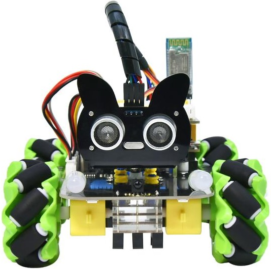

4WD 麦克纳姆轮小车是一款高性价比、易上手的开源编程教学套件。整车将各类复杂电子元器件集成于一体化底板，搭配 2.54mm 防反插端子，无需焊接，仅需几步简易组装就能完成整车搭建。

套件集成麦轮电机、4颗WS2812灯珠 2个七彩灯、巡线传感器、舵机、超声波传感器，支持红外遥控、蓝牙无线控制等物联网操控方式。学习者可从基础元器件控制入门，循序渐进掌握灯光、电机、传感器独立编程，最终完成多功能综合实训项目。

配套阶梯式编程课程，由浅入深引导零基础用户学习编程；同时预留丰富拓展接口，支持自主新增传感器、修改底层代码，自由拓展创意项目，完整实现从入门到进阶的科创探索。

## 1.3 产品特点

1. **功能丰富，实训场景齐全**

   集成 4颗WS2812灯珠、2个七彩灯、红外遥控、蓝牙无线控制、超声波跟随 / 避障、四轮麦轮全向驱动、黑白循迹等经典实训功能，覆盖中小学机器人编程主流教学案例。

2. **免焊快装，拆装便捷**

   电机驱动、WS2812灯珠、2个七彩灯、主控扩展电路全部集成一体化底板，零焊接设计；采用 2.54 防反插端子接线，杜绝插错烧件风险；舵机云台搭配兼容乐高标准孔位，卡扣式固定，组装、拆解仅需几步，新手也能快速上手。

3. **万向麦轮设计，造型简洁规整**

   搭载麦克纳姆万向轮，支持前后、左右、斜向、原地旋转全向移动；底层驱动板一体化布局，内部走线整洁不乱，整体外观简约小巧，颜值大气。

4. **多接口预留，拓展能力强**

   板载 I²C、UART、SPI 通用通信接口，预留 ESP8266 WIFI 扩展位，可外接各类第三方传感器、矩阵键盘、显示屏等外设，自由拓展智能小车创意项目。

5. **多编程方式，兼顾图形化与底层开发**

   支持三种主流编程模式：Arduino C 语言底层代码编程、Kidsblock (Scratch) 图形化编程、Mixly 图形化编程，既能零基础拖拽积木快速实现功能，也可深入学习底层代码逻辑，适配不同阶段教学需求。

## 1.4 产品参数

- 输入电压：7-9V

- 工作电压：5V

- 最大耗散功率：15W

- 电机转速：5V 200 rpm

- 电机驱动形式：DRV8833电机驱动

- 超声波感应角度：\<15度

- 超声波探测距离：2cm-400cm

- 红外遥控距离：10米（实测）

- 蓝牙遥控距离：50米（实测）

- 蓝牙APP控制：支持Android和IOS系统

## 1.5 产品清单

当我们收到这个产品套件的时候，我们首先看到是一个包装精美的外盒，每个配件被安全且有序的装在外盒里面的小盒子里。打开包装里面是一堆散装的电子及机械配件和乐高插梢。我们先来清点一下。

|序号|规格|倍用量|图片|
|-|-|-|-|
|1|超声波固定亚克力|1|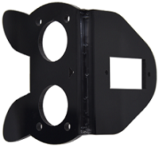|
|2|乐高孔位亚克力舵机固定平台|1|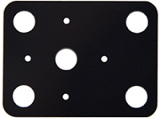|
|3|电机亚克力垫板|4|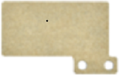|
|4|4.5V 200转/分电机|4|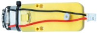|
|5|固定块 |4|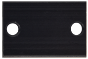|
|6|蓝牙模块|1|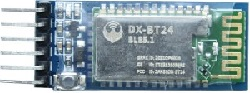|
|7|舵机|1|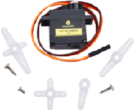|
|8|麦克纳姆轮全向轮|4|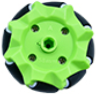|
|9|传感器扩展板|1||
|10|Keyes Uno Plus 开发板|1|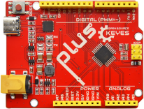|
|11|麦克纳姆轮小车下板|1|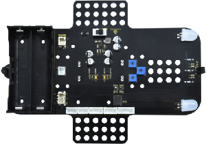|
|12|M3*15MM双通铜柱|4|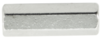|
|13|黄色乐高十字轴套|4|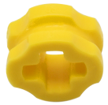|
|14|蓝色乐高半摩擦销|4|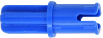|
|15|乐高摩擦销用亚克力垫片 6片|1|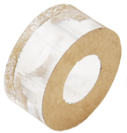|
|16|M3*6MM 平头 十字螺钉|10|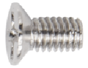|
|17|超声波传感器|1|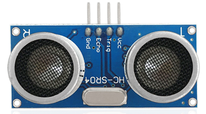|
|18|M3*8MM 平头 十字螺钉|10|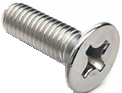|
|19|M3 螺母|10|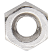|
|20|M3*30MM 圆头 十字螺钉|9|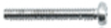|
|21|M2 螺母|3|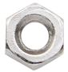|
|22|M2*8MM 圆头 十字螺钉|3|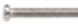|
|23|M1.4 螺母|6|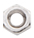|
|24|M1.4*10MM 圆头 十字螺钉|6|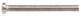|
|25|M2.3*16MM 圆头十字 自攻螺钉|4|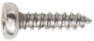|
|26|遥控器|1||
|27|USB线|1|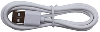|
|29|HX-2.54 5P 两端反向 22AWG 白黄红红黑 100mm|1||
|30|HX-2.54 4P 两端反向 22AWG 白黄红黑 50mm|1|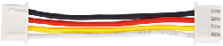|
|31|HX2.54mm-4P转2.54杜邦母单 绿蓝红黑线 26AWG 线长150MM|1|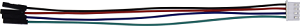|
|32|XH2.54 3P 两端反向 50mm 黄红黑 22AWG|2|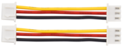|
|33|3*40MM 十字螺丝刀|1|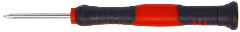|
|34|白色3D打印TT联轴器|4||
|35|M1.2*5MM 圆头十字自攻螺钉|6|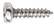|
|36|循迹跑道|1|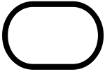|
|37|缠绕管|1|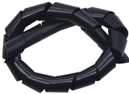|
|38|18650电池|2|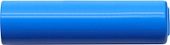|

## 1.6 主控板及扩展板介绍

### 1.6.1 Keyes UNO PLUS开发板简介

在开始所有的项目之前，首先要了解下面这块Keyes UNO PLUS开发板，因为这个小车的核心就是这个开发板。

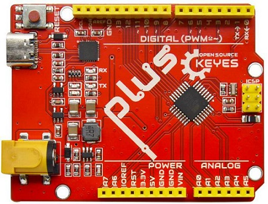

UNO PLUS开发板的处理器核心是ATMEGA328P-AU，并带有CP2102芯片作为USB串口转换器。主控板具有14个数字输入/输出口（其中6个可作为PWM输出），8个模拟输入，1个串口通信接口，USB连接口，电源插孔，1个ICSP插头和一个复位按钮。它支持微控制器所需的一切，只需用USB线将其连接到电脑，然后通过外部电源连接器(DC 6-15V)为其供电即可使用。

**规格参数**

- 微控制器：ATMEGA328P-AU
- USB转串口芯片：CP2102
- 工作电压：DC 5V
- 外接电源：DC 6-15V（建议9V）
- 数字I/O引脚：14个 (D0-D13) (其中包含6个PWM输出口)
- PWM引脚：6个 (D3、D5、D6、D9、D10、D11)
- 模拟输入通道（ADC）：8个 (A0-A7)
- 每个I/O直流输出能力：20 mA
- 3.3V端口输出能力：50 mA
- 快闪存储器：32 KB（其中引导程序使用0.5KB）
- 静态存储器M：2 KB 
- 只读存储器：1 KB 
- 时钟速度：16MHz

**各个接口和主要元件说明**

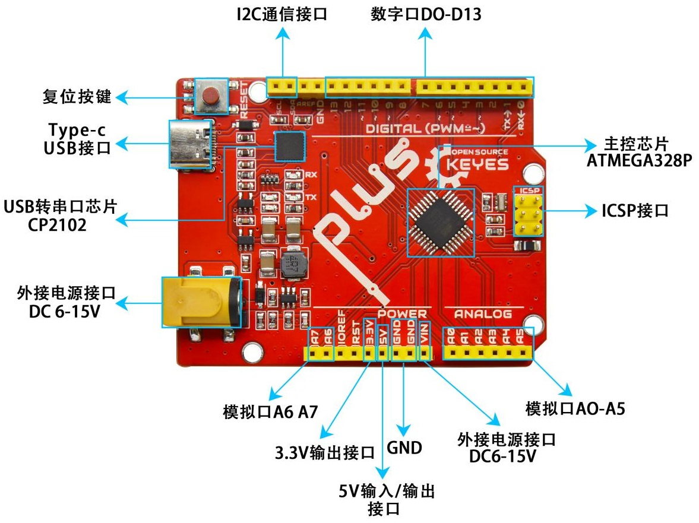

**特殊功能接口说明**

- 串口通信接口：D0为RX、D1为TX
- PWM接口（脉宽调制）：D3、D5、D6、D9、D10、D11
- 外部中断接口：D2(中断0)和D3 (中断1)
- SPI通信接口：D10为SS、D11为MOSI、D12为MISO、D13为SCK
- IIC通信端口：A4为SDA、A5为SCL

### 1.6.2 扩展板简介

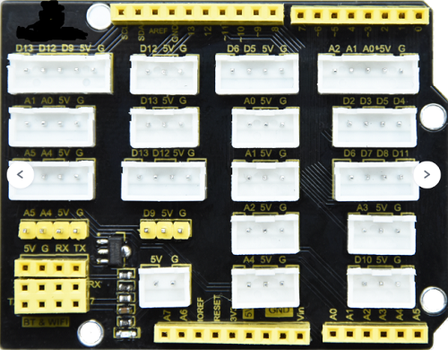

这款扩展板是适用于UNO开发板的，可直插在UNO开发板上；无需外接电源，在保留原IO口的情况下，采用PH2.54防反接插口，引出了UNO开发板的IO口，PH2.54插口避免接错而保护UNO主板和传感器；每个IO口配备独立的VCC和GND接口，使得传感器接线更轻松。

电机、七彩灯，WS2812灯珠等所有小车上的模块的接口都引出来了，只需要一根带防反插端子的线从对应底板上的接口连接就行了，简单方便。此外我们还预留了一些接口，如：I²C、UART、还有蓝牙/WIFI接口。

**规格参数**

- 电流：最大为1.2A（arduino UNO的IO引脚提供的最大总电流为200mA，wifi模块最大为1A）

- 输入电压：DC 5V

- 输出电压：DC 3.3V ~ 5V

- 最大功率: 4.3W

- 推荐环境温度：-10°C ~ 50°C

- 产品尺寸：70\*55\*27mm

- 重量：25.5g

**接口说明**

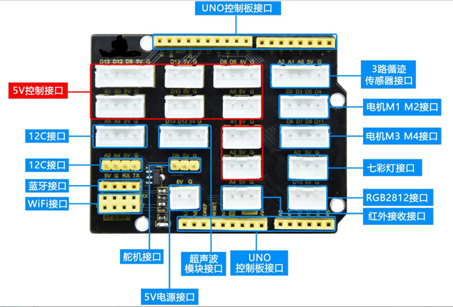

**使用方法**

将扩展板堆叠在Keyes UNO PLUS开发板上即可使用，如下图：

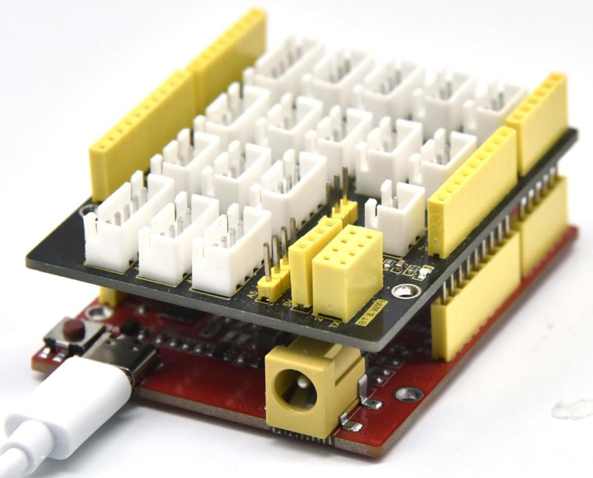

## 1.7 小车底板（带电机驱动）

**1\. 简介：**

底板主控为STC8，搭配 DRV8833 电机驱动芯片，驱动 4 个齿轮减速直流电机。

STC8 作为 I²C 从设备，外部主控通过 I²C 写寄存器控制引脚输出，节省主控 IO 口：

- 寄存器0x01 ~ 0x08：8 路 PWM 输出，控制电机速度。
- 寄存器0x09 ~ 0x0A：2 路数字电平输出，控制电机转向。

DRV8833 是双 H 桥芯片，4 个电机需要两片该芯片；减速电机自带齿轮箱，降低转速、增大扭矩，结构紧凑，适配小车运动。

板载外设分配：

- 直连 STC8：2 个七彩灯、4 个减速电机（经 DRV8833 驱动）
- 直连上层控制板：3 路循迹传感器、车头车尾 2 个红外接收头、4 个 WS2812 灯

工作流程：

上层主控板作为 I2C 主机，向 STC8 写入寄存器数据，STC8 输出 PWM 和方向电平给 DRV8833，实现电机调速换向；传感器、WS2812灯由上层主控板直接读取控制。

**2\. 规格参数：**

- 底板连接器端口输入：DC 7V--9V

- 驱动板系统运行电压：5V

- 标准运行功耗：约为2.2W

- 最大输出功率：约为12W

- 电机转速：200转/分

- 工作温度范围：0-50 ℃

- 尺寸：120\*120\*120mm

- 环保属性：ROHS

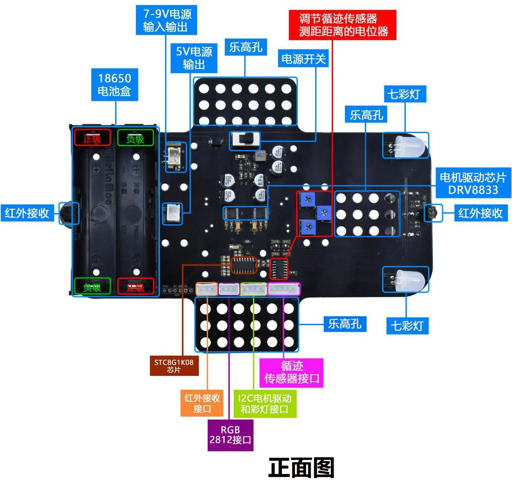

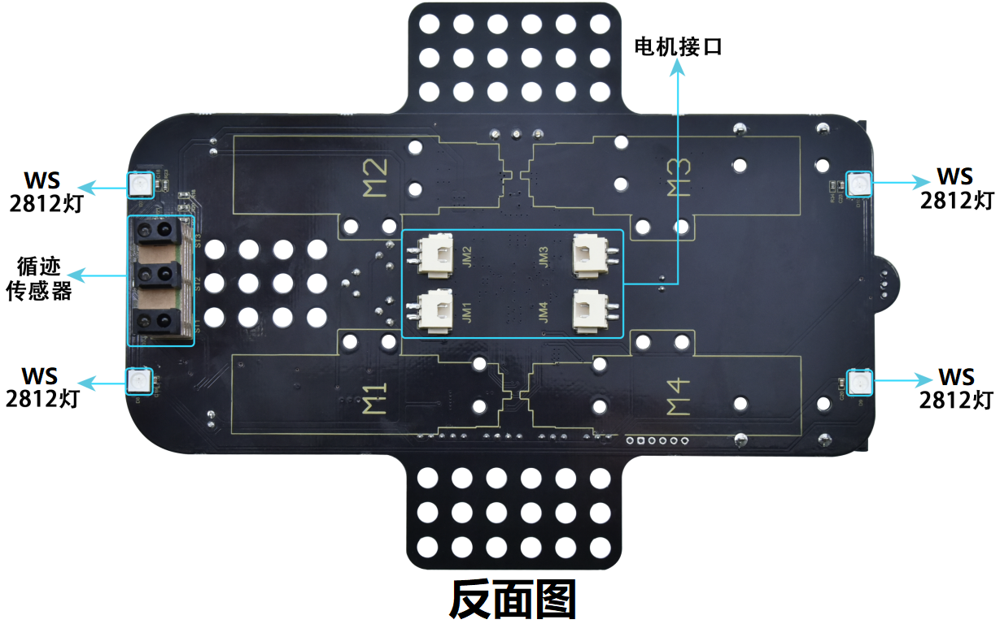