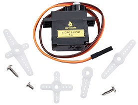
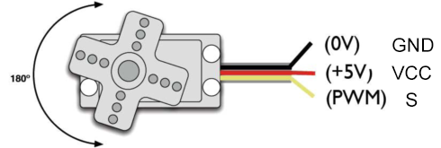
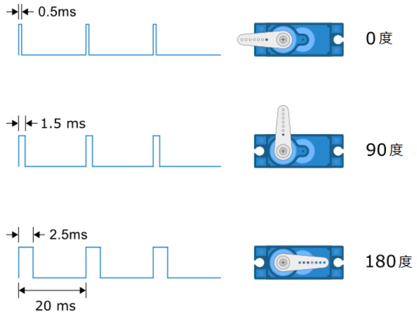

### 第03课 舵机  

#### 3.1 项目介绍  

  

对于那些DIY智能汽车来说，往往都有自动避障的功能。在DIY过程中，我们需要一个伺服来控制超声波模块左右旋转，然后检测汽车与障碍物的距离，从而控制汽车避开障碍物。  

如果使用其他微控制器来控制伺服的旋转，我们需要设置一定频率和一定宽度的脉冲来控制伺服角度。但是如果用Arduino来控制伺服角度，我们只需要在开发环境中设置舵机的连接引脚然后设置控制角度即可。在开发环境中会自动设置相应的脉冲来控制伺服旋转。  

在本项目中，您将学习如何控制伺服舵机在0°和180°之间来回旋转。  

#### 3.2 模块相关资料  

舵机内部主要由直流电机、减速齿轮组、电位器和控制电路组成。你可以把它想象成一个带有“记忆”的电机。

**内部结构图：**


**引脚介绍：**



**棕线：** 一个接地的引脚

**红线：** 一个连接到+5V电源的引脚

**橙线：** 信号端的引脚，PWM信号控制

当我们给舵机发送一个 PWM（脉冲宽度调制）信号时，控制电路会检测这个信号的脉冲宽度。标准的舵机信号周期是 20ms（即频率 50Hz）。在这个周期内，高电平持续的时间决定了舵机的角度：

- **0.5ms** 的高电平通常对应 **0°**。
- **1.5ms** 的高电平通常对应 **90°**（中位）。
- **2.5ms** 的高电平通常对应 **180°**。



Arduino 的 `Servo` 库帮我们要处理这些复杂的时序计算，我们只需要告诉它角度（0-180），它会自动生成对应的 PWM 信号。
 

#### 3.3 实验代码  

⚠️ <span style="color: rgb(255, 76, 65);">**重要提醒：上传示例代码前，请务必拔掉蓝牙模块！因为蓝牙模块也占用Arduino的串口通信（TX/RX），如果不拔掉，示例代码上传会失败。**</span>

```cpp  
#define  servo_pin  9   // 舵机接D9

void setup() {
  pinMode(servo_pin, OUTPUT);    // 舵机引脚设置为输出模式
}

void loop() {
  for (uint8_t angle = 0; angle < 180; angle++){ // 舵机角度从0°逐渐加1到180°
    servopulse(servo_pin, angle);
  }
  for (uint8_t angle = 180; angle > 0; angle--){ // 舵机角度从180°逐渐减1到0°
    servopulse(servo_pin, angle);
  }
}

void servopulse(int pin, int myangle) {   // 脉冲函数
  int pulsewidth = map(myangle, 0, 180, 500, 2500); // 将角度映射到脉宽
  //输出脉冲
  digitalWrite(pin, HIGH);        // 将舵机接口电平至高
  delayMicroseconds(pulsewidth);  // 延时脉宽值的微秒数
  digitalWrite(pin, LOW);         // 将舵机接口电平至低
  delay(20 - pulsewidth / 1000);  // 周期为20ms
}
```  

#### 3.4 实验结果  

⚠️ <span style="color: rgb(255, 76, 65);">**重要提示：**</span>

- <span style="color: rgb(172, 57, 255);">**上传示例代码前，请务必拔掉蓝牙模块！ 因为蓝牙模块也占用Arduino的串口通信（TX/RX），如果不拔掉，示例代码上传会失败。**</span>

外接电源，将4WD麦克纳姆轮小车下板上的拨码开关拨到 “<span style="color: rgb(255, 76, 65);">**ON**</span>” 端，上电后。选择好正确的开发板板型（Arduino Uno）和 适当的串口端口（COMxx），然后单击  按钮上传实验代码至Arduino控制板。

代码上传成功后，就可以看到舵机在0°到180°之间来回转动。  

#### 3.5 代码说明  

| 代码段 | 说明 |  
|--------|------|  
| `#define servo_pin 9` | 定义舵机的引脚号为D9。 |  
| `pinMode(servo_pin, OUTPUT);` | 设置连接舵机的引脚为输出模式，设置完后可输出高/低电平。 |  
| `servopulse(servo_pin, angle);` | 脉冲函数，使连接servo_pin引脚的舵机转动到angle角度位置。 |  
| `map(myangle, 0, 180, 500, 2500);` | 映射函数，把myangle这个变量从0~180映射到500到2500，比如当myangle为90时，映射出来的值就是1500。 |  
| `digitalWrite(pin, HIGH);` | 设置舵机引脚电平为高。 |  
| `delayMicroseconds(pulsewidth);` | 延时pulsewidth微秒。 |  

#### 3.6 项目拓展  

使用舵机库来驱动，使用前得先安装舵机文件。 

⚠️ <span style="color: rgb(255, 76, 65);">**重要提醒：上传示例代码前，请务必拔掉蓝牙模块！因为蓝牙模块也占用Arduino的串口通信（TX/RX），如果不拔掉，示例代码上传会失败。**</span>

```cpp  
#include <Servo.h> // 导入库文件

#define  servo_pin  9  // 舵机接D9
Servo myservo;    // 定义一个舵机类实例

void setup() {
  myservo.attach(servo_pin);    // 舵机引脚连接到D9
}

void loop() {
  for (uint8_t angle = 0; angle < 180; angle++) // 从0到180度
  {
    myservo.write(angle); // 转动到angle角度
    delay(15);  // 等待一会,以免转得太快
  }
  for (uint8_t angle = 180; angle > 0; angle--) // 从180到0度
  {
    myservo.write(angle); // 转动到angle角度
    delay(15);
  }
}
```  

⚠️ <span style="color: rgb(255, 76, 65);">**再次提醒：**</span>

- <span style="color: rgb(172, 57, 255);">**上传示例代码前，请务必拔掉蓝牙模块！ 因为蓝牙模块也占用Arduino的串口通信（TX/RX），如果不拔掉，示例代码上传会失败。**</span>

外接电源，将4WD麦克纳姆轮小车下板上的拨码开关拨到 “<span style="color: rgb(255, 76, 65);">**ON**</span>” 端，上电后。选择好正确的开发板板型（Arduino Uno）和 适当的串口端口（COMxx），然后单击  按钮上传扩展代码至Arduino控制板。

代码上传成功后，就可以看到舵机在0~180度之间来回转动。

一般我们使用舵机库来驱动，这样使用了定时器更精确。  
