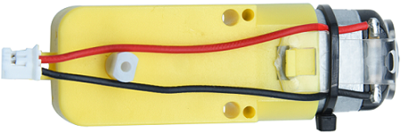
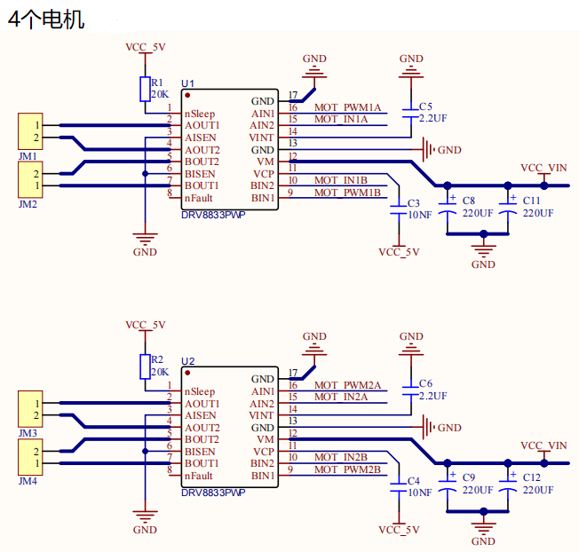
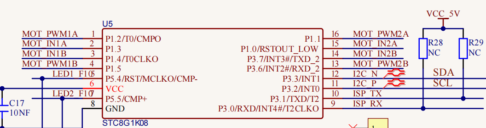
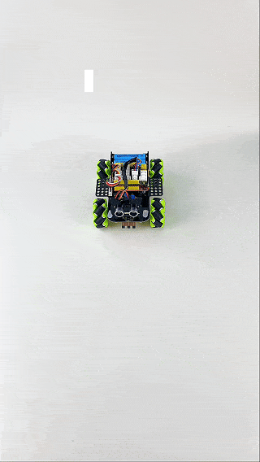

### 第04课 直流减速电机  

#### 4.1 项目介绍  

  

小车行走依靠电机带动车轮，套件配备 4 个直流减速电机，即 [齿轮减速电机](https://baike.baidu.com/item/%E9%BD%BF%E8%BD%AE%E5%87%8F%E9%80%9F%E7%94%B5%E6%9C%BA/3249233)，由 [直流电机](https://baike.baidu.com/item/%E7%9B%B4%E6%B5%81%E7%94%B5%E6%9C%BA/2404223)的基础上，加上配套齿轮减速箱。同时，[齿轮箱](https://baike.baidu.com/item/%E9%BD%BF%E8%BD%AE%E7%AE%B1/1059341) 可以降转速、增扭矩；选用不同 [减速比](https://baike.baidu.com/item/%E5%87%8F%E9%80%9F%E6%AF%94/5341327) 就能得到不同转速和力矩。这大大提高了直流电机在自动化行业中的使用率，[减速电机](https://baike.baidu.com/item/%E5%87%8F%E9%80%9F%E7%94%B5%E6%9C%BA/3750851)属于电机 ‑ [减速器](https://baike.baidu.com/item/%E5%87%8F%E9%80%9F%E6%9C%BA/873618)一体化模块，又称齿轮马达，应用广泛，能够简化设计、节约空间。  

电机工作电流大，不能直接用单片机 IO 口驱动，否则电机无力转动甚至烧毁主控芯片，因此需要专用电机驱动芯片。本底板集成 DRV8833，可控制 4 路直流减速电机的转速与转向。下面分析驱动板芯片电路原理图。  

#### 4.2 模块相关资料  

  

  

电路使用两片 DRV8833 电机驱动芯片，每颗驱动芯片拥有 2 组电机控制通道，每组通道占用 2 个控制引脚，总共使用 8 个 IO 引脚，实现对 4 台直流电机的独立控制。

上图为电机驱动芯片与 STC8G1K08 主控的接线原理图。本设计采用 I²C 通信协议控制电机：向 STC 芯片对应的寄存器地址写入 PWM 占空比数值，即可输出 PWM 信号控制电机驱动芯片。

底层电机驱动库已经编写完成，开发时直接调用封装好的 API 函数，就可以控制小车运行。

#### 4.3 实验代码  

⚠️ <span style="color: rgb(255, 76, 65);">**重要提醒：上传示例代码前，请务必拔掉蓝牙模块！因为蓝牙模块也占用Arduino的串口通信（TX/RX），如果不拔掉，示例代码上传会失败。**</span>

```cpp  
#include "MecanumCar_v2.h" // 导入库文件

mecanumCar mecanumCar(3, 2);  // sda-->D3,scl-->D2

void setup() {
  mecanumCar.Init();  // 初始化麦轮车驱动
}

void loop() {
  mecanumCar.Advance();  // 前进
  delay(2000);           // 等待2秒  
  mecanumCar.Back();     // 后退
  delay(2000);
  mecanumCar.Turn_Left(); // 左转
  delay(2000);
  mecanumCar.Turn_Right(); // 右转
  delay(2000);
  mecanumCar.Stop();      // 停止
  delay(1000);
}
```  

#### 4.4 实验结果  

⚠️ <span style="color: rgb(255, 76, 65);">**再次提醒：**</span>

- <span style="color: rgb(172, 57, 255);">**上传示例代码前，请务必拔掉蓝牙模块！ 因为蓝牙模块也占用Arduino的串口通信（TX/RX），如果不拔掉，示例代码上传会失败。**</span>

外接电源，将电机驱动板上的拨码开关拨到 “<span style="color: rgb(255, 76, 65);">ON</span>” 端，上电后。选择好正确的开发板板型（Arduino Uno）和 适当的串口端口（COMxx），然后单击  按钮上传S实验代码至Arduino控制板。

代码上传成功后，就可以看到小车前进2秒然后后退2秒，然后左转2秒再右转2秒，最后停止1秒，如此反复循环。



#### 4.5 代码说明  

| 代码段 | 说明 |  
|--------|------|  
| `#include "MecanumCar_v2.h"` | 导入MecanumCar_v2的头文件，使用库文件的一些接口函数。 |  
| `mecanumCar mecanumCar(sda, scl);` | 创建小车驱动的类实例，用来驱动电机，sda接D3，scl接D2。 |  
| `mecanumCar.Init();` | 初始化小车驱动。 |  
| `mecanumCar.Advance();` | 则4个电机向前转，小车前进。 |  
| `mecanumCar.Back();` | 则4个电机向后转，小车后退。 |  
| `mecanumCar.Turn_Left();` | 左边2个电机向后转，右边2个电机向前转，小车左旋转。 |  
| `mecanumCar.Turn_Right();` | 左边2个电机向前转，右边2个电机向后转，小车右旋转。 |  
| `mecanumCar.Stop();` | 4个电机停止转动，小车停止。 |  
| `delay(2000);` | 等待2秒。 |  


