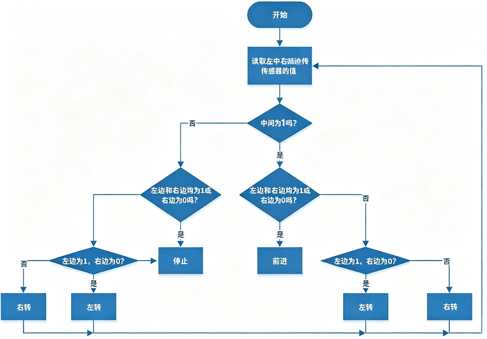

### 第06课 循迹智能车  

  

#### 6.1 项目介绍  

前面已经掌握循迹传感器、电机驱动的原理与用法，接下来组合二者制作循迹小车。

循迹，即沿着预定轨迹行驶，最常见的就是黑线循迹小车。它的实现原理是：循迹传感器检测地面黑色引导线，把路面状态信号传回主控板；主控板对采集到的传感器信号进行解析判断，实时控制电机驱动芯片，调整小车前进方向，让小车始终沿着黑色轨迹自动运行，完成自动循迹功能。  

#### 6.2 实验流程图  



#### 6.3 实验代码 

⚠️ <span style="color: rgb(255, 76, 65);">**重要提醒：上传示例代码前，请务必拔掉蓝牙模块！因为蓝牙模块也占用Arduino的串口通信（TX/RX），如果不拔掉，示例代码上传会失败。**</span>

```cpp  
#include "MecanumCar_v2.h" // 导入库文件
mecanumCar mecanumCar(3, 2);  // sda-->D3,scl-->D2

/*******循迹传感器引脚定义**********/
#define SensorLeft    A0   // 左传感器输入引脚
#define SensorMiddle  A1   // 中间传感器输入引脚
#define SensorRight   A2   // 右传感器输入引脚


void setup() {
  /****循迹传感器接口全部设置为输入模式***/
  pinMode(SensorLeft, INPUT);
  pinMode(SensorMiddle, INPUT);
  pinMode(SensorRight, INPUT);
  mecanumCar.Init(); // 初始化七彩灯与电机驱动
}

void loop() {
  uint8_t SL = digitalRead(SensorLeft);   // 读取左边巡线传感器的值
  uint8_t SM = digitalRead(SensorMiddle); // 读取中间巡线传感器的值
  uint8_t SR = digitalRead(SensorRight);  // 读取右边巡线传感器的值
  if (SM == HIGH) {
    if (SL == LOW && SR == HIGH) {  // 右边是黑色，左边是白色，向右转
      mecanumCar.Turn_Right();
    }
    else if (SR == LOW && SL == HIGH) {  // 左边是黑色，右边是白色，左转
      mecanumCar.Turn_Left();
    }
    else {  // 两边都是白色的，向前走
      mecanumCar.Advance();
    }
  }
  else {
    if (SL == LOW && SR == HIGH) { // 右边是黑色，左边是白色，向右转
      mecanumCar.Turn_Right();
    }
    else if (SR == LOW && SL == HIGH) {  // 右边是白色，左边是黑色，左转
      mecanumCar.Turn_Left();
    }
    else { // 全白色，停止
      mecanumCar.Stop();
    }
  }
}

```  

#### 6.4 实验结果  

⚠️ <span style="color: rgb(255, 76, 65);">**再次提醒：**</span>

- <span style="color: rgb(172, 57, 255);">**上传示例代码前，请务必拔掉蓝牙模块！ 因为蓝牙模块也占用Arduino的串口通信（TX/RX），如果不拔掉，示例代码上传会失败。**</span>

外接电源，将电机驱动板上的拨码开关拨到 “<span style="color: rgb(255, 76, 65);">ON</span>” 端，上电后。选择好正确的开发板板型（Arduino Uno）和 适当的串口端口（COMxx），然后单击  按钮上传实验代码至Arduino控制板。

代码上传成功后，将小车放在黑色循迹轨道上，小车就能沿着黑线行驶了。 

 

#### 6.5 代码说明  

| 代码段 | 说明 |  
|--------|------|  
| `#define SensorLeft A0` | 引脚定义 |  
| `pinMode(SensorLeft, INPUT);` | 设置引脚输入输出模式 |  
| `mecanumCar.Init();` | 初始化电机驱动 |  
| `SL = digitalRead(SensorLeft);` | 读取引脚电平信号，保存给变量 |  
| `if (SM == HIGH)` | 如果中间循迹传感器读取到高电平 |  
| `if (SL == LOW && SR == HIGH)` | 如果左边为低电平且右边为高电平 |  
| `else if (SR == LOW && SL == HIGH)` | 否则如果右边为低电平且左边为低电平 |  

