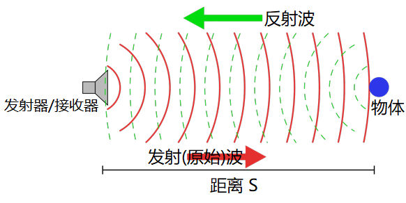
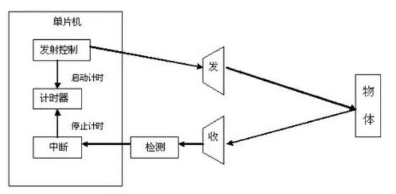
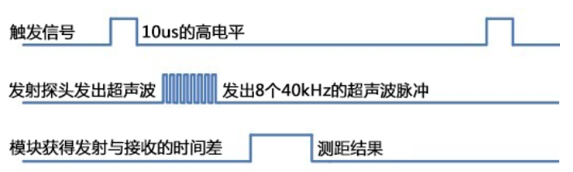
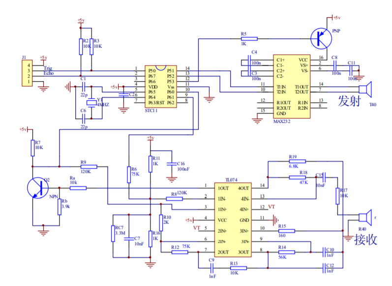
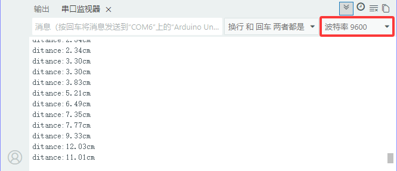

### 第07课 超声波传感器  

#### 7.1 项目介绍  

  

超声波传感器模仿蝙蝠声呐原理，测算传感器与障碍物之间的距离。该传感器可以实现非接触式距离检测，测量精度高、数据输出稳定，传感器集成超声波发射单元与接收单元。

超声波传感器被大量应用于各类电子项目，常用来实现障碍物检测、距离测量等功能。本节将介绍基于 UNO PLUS 开发板搭配超声波传感器实现距离测量，以及在 Arduino IDE 中对超声波传感器的使用。 

#### 7.2 模块相关参数  

- **工作电压:** +5V DC  
- **静态电流:** < 2mA  
- **工作电流:** 15mA  
- **有效角度:** < 15°  
- **距离范围:** 2cm – 400 cm  
- **精度:** 0.3 cm  
- **测量角度:** 30°  
- **触发输入脉宽:** 10us  

**测距原理：** HC‑SR04 采用回声探测法完成距离测量：超声波发射器向外发射超声波，发射瞬间计时器开始计时；超声波在空气中传播，遇到障碍物后发生反射；接收端接收到回波信号，立刻停止计时。超声波属于声波，传播速度受温度影响，常温下空气中声速约为 340m/s。根据计时器记录的传播总时间t，可以计算传感器到障碍物的距离。即：S=340t/2：



**工作步骤：**

- 通过 IO 口向 TRIG 引脚输出至少 10μs 的高电平，触发模块开始测距。
- 模块自动向外发送 8 组 40kHz 的超声波脉冲，同时检测回波信号。
- 当接收到回波，ECHO 引脚输出高电平；单片机读取 ECHO 高电平持续时长，即为超声波从发射到返回的总时间，代入公式即可算出距离。

时序逻辑：先给 TRIG 一个 10μs 触发高电平 → 探头输出 8 个 40kHz 超声波脉冲 → 接收回波得到时间差，换算输出测距结果。




**超声波模块的电路图：**

  

#### 7.3 实验代码 

⚠️ <span style="color: rgb(255, 76, 65);">**重要提醒：上传示例代码前，请务必拔掉蓝牙模块！因为蓝牙模块也占用Arduino的串口通信（TX/RX），如果不拔掉，示例代码上传会失败。**</span>

```cpp  
/*******超声波传感器接口*****/
#define EchoPin  13  // ECHO引脚接到D13
#define TrigPin  12  // TRIG引脚接到D12

void setup() {
  Serial.begin(9600); // 设置波特率为9600
  pinMode(EchoPin, INPUT);    // ECHO引脚设置为输入模式
  pinMode(TrigPin, OUTPUT);   // TRIG引脚设置为输出模式
}

void loop() {
  float distance = Get_Distance();  // 获取距离保存在distance变量
  Serial.print("ditance:");
  Serial.print(distance);
  Serial.println("cm");
  delay(100);
}

float Get_Distance(void) {    // 超声波测距函数
  float dis;
  digitalWrite(TrigPin, LOW);
  delayMicroseconds(2);
  digitalWrite(TrigPin, HIGH); // 给TRIG至少10us的高电平以触发
  delayMicroseconds(10);
  digitalWrite(TrigPin, LOW);
  dis = pulseIn(EchoPin, HIGH) /58.2;  // 计算出距离
  delay(50);
  return dis;
}
```  

#### 7.4 实验结果  

⚠️ <span style="color: rgb(255, 76, 65);">**再次提醒：**</span>

- <span style="color: rgb(172, 57, 255);">**上传示例代码前，请务必拔掉蓝牙模块！ 因为蓝牙模块也占用Arduino的串口通信（TX/RX），如果不拔掉，示例代码上传会失败。**</span>

外接电源，将电机驱动板上的拨码开关拨到 “<span style="color: rgb(255, 76, 65);">ON</span>” 端，上电后。选择好正确的开发板板型（Arduino Uno）和 适当的串口端口（COMxx），然后单击  按钮上传实验代码至Arduino控制板。

代码上传成功后，打开串口监视器，设置波特率为9600，可以在串口监视器中看到超声波传感器检测到的距离，移动小车前面的障碍物，看到串口监视器中距离值也在发生变化。  

  

#### 7.5 代码说明  

| 代码段 | 说明 |  
|--------|------|  
| `#define EchoPin 13` | 超声波引脚接口定义，Trig接D12，Echo接D13 |  
| `pinMode(EchoPin, INPUT);` | Echo引脚设置为输入模式，Trig引脚设置为输出模式 |  
| `pulseIn(EchoPin, HIGH);` | 这是Arduino自带的一个函数，返回Echo引脚高电平的时间，单位为us。 |  
| `pulseIn(EchoPin, HIGH) / 58.2;` | 根据Echo高电平时间来计算声波往返路程，从而计算出前方障碍物的距离。 |  