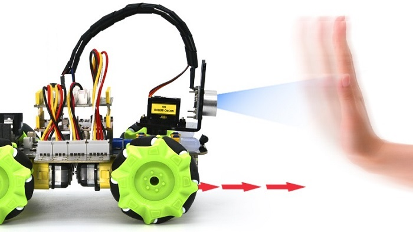
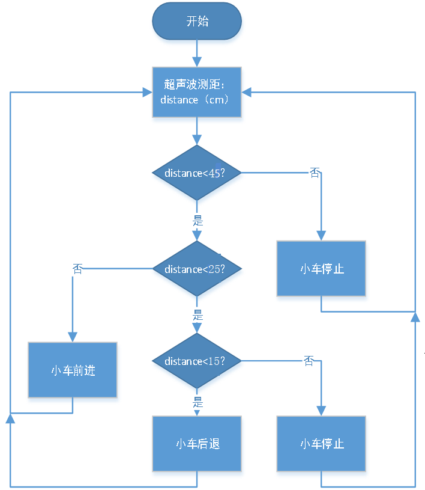

### 第08课 超声波跟随智能车  

  

#### 8.1 项目介绍  

前面我们学习了使用循迹传感器和电机制作一个自动巡线智能小车，这节课我们将使用超声波传感器和电机来制作一个自动跟随智能小车。通过超声波传感器检测智能车与前方障碍物的距离，然后根据这个数据控制两个电机的转动，从而控制智能车的运动状态。  

#### 8.2 实验流程图  




#### 8.3 实验代码

⚠️ <span style="color: rgb(255, 76, 65);">**重要提醒：上传示例代码前，请务必拔掉蓝牙模块！因为蓝牙模块也占用Arduino的串口通信（TX/RX），如果不拔掉，示例代码上传会失败。**</span>

```cpp  
#include "MecanumCar_v2.h"
#include "Servo.h"

mecanumCar mecanumCar(3, 2);  // sda-->D3,scl-->D2
Servo myservo;    // 定义一个舵机类实例

/*******超声波传感器接口*****/
#define EchoPin  13  // ECHO引脚接到D13
#define TrigPin  12  // TRIG引脚接到D12

void setup() {
  Serial.begin(9600); // 启动串口监视器,并设置波特率为9600
  pinMode(EchoPin, INPUT);  // ECHO引脚设置为输入模式
  pinMode(TrigPin, OUTPUT); // TRIG引脚设置为输出模式
  myservo.attach(9);  // 将D9上的舵机附加到舵机对象上
  myservo.write(90); // 转动到90度
  delay(300); // 延时0.3秒
  mecanumCar.Init(); // 初始化七彩灯与电机驱动
}

void loop() {
  int distance = get_distance();  // 获取距离保存在distance变量
  Serial.println(distance);
  if (distance < 15)  // 后退的范围
  {
    mecanumCar.Back();
  }
  else if (distance < 25)  // 停止的范围
  {
    mecanumCar.Stop();
  }
  else if (distance < 45) // 前进的范围
  {
    mecanumCar.Advance();
  }
  else  // 其它情况停止
  {
    mecanumCar.Stop();
  }
}

/*********************超声波测距*******************************/
int get_distance(void) {    //超声波测距
  int dis;
  digitalWrite(TrigPin, LOW);
  delayMicroseconds(2);
  digitalWrite(TrigPin, HIGH); //给TRIG至少10us的高电平以触发
  delayMicroseconds(10);
  digitalWrite(TrigPin, LOW);
  dis = pulseIn(EchoPin, HIGH) / 58.2; //计算出距离
  delay(30);
  return dis;
}
```  

#### 8.4 实验结果  

⚠️ <span style="color: rgb(255, 76, 65);">**再次提醒：**</span>

- <span style="color: rgb(172, 57, 255);">**上传示例代码前，请务必拔掉蓝牙模块！ 因为蓝牙模块也占用Arduino的串口通信（TX/RX），如果不拔掉，示例代码上传会失败。**</span>

外接电源，将4WD麦克纳姆轮小车下板上的拨码开关拨到 “<span style="color: rgb(255, 76, 65);">**ON**</span>” 端，上电后。选择好正确的开发板板型（Arduino Uno）和 适当的串口端口（COMxx），然后单击  按钮上传实验代码至Arduino控制板。

代码上传成功后，小车就能直线跟随，在超声波传感器前放置手掌并慢慢向前移动，小车会跟随手掌的移动。  

#### 8.5 代码说明  

| 代码段 | 说明 |  
|--------|------|  
| `myservo.write(90);` | 在开始的时候，我们先让舵机转动到90度位置。 |  
| `int distance = get_distance();` | 定义一个整数变量用来保存测得的距离，后面根据这个距离来控制小车行驶。 |  
| `if (distance <= 15)` | 测得的前面距离小于等于15cm时，小车后退。 |  
| `else if (distance <= 25)` | 前面距离小于等于25cm时，小车停止。 |  
| `else if (distance <= 45)` | 前面距离小于等于45cm时，小车前进。 |  
| `else` | 前面距离大于45cm时，小车停止。 |  
