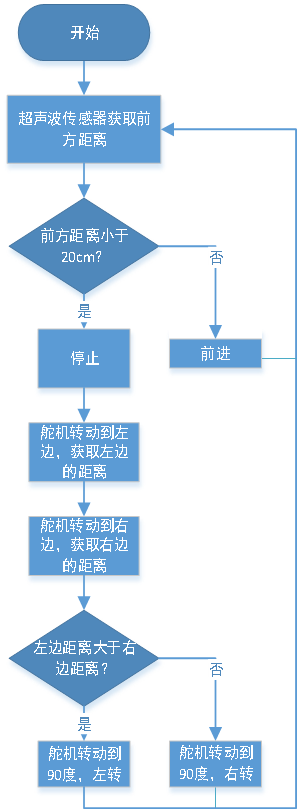

### 第09课 超声波避障智能车  

  

#### 9.1 项目介绍  

在上个项目中，我们制作了一个超声波跟随智能车。实际上，利用相同的硬件和接线方法，只需更改一个测试代码，就可以将跟随智能车转变为避障智能车。超声波避障智能车通过超声波传感器检测前方障碍物的距离，然后舵机云台转动检测左右两侧的距离，并根据这些数据控制四个电机的转动，从而控制智能车的运动状态，实现避障。  

#### 9.2 实验流程图  


 

#### 9.3 实验代码 

⚠️ <span style="color: rgb(255, 76, 65);">**重要提醒：上传示例代码前，请务必拔掉蓝牙模块！因为蓝牙模块也占用Arduino的串口通信（TX/RX），如果不拔掉，示例代码上传会失败。**</span>

```cpp  
#include "MecanumCar_v2.h"
#include "Servo.h"

mecanumCar mecanumCar(3, 2);  // sda-->D3,scl-->D2
Servo myservo;    // 定义一个舵机类实例

/*******超声波传感器接口*****/
#define EchoPin  13  // ECHO引脚接到D13
#define TrigPin  12  // TRIG引脚接到D12

int distance_M, distance_L, distance_R;

void setup() {
  myservo.attach(9);    // 舵机引脚连接到GP9
  pinMode(EchoPin, INPUT);    // ECHO引脚设置为输入模式
  pinMode(TrigPin, OUTPUT);   // TRIG引脚设置为输出模式
  myservo.write(90); // 转动到90度
  delay(300);
}

void loop() {
  distance_M = get_distance();  // 获取距离保存在distance变量
  if (distance_M < 20) { // 当测到前方的距离小于20cm时
    mecanumCar.Stop();  // 小车停止
    delay(500); // 延时500ms
    myservo.write(180);  // 超声波云台左转
    delay(500); // 延时500ms
    distance_L = get_distance();  // 把超声波测到左边的距离赋给变量distance_L
    delay(100); // 稳定读取值时间
    myservo.write(0); // 超声波云台右转
    delay(500); //延时500ms
    distance_R = get_distance(); // 把超声波测到右边的距离赋给变量distance_R
    delay(100); // 稳定读取值时间
    myservo.write(90);  // 回到90度位置
    delay(500);
    if (distance_L > distance_R) { // 左边的距离大于右边时
      mecanumCar.Turn_Left();  // 小车左转
      delay(700);  // 左转700ms
    } else {
      mecanumCar.Turn_Right(); // 小车右转
      delay(700);
    }
  }
  else { // 如果测到前方的距离>=20cm时，机器人前进
    mecanumCar.Advance(); // 前进
  }
}

/*********************超声波测距*******************************/
int get_distance(void) {    // 超声波测距
  int dis;
  digitalWrite(TrigPin, LOW);
  delayMicroseconds(2);
  digitalWrite(TrigPin, HIGH); // 给TRIG至少10us的高电平以触发
  delayMicroseconds(10);
  digitalWrite(TrigPin, LOW);
  dis = pulseIn(EchoPin, HIGH) / 58.2; // 计算出距离
  delay(30);
  return dis;
}
```  

#### 9.4 实验结果  

⚠️ <span style="color: rgb(255, 76, 65);">**再次提醒：**</span>

- <span style="color: rgb(172, 57, 255);">**上传示例代码前，请务必拔掉蓝牙模块！ 因为蓝牙模块也占用Arduino的串口通信（TX/RX），如果不拔掉，示例代码上传会失败。**</span>

外接电源，将4WD麦克纳姆轮小车下板上的拨码开关拨到 “<span style="color: rgb(255, 76, 65);">**ON**</span>” 端，上电后。选择好正确的开发板板型（Arduino Uno）和 适当的串口端口（COMxx），然后单击  按钮上传实验代码至Arduino控制板。

代码上传成功后，小车能够自动避障，注意速度不要调得太大。当小车在行驶过程中前方遇到障碍物时，小车会停止，舵机云台转动到左侧来测量左侧的障碍物距离，之后舵机云台转动到右侧测量右侧的距离，判断左右两侧障碍物的距离，较远的一边小车会进行转向并继续行驶。  

#### 9.5 代码说明  

| 代码段 | 说明 |  
|--------|------|  
| `myservo.write(90);` | 在开始的时候我们让舵机转动到90度位置。 |  
| `int distance = get_distance();` | 定义整数变量，保存测得的距离，用于控制小车运行。 |  
| `myservo.write(180); distance_L = get_distance();` | 超声波转动到左边，测量左边的距离并保存。 |  
| `myservo.write(0); distance_R = get_distance();` | 超声波转动到右边，测量右边的距离并保存。 |  
| `myservo.write(90);` | 舵机回正到90度位置。 |  
| `if (distance_L > distance_R)` | 判断左右两侧的距离，哪一侧更大。 |  
| `else { mecanumCar.Advance(); }` | 如果前方距离大于或等于20cm，小车继续前进。 | 
