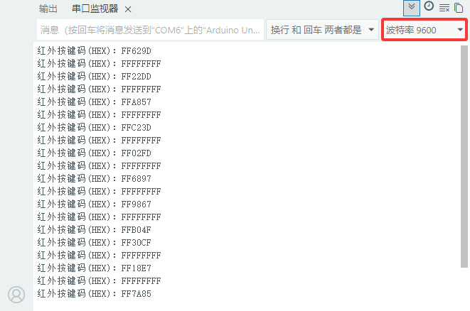
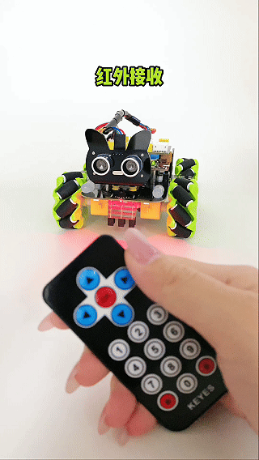

### 第10课 红外接收  

  

#### 10.1 项目介绍  

红外遥控在日常生活中应用十分普遍，电视、音响、录像机、卫星接收机等各类家电都大量使用红外遥控。一套红外遥控系统包含红外发射与红外接收两部分，主要由红外遥控器、红外接收头以及具备解码能力的单片机构成。

红外接收头内部集成 IC 芯片，完成红外信号的接收、放大与解调，最终输出兼容 TTL 电平的数字信号。红外接收头共有 3 个引脚：信号引脚（接单片机 A3 引脚）、VCC 电源引脚、GND 接地引脚。

#### 10.2 模块相关资料  

红外遥控器发射**38KHz 红外载波信号**，信号由遥控器内部编码芯片按照 NEC 协议进行编码。

NEC 协议帧结构包含：引导码、用户码、用户反码、数据码、数据反码。

依靠脉冲时间间隔区分逻辑 0 和逻辑 1：

- 逻辑 0：560μs 低电平 + 560μs 高电平
- 逻辑 1：560μs 低电平 + 1680μs 高电平

遥控器的用户码固定不变，不同按键依靠数据码来区分。按下按键后，遥控器向外发送带编码的 38KHz 红外载波；红外接收模块收到信号后，程序对载波信号做解码处理，解析出数据码，识别出当前按下的按键。 

  

#### 10.3 实验代码 

⚠️ <span style="color: rgb(255, 76, 65);">**重要提醒：上传示例代码前，请务必拔掉蓝牙模块！因为蓝牙模块也占用Arduino的串口通信（TX/RX），如果不拔掉，示例代码上传会失败。**</span>

```cpp  
#include <IRremote.h>

// 红外接收引脚
const int RECV_PIN = A3;
IRrecv irrecv(RECV_PIN);
decode_results results;

void setup(){
  Serial.begin(9600); // 设置波特率
  // 开启红外接收
  irrecv.enableIRIn();
  Serial.println("红外遥控就绪，请按下遥控器按键");
}

void loop()
{
  // 判断是否收到红外信号
  if (irrecv.decode(&results))
  {
    Serial.print("红外按键码(HEX)：");
    Serial.println(results.value, HEX);
  irrecv.resume(); // 释放缓存，准备接收下一组信号
  }
}
```  

#### 10.4 实验结果  

⚠️ <span style="color: rgb(255, 76, 65);">**再次提醒：**</span>

- <span style="color: rgb(172, 57, 255);">**上传示例代码前，请务必拔掉蓝牙模块！ 因为蓝牙模块也占用Arduino的串口通信（TX/RX），如果不拔掉，示例代码上传会失败。**</span>

外接电源，将电机驱动板上的拨码开关拨到 “<span style="color: rgb(255, 76, 65);">ON</span>” 端，上电后。选择好正确的开发板板型（Arduino Uno）和 适当的串口端口（COMxx），然后单击  按钮上传实验代码至Arduino控制板。

代码上传成功后，打开串口监视器，设置波特率为9600，拿出遥控器，对准红外接收传感器发送信号，即可看到相应按键的键值。如果按键时间过长，容易出现乱码。  

特别提醒： 使用红外遥控器之前，需要将红外遥控器上的透明塑料卡片抽掉。

  

 

通过测试得出的数值，我们做了一个遥控器按键值表，方便以后使用：  

  

#### 10.5 代码说明  

| 代码段 | 说明 |  
|--------|------|  
| `#include <IRremote.h>` | 导入红外接收的库文件 |  
| `int RECV_PIN = A3;` | 红外接收模块接A3 |  
| `if (irrecv.decode(&results))` | 定义一个整型变量，用来保存红外遥控的键值 |  
| `if (results.value == 0xFF02FD && flag == true)` | 如果按下了OK键并且flag为真 |
| `flag = true;` |将flag置为假，用来下次熄灭 | 
|`else if (results.value == 0xFF02FD && flag == false)`|如果按下了OK键并且flag为假| 
| `flag = false;` |将flag置为真，用来下次点亮 |  

#### 10.6 项目拓展：使用一个OK键来控制七彩灯的亮灭 

⚠️ <span style="color: rgb(255, 76, 65);">**重要提醒：上传示例代码前，请务必拔掉蓝牙模块！因为蓝牙模块也占用Arduino的串口通信（TX/RX），如果不拔掉，示例代码上传会失败。**</span>

```cpp  
#include <MecanumCar_v2.h>
#include <IRremote.h>

// I2C七彩灯与电机驱动 SDA=D3 SCL=D2
mecanumCar mecanumCar(3, 2);
// 红外接收引脚A3
const int RECV_PIN = A3;
IRrecv irrecv(RECV_PIN);
decode_results results;

// 灯光状态标记
bool flag = true;

void setup() {
  Serial.begin(9600);   // 开启串口，波特率9600
  mecanumCar.Init();   // 初始化电机与七彩灯驱动
  irrecv.enableIRIn();  // 启动红外接收 
}

void loop() {
  if (irrecv.decode(&results)) {
    Serial.println(results.value, HEX);
    if (results.value == 0xFF02FD && flag == true) { // 开灯的值
       mecanumCar.right_led(1);
       mecanumCar.left_led(1);
       flag = false;
    }
    else if (results.value == 0xFF02FD && flag == false) { // 关灯的值
       mecanumCar.right_led(0);
       mecanumCar.left_led(0);
       flag = true;
    }
    irrecv.resume(); // 释放缓存，准备接收下一组信号
  }
}
```  

⚠️ <span style="color: rgb(255, 76, 65);">**再次提醒：**</span>

- <span style="color: rgb(172, 57, 255);">**上传示例代码前，请务必拔掉蓝牙模块！ 因为蓝牙模块也占用Arduino的串口通信（TX/RX），如果不拔掉，示例代码上传会失败。**</span>

外接电源，将电机驱动板上的拨码开关拨到 “<span style="color: rgb(255, 76, 65);">ON</span>” 端，上电后。选择好正确的开发板板型（Arduino Uno）和 适当的串口端口（COMxx），然后单击  按钮上传实验代码至Arduino控制板。

代码上传成功后，当遥控器按下OK按键时，七彩灯就会亮；再按一下OK按键时，七彩灯就会灭。


