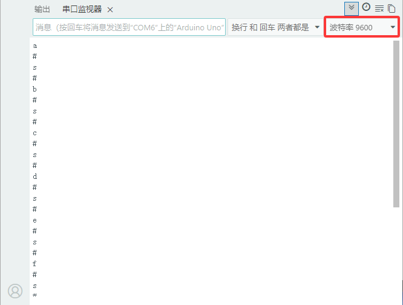
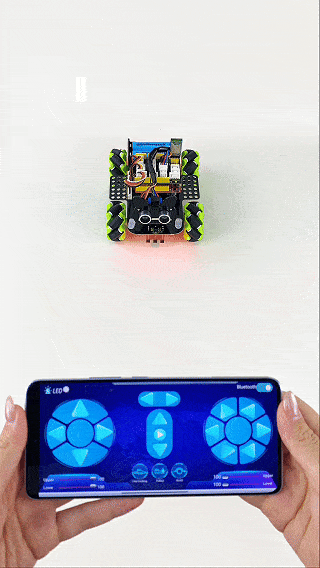

### 第12课 蓝牙APP控制麦轮车  

  

#### 12.1 项目介绍  

蓝牙是应用十分广泛的无线通信技术，可以实现设备之间无需线缆即可完成数据交互。蓝牙模块在此通信链路中承担中转作用：手机端发送蓝牙控制指令，蓝牙模块接收后将指令转发给 Arduino 开发板；开发板解析收到的指令，执行对应的功能，例如控制 LED 灯点亮与熄灭、控制智能小车运动等。

#### 12.2 模块相关资料 

 

BT24是一款面向嵌入式开发的‌低功耗串口透传蓝牙模块‌，主打简化蓝牙通信开发，广泛应用于物联网原型开发和小型智能设备项目中，以下是详细介绍：

蓝牙参数：

- 蓝牙协议: 蓝牙V5.1低功耗蓝牙
- 工作频率: 2.4GHz ISM频段
- 通信接口: UART串口
- 工作电压: DC 5V
- 通信距离: 40m
- 蓝牙名称: BT24
- 串口参数: 9600、8数据位、1停止位、无校验、无流控
- 兼容性‌：支持Android/iOS蓝牙4.0及以上设备，AT指令可灵活修改模块名称、波特率等参数。

DX-BT24模块同时支持BT5.1 BLE协议，能够与具备BLE蓝牙功能的IOS设备直接连接，支持后台程序常驻运行。主要用于短距离的数据无线传输领域。避免繁琐的线缆连接，能直接替代串口线。BT24模块成功应用领域包括：

- 蓝牙无线数据传输
- 手机、电脑周边设备
- 手持POS设备
- 医疗设备无线数据传输
- 智能家居控制
- 蓝牙打印机
- 蓝牙遥控玩具
- 共享单车

**蓝牙接口说明** 

  

| 引脚   | 功能     |  
|--------|----------|  
| ① STATE  | 状态脚   |  
| ② RXD     | 接收脚   |  
| ③ TXD     | 发送脚   |  
| ④ GND    | 接地脚   |  
| ⑤ VCC    | 电源脚   |  
| ⑥ EN     | 使能脚   |  

**将蓝牙模块连接到开发板**  

| BT24 蓝牙模块  | Uno plus主板  |  
|-------|-------|
| STATE |  --   |  
|  RXD  |  TX   |  
|  TXD  |  RX   |
|  GND  |  G    |  
|  VCC  |  5V   |
|  EN   |  --   | 

#### 12.3 APP下载安装：

⚠️ **特别提醒：如果已经在手机/平板上安装好了APP，则这一步骤可以直接跳过；否则，需要参照以下步骤在手机/平板上来安装APP。**


**步骤1：** 在手机/平板浏览器的搜索框中输入官网链接：[https://www.keyesrobot.cn/zh-cn/latest](https://www.keyesrobot.cn/zh-cn/latest)


**步骤2：** 点击 “**下载中心**”，进入下载中心页面。


**步骤3：** 在 “**APP下载**” 栏向下滑找到 **Mecanum Robot**，根据自己的手机/平板系统选择对应的APP下载安装。


<span style="color: rgb(255, 76, 65);">**安卓系统(Android)**</span>

a. 点击 "**点击下载**" 按钮，下载对应的 "**Mecanum Robot.apk**" 文件。


b. 按照安装提示进行下载安装。


c. 下载安装后，打开 **Mecanum Robot** APP，出现如下图界面，按照提示进行操作。


d. 打开手机/平板上的蓝牙。


<span style="color: rgb(255, 76, 65);">**苹果系统(IOS)**</span>

a. 点击 "**跳转APP Store**" 按钮，页面跳转到 APP Store


b. 在 APP Store 上搜索 **Mecanum Robot** ，选择 **Mecanum Robot**，然后点击  获取，等待下载安装APP即可。


c. 下载安装后，打开 Mecanum Robot APP，出现如下图界面，参照提示进行相应的操作。


d. 打开手机/平板上的蓝牙。


#### 12.4 示例代码：

⚠️ <span style="color: rgb(255, 76, 65);">**重要提醒：上传示例代码前，请务必拔掉蓝牙模块！ 因为蓝牙模块也占用Arduino的串口通信（TX/RX），如果不拔掉，示例代码上传会失败。示例代码上传成功后，再插回蓝牙模块。**</span>

```cpp  
void setup() {
  Serial.begin(9600); // 启动串口监视器，设置波特率为9600
}

void loop() {
  if (Serial.available()) { // 如果接收区非空
    char ble_val = Serial.read(); // 读取蓝牙数据
    Serial.println(ble_val); // 串口打印读取到的数据
  }
}
```  

#### 12.5 项目结果：

⚠️ <span style="color: rgb(255, 76, 65);">**再次提醒：**</span>

- <span style="color: rgb(172, 57, 255);">**上传示例代码前，请务必拔掉蓝牙模块！ 因为蓝牙模块也占用Arduino的串口通信（TX/RX），如果不拔掉，示例代码上传会失败。示例代码上传成功后，再插回蓝牙模块。**</span>

- 外接电源，将电机驱动板上的拨码开关拨到 “<span style="color: rgb(255, 76, 65);">ON</span>” 端，上电后。选择好正确的开发板板型（Arduino Uno）和 适当的串口端口（COMxx），然后单击  按钮上传示例代码至Arduino控制板。

- 插上蓝牙模块，确认接线无误。

- 连接好蓝牙模块，上电后，蓝牙模块上的LED闪烁。

**安卓系统(Android)**

- 打开手机/平板上的蓝牙。


- 点击手机/平板上的APP图标，进入APP界面，显示如下图：


- 点击APP界面左上角的图标开关，搜索到对应的蓝牙设备（<span style="color: rgb(255, 76, 65);">**BT24**</span>），上下滑动找到对应的蓝牙设备（<span style="color: rgb(255, 76, 65);">**BT24**</span>），显示如下图：


- 点击 “**connect**” 来连接蓝牙，蓝牙连接成功后，“**connect**” 字样会变成 “**is connected**” 字样，显示如下图。这时，蓝牙模块上的LED变为常亮。


**苹果系统(IOS)**

- 打开手机/平板上的蓝牙。


- 点击手机/平板上的APP图标，进入APP界面，显示如下图：


- 点击APP界面左上角的图标开关，搜索到对应的蓝牙设备（<span style="color: rgb(255, 76, 65);">**BT24**</span>），上下滑动找到对应的蓝牙设备（<span style="color: rgb(255, 76, 65);">**BT24**</span>），显示如下图：


- 点击 “**connect**” 来连接蓝牙，蓝牙连接成功后，“**connect**” 字样会变成 “**is connected**” 字样，显示如下图。这时，蓝牙模块上的LED变为常亮。


- 打开串口监视器，设置波特率为9600，按下APP界面上的各个按键，串口监视器窗口会打印对应的字符。



#### 12.6 代码说明  

| 代码段                           | 说明                                             |  
|----------------------------------|--------------------------------------------------|  
| `Serial1.begin(9600);`          | 设置蓝牙串口波特率为9600，注意Serial与Serial1的区别。 |  
| `Serial1.available()`            | 如果接收到蓝牙数据，这个值就不为0。            |  
| `char ble_val = Serial1.read();`| 读取蓝牙串口的数据，定义一个char类型的变量来保存。 |  
| `Serial.println(ble_val);`       | 输出到串口监视器，`Serial1.println(ble_val);`是输出数据到蓝牙模块。 |  
| `Serial1.readStringUntil('#');` | 读取蓝牙发送的一串字符串，遇到“#”停止读取。  |  
| `String(speed_str).toInt();`     | 将读取到的数字字符串转换为整数值。              |  
| `map(speed_Upper_L, 0, 100, 0, 255);` | 将速度值从0~100映射到0~255的范围中。           |  
| `speed_Upper_L`等变量             | 包含在"MecanumCar_v2.h"头文件中，代表四个电机的速度值，范围为0~255。 |  

#### 12.7 综合项目：APP控制麦克纳姆轮智能车 

⚠️ <span style="color: rgb(255, 76, 65);">**重要提醒：上传示例代码前，请务必拔掉蓝牙模块！因为蓝牙模块也占用Arduino的串口通信（TX/RX），如果不拔掉，示例代码上传会失败。示例代码上传成功后，再插回蓝牙模块。**</span>

```cpp  
// 导入库文件 
#include "MecanumCar_v2.h"
#include <Adafruit_NeoPixel.h>
#include "Servo.h"

mecanumCar mecanumCar(3, 2);  // sda-->D3,scl-->D2
// 创建一个用于控制rgb的类,名为rgb_2812,共4个灯珠,引脚连接到D10
Adafruit_NeoPixel rgb_2812 = Adafruit_NeoPixel(4, 10, NEO_GRB + NEO_KHZ800);
Servo myservo;

/*******超声波传感器接口*****/
#define EchoPin  13  // Echo 接 D13
#define TrigPin  12  // Trig 接 D12

/*******循迹传感器引脚定义**********/
#define SensorLeft    A0   // 左传感器输入引脚
#define SensorMiddle  A1   // 中间传感器输入引脚
#define SensorRight   A2   // 右侧传感器输入引脚

//定义变量
String speed_str1 = "0";
String speed_str2 = "0";
int color_num = 0;
char ble_val;

void setup() {
  Serial.begin(9600);  // 设置蓝牙串波特率为9600
  pinMode(EchoPin, INPUT);    // Echo引脚设置为输入模式
  pinMode(TrigPin, OUTPUT);   // Trig引脚设置为输出模式

  /****循迹传感器接口全部设置为输入模式***/
  pinMode(SensorLeft, INPUT);
  pinMode(SensorMiddle, INPUT);
  pinMode(SensorRight, INPUT);
  myservo.attach(9);  // 将D9上的舵机附加到舵机对象上
  myservo.write(90);
  delay(500);

  rgb_2812.begin();   // 启动rgb2812
  rgb_2812.setBrightness(255);  // 初始化亮度(0~255)
  rgb_2812.show();   // 初始化刷新
  mecanumCar.Init(); // 初始化七彩灯与电机驱动
}

void loop() {
  if (Serial.available()) {  // 如果接收缓冲区非空
    ble_val = Serial.read(); // 读取蓝牙数据
    Serial.println(ble_val); // 串口打印读取到的数据
    switch (ble_val) {
      /*********************小车行驶************************/
      case 's': mecanumCar.Stop();       break;  // 停止
      case 'a': mecanumCar.Advance();    break;  // 前进
      case 'c': mecanumCar.Back();       break;  // 后退
      case 'b': mecanumCar.Turn_Left();  break;  // 左转
      case 'd': mecanumCar.Turn_Right(); break;  // 右转
      case 'k': mecanumCar.L_Move();     break;  // 左移
      case 'h': mecanumCar.R_Move();     break;  // 右移
      case 'l': mecanumCar.LU_Move();    break;  // 左上移
      case 'j': mecanumCar.LD_Move();    break;  // 左下移
      case 'g': mecanumCar.RU_Move();    break;  // 右上移
      case 'i': mecanumCar.RD_Move();    break;  // 右下移
      case 'e': mecanumCar.drift_left(); break;  // 左漂移
      case 'f': mecanumCar.drift_right(); break; // 右漂移

      case 'p': Line_Tracking();   break;  // 循迹模式
      case 'q': ult_following();   break;  // 跟随模式
      case 'r': ult_avoiding();    break;  // 避障模式

      /*********************小车灯光*************************/
      case 't': mecanumCar.right_led(1);  mecanumCar.left_led(1); break;  // 打开七彩灯
      case 'u': mecanumCar.right_led(0);  mecanumCar.left_led(0); break;  // 关闭七彩灯
      case 'm': color_num++; showColor(); break;  // 切换2812灯珠颜色
      case 'o': rgb_2812.clear(); rgb_2812.show(); break;  // 关闭2812灯珠
      case 'n': color_num--; showColor(); break;  // 切换2812灯珠颜色
      
      /*********************小车调速*************************/
      case 'v':   /*读左前方电机M2的速度*/
        speed_str1 = Serial.readStringUntil('#');  // 第一次接收到的速度数据，保存
        speed_str2 = Serial.readStringUntil('#');  // 第二次接收到速度数据，保存
        speed_Upper_L = String(speed_str2).toInt();      // 速度值为字符串格式，需要转换为整型
        speed_Upper_L = map(speed_Upper_L, 0, 100, 0, 255);  // 从0~100映射到0~255
        //Serial.println(speed_Upper_L);
        break;
      case 'w':   /*读左后方电机M3的速度*/
        speed_str1 = Serial.readStringUntil('#'); 
        speed_str2 = Serial.readStringUntil('#');
        speed_Lower_L = String(speed_str2).toInt();
        speed_Lower_L = map(speed_Lower_L, 0, 100, 0, 255);
        //Serial.println(speed_Lower_L);
        break;
      case 'x':   /*读右前方电机M1的速度*/
        speed_str1 = Serial.readStringUntil('#');
        speed_str2 = Serial.readStringUntil('#');
        speed_Upper_R = String(speed_str2).toInt();
        speed_Upper_R = map(speed_Upper_R, 0, 100, 0, 255);
        //Serial.println(speed_Upper_R);
        break;
      case 'y':   /*读右后方电机M4的速度*/
        speed_str1 = Serial.readStringUntil('#');
        speed_str2 = Serial.readStringUntil('#');
        speed_Lower_R = String(speed_str2).toInt();
        speed_Lower_R = map(speed_Lower_R, 0, 100, 0, 255);
        //Serial.println(speed_Lower_R);
        break;
    
      default: break;
    } 
  }
}


/*********************RGB2812显示*******************************/
void showColor() {
  //  Serial.print("color num:"); // 用于串口调试
  //  Serial.println(color_num);
  //  这里设置只了7种颜色，可以自己添加
  if (color_num > 6)color_num = 0;
  if (color_num < 0)color_num = 6;
  switch (color_num) {
    case  0:
      for (int i = 0; i < 4; i++) {
        rgb_2812.setPixelColor(i, 255, 0, 0);  // 第i个灯珠亮红色
      }
      break;
    case  1:
      for (int i = 0; i < 4; i++) {
        rgb_2812.setPixelColor(i, 255, 80, 0); // 第i个灯珠亮橙色
      }
      break;
    case  2:
      for (int i = 0; i < 4; i++) {
        rgb_2812.setPixelColor(i, 255, 255, 0); // 第i个灯珠亮黄色
      }
      break;
    case  3:
      for (int i = 0; i < 4; i++) {
        rgb_2812.setPixelColor(i, 0, 255, 0);   // 第i个灯珠亮绿色
      }
      break;
    case  4:
      for (int i = 0; i < 4; i++) {
        rgb_2812.setPixelColor(i, 0, 0, 255);   // 第i个灯珠亮蓝色
      }
      break;
    case  5:
      for (int i = 0; i < 4; i++) {
        rgb_2812.setPixelColor(i, 0, 255, 255); // 第i个灯珠亮靛色
      }
      break;
    case  6:
      for (int i = 0; i < 4; i++) {
        rgb_2812.setPixelColor(i, 160, 32, 240); // 第i个灯珠亮紫色
      }
      break;
    default : break;
  }
  rgb_2812.show();   // 刷新显示
}

/*********************循迹*******************************/
void Line_Tracking(void) {   //循黑线
  while (1) {
    uint8_t SL = digitalRead(SensorLeft);   // 读取左边巡线传感器的值
    uint8_t SM = digitalRead(SensorMiddle); // 读取中间巡线传感器的值
    uint8_t SR = digitalRead(SensorRight);  // 读取右边巡线传感器的值
    if (SM == HIGH) {
      if (SL == LOW && SR == HIGH) {  // 右边是黑色，左边是白色，向右转
        mecanumCar.Turn_Right();
      }
      else if (SR == LOW && SL == HIGH) {  // 左边是黑色，右边是白色，左转
        mecanumCar.Turn_Left();
      }
      else {  // 两边都是白色的，向前走
        mecanumCar.Advance();
      }
    }
    else {
      if (SL == LOW && SR == HIGH) { // 右边是黑色，左边是白色，向右转
        mecanumCar.Turn_Right();
      }
      else if (SR == LOW && SL == HIGH) {  // 右边是白色，左边是黑色，左转
        mecanumCar.Turn_Left();
      }
      else { // 全白色,停止
        mecanumCar.Stop();
      }
    }
    if (Serial.available()) {  // 如果接收缓冲区非空
      ble_val = Serial.read(); // 读取蓝牙数据
      if (ble_val == 's') {
        mecanumCar.Stop();
        break;
      }
    }
  }
}


/*********************超声波跟随*******************************/
void ult_following(void) {
  while (1) {
    int distance = get_distance();  // 获取距离保存在distance变量
    //Serial.println(distance);
    if (distance <= 15) {  // 后退的范围
      mecanumCar.Back();
    }
    else if (distance <= 25) { // 停止的范围
      mecanumCar.Stop();
    }
    else if (distance <= 45) { // 前进的范围
      mecanumCar.Advance();
    }
    else { //其它情况停止
      mecanumCar.Stop();
    }
    if (Serial.available()) { // 如果接收缓冲区非空
      ble_val = Serial.read(); // 读取蓝牙数据
      if (ble_val == 's') {
        mecanumCar.Stop();
        break;
      }
    }
  }
}

/*********************超声波避障*******************************/
void ult_avoiding(void) {
  int distance_M, distance_L, distance_R;
  while (1) {
    distance_M = get_distance();  // 获取距离保存在distance变量
    if (distance_M < 20) {  // 当测到前方的距离小于20cm时
      mecanumCar.Stop();   // 小车停止
      delay(500); // 延时500ms
      myservo.write(180);  // 超声波云台左转
      delay(500); //延时500ms
      distance_L = get_distance();  // 把超声波测到左边的距离赋给变量distance_L
      delay(100); // 稳定读取值时间
      myservo.write(0); // 超声波云台右转
      delay(500); // 延时500ms
      distance_R = get_distance(); // 把超声波测到右边的距离赋给变量distance_R
      delay(100); // 稳定读取值时间
      myservo.write(90);  // 回到90度位置
      delay(500);
      if (distance_L > distance_R) { // 左边的距离大于右边时
        mecanumCar.Turn_Left();  // 小车左转
        delay(300);  // 左转700ms
      } else {
        mecanumCar.Turn_Right(); // 小车右转
        delay(300);
      }
    }
    else { // 如果测到前方的距离>=20cm时，机器人前进
      mecanumCar.Advance(); // 前进
    }
    if (Serial.available()) {  // 如果接收缓冲区非空
      ble_val = Serial.read(); // 读取蓝牙数据
      if (ble_val == 's') {
        mecanumCar.Stop();
        break;
      }
    }
  }
}

/*********************超声波测距*******************************/
int get_distance(void) {    // 超声波测距
  int dis;
  digitalWrite(TrigPin, LOW);
  delayMicroseconds(2);
  digitalWrite(TrigPin, HIGH); // 给Trig至少10us的高电平以触发
  delayMicroseconds(10);
  digitalWrite(TrigPin, LOW);
  dis = pulseIn(EchoPin, HIGH) / 58.2; // 计算出距离
  delay(30);
  return dis;
}
```  

⚠️ <span style="color: rgb(255, 76, 65);">**再次提醒：**</span>

- <span style="color: rgb(172, 57, 255);">**上传示例代码前，请务必拔掉蓝牙模块！ 因为蓝牙模块也占用Arduino的串口通信（TX/RX），如果不拔掉，示例代码上传会失败。示例代码上传成功后，再插回蓝牙模块。**</span>

- 外接电源，将电机驱动板上的拨码开关拨到 “<span style="color: rgb(255, 76, 65);">ON</span>” 端，上电后。选择好正确的开发板板型（Arduino Uno）和 适当的串口端口（COMxx），然后单击  按钮上传示例代码至Arduino控制板。

- 插上蓝牙模块，确认接线无误。

- 连接好蓝牙模块，上电后，蓝牙模块上的LED闪烁。

- 使用手机APP控制小车，实现前面所学的多种功能：  

  - 1\. 点击开启七彩灯，再次点击这个按钮七彩灯就会关闭。

  - 2\. 点击会进入循迹模式，当想退出该模式时，再次点击该按钮。

  - 3\. 点击会进入跟随模式、当想退出该模式时，再次点击该按钮。

  - 4\. 点击会进入避障模式，当想退出该模式时，再次点击该按钮。

  - 5\. 拉动这两个条幅会改变左边两个电机的速度，右边也是相同的操作方法。

  - 6\. 这几个按钮是用来切换底板下面4个2812灯珠颜色的，中间按钮为关闭功能。

  - 7\. 剩下其他的按钮全都是用来操控小车行驶的，跟其他按钮不同的是：这些按钮当我们按下时，小车行驶；松开按钮时，小车停止。




#### 12.8 注意事项：

1\. 电源充足：高速运转时电机消耗电流较大，请确保电池电量充足，否则4WD智能车可能会因为电压不足而行动迟缓或重启。
    
2\. 上传代码问题：由于蓝牙模块占用了 Arduino 的 D0 (RX) 和 D1 (TX) 引脚，在上传代码前，务必拔掉蓝牙模块的 TX 和 RX 连线，否则会出现 “上传错误”。上传完成后再插回。
    
3\. 速度范围：PWM 值必须在 0-255 之间。如果代码逻辑错误导致数值溢出，电机可能无法正常工作。
   
4\.  地面摩擦：在不同的地面（如地毯、瓷砖）上，4WD智能车的实际速度感会有所不同，这是正常现象。