## 5.2.1 Windows 系统 Kidsblock 安装

1\. 点击官网链接：[https://www.keyesrobot.cn/zh-cn/latest](https://www.keyesrobot.cn/zh-cn/latest)

2\. 点击 “**下载中心**”，进入下载中心页面，向下滑找到 **KidsBlock软件** 部分。

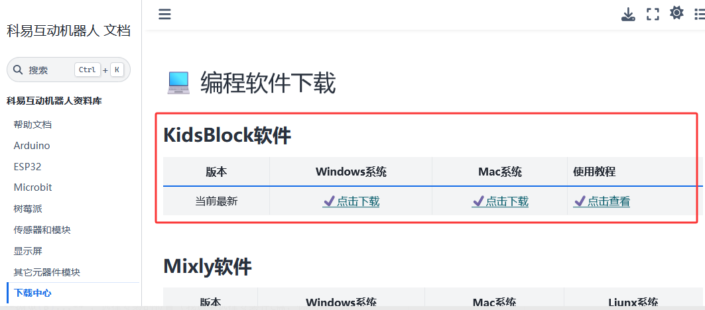

3\. 点击 **点击下载** 按钮下载 Kidsblock 软件。

4\. 双击下载好的软件 “**KidsBlock.exe**” 。

5\. 先选中 “**为使用这台电脑的任何人安装**” ，再点击 “**下一步**”。

6\. 先点击 “**浏览(B)...**”，选择安装的位置（我这里选择安装在C盘，你也可以选择安装在电脑的其他盘），再点击 “**安装**”。这样，软件就在安装过程中。

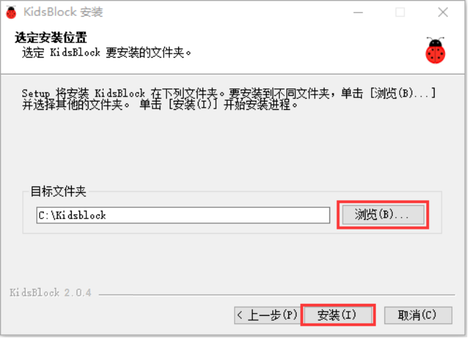

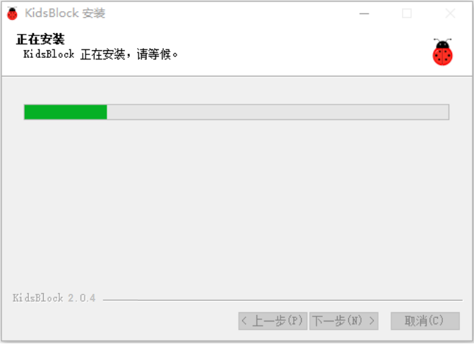

7\. 几秒种后，安装完成。点击 “**完成**” 就可以打开安装好的软件。

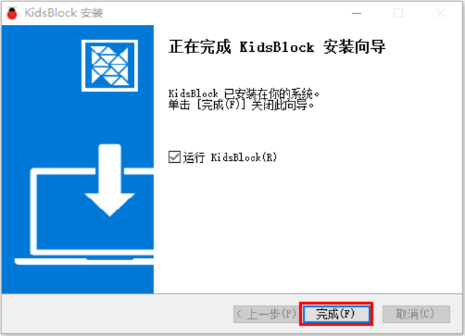

8\. 如果出现电脑安全警报窗口，点击 “**允许访问**”。这样就可以打开了软件页面。

9\. 有更新软件时一般打开Kidsblock IDE页面时会自动提醒，为了软件能正常使用我们选择升级。

我们也可在设置中手动更新软件。

如果已经是最新版本则显示以下提示。

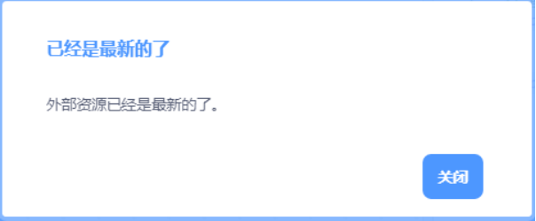

10\. 打开软件页面。

## 5.2.2 MacOS 系统 Kidsblock 安装

1\. 点击官网链接：[https://www.keyesrobot.cn/zh-cn/latest](https://www.keyesrobot.cn/zh-cn/latest)

2\. 点击 “**下载中心**”，进入下载中心页面，向下滑找到 **KidsBlock软件** 部分。

3\. 点击 **点击下载** 按钮下载 Kidsblock 软件。

4\. 双击下载好的软件文件 “**KidsBlock.dmg**”。

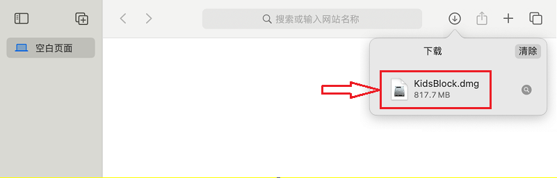

5\. 双击之后，出现如下图。

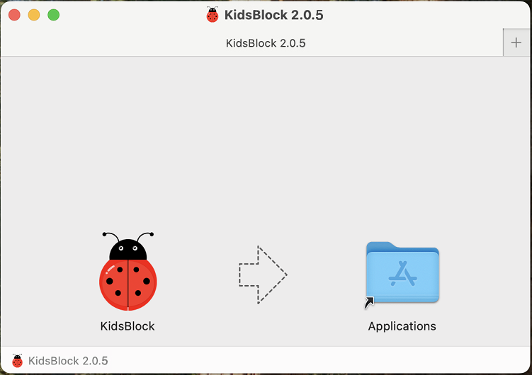

6\. 按住鼠标左键将 “**KidsBlock**” 拖动到 **Applications** 文件夹中。

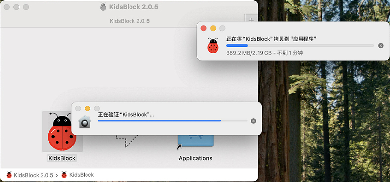

7\. “**KidsBlock**” 在复制拷贝至 **Applications** 文件夹过程中，有可能会出现 “**安全提醒**” 框 。

8\. 先点击电脑的 “**设置**”，找到 “**隐私与安全性**” 并且点击它；然后找到 “**仍要打开**” 并且点击它，出现 “ **打开“KidsBlock”？**”对话框，最后点击 “**仍要打开**” 按钮。

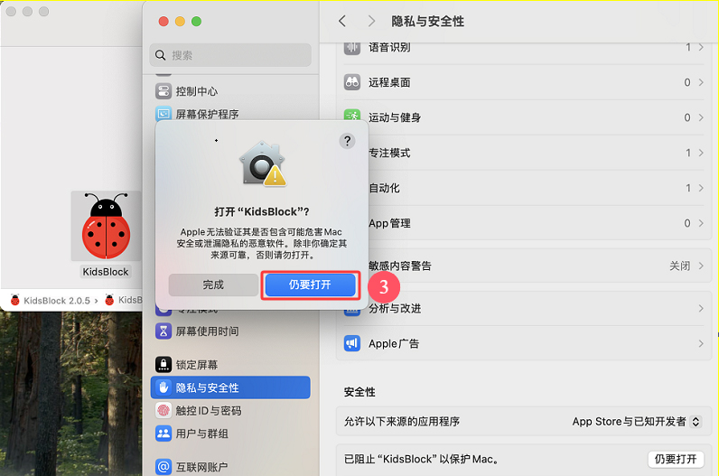

9\. 出现 “**隐私与安全性**”对话框，在对话框中输入好 “**管理员用户名**” 和 “**密码**”，然后单击 “**好**” 按钮。

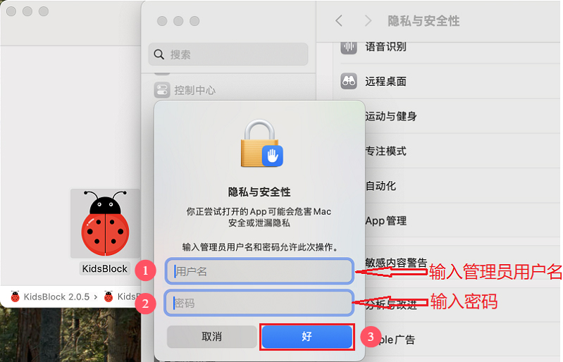

10\. 如果提示更新，请点击更新按钮获取最新版本KidsBlock。

11\. 过一会儿，您就可以打开 Kidsblock 页面了。

## 5.2.3 KidsBlock软件的使用方法

⚠️ **特别提醒：** 以下是以Windows系统为例，MacOS系统可以参考。

### 5.2.3.1 驱动安装

如果驱动程序已经在计算机上安装好了，那么您就无需再进行安装了。如果没有安装，那么您需要按照以下步骤操作。

1\. 点击选择“**安装驱动**”。

2\. 进入设备驱动程序安装向导，然后点击“**下一页**”。

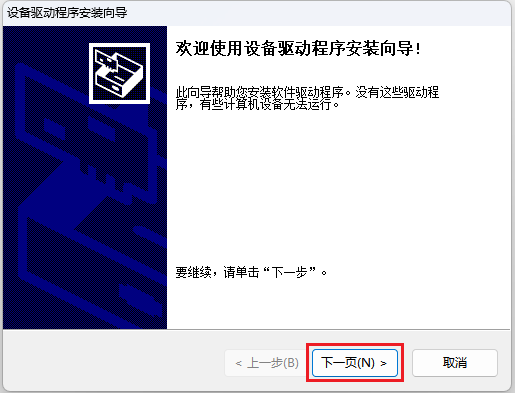

3\. 点击“**完成**”。

4\. 点击“**下一页**”。

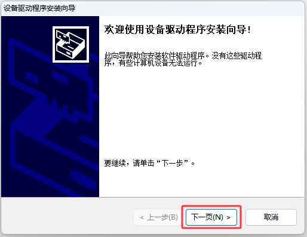

5\. 点击“**完成**”。

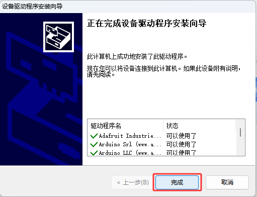

6\. 如果出现警告，只需点击“**允许程序所有操作**”和“**安装**”。

7\. 点击“**完成**”。

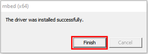

8\. 点击“**Extract**”。

9\. 点击“**下一页**”。

10\. 勾选“**我接受这个协议(A)**”，然后点击“**下一页**”。

11\. 点击“**完成**”。

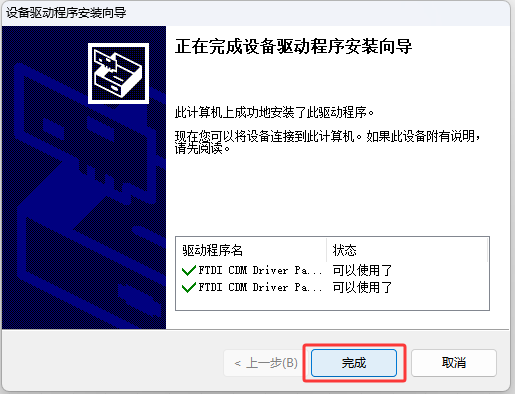

12\. 点击“**安装**”。

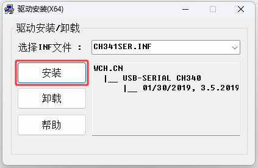

13\. 安装驱动程序完成后，点击“**确定**”.

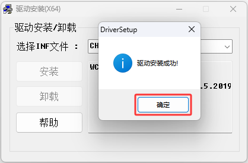

### 5.2.3.2 选择设备

1\. 确保Arduino主控板与计算机连接成功，然后双击 “**KidsBlock**” 图标打开KidsBlock软件。

2\. 单击，如下图所示：

3\. 由于本教程使用的是 Mecanum Robot 设备，所以选择 “**Mecanum Robot**” 设备，如下图所示：

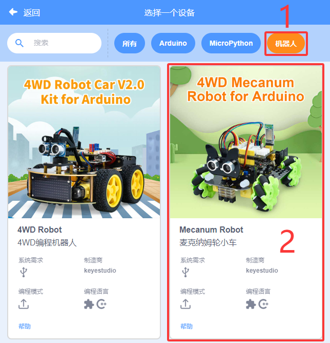

4\. 连接串口端口，点击 “**连接**”，如下图所示：

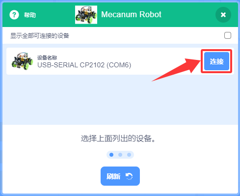

5\. 然后单击 “**返回编辑器**” 返回代码编辑区，如下图所示：

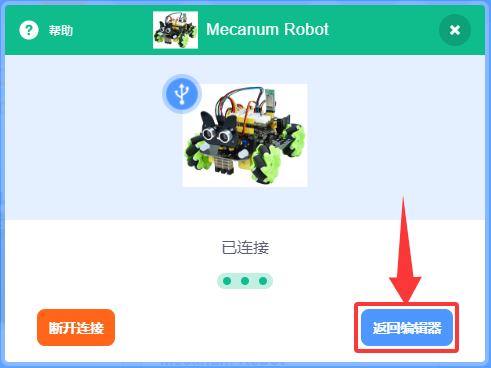

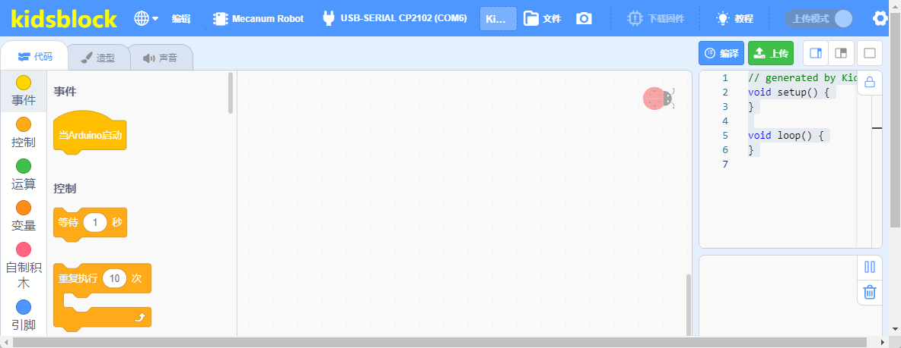

### 5.2.3.3 软件界面介绍

了解KidsBlock软件界面，有利于代码编程的学习，如下图所示：

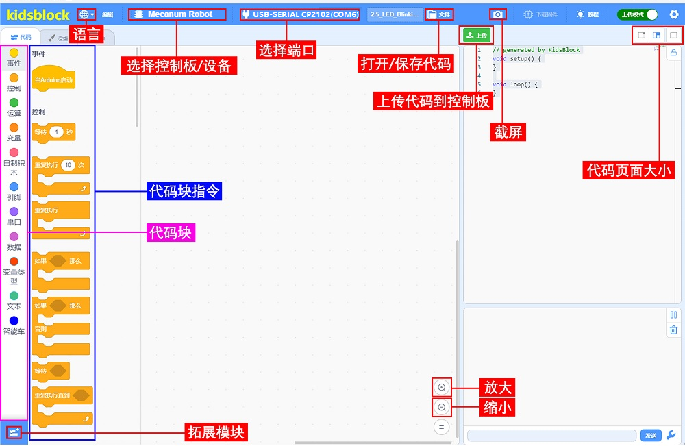

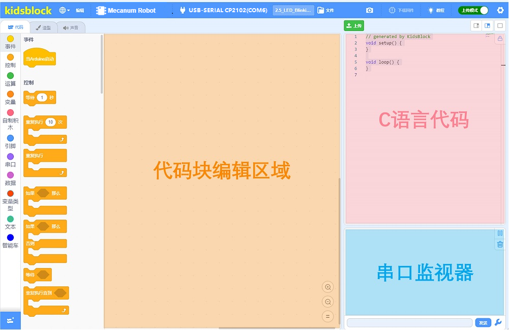

### 5.2.3.4 添加KidsBlock库文件 (重要)

⚠️ **特别提醒：** 如果是自己拖动代码块来编写实验代码，则必须添加 “**语音识别模块**” 库和 “**TinyVision**” 库，这是为了后面学习视觉AI摄像头控制与语音控制扩展包做准备的（如果已经购买了扩展包，这两个库文件必须添加；如果未购买，可以不用添加），其添加方法如下所示：

如果是直接导入我们提供的示例代码，不需要添加库，这一步骤可以直接跳过。

如下图所示，在KidsBlock IDE软件的左下角点击进入扩展界面。

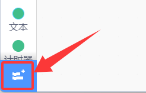

先点击 “**AI**”，再找到 “**语音识别模块**” 并点击。这样，语音识别模块 库文件就添加好了。

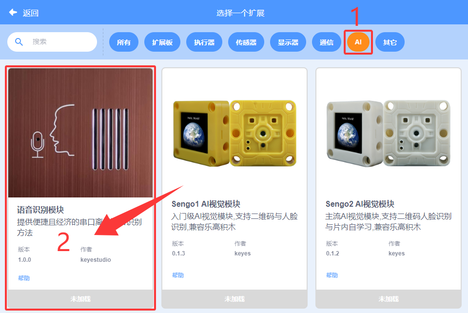

接着，又找到 “**TinyVision**” 并点击。这样，TinyVision (视觉AI摄像头模块) 库文件就添加好了。

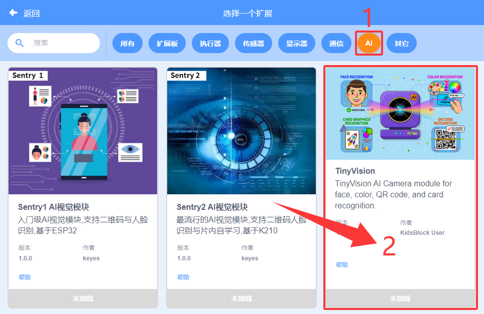

点击返回编程界面，在KidsBlock IDE左侧的代码块栏中可以看到添加成功的 “**语音识别模块**” 库，和 “**TinyVision (视觉AI摄像头模块)**” 库。

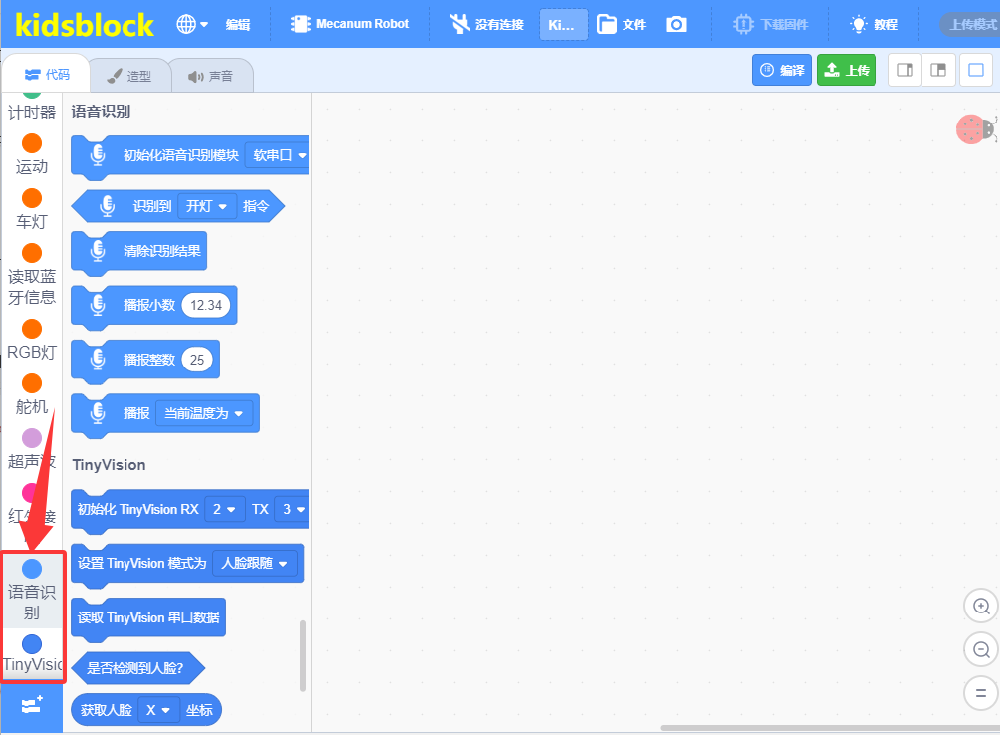

### 5.2.3.5 编写代码并上传

确保Arduino主控板与计算机连接成功，然后双击 “ **KidsBlock** ” 图标打开KidsBlock软件。

**方法①：** 从直接拖动代码块到代码编辑区进行代码编写，如下图所示：

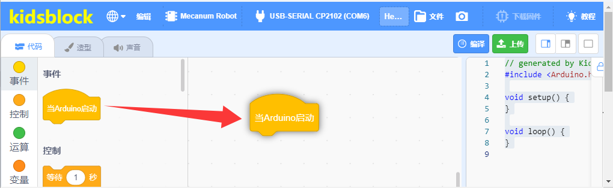

代码编写完成后保存到电脑，单击 “**文件**” --> “**保存到电脑**”，如下图所示：

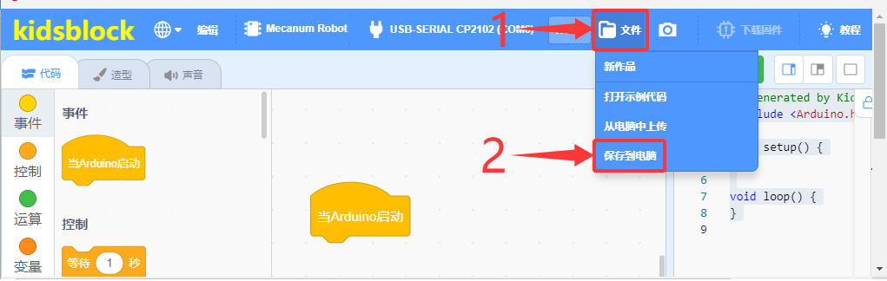

单击将代码上传到Arduino主控板。

**方法②：** 从电脑打开已经编写好的代码。

单击 “**文件**” --> “**从电脑中上传**”，然后选择代码所在的路径（在 `资料下载`中下载的文件解压），选中代码文件打开即可，如下图所示：

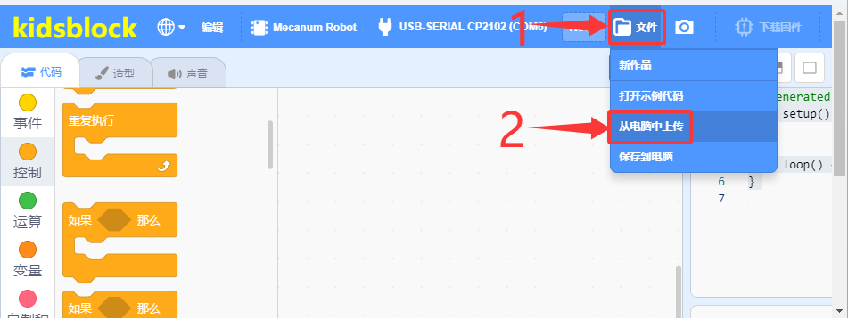

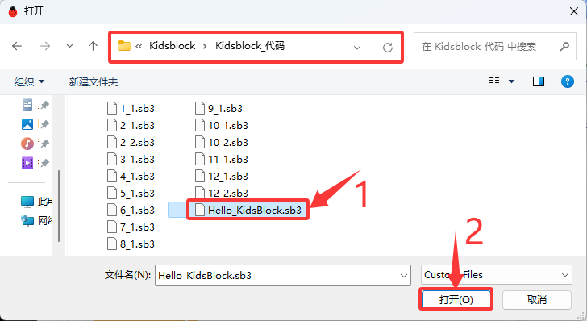

代码文件打开后，需要手动连接串口端口，如下图所示：

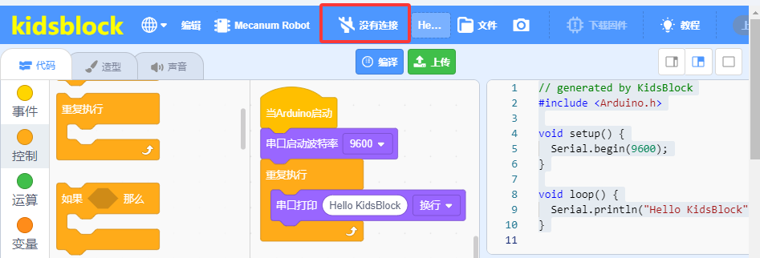

然后单击 “**返回编辑器**” 返回代码编辑区，如下图所示：

单击将代码上传到Arduino主控板。

代码上传成功后，点击  设置串口波特率为9600。

这样，可以看到串口监视器循环打印 “Hello KidsBlock”。

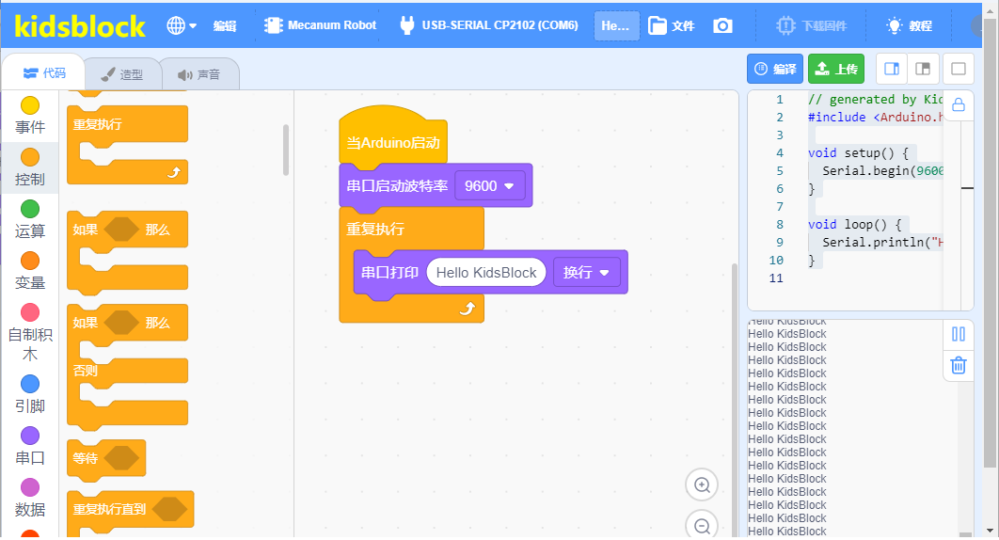

