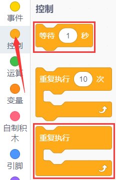
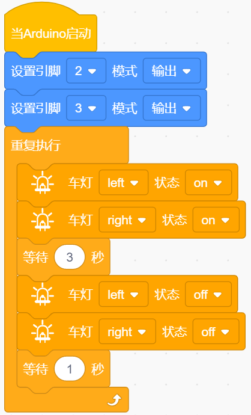

### 第01课 七彩灯  

#### 1.1 项目介绍  

  

本实验完成 Arduino 点亮 LED 实验，所用并非普通单色 LED，而是自动七彩闪烁 LED，灯体外观为白色，内部自带程序，通电后自动循环切换七种色彩。

它的驱动方式和普通 LED 一致：信号端 S 输入高电平，LED 就自动七彩闪烁；输入低电平，LED 熄灭、停止发光。

该七彩 LED 已经集成在电机驱动底板上。本项目通过基础测试代码控制 LED，实现闪烁 3 秒、熄灭 1 秒的效果。修改代码中的延时参数，即可自由调整灯的亮灭时长。  

#### 1.2 模块相关资料  

![模块资料1]
(../../media/4a5647d33d9c52aaecf13bc986c44ed6.png)  

  

两个七彩灯分别通过三极管来控制，信号端分别接到了P5.4和P5.5，所以我们只要控制这两个引脚输出高低电平即可控制两个七彩灯。  

#### 1.3 实验代码

⚠️ **重要提醒：上传示例代码前，请务必拔掉蓝牙模块！ 因为蓝牙模块也占用Arduino的串口通信（TX/RX），如果不拔掉，示例代码上传会失败。**

##### 1.3.1 寻找代码块  

你也可以通过拖动代码块来编写代码程序，寻找代码块如下：  

1\.    

2\.    

3\.    

4\.    

##### 1.3.2 完整的代码程序  

  

#### 1.4 实验结果  

⚠️ **再次提醒：**

- **上传示例代码前，请务必拔掉蓝牙模块！ 因为蓝牙模块也占用Arduino的串口通信（TX/RX），如果不拔掉，示例代码上传会失败。**

外接电源，将电机驱动板上的拨码开关拨到 “ON” 端，上电后。选择好正确的设备（Mecanum Robot）和 适当的串口端口（COMxx），然后单击  按钮上传实验代码至Arduino控制板。

代码上传成功后，可以看到底板的2个七彩LED闪烁3秒然后熄灭1秒，然后再次闪烁3秒再熄灭1秒，如此反复循环。  

