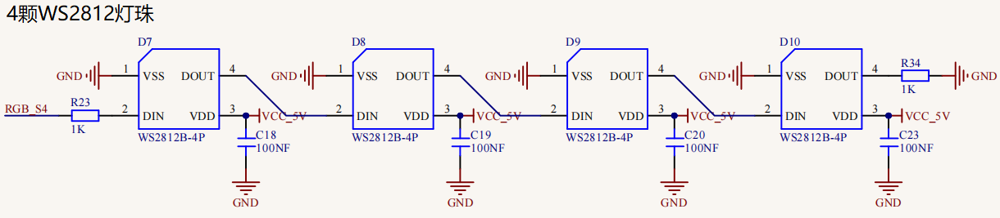
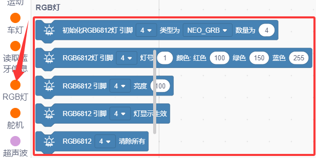
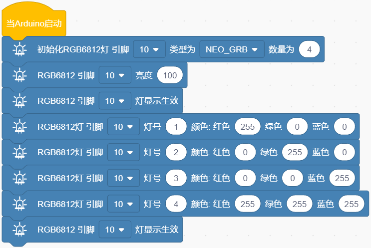
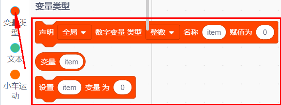
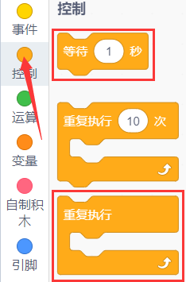
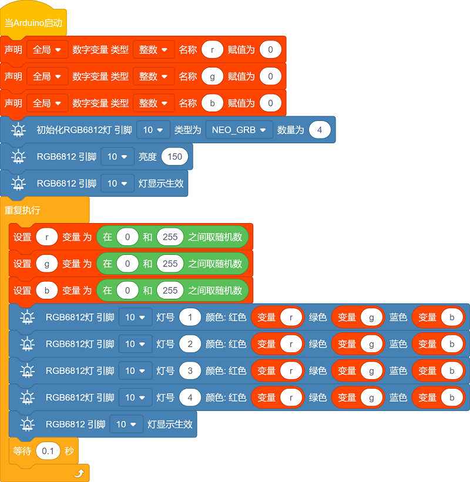

### 第02课 WS2812 RGB灯  

#### 2.1 项目介绍  

  

上一项目我们学习了自闪七彩 LED，只能控制灯自动闪烁和熄灭。本节课使用 WS2812 灯珠，它可以通过编程自由设定，显示任意想要的色彩。

板载的 4 颗 WS2812 灯珠驱动原理和之前的自闪七彩 LED 不同，但同样仅需 1 个 IO 引脚即可控制。WS2812 属于智能外控 LED，控制电路与发光电路集成在单颗灯珠内部，外观和 5050 灯珠一致，每一颗灯珠相当于一个独立像素点。本电机驱动底板搭载 4 颗 WS2812，对应 4 个像素。接下来我们学习如何控制它输出任意颜色。  

#### 2.2 模块相关资料  

  

电路中 4 颗 WS2812 灯珠为级联串联结构。不管灯珠数量多少，仅需一个 IO 引脚（本硬件使用 D10），就可以独立控制每一颗灯珠，设置不同颜色。

WS2812 灯珠内部集成数字接口、数据锁存、信号整形放大驱动电路、高精度内部振荡器与恒流控制单元，保障多颗灯珠发光色彩一致性。它使用单线归零码通信协议：上电复位后，信号引脚接收控制器下发数据；最先传输的 24bit 色彩数据，会被第一颗灯珠保存至内部寄存器，剩余数据向后传递给下一级灯珠。

本底板已经完成 WS2812 底层驱动与通信协议封装，开发时直接调用库函数接口，即可控制灯光。  

#### 2.3 实验代码 

⚠️ **重要提醒：上传示例代码前，请务必拔掉蓝牙模块！ 因为蓝牙模块也占用Arduino的串口通信（TX/RX），如果不拔掉，示例代码上传会失败。**

##### 2.3.1 寻找代码块  

你也可以通过拖动代码块来编写代码程序，寻找代码块如下：  

1\.    

2\.    

##### 2.3.2 完整的代码程序  

  

#### 2.4 实验结果  

⚠️ **再次提醒：**

- **上传示例代码前，请务必拔掉蓝牙模块！ 因为蓝牙模块也占用Arduino的串口通信（TX/RX），如果不拔掉，示例代码上传会失败。**

外接电源，将电机驱动板上的拨码开关拨到 “ON” 端，上电后。选择好正确的设备（Mecanum Robot）和 适当的串口端口（COMxx），然后单击  按钮上传实验代码至Arduino控制板。

代码上传成功后，就可以看到底板的4颗WS2812灯珠分别显示红、绿、蓝、白色。  
 

#### 2.5 项目拓展：流水彩灯 

⚠️ **重要提醒：上传示例代码前，请务必拔掉蓝牙模块！ 因为蓝牙模块也占用Arduino的串口通信（TX/RX），如果不拔掉，示例代码上传会失败。**

##### 2.5.1 寻找代码块  

同样，你可以通过拖动代码块来编写代码程序，寻找代码块如下：  

1\.    

2\.    

3\.    

4\.    

5\.    

##### 2.5.2 完整的代码程序  

⚠️ **再次提醒：**

- **上传示例代码前，请务必拔掉蓝牙模块！ 因为蓝牙模块也占用Arduino的串口通信（TX/RX），如果不拔掉，示例代码上传会失败。**

外接电源，将电机驱动板上的拨码开关拨到 “ON” 端，上电后。选择好正确的设备（Mecanum Robot）和 适当的串口端口（COMxx），然后单击  按钮上传实验代码至Arduino控制板。

代码上传成功后，可以看到4颗WS2812灯珠以随机颜色显示流水灯。