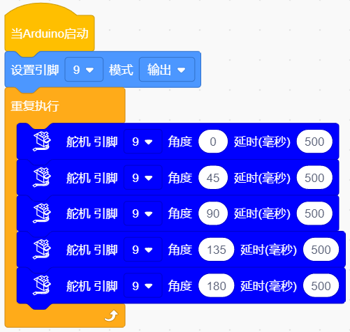

### 第03课 舵机  

#### 3.1 项目介绍  

  

很多 DIY 智能小车都具备自动避障功能。实现避障时，一般使用舵机带动超声波传感器左右转动，检测小车与障碍物之间的距离，根据测距结果控制小车躲避障碍物。

使用普通微控制器驱动舵机，需要手动配置对应频率、脉冲宽度的信号，以此控制舵机转动角度。而在 Arduino 中，借助 Servo 库，只需要定义舵机信号引脚，直接设置目标角度，库就会自动生成对应的控制脉冲，完成舵机驱动，无需手动处理底层时序。

本项目我们将学习控制舵机，使其在 0°~180° 之间往复转动。 

#### 3.2 模块相关资料  

舵机内部主要由直流电机、减速齿轮组、电位器和控制电路组成。你可以把它想象成一个带有“记忆”的电机。

**内部结构图：**

**引脚介绍：**

**棕线：** 一个接地的引脚

**红线：** 一个连接到+5V电源的引脚

**橙线：** 信号端的引脚，PWM信号控制

当我们给舵机发送一个 PWM（脉冲宽度调制）信号时，控制电路会检测这个信号的脉冲宽度。标准的舵机信号周期是 20ms（即频率 50Hz）。在这个周期内，高电平持续的时间决定了舵机的角度：

- **0.5ms** 的高电平通常对应 **0°**。
- **1.5ms** 的高电平通常对应 **90°**（中位）。
- **2.5ms** 的高电平通常对应 **180°**。

Arduino 的 `Servo` 库帮我们要处理这些复杂的时序计算，我们只需要告诉它角度（0-180），它会自动生成对应的 PWM 信号。 

#### 3.3 实验代码 

⚠️ **重要提醒：上传示例代码前，请务必拔掉蓝牙模块！ 因为蓝牙模块也占用Arduino的串口通信（TX/RX），如果不拔掉，示例代码上传会失败。**

##### 3.3.1 寻找代码块  

你也可以通过拖动代码块来编写代码程序，寻找代码块如下：  

1\.    

2\.    

3\.    

4\.    

##### 3.3.2 完整的代码程序  

 

#### 3.4 实验结果  

⚠️ **再次提醒：**

- **上传示例代码前，请务必拔掉蓝牙模块！ 因为蓝牙模块也占用Arduino的串口通信（TX/RX），如果不拔掉，示例代码上传会失败。**

外接电源，将电机驱动板上的拨码开关拨到 “ON” 端，上电后。。选择好正确的设备（Mecanum Robot）和 适当的串口端口（COMxx），然后单击  按钮上传实验代码至Arduino控制板。

代码上传成功后，就可以看到舵机在0°到180°之间来回转动。  

 
