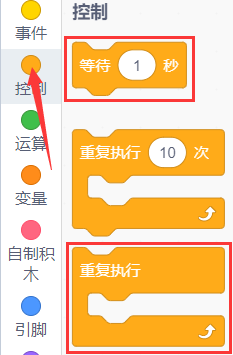
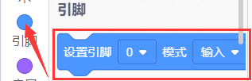
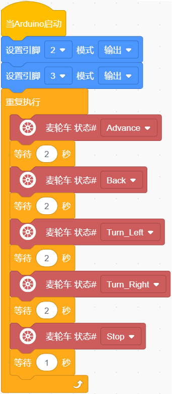

### 第04课 直流减速电机  

#### 4.1 项目介绍  

  

小车行走依靠电机带动车轮，套件配备 4 个直流减速电机，即 [齿轮减速电机](https://baike.baidu.com/item/%E9%BD%BF%E8%BD%AE%E5%87%8F%E9%80%9F%E7%94%B5%E6%9C%BA/3249233)，由 [直流电机](https://baike.baidu.com/item/%E7%9B%B4%E6%B5%81%E7%94%B5%E6%9C%BA/2404223)的基础上，加上配套齿轮减速箱。同时，[齿轮箱](https://baike.baidu.com/item/%E9%BD%BF%E8%BD%AE%E7%AE%B1/1059341) 可以降转速、增扭矩；选用不同 [减速比](https://baike.baidu.com/item/%E5%87%8F%E9%80%9F%E6%AF%94/5341327)就能得到不同转速和力矩。这大大提高了直流电机在自动化行业中的使用率，[减速电机](https://baike.baidu.com/item/%E5%87%8F%E9%80%9F%E7%94%B5%E6%9C%BA/3750851)属于电机 ‑ [减速器](https://baike.baidu.com/item/%E5%87%8F%E9%80%9F%E6%9C%BA/873618)一体化模块，又称齿轮马达，应用广泛，能够简化设计、节约空间。  

电机工作电流大，不能直接用单片机 IO 口驱动，否则电机无力转动甚至烧毁主控芯片，因此需要专用电机驱动芯片。本底板集成 DRV8833，可控制 4 路直流减速电机的转速与转向。下面分析驱动板芯片电路原理图。  

#### 4.2 模块相关资料  

  

  

电路使用两片 DRV8833 电机驱动芯片，每颗驱动芯片拥有 2 组电机控制通道，每组通道占用 2 个控制引脚，总共使用 8 个 IO 引脚，实现对 4 台直流电机的独立控制。

上图为电机驱动芯片与 STC8G1K08 主控的接线原理图。本设计采用 I²C 通信协议控制电机：向 STC 芯片对应的寄存器地址写入 PWM 占空比数值，即可输出 PWM 信号控制电机驱动芯片。

底层电机驱动库已经编写完成，开发时直接调用封装好的 API 函数，就可以控制小车运行。

#### 4.3 实验代码

⚠️ **重要提醒：上传示例代码前，请务必拔掉蓝牙模块！ 因为蓝牙模块也占用Arduino的串口通信（TX/RX），如果不拔掉，示例代码上传会失败。**

##### 4.3.1 寻找代码块  

你也可以通过拖动代码块来编写代码程序，寻找代码块如下：  

1\.    

2\.    

3\.    

4\.    

##### 4.3.2 完整的代码程序  

  

#### 4.4 实验结果  

⚠️ **再次提醒：**

- **上传示例代码前，请务必拔掉蓝牙模块！ 因为蓝牙模块也占用Arduino的串口通信（TX/RX），如果不拔掉，示例代码上传会失败。**

外接电源，将电机驱动板上的拨码开关拨到 “ON” 端，上电后。选择好正确的设备（Mecanum Robot）和 适当的串口端口（COMxx），然后单击  按钮上传实验代码至Arduino控制板。

代码上传成功后，就可以看到小车前进2秒然后后退2秒，然后左转2秒再右转2秒，最后停止1秒，如此反复循环。  

