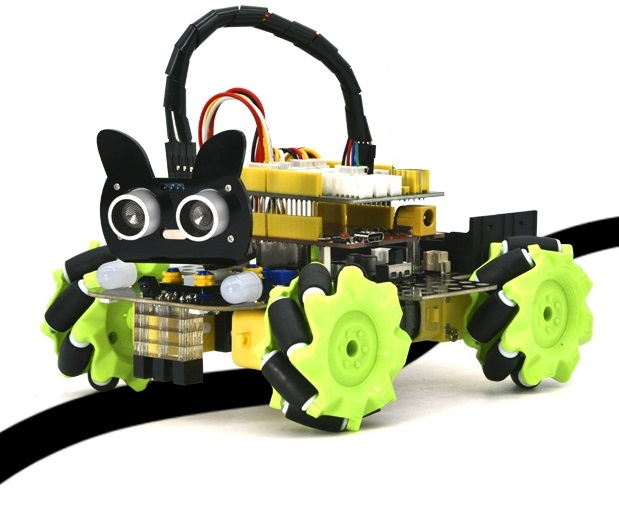
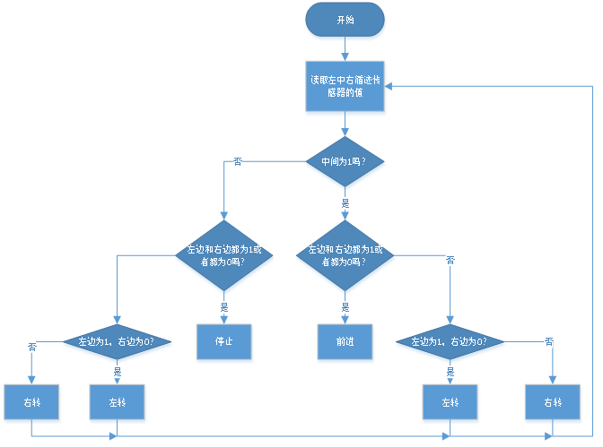
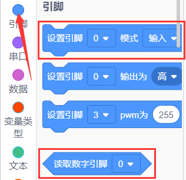
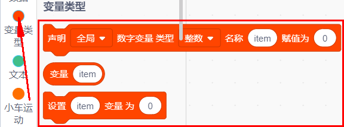
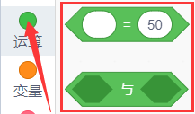
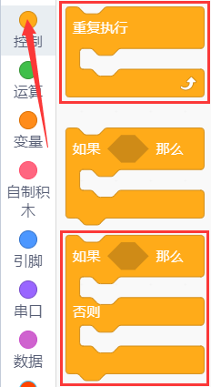
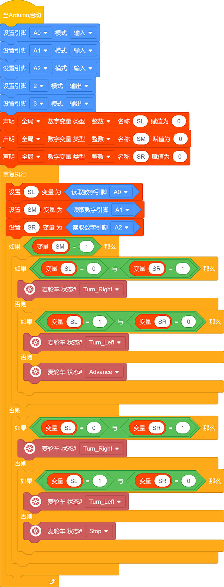

### 第06课 循迹智能车  

  

#### 6.1 项目介绍  

前面已经掌握循迹传感器、电机驱动的原理与用法，接下来组合二者制作循迹小车。

循迹，即沿着预定轨迹行驶，最常见的就是黑线循迹小车。它的实现原理是：循迹传感器检测地面黑色引导线，把路面状态信号传回主控板；主控板对采集到的传感器信号进行解析判断，实时控制电机驱动芯片，调整小车前进方向，让小车始终沿着黑色轨迹自动运行，完成自动循迹功能。  

#### 6.2 实验流程图  

#### 6.3 实验代码 

⚠️ **重要提醒：上传示例代码前，请务必拔掉蓝牙模块！ 因为蓝牙模块也占用Arduino的串口通信（TX/RX），如果不拔掉，示例代码上传会失败。**

##### 6.3.1 寻找代码块  

你也可以通过拖动代码块来编写代码程序，寻找代码块如下：  

1\.    

2\.    

3\.    

4\.    

5\.    

6\.    

##### 6.3.2 完整的代码程序  

  

#### 6.4 实验结果  

⚠️ **再次提醒：**

- **上传示例代码前，请务必拔掉蓝牙模块！ 因为蓝牙模块也占用Arduino的串口通信（TX/RX），如果不拔掉，示例代码上传会失败。**

外接电源，将电机驱动板上的拨码开关拨到 “ON” 端，上电后。选择好正确的设备（Mecanum Robot）和 适当的串口端口（COMxx），然后单击  按钮上传实验代码至Arduino控制板。

代码上传成功后，将小车放在黑色循迹轨道上，小车就能沿着黑线行驶了。  

