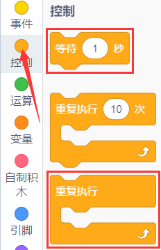
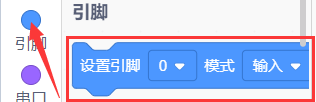
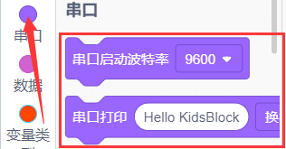
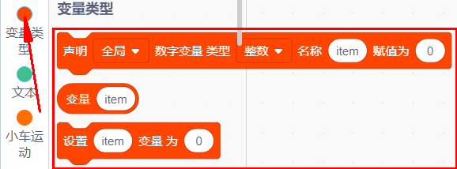
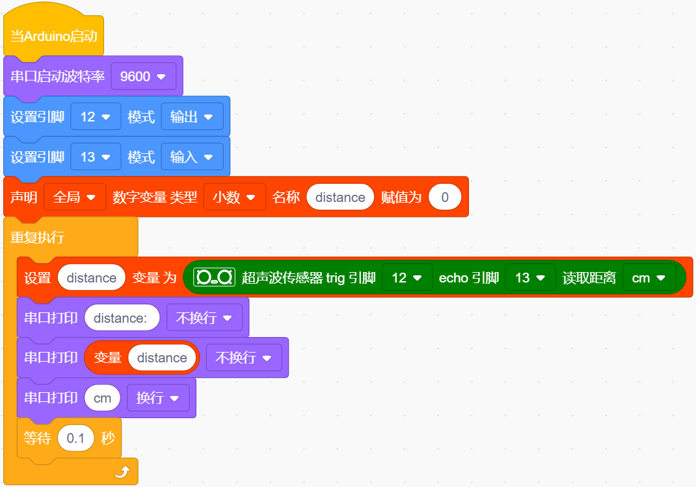
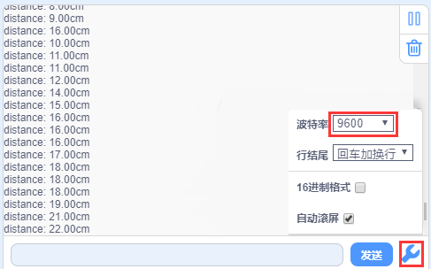

### 第07课 超声波传感器  

#### 7.1 项目介绍  

  

超声波传感器模仿蝙蝠声呐原理，测算传感器与障碍物之间的距离。该传感器可以实现非接触式距离检测，测量精度高、数据输出稳定，传感器集成超声波发射单元与接收单元。

超声波传感器被大量应用于各类电子项目，常用来实现障碍物检测、距离测量等功能。本节将介绍基于 UNO PLUS 开发板搭配超声波传感器实现距离测量，以及在 Arduino IDE 中对超声波传感器的使用。 

#### 7.2 模块相关参数  

- **工作电压:** +5V DC  
- **静态电流:** < 2mA  
- **工作电流:** 15mA  
- **有效角度:** < 15°  
- **距离范围:** 2cm – 400 cm  
- **精度:** 0.3 cm  
- **测量角度:** 30°  
- **触发输入脉宽:** 10us  

**测距原理：** HC‑SR04 采用回声探测法完成距离测量：超声波发射器向外发射超声波，发射瞬间计时器开始计时；超声波在空气中传播，遇到障碍物后发生反射；接收端接收到回波信号，立刻停止计时。超声波属于声波，传播速度受温度影响，常温下空气中声速约为 340m/s。根据计时器记录的传播总时间t，可以计算传感器到障碍物的距离。即：S=340t/2：

**工作步骤：**

- 通过 IO 口向 TRIG 引脚输出至少 10μs 的高电平，触发模块开始测距。
- 模块自动向外发送 8 组 40kHz 的超声波脉冲，同时检测回波信号。
- 当接收到回波，ECHO 引脚输出高电平；单片机读取 ECHO 高电平持续时长，即为超声波从发射到返回的总时间，代入公式即可算出距离。

时序逻辑：先给 TRIG 一个 10μs 触发高电平 → 探头输出 8 个 40kHz 超声波脉冲 → 接收回波得到时间差，换算输出测距结果。

**超声波模块的电路图：**

  

#### 7.3 实验代码 

⚠️ **重要提醒：上传示例代码前，请务必拔掉蓝牙模块！ 因为蓝牙模块也占用Arduino的串口通信（TX/RX），如果不拔掉，示例代码上传会失败。**

##### 7.3.1 寻找代码块  

你也可以通过拖动代码块来编写代码程序，寻找代码块如下：  

1\.    

2\.    

3\.    

4\.    

5\.    

6\.    

##### 7.3.2 完整的代码程序  

 

#### 7.4 实验结果  

⚠️ **再次提醒：**

- **上传示例代码前，请务必拔掉蓝牙模块！ 因为蓝牙模块也占用Arduino的串口通信（TX/RX），如果不拔掉，示例代码上传会失败。**

外接电源，将电机驱动板上的拨码开关拨到 “ON” 端，上电后。选择好正确的设备（Mecanum Robot）和 适当的串口端口（COMxx），然后单击  按钮上传实验代码至Arduino控制板。

码上传成功后，单击kidsblock IDE 右下角串口监视器窗口中的，设置串口波特率为 9600，可以在串口监视器中看到超声波传感器检测到的距离，移动小车前面的障碍物，看到串口监视器中距离值也在发生变化。  

  

