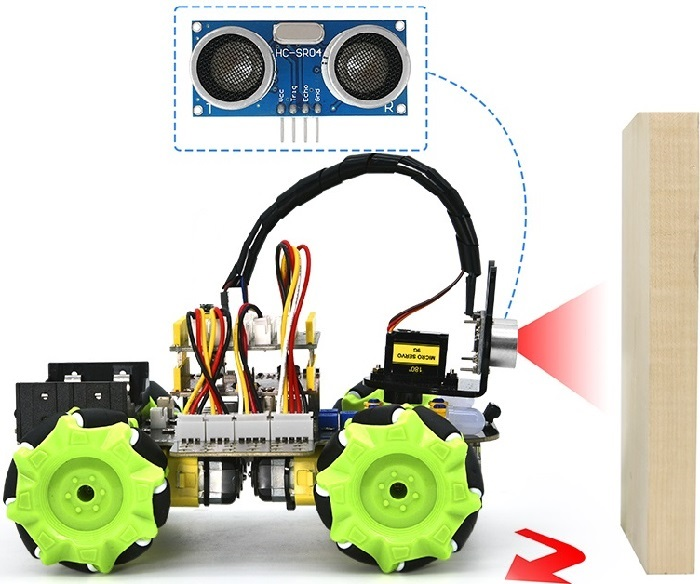
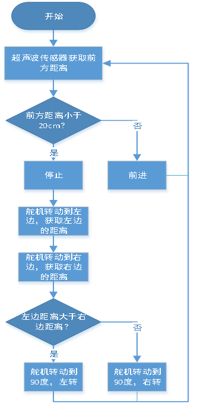
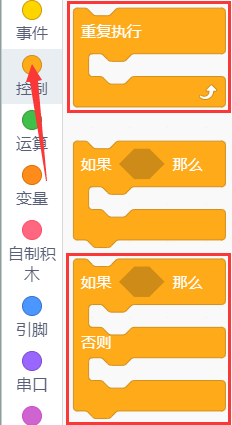
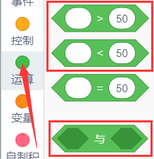
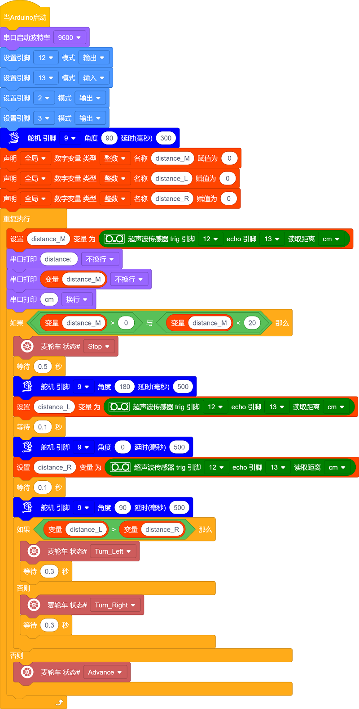

### 第09课 超声波避障智能车  

  

#### 9.1 项目介绍  

在上个项目中，我们制作了一个超声波跟随智能车。实际上，利用相同的硬件和接线方法，只需更改一个测试代码，就可以将跟随智能车转变为避障智能车。超声波避障智能车通过超声波传感器检测前方障碍物的距离，然后舵机云台转动检测左右两侧的距离，并根据这些数据控制四个电机的转动，从而控制智能车的运动状态，实现避障。  

#### 9.2 实验流程图  

 

#### 9.3 实验代码  

##### 9.3.1 寻找代码块  

你也可以通过拖动代码块来编写代码程序，寻找代码块如下：  

1\.    

2\.    

3\.    

4\.    

5\.    

6\.    

7\.    

8\.    

9\.    

10\.   

##### 9.3.2 完整的代码程序  

  

#### 9.4 实验结果  

⚠️ **重要提示：**

- **上传示例代码前，请务必拔掉蓝牙模块！ 因为蓝牙模块也占用Arduino的串口通信（TX/RX），如果不拔掉，示例代码上传会失败。**

外接电源，将4WD麦克纳姆轮小车下板上的拨码开关拨到 “**ON**” 端，上电后。选择好正确的设备（Mecanum Robot）和 适当的串口端口（COMxx），然后单击  按钮上传实验代码至Arduino控制板。

代码上传成功后，小车能够自动避障，注意速度不要调得太大。当小车在行驶过程中前方遇到障碍物时，小车会停止，舵机云台转动到左侧来测量左侧的障碍物距离，之后舵机云台转动到右侧测量右侧的距离，判断左右两侧障碍物的距离，较远的一边小车会进行转向并继续行驶。  

