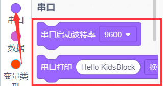
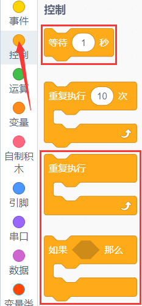
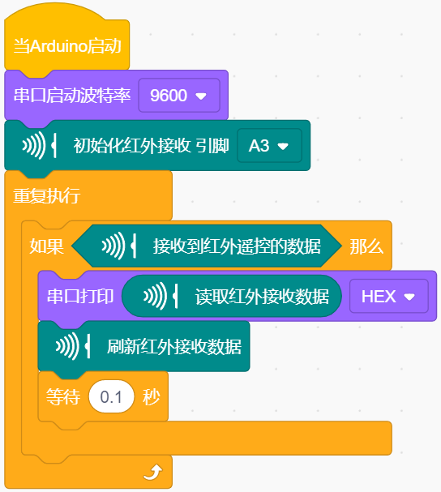
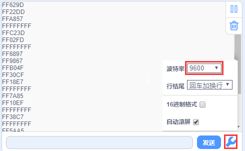
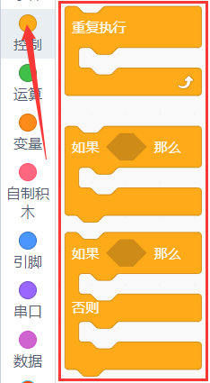
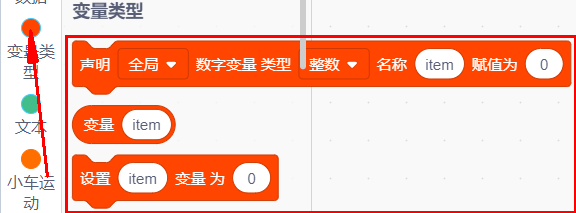
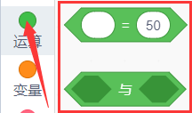
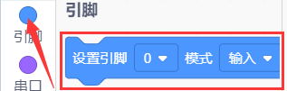
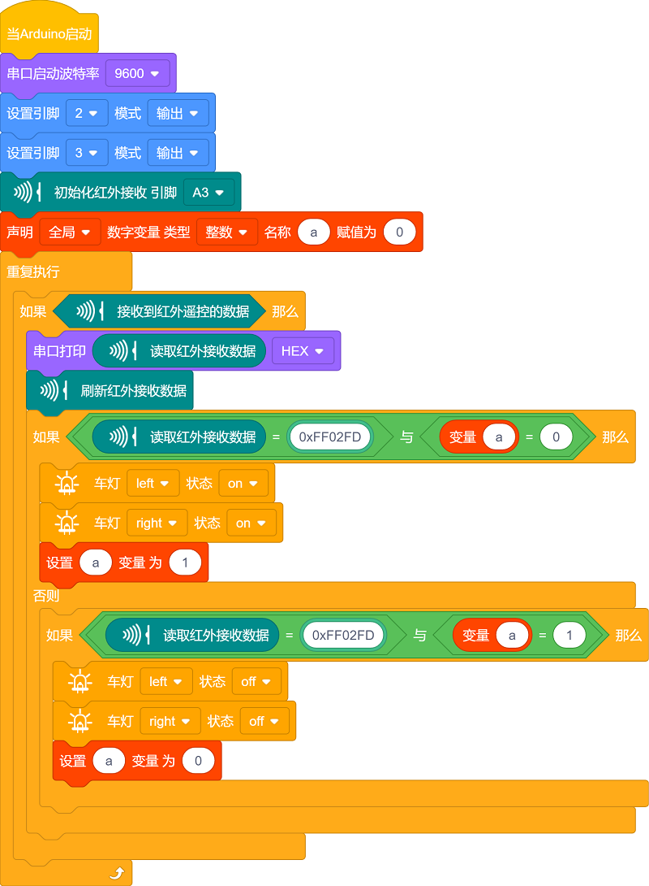

### 第10课 红外接收  

  

#### 10.1 项目介绍  

红外遥控在日常生活中应用十分普遍，电视、音响、录像机、卫星接收机等各类家电都大量使用红外遥控。一套红外遥控系统包含红外发射与红外接收两部分，主要由红外遥控器、红外接收头以及具备解码能力的单片机构成。

红外接收头内部集成 IC 芯片，完成红外信号的接收、放大与解调，最终输出兼容 TTL 电平的数字信号。红外接收头共有 3 个引脚：信号引脚（接单片机 A3 引脚）、VCC 电源引脚、GND 接地引脚。

#### 10.2 模块相关资料  

红外遥控器发射**38KHz 红外载波信号**，信号由遥控器内部编码芯片按照 NEC 协议进行编码。

NEC 协议帧结构包含：引导码、用户码、用户反码、数据码、数据反码。

依靠脉冲时间间隔区分逻辑 0 和逻辑 1：

- 逻辑 0：560μs 低电平 + 560μs 高电平
- 逻辑 1：560μs 低电平 + 1680μs 高电平

遥控器的用户码固定不变，不同按键依靠数据码来区分。按下按键后，遥控器向外发送带编码的 38KHz 红外载波；红外接收模块收到信号后，程序对载波信号做解码处理，解析出数据码，识别出当前按下的按键。

  

#### 10.3 实验代码

⚠️ **重要提醒：上传示例代码前，请务必拔掉蓝牙模块！ 因为蓝牙模块也占用Arduino的串口通信（TX/RX），如果不拔掉，示例代码上传会失败。**

##### 10.3.1 寻找代码块  

你也可以通过拖动代码块来编写代码程序，寻找代码块如下：  

1\.    

2\.    

3\.    

4\.    

##### 10.3.2 完整的代码程序  

  

#### 10.4 实验结果  

⚠️ **再次提醒：**

- **上传示例代码前，请务必拔掉蓝牙模块！ 因为蓝牙模块也占用Arduino的串口通信（TX/RX），如果不拔掉，示例代码上传会失败。**

外接电源，将4WD麦克纳姆轮小车下板上的拨码开关拨到 “**ON**” 端，上电后。选择好正确的设备（Mecanum Robot）和 适当的串口端口（COMxx），然后单击  按钮上传实验代码至Arduino控制板。

代码上传成功后，单击kidsblock IDE 右下角串口监视器窗口中的，设置串口波特率为 9600，拿出遥控器，对准红外接收传感器发送信号，即可看到相应按键的键值。如果按键时间过长，容易出现乱码。  

特别提醒： 使用红外遥控器之前，需要将红外遥控器上的透明塑料卡片抽掉。

 

  

通过测试得出的数值，我们做了一个遥控器按键值表，方便以后使用：  

  

 

#### 10.5 项目拓展：使用一个OK键来控制七彩灯的亮灭 

⚠️ **重要提醒：上传示例代码前，请务必拔掉蓝牙模块！ 因为蓝牙模块也占用Arduino的串口通信（TX/RX），如果不拔掉，示例代码上传会失败。**

##### 10.5.1 寻找代码块  

你也可以通过拖动代码块来编写代码程序，寻找代码块如下：  

1\.    

2\.    

3\.    

4\.    

5\.    

6\.    

7\.    

8\.    

9\.    

##### 10.5.2 完整的代码程序  

  

⚠️ **重要提示：**

- **上传示例代码前，请务必拔掉蓝牙模块！ 因为蓝牙模块也占用Arduino的串口通信（TX/RX），如果不拔掉，示例代码上传会失败。**

外接电源，将电机驱动板上的拨码开关拨到 “ON” 端，上电后。选择好正确的设备（Mecanum Robot）和 适当的串口端口（COMxx），然后单击  按钮上传实验代码至Arduino控制板。

代码上传成功后，当遥控器按下OK按键时，七彩灯就会亮；再按一下OK按键时，七彩灯就会灭。
