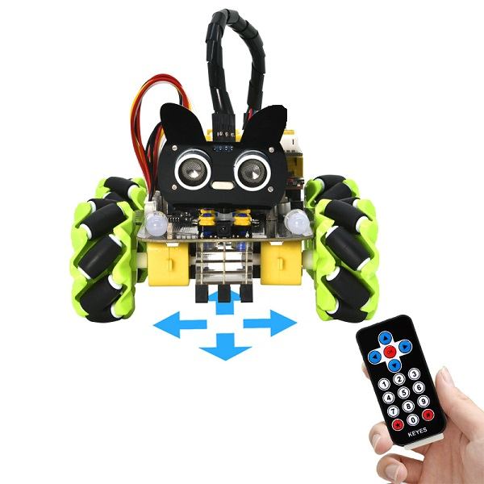
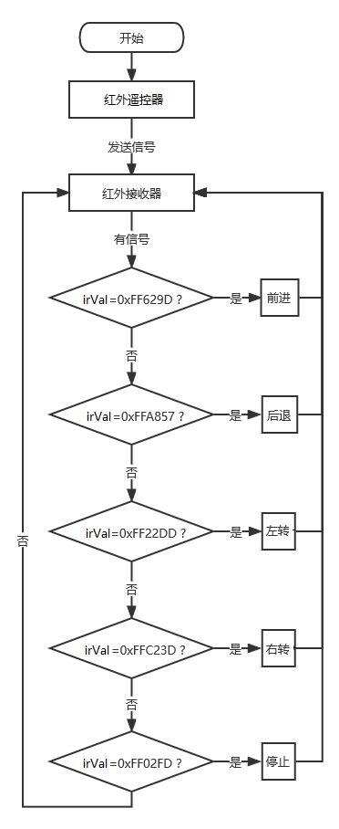
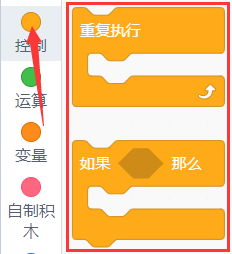
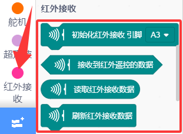
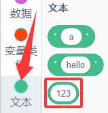
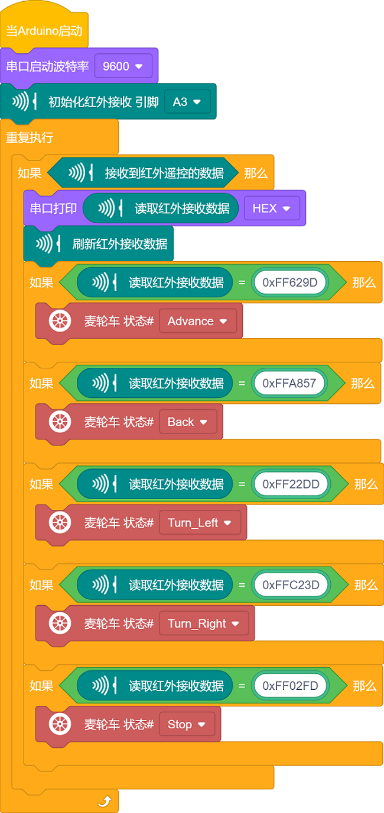

### 第11课 红外遥控智能车  

  

#### 11.1 项目介绍  

前面我们已经测试出红外遥控器各个按键对应的键值，这个项目我们就是使用红外遥控器来控制小车。通过代码设置（键值），让对应的按键控制智能车的运动状态。  

#### 11.2 实验流程图  

 

#### 11.3 实验代码

⚠️ **重要提醒：上传示例代码前，请务必拔掉蓝牙模块！ 因为蓝牙模块也占用Arduino的串口通信（TX/RX），如果不拔掉，示例代码上传会失败。**

##### 11.3.1 寻找代码块  

你也可以通过拖动代码块来编写代码程序，寻找代码块如下：  

1\.    

2\.    

3\.    

4\.    

5\.    

6\.    

7\.    

##### 11.3.2 完整的代码程序  

  

#### 11.4 实验结果  

⚠️ **再次提醒：**

- **上传示例代码前，请务必拔掉蓝牙模块！ 因为蓝牙模块也占用Arduino的串口通信（TX/RX），如果不拔掉，示例代码上传会失败。**

外接电源，将4WD麦克纳姆轮小车下板上的拨码开关拨到 “**ON**” 端，上电后。选择好正确的设备（Mecanum Robot）和 适当的串口端口（COMxx），然后单击  按钮上传实验代码至Arduino控制板。

代码上传成功后，当按下遥控器上的时，小车前进；当我们按下遥控器上的时，小车左转；当我们按下遥控器上的时，小车后退；当我们按下遥控器上的时，小车右转；当我们按下遥控器上的时，小车停止。
