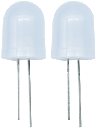
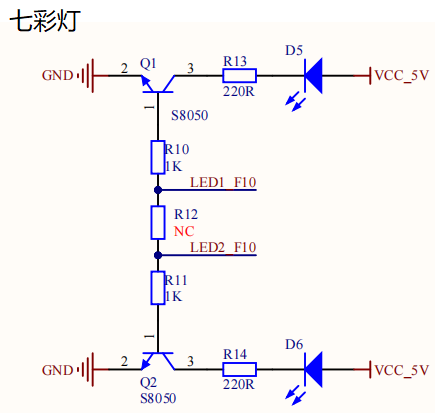
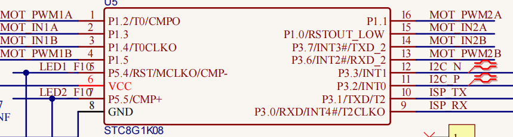
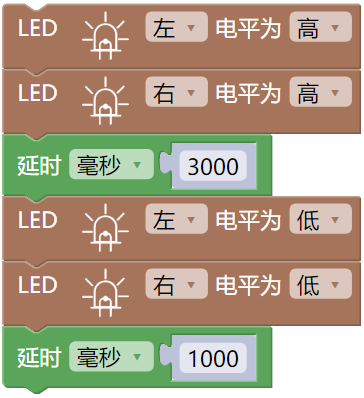

### 第01课 七彩灯  

#### 1.1 项目介绍  

  

首先我们要来完成经典的“Arduino点亮LED”，但是我们这里的LED，不是普通的单色LED，而是一个七彩LED，它采用七彩自动闪烁LED（外观白色，显示七彩）元件。7色LED模块可自动闪烁内置颜色，可以用来制作相当迷人的灯光效果。这个模块与普通LED驱动相同，当我们给它输入高电平时将自动闪烁七种颜色，而输入低电平时将停止闪烁。  

我们已经将七彩LED集成到了我们的电机驱动底板，在第一个项目中，我们用一个最基本的测试代码来控制这个七彩LED，让它闪烁3秒钟，灭一秒钟，来实现控制的效果。你也可以改变代码中LED灯亮灭的时间，实现不同的闪烁时长效果。LED模块信号端S为高电平时七彩LED开始自动闪烁，S为低电平时七彩LED熄灭不再闪烁。  

#### 1.2 模块相关资料  

  

  

两个七彩灯分别通过三极管来控制，信号端分别接到了P5.4和P5.5，所以我们只要控制这两个引脚输出高低电平即可控制两个七彩灯。  

#### 1.3 实验代码

⚠️ **重要提醒：上传示例代码前，请务必拔掉蓝牙模块！ 因为蓝牙模块也占用Arduino的串口通信（TX/RX），如果不拔掉，示例代码上传会失败。**

  

#### 1.4 实验结果  

⚠️ **再次提醒：**

- **上传示例代码前，请务必拔掉蓝牙模块！ 因为蓝牙模块也占用Arduino的串口通信（TX/RX），如果不拔掉，示例代码上传会失败。**

外接电源，将电机驱动板上的拨码开关拨到 “ON” 端，上电后。选择好正确的开发板板型（Arduino Uno）和 适当的串口端口（COMxx），然后单击  按钮上传实验代码至Arduino控制板。

代码上传成功后，可以看到底板的2个七彩LED闪烁3秒然后熄灭1秒，然后再次闪烁3秒再熄灭1秒，如此反复循环。  

