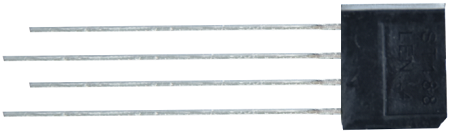
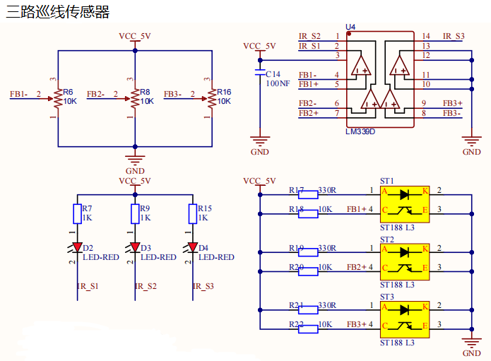
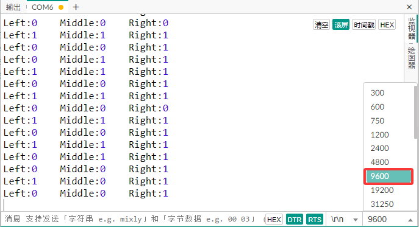

### 第05课 循迹传感器  

#### 5.1 项目介绍  

  

巡线传感器实际上是红外传感器。在小车驱动底板的前面有三路巡线，此处使用的组件是TCRT5000红外灯管。其工作原理是利用红外光对颜色的不同反射率，将反射信号的强度转换为电流信号。在检测过程中，黑色在高电平时处于活动状态，而白色在低电平时处于活动状态，即检测到黑色时或者近距离没有检测到物体时输出高电平，检测到白色或者光滑易反射光的物体时输出低电平。检测高度为0-3厘米。底板上方还有3个蓝色旋转电位器，通过旋转这些电位器，可以调节传感器的检测灵敏度。  

#### 5.2 模块相关资料  

- 工作电压: 3.3-5V (DC)  
- 接口: 5PIN接口 (我们接到了A0, A1, A2)  
- 输出信号: 数字信号（模拟信号口也可以当数字信号用，A0相当于D13，A1相当于D14，以此类推。）  
- 检测高度: 0-3 cm  

**原理：** 巡线传感器的原理是利用红外线对颜色的反射率不一样，将反射信号的强弱转化成电流信号。上电时，发射二极管发射红外光，通过调整电位器给电压比较器LM339D的4、6、8脚提供一个阈值电压，信号输出依赖于反射光强度的变化。  

  

#### 5.3 实验代码  

 

#### 5.4 实验结果  

⚠️ **重要提示：**

- **上传示例代码前，请务必拔掉蓝牙模块！ 因为蓝牙模块也占用Arduino的串口通信（TX/RX），如果不拔掉，示例代码上传会失败。示例代码上传成功后，再插回蓝牙模块。**

外接电源，将4WD麦克纳姆轮小车下板上的拨码开关拨到 “**OFF**” 端，上电后。选择好正确的开发板板型（Arduino Uno）和 适当的串口端口（COMxx），然后单击  按钮上传示例代码1至Arduino控制板。

代码上传成功后，单击Mixly IDE 左上角，在串口监视器窗口中的右下角设置串口波特率为 9600，可以看到在串口监视器上打印三路巡线传感器接收到的数字信号。当我们用白纸去遮挡它时，输出0；用黑纸或者悬空小车时，输出1：  

  

 