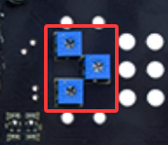
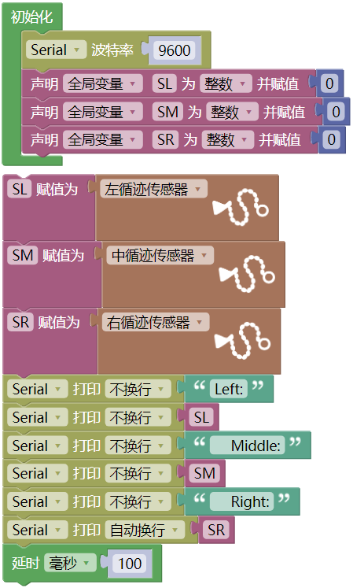

### 第05课 循迹传感器  

#### 5.1 项目介绍  

  

循迹传感器本质属于红外反射式传感器，本小车驱动底板前端搭载三路循迹单元，核心器件为 TCRT5000 红外对管。

传感器有效检测高度 0‑3 厘米。底板配有 3 个蓝色可调电位器，分别对应三路循迹传感器，旋转电位器即可调节每一路的检测灵敏度。

  

#### 5.2 模块相关资料  

- 工作电压：3.3‑5V（直流）
- 接口：5PIN 接口，硬件连接 G、5V、A0、A1、A2
- 输出信号：数字信号；模拟引脚可当做数字引脚使用，A0 对应 D13，A1 对应 D14，以此类推。
- 检测高度：0‑3 厘米

**工作原理**

循迹传感器利用不同颜色表面对红外光反射率的差异，把红外反射光的强弱转换成电流信号。上电后红外发射二极管向外发射红外光；电位器为电压比较器 LM339D 的 4、6、8 脚提供阈值参考电压，最终输出电平随红外反射光强度变化。

- 检测到黑色标线，或是近距离无物体反射时，输出高电平。
- 检测到白色地面、光滑高反射物体时，输出低电平。

电路由三路红外发射管、分压可调电位器、LM339D 电压比较器组成。红外管发出红外光，地面反射后由接收管接收；电位器调整比较阈值，LM339D 完成电平比较，输出高低数字电平，以此识别黑线与白色底面。 

  

#### 5.3 实验代码 

⚠️ **重要提醒：上传示例代码前，请务必拔掉蓝牙模块！ 因为蓝牙模块也占用Arduino的串口通信（TX/RX），如果不拔掉，示例代码上传会失败。**

 

#### 5.4 实验结果  

⚠️ **再次提醒：**

- **上传示例代码前，请务必拔掉蓝牙模块！ 因为蓝牙模块也占用Arduino的串口通信（TX/RX），如果不拔掉，示例代码上传会失败。示例代码上传成功后，再插回蓝牙模块。**

外接电源，将电机驱动板上的拨码开关拨到 “ON” 端，上电后。选择好正确的开发板板型（Arduino Uno）和 适当的串口端口（COMxx），然后单击  按钮上传示例代码1至Arduino控制板。

代码上传成功后，单击Mixly IDE 左上角，在串口监视器窗口中的右下角设置串口波特率为 9600，可以看到在串口监视器上打印三路巡线传感器接收到的数字信号。当我们用白纸去遮挡它时，输出0；用黑纸或者悬空小车时，输出1：  

  

 