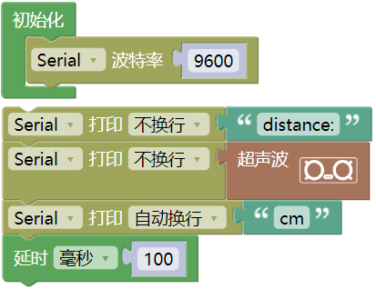
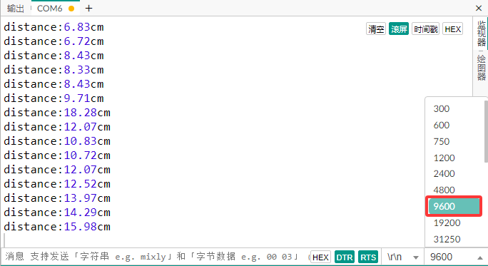

### 第07课 超声波传感器  

#### 7.1 项目介绍  

  

HC-SR04超声波传感器像蝙蝠一样使用声纳来确定与物体的距离。它在一个易于使用的包装中提供了出色的非接触式范围检测，具有高精度和稳定的读数。它配有超声波发射器和接收器模块。HC-SR04或超声波传感器正在广泛的电子项目中用于创建障碍物检测和距离测量应用以及各种其他应用。这里介绍了用Keyes UNO PLUS开发板和超声波传感器测量距离的简单方法，以及如何在Arduino IDE中使用超声波传感器。  

#### 7.2 模块相关参数  

- **工作电压:** +5V DC  
- **静态电流:** < 2mA  
- **工作电流:** 15mA  
- **有效角度:** < 15°  
- **距离范围:** 2cm – 400 cm  
- **精度:** 0.3 cm  
- **测量角度:** 30 degree  
- **触发输入脉宽:** 10us  

**原理：** 最常用的超声测距的方法是回声探测法，如图，超声波发射器向某一方向发射超声波，在发射时刻的同时计数器开始计时，超声波在空气中传播，途中碰到障碍物面阻挡就立即反射回来，超声波接收器收到反射回的超声波就立即停止计时。

超声波也是一种声波，其声速V与温度有关。一般情况下超声波在空气中的传播速度为340m/s，根据计时器记录的时间t，就可以计算出发射点距障碍物面的距离s，即：s=340t/2：

* (1)采用IO口TRIG触发测距，给至少10us的高电平信号;
* (2)模块自动发送8个40khz的方波，自动检测是否有信号返回；
* (3)有信号返回，通过ECHO输出一个高电平，单片机读取到高电平持续的时间就是超声波从发射到返回的时间。

**超声波模块的电路图：**

  

#### 7.3 实验代码  

#### 7.4 实验结果  

⚠️ **重要提示：**

- **上传示例代码前，请务必拔掉蓝牙模块！ 因为蓝牙模块也占用Arduino的串口通信（TX/RX），如果不拔掉，示例代码上传会失败。**

外接电源，将4WD麦克纳姆轮小车下板上的拨码开关拨到 “**ON**” 端，上电后。选择好正确的开发板板型（Arduino Uno）和 适当的串口端口（COMxx），然后单击  按钮上传实验代码至Arduino控制板。

代码上传成功后，单击Mixly IDE 左上角，在串口监视器窗口中的右下角设置串口波特率为 9600，可以在串口监视器中看到超声波传感器检测到的距离，移动小车前面的障碍物，看到串口监视器中距离值也在发生变化。  

  

