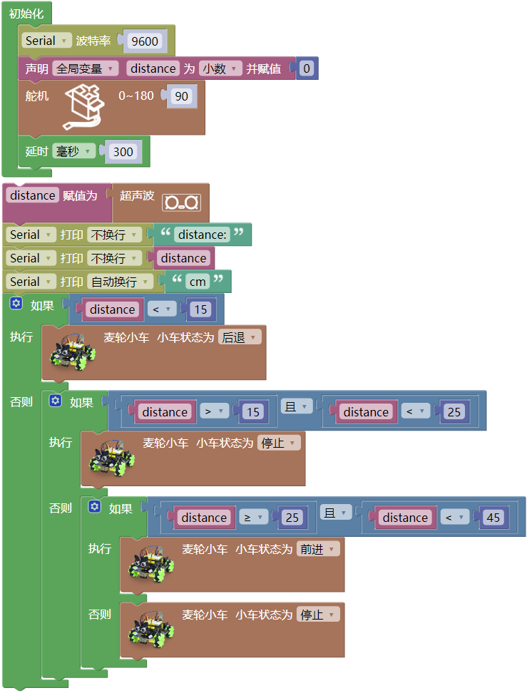
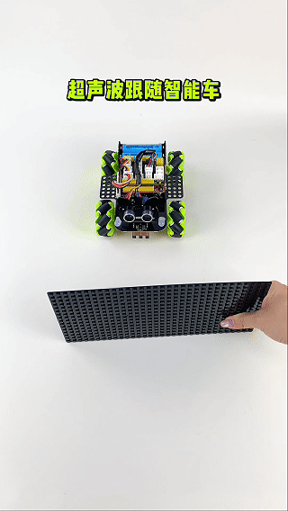

### 第08课 超声波跟随智能车  

  

#### 8.1 项目介绍  

前面我们已经学习利用循迹传感器与电机，制作自动巡线智能小车。本节课中，我们结合超声波传感器与电机，完成自动跟随智能小车项目。

小车通过超声波传感器实时检测自身与前方目标障碍物之间的距离，主控板读取距离数据并进行逻辑判断，根据距离的远近来控制电机运转，以此改变小车前进、后退、停止等运动状态，实现小车自动跟随的效果。

#### 8.2 实验流程图  

#### 8.3 实验代码  

⚠️ **重要提醒：上传示例代码前，请务必拔掉蓝牙模块！ 因为蓝牙模块也占用Arduino的串口通信（TX/RX），如果不拔掉，示例代码上传会失败。**

 

#### 8.4 实验结果  

⚠️ **再次提醒：**

- **上传示例代码前，请务必拔掉蓝牙模块！ 因为蓝牙模块也占用Arduino的串口通信（TX/RX），如果不拔掉，示例代码上传会失败。**

外接电源，将电机驱动板上的拨码开关拨到 “ON” 端，上电后。选择好正确的开发板板型（Arduino Uno）和 适当的串口端口（COMxx），然后单击  按钮上传实验代码至Arduino控制板。

代码上传成功后，小车就能直线跟随，在超声波传感器前放置手掌或其他物体并慢慢向前移动，小车会跟随手掌或其他物体移动。  

 

