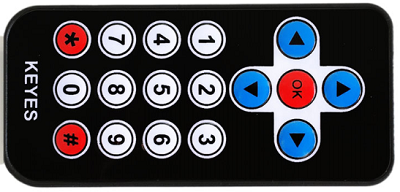
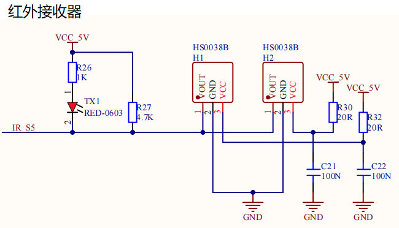
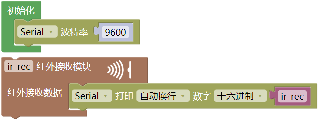
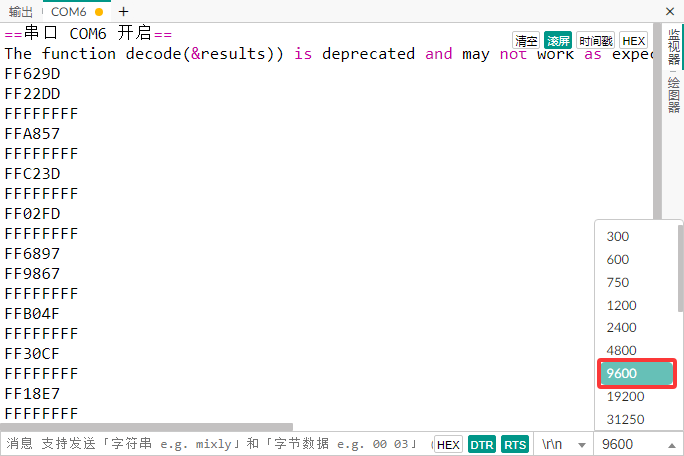
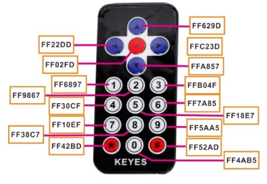
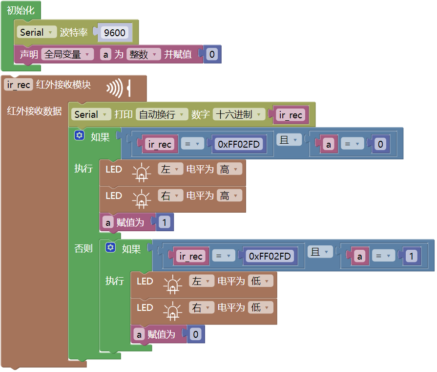

### 第10课 红外接收  

  

#### 10.1 项目介绍  

毫无疑问，红外遥控在日常生活中随处可见，以至于很难想象没有它的世界会变得怎样。它被用来控制各种家电，如电视、音响、录影机和卫星信号接收器。红外遥控由红外发射和红外接收系统组成，包括一个红外遥控器、红外接收模块和一个能解码的单片机。  

红外接收模块主要由红外接收头组成，能够接收、放大、解调信号，内部的IC完成了解调工作，输出与TTL电平信号兼容的数字信号。该模块只有三个引脚，分别是信号线（与单片机的A3管脚相连）、VCC和GND。这个实验将红外遥控的键值打印到串口监视器上。  

#### 10.2 模块相关资料  

红外发射遥控器发射的38KHz红外载波信号，由遥控器内的编码芯片编码。信号结构为（NEC协议），包含一段引导码、用户码、用户反码、数据码和数据反码。利用脉冲的时间间隔来区分信号：560us低电平+560us高电平表示信号0，560us低电平+1680us高电平表示信号1。遥控器的用户码是不变的，通过数据码来区分按下的不同按键。当按下遥控器按键时，遥控器发送红外载波信号，红外接收器接收到信号时程序对载波信号进行解码，从而判断按下的是哪个键。  

  

#### 10.3 实验代码

⚠️ **重要提醒：上传示例代码前，请务必拔掉蓝牙模块！ 因为蓝牙模块也占用Arduino的串口通信（TX/RX），如果不拔掉，示例代码上传会失败。**

 

#### 10.4 实验结果  

⚠️ **重要提示：**

- **上传示例代码前，请务必拔掉蓝牙模块！ 因为蓝牙模块也占用Arduino的串口通信（TX/RX），如果不拔掉，示例代码上传会失败。**

外接电源，将电机驱动板上的拨码开关拨到 “ON” 端，上电后。选择好正确的开发板板型（Arduino Uno）和 适当的串口端口（COMxx），然后单击  按钮上传实验代码至Arduino控制板。

代码上传成功后，单击Mixly IDE 左上角，在串口监视器窗口中的右下角设置串口波特率为 9600。拿出遥控器，对准红外接收传感器发送信号，即可看到相应按键的键值。如果按键时间过长，容易出现乱码。  

特别提醒： 使用红外遥控器之前，需要将红外遥控器上的透明塑料卡片抽掉。

  

 

通过测试得出的数值，我们做了一个遥控器按键值表，方便以后使用：  

  
  

#### 10.5 项目拓展：使用一个OK键来控制七彩灯的亮灭

⚠️ **重要提醒：上传示例代码前，请务必拔掉蓝牙模块！ 因为蓝牙模块也占用Arduino的串口通信（TX/RX），如果不拔掉，示例代码上传会失败。**

⚠️ **再次提醒：**

- **上传示例代码前，请务必拔掉蓝牙模块！ 因为蓝牙模块也占用Arduino的串口通信（TX/RX），如果不拔掉，示例代码上传会失败。**

外接电源，将电机驱动板上的拨码开关拨到 “ON” 端，上电后。选择好正确的开发板板型（Arduino Uno）和 适当的串口端口（COMxx），然后单击  按钮上传实验代码至Arduino控制板。

代码上传成功后，当遥控器按下OK按键时，七彩灯就会亮；再按一下OK按键时，七彩灯就会灭。
