### 第12课 蓝牙APP控制麦轮车  

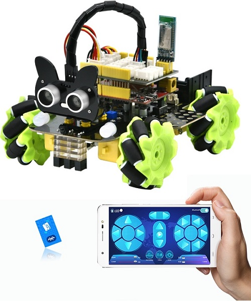  

#### 12.1 项目介绍  

蓝牙是一种流行的无线通信方式，能让设备之间不用电线就能传递信息。蓝牙模块充当中间人，手机通过蓝牙发送指令，蓝牙模块将指令传给Arduino开发板，开发板根据指令执行相应操作，例如控制LED灯的亮灭或小车的运动等。  

#### 12.2 模块相关资料 

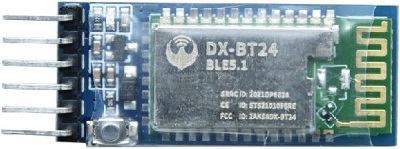 

BT24是一款面向嵌入式开发的‌低功耗串口透传蓝牙模块‌，主打简化蓝牙通信开发，广泛应用于物联网原型开发和小型智能设备项目中，以下是详细介绍：

蓝牙参数：

- 蓝牙协议: Bluetooth Specification V5.1 BLE
- 工作频率: 2.4GHz ISM band
- 通信接口: UART
- 工作电压: DC 5V
- 通信距离: 40m
- 蓝牙名称: BT24
- 串口参数: 9600、8数据位、1停止位、无校验、无流控
- 兼容性‌：支持Android/iOS蓝牙4.0及以上设备，AT指令可灵活修改模块名称、波特率等参数。

DX-BT24模块同时支持BT5.1 BLE协议，能够与具备BLE蓝牙功能的iOS设备直接连接，支持后台程序常驻运行。主要用于短距离的数据无线传输领域。避免繁琐的线缆连接，能直接替代串口线。BT24模块成功应用领域包括：

- 蓝牙无线数据传输
- 手机、电脑周边设备
- 手持POS设备
- 医疗设备无线数据传输
- 智能家居控制
- 蓝牙打印机
- 蓝牙遥控玩具
- 共享单车

**蓝牙接口说明** 

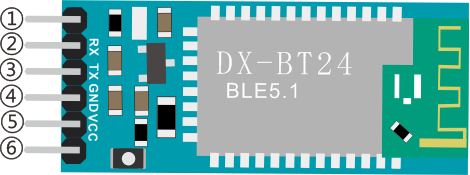  

| 引脚   | 功能     |  
|--------|----------|  
| ① STATE  | 状态脚   |  
| ② RXD     | 接收脚   |  
| ③ TXD     | 发送脚   |  
| ④ GND    | 接地脚   |  
| ⑤ VCC    | 电源脚   |  
| ⑥ EN     | 使能脚   |  

**将蓝牙模块连接到开发板**  

| Uno plus主板  | BT24 蓝牙模块 |  
|-------|-------|  
| TX    | RXD    |  
| RX    | TXD    |
| G   | GND   |  
| 5V   | VCC    |  
  

#### 12.3 APP下载安装：

⚠️ **特别提醒：如果已经在手机/平板上安装好了APP，则这一步骤可以直接跳过；否则，需要参照以下步骤在手机/平板上来安装APP。**

**步骤1：** 在手机/平板浏览器的搜索框中输入官网链接：[https://www.keyesrobot.cn/zh-cn/latest](https://www.keyesrobot.cn/zh-cn/latest)

**步骤2：** 点击 “**下载中心**”，进入下载中心页面。

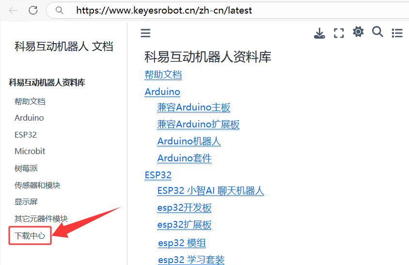

**步骤3：** 在 “**APP下载**” 栏向下滑找到 **Mecanum Robot**，根据自己的手机/平板系统选择对应的APP下载安装。

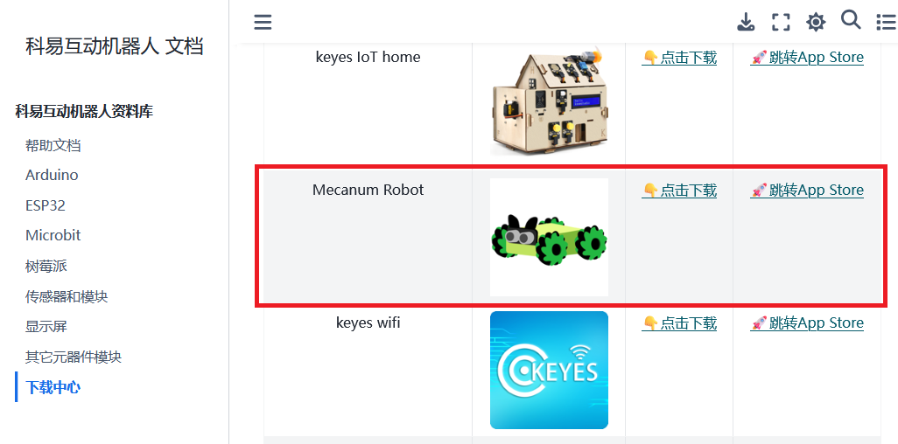

**安卓系统(Android)**

a. 点击 "**点击下载**" 按钮，下载对应的 "**Mecanum Robot.apk**" 文件。

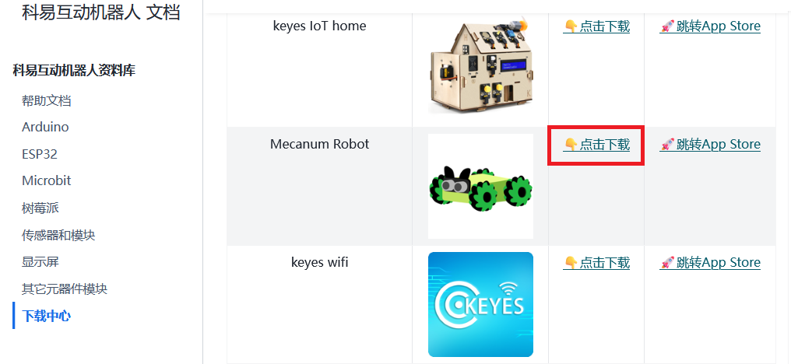

b. 按照安装提示进行下载安装。

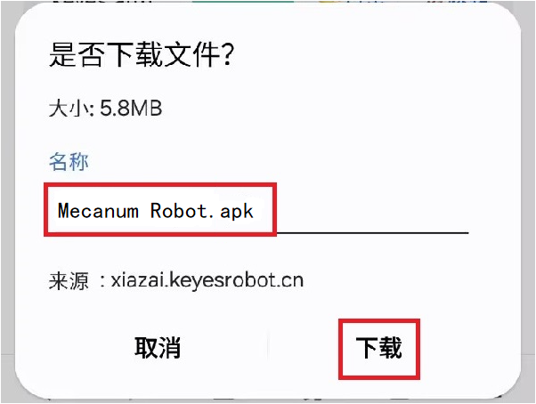

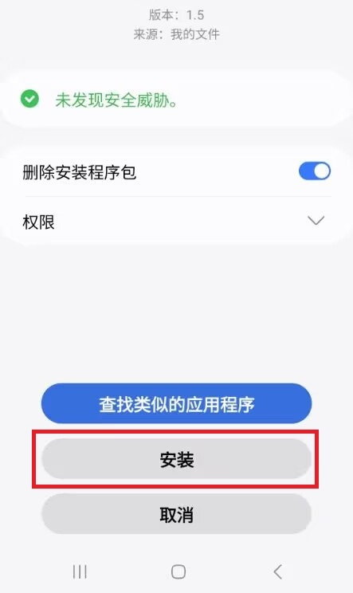

c. 下载安装后，打开 **Mecanum Robot** APP，出现如下图界面，按照提示进行操作。

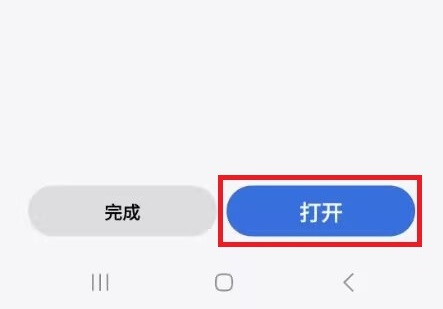

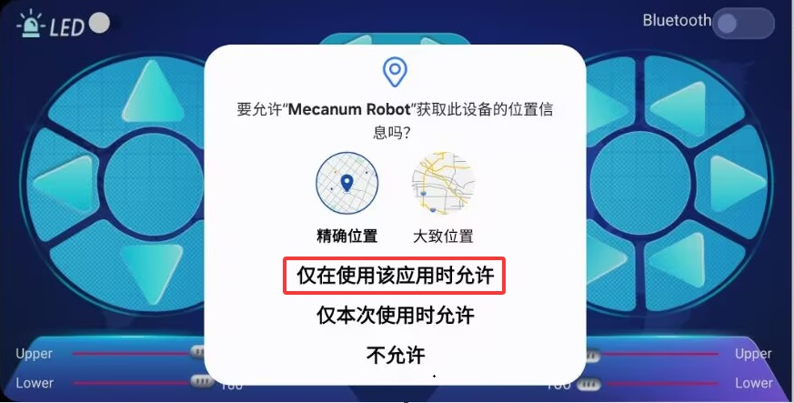

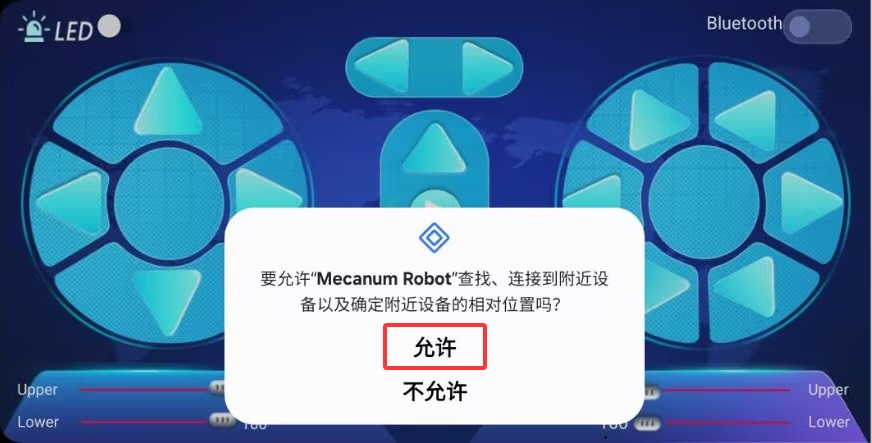

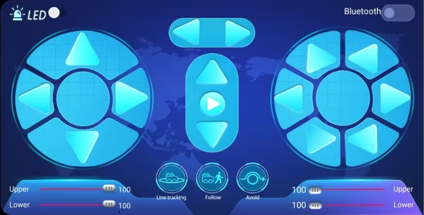

d. 打开手机/平板上的蓝牙。

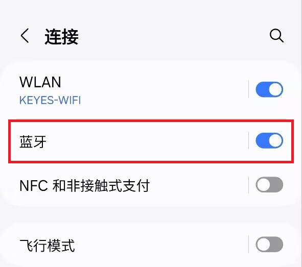

**苹果系统(IOS)**

a. 点击 "**跳转APP Store**" 按钮，页面跳转到 APP Store

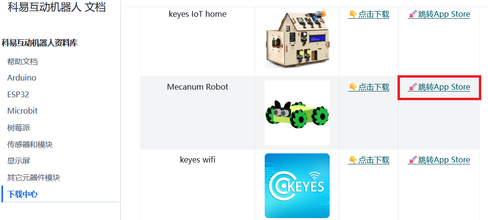

b. 在 APP Store 上搜索 **Mecanum Robot** ，选择 **Mecanum Robot**，然后点击  获取，等待下载安装APP即可。

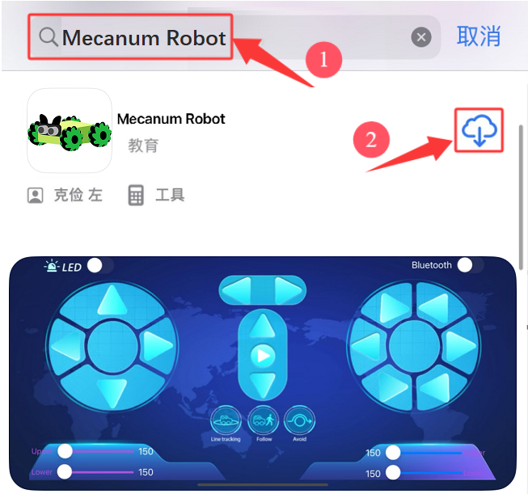

c. 下载安装后，打开 Mecanum Robot APP，出现如下图界面，参照提示进行相应的操作。

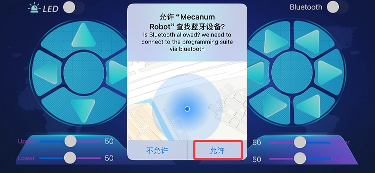

d. 打开手机/平板上的蓝牙。

#### 12.4 示例代码：

⚠️ **重要提醒：上传示例代码前，请务必拔掉蓝牙模块！ 因为蓝牙模块也占用Arduino的串口通信（TX/RX），如果不拔掉，示例代码上传会失败。示例代码上传成功后，再插回蓝牙模块。**

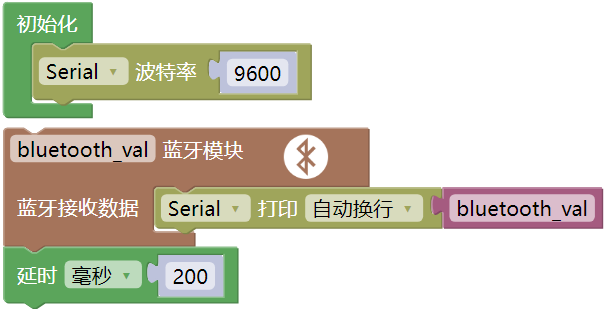

#### 12.5 项目结果：

⚠️ **再次提醒：**

- **上传示例代码前，请务必拔掉蓝牙模块！ 因为蓝牙模块也占用Arduino的串口通信（TX/RX），如果不拔掉，示例代码上传会失败。示例代码上传成功后，再插回蓝牙模块。**

- 外接电源，将电机驱动板上的拨码开关拨到 “ON” 端，上电后。选择好正确的开发板板型（Arduino Uno）和 适当的串口端口（COMxx），然后单击  按钮上传示例代码至Arduino控制板。

- 插上蓝牙模块，确认接线无误。

- 连接好蓝牙模块，上电后，蓝牙模块上的LED闪烁。

**安卓系统(Android)**

- 打开手机/平板上的蓝牙。

- 点击手机/平板上的APP图标，进入APP界面，显示如下图：

- 点击APP界面左上角的图标开关，搜索到对应的蓝牙设备（**BT24**)），上下滑动找到对应的蓝牙设备（**BT24**），显示如下图：

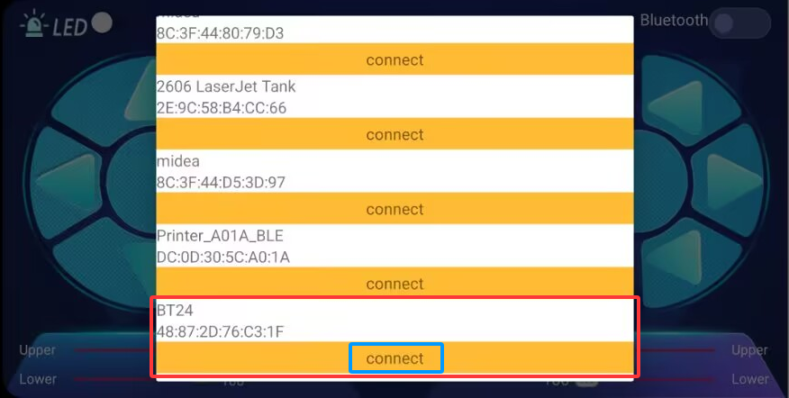

- 点击 “**connect**” 来连接蓝牙，蓝牙连接成功后，“**connect**” 字样会变成 “**is connected**” 字样，显示如下图。这时，蓝牙模块上的LED变为常亮。

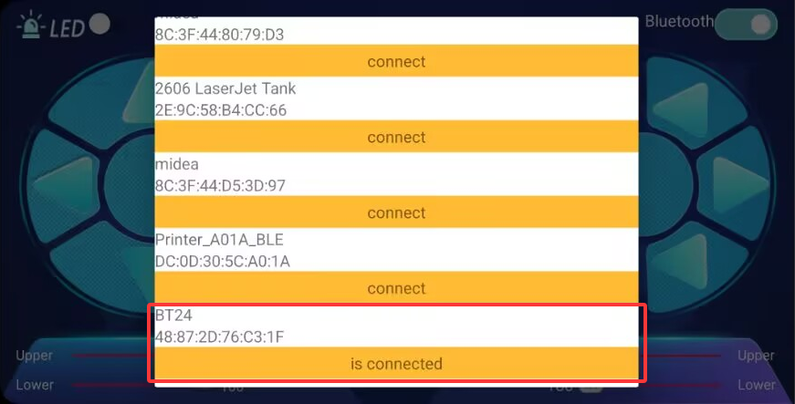

**苹果系统(IOS)**

- 打开手机/平板上的蓝牙。

- 点击手机/平板上的APP图标，进入APP界面，显示如下图：

- 点击APP界面左上角的图标开关，搜索到对应的蓝牙设备（**BT24**），上下滑动找到对应的蓝牙设备（**BT24**），显示如下图：

- 点击 “**connect**” 来连接蓝牙，蓝牙连接成功后，“**connect**” 字样会变成 “**is connected**” 字样，显示如下图。这时，蓝牙模块上的LED变为常亮。

- 单击Mixly IDE 左上角，在串口监视器窗口中的右下角设置串口波特率为 9600，按下APP界面上的各个按键，串口监视器窗口会打印对应的字符。

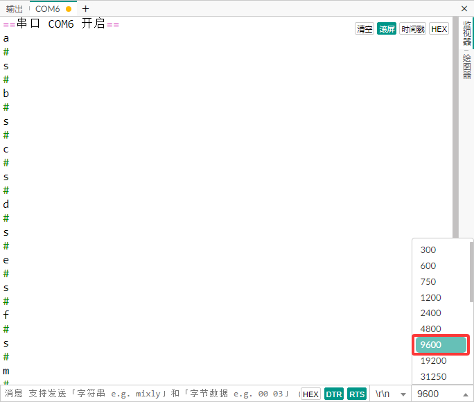 

#### 12.6 综合项目：APP控制麦克纳姆轮智能车

⚠️ **重要提醒：上传示例代码前，请务必拔掉蓝牙模块！ 因为蓝牙模块也占用Arduino的串口通信（TX/RX），如果不拔掉，示例代码上传会失败。示例代码上传成功后，再插回蓝牙模块。**

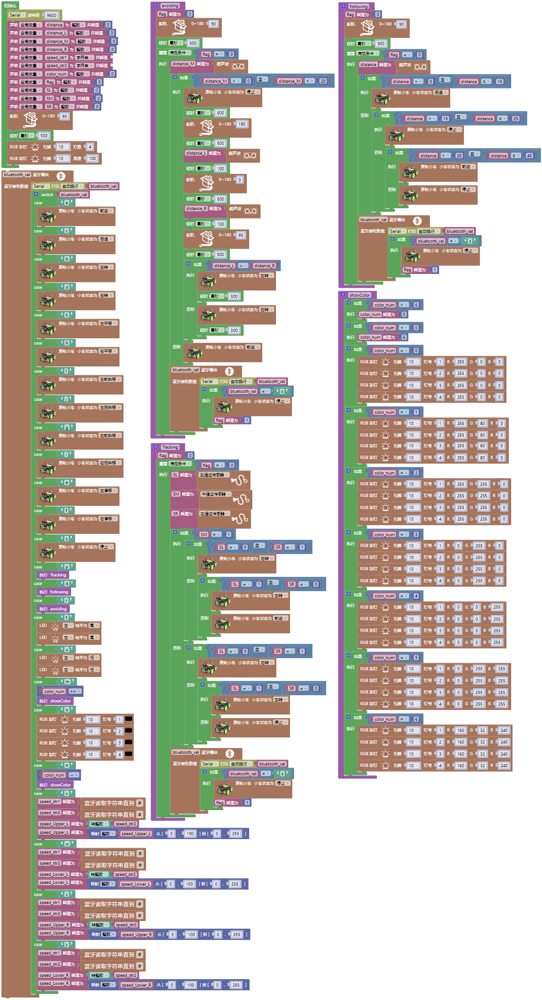

⚠️ **再次提醒：**

- **上传示例代码前，请务必拔掉蓝牙模块！ 因为蓝牙模块也占用Arduino的串口通信（TX/RX），如果不拔掉，示例代码上传会失败。示例代码上传成功后，再插回蓝牙模块。**

- 外接电源，将电机驱动板上的拨码开关拨到 “ON” 端，上电后。选择好正确的开发板板型（Arduino Uno）和 适当的串口端口（COMxx），然后单击  按钮上传示例代码至Arduino控制板。

- 插上蓝牙模块，确认接线无误。

- 连接好蓝牙模块，上电后，蓝牙模块上的LED闪烁。

- 使用手机APP控制小车，实现前面所学的多种功能：  

  - 1\. 点击开启七彩灯，再次点击这个按钮七彩灯就会关闭。

  - 2\. 点击会进入循迹模式，当想退出该模式时，再次点击该按钮。

  - 3\. 点击会进入跟随模式、当想退出该模式时，再次点击该按钮。

  - 4\. 点击会进入避障模式，当想退出该模式时，再次点击该按钮。

  - 5\. 拉动这两个条幅会改变左边两个电机的速度，右边也是相同的操作方法。

  - 6\. 这几个按钮是用来切换底板下面4个2812灯珠颜色的，中间按钮为关闭功能。

  - 7\. 剩下其他的按钮全都是用来操控小车行驶的，跟其他按钮不同的是：这些按钮当我们按下时，小车行驶；松开按钮时，小车停止。

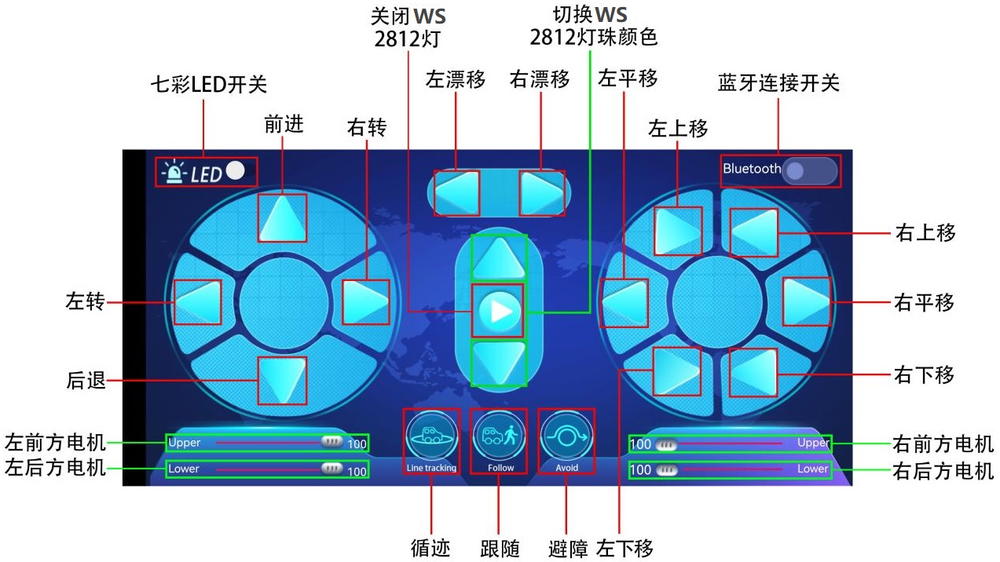

#### 12.8 注意事项：

1\. 电源充足：高速运转时电机消耗电流较大，请确保电池电量充足，否则4WD智能车可能会因为电压不足而行动迟缓或重启。
    
2\. 上传代码问题：由于蓝牙模块占用了 Arduino 的 D0 (RX) 和 D1 (TX) 引脚，在上传代码前，务必拔掉蓝牙模块的 TX 和 RX 连线，否则会出现“上传错误”。上传完成后再插回。
    
3\. 速度范围：PWM 值必须在 0-255 之间。如果代码逻辑错误导致数值溢出，电机可能无法正常工作。
   
4\.  地面摩擦：在不同的地面（如地毯、瓷砖）上，4WD智能车的实际速度感会有所不同，这是正常现象。