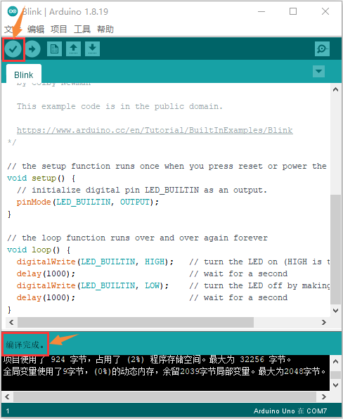
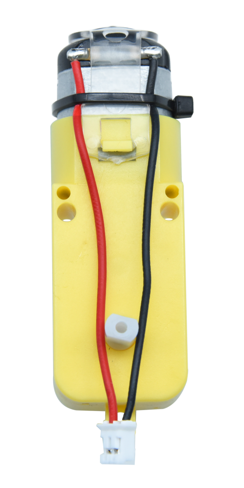
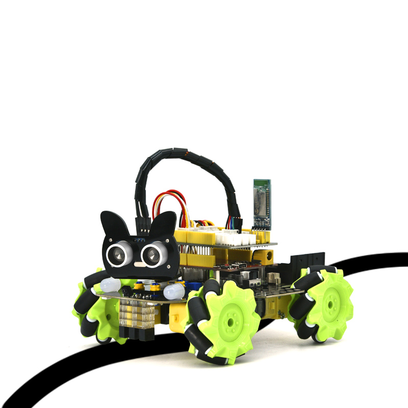
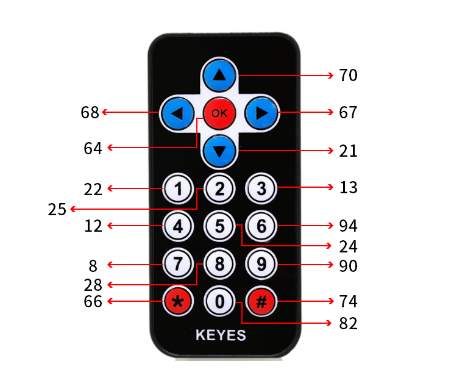
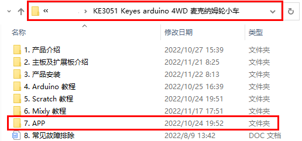

# Arduino 教程

## 开发环境配置

开始于Arduino

### 1. 安装Windows驱动程序 


安装 Arduino IDE

我们先到arduino
官方的网站<https://www.arduino.cc/>下载最新版本的arduino开发软件,进入网站之后点击界面上的SOFTWARE,选择DOWNLOADS进入下载页面，如下图：


Arduino 软件有很多版本，有windows,mac, linux系统的（如下图），而且还有过去老的版本，你只需要下载一个适合系统的版本。

这里我们以WINDOWS系统的为例给大家介绍一下下载和安装的步骤。

WINDOWS系统的也有两个版本，一个版本是安装版的，一个是下载版的不用安装，直接下载文件到电脑，解压缩就可以用了。


两个版本都可以正常使用，看你自己的喜好了。选择一个版本，然后将Arduino
开发软件下载到我们的电脑。


一般情况下，我们点击JUST DOWNLOAD就可以下载了，当然如果你愿意，你可以选择小小的赞助，以帮助伟大的ARDUINO开源事业。

在Windows系统安装开发板驱动文件

接下来是开发板驱动的安装，这次我们安装的是Keyes Uno Plus
开发板的驱动，这个开发板的USB转串口芯片是CP2102。在ARDUINO
开发软件1.8以上的版本里就已经包含了这个芯片的驱动程序，这样我们使用起来会非常方便。（如果你的Arduino开发软件不是1.8以上版本的，就需要到

[https://www.silabs.com/products/development-tools/software/usb-to-uart-bridge-vcp-drivers](https://www.silabs.com/products/development-tools/software/usb-to-uart-bridge-vcp-drivers)

这个地址去下载CP2102的芯片驱动）一般插上USB，电脑就会识别到硬件，WINDOWS就会自动安装CP2102的驱动。


如果驱动安装失败，则需要手动安装驱动。请打开计算机的设备管理器，右键单击“计算机”-----单击“属性”-----单击“设备管理器”。在端口
(COM &LPT)或Other devices下，黄色感叹号表示CP2102驱动程序安装失败。


显示CP2102的驱动没有安装成功，有一个黄色的感叹号。先双击，再单击“更新驱动程序(U)...”更新驱动。


点击“浏览我的电脑一查找驱动程序(R)”，找到我们安装或者下载的Arduino软件.


在Arduino文件夹（）里面有一个drivers文件夹，打开drivers文件夹就可以看到CP210X系列芯片的驱动。

点击“浏览(R)...”,选中CP210X系列芯片的驱动，点击“下一页”。


过一会儿，驱动安装成功。点击“关闭”即可。


这个时候再打开计算机设备管理器，就可以看到CP2102驱动程序已经安装成功了，刚刚那个黄色的感叹号不见了。


IDE设置和工具栏介绍

装好了开发板的驱动，我们下面要了解Arduino开发软件的使用了，首先我们点击电脑桌面上的图标，打开Arduino IDE，进行语言切换。单击“File”→“Preferences”，在 Preferences
页面中将语言“English”切换成“简体中文”，点击“OK”就可以了。


关闭Arduino IDE再重启，这样，Arduino IDE页面中的语言就切换好了。


为了避免在将程序上载到板上时出现任何错误，必须选择正确的Arduino板名称，该名称与连接到计算机的电路板相匹配。转到“工具”→“开发板：”，然后选择你的板。


然后再选择正确的COM口（安装驱动成功后可看到对应COM口）。


我们的程序上传到板之前，我们必须演示Arduino IDE工具栏中出现的每个符号的功能。


A - 用于检查是否存在任何编译错误。

B - 用于将程序上传到Arduino板。

C - 用于创建新草图的快捷方式。

D - 用于直接打开示例草图之一。

E - 用于保存草图。

F - 用于从板接收串行数据并将串行数据发送到板的串行监视器。

启动你的第一个程序

上面我们学习了怎么下载软件和安装开发板的驱动，那下面我们就开始正式开始第一个程序，打开文件选择例子，选择第一个文件BASIC里面的BLINK程序


当草图窗口打开时，您可以在窗口中看到整个草图。


按照前面方法设置板和COM口，IDE右下角显示对应板和COM口。


点击图标开始编译程序，检查错误，检查无误。



点击图标开始上传程序，上传成功。


程序上传成功，板载的LED灯亮一秒钟，灭一秒钟，恭喜你的第一个程序完成了！

2.在MAC 系统上安装驱动


#### 2.1下载安装arduino软件： 


#### 2.2如何安装CP2102驱动程序： 

（注意：如果已经安装了驱动程序，则不需要再安装驱动；如果没有，则需要进行以下操作）

（1）用USB线将Keyes Uno PLUS控制板连接到你的MacOS系统电脑上，并打开Arduino IDE。


点击工具，选择主板:“Arduino Uno”，串口为
/dev/cu.usbserial-0001。


点击上传代码，如果上传成功，如下图所示，会显示上传成功。


注意：如果上传代码程序成功了，则不需要再安装驱动，可以跳过下面安装驱动的步骤；如果没有上传成功，则需要跟着下面的步骤安装CP2102驱动。执行下面（2）~（13）步。

（2）CP2102驱动下载链接：

<https://www.silabs.com/products/development-tools/software/usb-to-uart-bridge-vcp-drivers>

（3）点击下载MacOS 版本。


（4）解压下载好的压缩包。


（5）打开文件夹，双击SiLabsUSBDriverDisk.dmg文件。


可以看到以下文件。


（6）双击 Install CP210x VCP Driver 等待界面。

（7）点击Continue


（8）先点击Agree ，然后点击Continue


（9）继续点击Continue ，然后输入你的用户密码


（10）回到安装界面，根据提示等待安装


（11）安装成功


（12）打开arduinoIDE，点击工具，选择主板为Arduino Uno，串口为/dev/cu.usbserial-0001


（13）然后再点击上传程序，就可以看到烧录成功。


3. 库文件安装

在开始课程之前我们还需要安装课程里面代码需要的Arduino库文件。

什么是arduino库文件 ?

库是代码的集合，使您可以轻松地连接到传感器、显示器、模块等。

例如，内置的LiquidCrystal库使与字符LCD显示器的通话变得容易。
Internet上有数百个其他库可供下载。 参考中列出了内置库和其中一些其他库。
要使用其他库，您需要安装它们。

如何安装库文件?

在这里，我们将为您介绍最简单的添加库的方法。  
第一步： 下载Arduino IDE成功后，您可以右键单击Arduino IDE的图标。
选择“打开文件所在的位置(I)”就会进入安装目录，再点击进入libraries文件夹。


第二步：
你可以看到“libraries”文件夹所在的位置，这个文件夹里面就是Arduino的库文件。


第三步：打开我们提供的资料里面的
Libraries文件夹，复制粘贴到第二步我们打开的文件夹内。复制好了之后，我们的库文件就安装成功了，如下所示：


< 

如果下载的是Arduino IDE 2.0版本，则Arduino IDE 2.0版本的库文件添加方式如下：

1.  现将提供的库文件都压缩成
    .ZIP格式，（这里以文件“Adafruit_NeoPixel”为演示过程，其他库文件的压缩方法是一样的。）


我们也提供了库文件的压缩包，也可以直接添加。

（2）在Arduino IDE2.0版本界面点击“项目”→“包含库”→“添加.ZIP库...”。


（3）点击“打开”添加即可：（注意：库文件需要压缩为.ZIP格式；这里以“Adafruit_GFX_Library.ZIP”为演示，其他库文件的添加方法是一样的。）


## 项目课程

### 第一步: 七彩灯  

#### 1.1 项目介绍  

  

首先我们要来完成经典的“Arduino点亮LED”，但是我们这里的LED，不是普通的单色LED，而是一个七彩LED，它采用七彩自动闪烁LED（外观白色，显示七彩）元件。7色LED模块可自动闪烁内置颜色，可以用来制作相当迷人的灯光效果。这个模块与普通LED驱动相同，当我们给它输入高电平时将自动闪烁七种颜色，而输入低电平时将停止闪烁。  

我们已经将七彩LED集成到了我们的电机驱动底板，在第一个项目中，我们用一个最基本的测试代码来控制这个七彩LED，让它闪烁3秒钟，灭一秒钟，来实现控制的效果。你也可以改变代码中LED灯亮灭的时间，实现不同的闪烁时长效果。LED模块信号端S为高电平时七彩LED开始自动闪烁，S为低电平时七彩LED熄灭不再闪烁。  

#### 1.2 模块相关资料  

  
  

两个七彩灯分别通过三极管来控制，信号端分别接到了P5.4和P5.5，所以我们只要控制这两个引脚输出高低电平即可控制两个七彩灯。  

#### 1.3 实验代码  

```cpp  
//*******************************************************************
/*
  Keyes arduino 4WD 麦克纳姆轮小车
  lesson 1
  Color LED
  www.keyes-robot.com
*/
#include "MecanumCar_v2.h"
mecanumCar mecanumCar(3, 2);  //sda-->D3,scl-->D2

void setup() {
  mecanumCar.Init();//初始化电机与七彩灯驱动
}

void loop() {
  mecanumCar.right_led(1);//开启右边七彩灯闪烁
  mecanumCar.left_led(1); //开启左边七彩灯闪烁
  delay(3000);            //延时3000毫秒
  mecanumCar.right_led(0); //关闭右边七彩灯闪烁
  mecanumCar.left_led(0);  //关闭左边七彩灯闪烁
  delay(1000);             //延时1000毫秒
}
//*******************************************************************

```  

#### 1.4 实验结果  

首先我们先确保安装了库文件，不然代码会编译出错，这里我们用到库文件“MecanumCar_v2”，如何安装库文件请参考“开发环境配置”。编译上传代码完成后，将拨码开关拨到ON端上电，我们就可以看到底板的2个七彩LED闪烁3秒然后熄灭1秒，然后再次闪烁3秒再熄灭1秒，如此反复循环。  

#### 1.5 代码说明  

| 代码段 | 说明 |  
|--------|------|  
| `#include "MecanumCar_v2.h"` | 导入MecanumCar_v2的头文件，然后我们才能使用这个库文件的一些接口函数。 |  
| `void setup()` | 一些初始化设置代码，这里的代码只运行一次。 |  
| `mecanumCar mecanumCar(sda, scl);` | 创建一个小车驱动的类实例，用来驱动小车的电机和七彩灯，sda接D3，scl接D2，可以更改接线。 |  
| `void loop()` | 主循环，相当于while(1)，这里面的代码反复循环运行。 |  
| `mecanumCar.Init();` | 初始化小车驱动。 |  
| `mecanumCar.right_led(1);` | 参数为1时，输出高电平到右边七彩灯的信号引脚，点亮；为0时，输出低电平到右边七彩灯的信号引脚，熄灭。 |  
| `mecanumCar.left_led(1);` | 参数为1时，输出高电平到左边七彩灯的信号引脚，点亮；为0时，输出低电平到左边七彩灯的信号引脚，熄灭。 |  
| `delay(1000);` | 延时1000毫秒。 |  


### 第二课 WS2812 RGB灯  

#### 1.1 项目介绍  

  

在第一个项目中，我们详细介绍了通过代码控制七彩LED控制闪烁。这节课我们使用WS2812灯珠来显示真正的多彩灯，理论上我们可以通过编程实现我们想要显示的任意颜色。  

但是这个2812 RGB驱动原理与我们前面学习过的七彩LED不相同，但是也只需要一个引脚就能控制，这是一个集控制电路与发光电路于一体的智能外控LED光源。每个LED原件外型与一个5050LED灯珠相同，每个元件即为一个像素点，我们这个电机驱动板上有四个灯珠即四个像素。下面我们来学习如何控制它来显示任意颜色。  

#### 1.2 模块相关资料  

  

这四个像素点灯珠都是串联起来的，其实不论多少个，我们都可以用一个引脚（我们这里接的D10）控制任意一个灯，并且让它显示任一种颜色。像素点内部包含了智能数字接口数据锁存信号整形放大驱动电路，还包含有高精度的内部振荡器和12V高压可编程定电流控制部分，有效保证了像素点光的颜色高度一致。数据协议采用单线归零码的通讯方式，像素点在上电复位以后，S端接受从控制器传输过来的数据，首先送过来的24bit数据被第一个像素点提取后，送到像素点内部的数据锁存器。这个2812RGB通讯协议与驱动已经在底层封装好了，我们直接调用函数的接口就可以使用。  

#### 1.3 实验代码  

```cpp  
//*************************************************************************
/*
  Keyes arduino 4WD 麦克纳姆轮小车
  lesson 2.1
  RGB2812
  www.keyes-robot.com
*/
#include <Adafruit_NeoPixel.h>

//创建一个用于控制rgb的类,名为rgb_2812,共4个灯珠,引脚连接到D10
Adafruit_NeoPixel rgb_2812 = Adafruit_NeoPixel(4, 10, NEO_GRB + NEO_KHZ800);

void setup() {
  rgb_2812.begin();   //启动rgb2818
  rgb_2812.setBrightness(100);  //初始化设置亮度为100,(0~255)
  rgb_2812.clear();   //初始化所有NeoPixels为“关闭”状态


  rgb_2812.setPixelColor(0, 255, 0, 0);//第1个灯珠亮红
  rgb_2812.setPixelColor(1, 0, 255, 0);//第2个灯珠亮绿色
  rgb_2812.setPixelColor(2, 0, 0, 255);//第3个灯珠亮蓝
  rgb_2812.setPixelColor(3, 255, 255, 255);//第4个灯珠亮白色
  rgb_2812.show();    //刷新显示
}

void loop() {
}
//*************************************************************************

```  

#### 1.4 实验结果  

首先我们先确保安装了库文件，不然代码会编译出错，这里我们用到库文件“Adafruit_NeoPixel”，如何安装库文件请参考“开发环境配置”。将拨码开关拨到ON端上电，上传代码完成，我们就可以看到底板的4个2812灯珠分别显示红、绿、蓝、白色。  

#### 1.5 代码说明  

| 代码段 | 说明 |  
|--------|------|  
| `#include <Adafruit_NeoPixel.h>` | 导入rgb_2818的头文件，然后我们才能使用这个库文件的一些接口函数。 |  
| `Adafruit_NeoPixel rgb_2812 = Adafruit_NeoPixel(num, pin, NEO_GRB + NEO_KHZ800);` | 创建一个rgb_2818灯驱动的类实例，用来驱动rgb_2818灯，pin接为引脚号，num为灯珠数量，我们这里接的D10 ,4个灯珠，所以是(4， 10)。 |  
| `rgb_2812.begin();` | 启动rgb2818。 |  
| `rgb_2812.setBrightness(100);` | 设置灯珠亮度为100，范围为0~255，越大越亮。 |  
| `rgb_2812.clear();` | 初始化所有NeoPixels为“关闭”状态。 |  
| `rgb_2812.setPixelColor(num, r, g, b);` | 设置灯珠的颜色，num为灯珠号，4颗灯珠号分别为0、1、2、3；r,g,b为灯珠显示的颜色。 |  
| `rgb_2812.show();` | 刷新显示，如果不调用该函数，设置的颜色不会更新。 |  
| `random(0, 255);` | 在0~255之间取随机数。 |  

#### 1.6 项目拓展：流水彩灯  

```cpp  
//*************************************************************************
/*
  Keyes arduino 4WD 麦克纳姆轮小车
  lesson 2.2
  RGB2812
  www.keyes-robot.com
*/
#include <Adafruit_NeoPixel.h>

//创建一个用于控制rgb的类,名为rgb_2812,共4个灯珠,引脚连接到D10
Adafruit_NeoPixel rgb_2812 = Adafruit_NeoPixel(4, 10, NEO_GRB + NEO_KHZ800);

void setup() {
  rgb_2812.begin();   //启动rgb2818
  rgb_2812.setBrightness(150);  //初始化亮度(0~255)
  rgb_2812.clear();   //初始化所有NeoPixels为“关闭”状态
}

void loop() {
  uint8_t r = random(0, 255);
  uint8_t g = random(0, 255);
  uint8_t b = random(0, 255);
  for (uint8_t i = 0; i < 4; i++)
  {
    rgb_2812.setPixelColor(i, r, g, b);//第i+1个灯珠颜色为随机(r,g,b)
    rgb_2812.show();    //刷新显示
    delay(100); //等待一会儿
  }
}
//*************************************************************************

```  

上传代码成功后，我们将看到4个灯珠以随机颜色显示流水灯。  

### 第三课 伺服舵机  

#### 1.1 项目介绍  

  

对于那些DIY智能汽车来说，往往都有自动避障的功能。在DIY过程中，我们需要一个伺服来控制超声波模块左右旋转，然后检测汽车与障碍物的距离，从而控制汽车避开障碍物。  

如果使用其他微控制器来控制伺服的旋转，我们需要设置一定频率和一定宽度的脉冲来控制伺服角度。但是如果用Arduino来控制伺服角度，我们只需要在开发环境中设置舵机的连接引脚然后设置控制角度即可。在开发环境中会自动设置相应的脉冲来控制伺服旋转。  

在本项目中，您将学习如何控制伺服舵机在0°和180°之间来回旋转。  

#### 1.2 模块相关资料  


  

- 角度范围：0°~180°（有0°~360°舵机，0°~180°舵机，0°~90°舵机）  
- 驱动电压：3.3V或5V  
- 引脚一般为三根线：  
- GND：一个接地的引脚，棕色  
- VCC：一个连接到 +5v（3.3V）电源的引脚，红色  
- S：信号端的引脚，PWM信号控制，橙色（我们这里接到了D9）  

控制原理：舵机的转动角度是通过调节PWM（脉冲宽度调制）信号的占空比来实现的，标准PWM信号的周期固定为20ms（50Hz），理论上脉宽分布应在1ms到2ms之间。  

  

经过实测，舵机的脉冲范围为0.65ms~2.5ms。180度舵机对应的控制关系如下：  

| 高电平时间 | 舵机角度 | 基准信号周期时间（20ms） |  
|------------|----------|--------------------------|  
| 0.65ms     | 0度      | 0.65ms高电平 + 19.35ms低电平  |  
| 1.5ms      | 90度     | 1.5ms高电平 + 18.5ms低电平   |  
| 2.5ms      | 180度    | 2.5ms高电平 + 17.5ms低电平   |  

#### 1.3 实验代码  

```cpp  
//*************************************************************************
/*
  Keyes arduino 4WD 麦克纳姆轮小车
  lesson 3.1
  Servo
  www.keyes-robot.com
*/
#define  servo_pin  9      //舵机接D9

void setup() {
  pinMode(servo_pin, OUTPUT);    //舵机引脚设置为输出模式
}

void loop() {
  for (uint8_t angle = 0; angle < 180; angle++)
  {
    servopulse(servo_pin, angle);
  }
  for (uint8_t angle = 180; angle > 0; angle--)
  {
    servopulse(servo_pin, angle);
  }
}

void servopulse(int pin, int myangle) {   //脉冲函数
  int pulsewidth = map(myangle, 0, 180, 500, 2500); //将角度映射到脉宽
  //输出脉冲
  digitalWrite(pin, HIGH);        //将舵机接口电平至高
  delayMicroseconds(pulsewidth);  //延时脉宽值的微秒数
  digitalWrite(pin, LOW);         //将舵机接口电平至低
  delay(20 - pulsewidth / 1000);  //周期为20ms
}
//*************************************************************************

```  

#### 1.4 实验结果  

编译上传代码完成后，将拨码开关拨到ON端上电，我们就可以看到舵机在0°到180°之间来回转动。  

#### 1.5 代码说明  

| 代码段 | 说明 |  
|--------|------|  
| `#define servo_pin 9` | 定义舵机的引脚号为D9。 |  
| `pinMode(servo_pin, OUTPUT);` | 设置连接舵机的引脚为输出模式，设置完后可输出高/低电平。 |  
| `servopulse(servo_pin, angle);` | 脉冲函数，使连接servo_pin引脚的舵机转动到angle角度位置。 |  
| `map(myangle, 0, 180, 500, 2500);` | 映射函数，把myangle这个变量从0~180映射到500到2500，比如当myangle为90时，映射出来的值就是1500。 |  
| `digitalWrite(pin, HIGH);` | 设置舵机引脚电平为高。 |  
| `delayMicroseconds(pulsewidth);` | 延时pulsewidth微秒。 |  

#### 1.6 项目拓展  

使用舵机库来驱动，使用前得先安装舵机文件。  

```cpp  
//*************************************************************************
/*
  Keyes arduino 4WD 麦克纳姆轮小车
  lesson 3.2
  Servo
  www.keyes-robot.com
*/
#include <Servo.h>
Servo myservo;    //定义一个舵机类实例

void setup() {
  myservo.attach(9);    //舵机引脚连接到D9
}

void loop() {
  for (uint8_t angle = 0; angle < 180; angle++)//从0到180度
  {
    myservo.write(angle); //转动到angle角度
    delay(15);  //等待一会,以免转得太快
  }
  for (uint8_t angle = 180; angle > 0; angle--)//从180到0度
  {
    myservo.write(angle); //转动到angle角度
    delay(15);
  }
}
//*************************************************************************

```  

首先我们先确保安装了库文件，不然代码会编译出错，这里我们用到库文件“MecanumCar_v2”，如何安装库文件请参考“开发环境配置”。烧入代码后，将拨码开关拨到ON端上电，舵机在0~180度之间来回转动，一般我们使用舵机库来驱动，这样使用了定时器更精确。  


### 第四课 直流减速电机  

#### 1.1 项目介绍  

  

要想让小车跑起来那必须要有电机，然后搭配车轮就可以了。我们这个套件上配有4个直流减速电机，即[齿轮减速电机](https://baike.baidu.com/item/%E9%BD%BF%E8%BD%AE%E5%87%8F%E9%80%9F%E7%94%B5%E6%9C%BA/3249233)，是在普通[直流电机](https://baike.baidu.com/item/%E7%9B%B4%E6%B5%81%E7%94%B5%E6%9C%BA/2404223)的基础上，加上配套齿轮减速箱。齿轮减速箱的作用是，提供较低的转速，较大的力矩。同时，[齿轮箱](https://baike.baidu.com/item/%E9%BD%BF%E8%BD%AE%E7%AE%B1/1059341)不同的[减速比](https://baike.baidu.com/item/%E5%87%8F%E9%80%9F%E6%AF%94/5341327)可以提供不同的转速和力矩。这大大提高了直流电机在自动化行业中的使用率，[减速电机](https://baike.baidu.com/item/%E5%87%8F%E9%80%9F%E7%94%B5%E6%9C%BA/3750851)是指[减速机](https://baike.baidu.com/item/%E5%87%8F%E9%80%9F%E6%9C%BA/873618)和电机（马达）的集成体，这种集成体通常也可称为[齿轮马达](https://baike.baidu.com/item/%E9%BD%BF%E8%BD%AE%E9%A9%AC%E8%BE%BE/7911602)或[齿轮电机](https://baike.baidu.com/item/%E9%BD%BF%E8%BD%AE%E7%94%B5%E6%9C%BA/3377578)。减速电机广泛应用于钢铁行业、机械行业等。使用减速电机的优点是简化设计、节省空间。  

电机的驱动不比LED，它要求的电流比较大，如果我们使用IO口强制驱动电机，要么电机不转动，要么烧坏单片机，所以我们需要一个电机驱动芯片。在电机驱动底板板上已经包含了DRV8833电机驱动芯片，用来控制4个直流减速电机的转动方向和转动速度。我们下面来看一下电机驱动底板两个芯片的电路原理图：  

#### 1.2 模块相关资料  

  
  

每个芯片控制4个引脚，每两个引脚控制一个电机，这样就使用了8个引脚控制了4个电机了。我们可以看到电机驱动与STC的接线图，我们驱动电机的时候使用IIC协议往STC这个芯片对应的寄存器地址写入脉宽值就可以输出PWM信号给电机驱动芯片了，我们已经写好了电机驱动的库文件，我们使用的时候只需要调用API函数就可以让小车走了，非常简单。  

#### 1.3 实验代码  

```cpp  
//*************************************************************************
/*
  Keyes arduino 4WD 麦克纳姆轮小车
  lesson 4
  Motor
  www.keyes-robot.com
*/

#include "MecanumCar_v2.h"
mecanumCar mecanumCar(3, 2);  //sda-->D3,scl-->D2

void setup() {
  mecanumCar.Init();  //初始化麦轮车驱动
}

void loop() {
  mecanumCar.Advance();
  delay(2000);            //等待2秒
  
  mecanumCar.Back();      //后退
  delay(2000);
  
  mecanumCar.Turn_Left(); //左转
  delay(2000);

  mecanumCar.Turn_Right();//右转
  delay(2000);

  mecanumCar.Stop();      //停止
  delay(1000);
}
//*************************************************************************

```  

#### 1.4 实验结果  

首先我们先确保安装了库文件，不然代码会编译出错，这里我们用到库文件MecanumCar_v2，如何安装库文件请参考开发环境配置。编译上传代码完成后，将拨码开关拨到ON端上电，我们就可以看到小车前进2秒然后后退2秒，然后左转2秒再右转2秒，最后停止1秒，如此反复循环。  

#### 1.5 代码说明  

| 代码段 | 说明 |  
|--------|------|  
| `#include "MecanumCar_v2.h"` | 导入MecanumCar_v2的头文件，使用库文件的一些接口函数。 |  
| `mecanumCar mecanumCar(sda, scl);` | 创建小车驱动的类实例，用来驱动电机，sda接D3，scl接D2。 |  
| `mecanumCar.Init();` | 初始化小车驱动。 |  
| `mecanumCar.Advance();` | 则4个电机向前转，小车前进。 |  
| `mecanumCar.Back();` | 则4个电机向后转，小车后退。 |  
| `mecanumCar.Turn_Left();` | 左边2个电机向后转，右边2个电机向前转，小车左旋转。 |  
| `mecanumCar.Turn_Right();` | 左边2个电机向前转，右边2个电机向后转，小车右旋转。 |  
| `mecanumCar.Stop();` | 4个电机停止转动，小车停止。 |  
| `delay(2000);` | 等待2秒。 |  


### 第五课 循迹传感器  

#### 1.1 项目介绍  

  

巡线传感器实际上是红外传感器。在小车驱动底板的前面有三路巡线，此处使用的组件是TCRT5000红外灯管。其工作原理是利用红外光对颜色的不同反射率，将反射信号的强度转换为电流信号。在检测过程中，黑色在高电平时处于活动状态，而白色在低电平时处于活动状态，即检测到黑色时或者近距离没有检测到物体时输出高电平，检测到白色或者光滑易反射光的物体时输出低电平。检测高度为0-3厘米。底板上方还有3个蓝色旋转电位器，通过旋转这些电位器，可以调节传感器的检测灵敏度。  

#### 1.2 模块相关资料  

- 工作电压: 3.3-5V (DC)  
- 接口: 5PIN接口 (我们接到了A0, A1, A2)  
- 输出信号: 数字信号（模拟信号口也可以当数字信号用，A0相当于D13，A1相当于D14，以此类推。）  
- 检测高度: 0-3 cm  

原理：巡线传感器的原理是利用红外线对颜色的反射率不一样，将反射信号的强弱转化成电流信号。上电时，发射二极管发射红外光，通过调整电位器给电压比较器LM339D的4、6、8脚提供一个阈值电压，信号输出依赖于反射光强度的变化。  

  

#### 1.3 实验代码  

```cpp  
//*************************************************************************
/*
  Keyes arduino 4WD 麦克纳姆轮小车
  lesson 5
  Line Tracking Sensor
  www.keyes-robot.com
*/
/*******循迹传感器引脚定义**********/
#define SensorLeft    A0   //左传感器输入引脚
#define SensorMiddle  A1   //中间传感器输入引脚
#define SensorRight   A2   //右传感器输入引脚


void setup() {
  Serial.begin(9600); //启动串口监视器,并设置波特率为9600
  /****循迹传感器接口全部设置为输入模式***/
  pinMode(SensorLeft, INPUT);
  pinMode(SensorMiddle, INPUT);
  pinMode(SensorRight, INPUT);
}

void loop() {
  uint8_t SL = digitalRead(SensorLeft); //读取左边巡线传感器的值
  uint8_t SM = digitalRead(SensorMiddle); //读取中间巡线传感器的值
  uint8_t SR = digitalRead(SensorRight); //读取右边巡线传感器的值
  Serial.print("Left:");  //串口打印信息
  Serial.print(SL);
  Serial.print("  Middle:");
  Serial.print(SM);
  Serial.print("  Right:");
  Serial.print(SR);
  Serial.println(); //换行
  delay(100);
}
//*************************************************************************

```  

#### 1.4 实验结果  

编译上传代码完成后，将拨码开关拨到ON端上电，再打开串口监视器，我们可以看到在串口监视器上打印的三路巡线传感器接收到的数字信号。当我们用白纸去遮挡它时，输出0；用黑纸或者悬空小车时，输出1：  

  

#### 1.5 代码说明  

| 代码段 | 说明 |  
|--------|------|  
| `#define SensorLeft A0` | 传感器引脚接口定义，例如这里我们左边接到A0。 |  
| `Serial.begin(9600);` | 启动串口监视器，并设置波特率为9600。 |  
| `pinMode(SensorLeft, INPUT);` | 设置引脚为输入模式，以读取循迹传感器输出的电平信号。 |  
| `digitalRead(SensorLeft);` | 读取引脚的数字电平，当引脚为3.3V时读取到的值是1，0V时读取的值是0。 |  
| `Serial.print("Left: ");` | 在USB串口监视器上不换行打印“Left:”。 |  
| `Serial.println();` | 在USB串口监视器上换行打印。 |  


### 第六课 循迹智能车  

  

#### 1.1 项目介绍  

前面我们学习了循迹传感器和电机驱动的原理和应用，下面我们要结合这两个基本的循迹传感器和电机驱动来做一款循迹小车。  

循迹，意思就是循着轨迹，也就是我们经常会看到的走黑线的循迹小车，原理是利用循迹传感器对路面黑色轨迹进行检测，并将路面检测信号反馈给控制主板。控制板对采集到的信号予以分析判断，及时控制驱动电机以调整小车转向，从而使小车能够沿着黑色轨迹自动行驶，实现循迹小车自动寻迹的目的。  

#### 1.2 实验流程图  

  

#### 1.3 实验代码  

```cpp  
//*************************************************************************
/*
  Keyes arduino 4WD 麦克纳姆轮小车
  lesson 6
  Line Tracking Robot
  www.keyes-robot.com
*/

#include "MecanumCar_v2.h"
mecanumCar mecanumCar(3, 2);  //sda-->D3,scl-->D2

/*******循迹传感器引脚定义**********/
#define SensorLeft    A0   //左传感器输入引脚
#define SensorMiddle  A1   //中间传感器输入引脚
#define SensorRight   A2   //右传感器输入引脚


void setup() {
  /****循迹传感器接口全部设置为输入模式***/
  pinMode(SensorLeft, INPUT);
  pinMode(SensorMiddle, INPUT);
  pinMode(SensorRight, INPUT);
  mecanumCar.Init(); //初始化七彩灯与电机驱动
}

void loop() {
  uint8_t SL = digitalRead(SensorLeft);   //读取左边巡线传感器的值
  uint8_t SM = digitalRead(SensorMiddle); //读取中间巡线传感器的值
  uint8_t SR = digitalRead(SensorRight);  //读取右边巡线传感器的值
  if (SM == HIGH) {
    if (SL == LOW && SR == HIGH) {  // 右边是黑色，左边是白色，向右转
      mecanumCar.Turn_Right();
    }
    else if (SR == LOW && SL == HIGH) {  //左边是黑色，右边是白色，左转
      mecanumCar.Turn_Left();
    }
    else {  // 两边都是白色的，向前走
      mecanumCar.Advance();
    }
  }
  else {
    if (SL == LOW && SR == HIGH) { // 右边是黑色，左边是白色，向右转
      mecanumCar.Turn_Right();
    }
    else if (SR == LOW && SL == HIGH) {  // 右边是白色，左边是黑色，左转
      mecanumCar.Turn_Left();
    }
    else { // 全白色,停止
      mecanumCar.Stop();
    }
  }
}
//*************************************************************************


```  

#### 1.4 实验结果  

代码烧录完成后，将拨码开关拨到ON端上电，我们把小车放在黑色循迹图上，小车就能沿着黑线行驶了。  

#### 1.5 代码说明  

| 代码段 | 说明 |  
|--------|------|  
| `#define SensorLeft A0` | 引脚定义 |  
| `pinMode(SensorLeft, INPUT);` | 设置引脚输入输出模式 |  
| `mecanumCar.Init();` | 初始化电机驱动 |  
| `SL = digitalRead(SensorLeft);` | 读取引脚电平信号，保存给变量 |  
| `if (SM == HIGH)` | 如果读取到高电平 |  
| `if (SL == LOW && SR == HIGH)` | 如果左边为低电平且右边为高电平 |  
| `else if (SR == LOW && SL == HIGH)` | 否则如果右边为低电平且左边为低电平 |  


### 第七课 超声波传感器  

#### 1.1 项目介绍  

  

HC-SR04超声波传感器像蝙蝠一样使用声纳来确定与物体的距离。它在一个易于使用的包装中提供了出色的非接触式范围检测，具有高精度和稳定的读数。它配有超声波发射器和接收器模块。HC-SR04或超声波传感器正在广泛的电子项目中用于创建障碍物检测和距离测量应用以及各种其他应用。这里介绍了用Keyes UNO PLUS开发板和超声波传感器测量距离的简单方法，以及如何在Arduino IDE中使用超声波传感器。  

#### 1.2 模块相关参数  

- **工作电压:** +5V DC  
- **静态电流:** < 2mA  
- **工作电流:** 15mA  
- **有效角度:** < 15°  
- **距离范围:** 2cm – 400 cm  
- **精度:** 0.3 cm  
- **测量角度:** 30 degree  
- **触发输入脉宽:** 10us  

原理：最常用的超声测距的方法是回声探测法，如图，超声波发射器向某一方向发射超声波，在发射时刻的同时计数器开始计时，超声波在空气中传播，途中碰到障碍物面阻挡就立即反射回来，超声波接收器收到反射回的超声波就立即停止计时。超声波也是一种声波，其声速V与温度有关。一般情况下超声波在空气中的传播速度为340m/s，根据计时器记录的时间t，就可以计算出发射点距障碍物面的距离s，即：s=340t/2：

* (1)采用IO口TRIG触发测距，给至少10us的高电平信号;
* (2)模块自动发送8个40khz的方波，自动检测是否有信号返回；
* (3)有信号返回，通过ECHO输出一个高电平，单片机读取到高电平持续的时间就是超声波从发射到返回的时间。


超声波模块的电路图：

  

#### 1.3 实验代码  

```cpp  
//*************************************************************************
/*
  Keyes arduino 4WD 麦克纳姆轮小车
  lesson 7
  Ultrasonic sensor
  www.keyes-robot.com
*/

/*******超声波传感器接口*****/
#define EchoPin  13  //ECHO引脚接到D13
#define TrigPin  12  //TRIG引脚接到D12

void setup() {
  Serial.begin(9600); //设置波特率为9600
  pinMode(EchoPin, INPUT);    //ECHO引脚设置为输入模式
  pinMode(TrigPin, OUTPUT);   //TRIG引脚设置为输出模式
}

void loop() {
  float distance = Get_Distance();  //获取距离保存在distance变量
  Serial.print("ditance:");
  Serial.print(distance);
  Serial.println("cm");
  delay(100);
}

float Get_Distance(void) {    //超声波测距
  float dis;
  digitalWrite(TrigPin, LOW);
  delayMicroseconds(2);
  digitalWrite(TrigPin, HIGH); //给TRIG至少10us的高电平以触发
  delayMicroseconds(10);
  digitalWrite(TrigPin, LOW);
  dis = pulseIn(EchoPin, HIGH) /58.2;  //计算出距离
  delay(50);
  return dis;
}
//*************************************************************************

```  

#### 1.4 实验结果  

编译上传代码成功后上电，打开串口监视器，我们可以在串口监视器中看到超声波模块测得的距离，移动小车前面的障碍物，看到串口监视器中距离值也在发生变化。  

  

#### 1.5 代码说明  

| 代码段 | 说明 |  
|--------|------|  
| `#define EchoPin 13` | 超声波引脚接口定义，Trig接D12，Echo接D13 |  
| `pinMode(EchoPin, INPUT);` | Echo引脚设置为输入模式，Trig引脚设置为输出模式 |  
| `pulseIn(EchoPin, HIGH);` | 这是Arduino自带的一个函数，返回Echo引脚高电平的时间，单位为us。 |  
| `pulseIn(EchoPin, HIGH) / 58.2;` | 根据Echo高电平时间来计算声波往返路程，从而计算出前方障碍物的距离。 |  


### 第八课 超声波跟随智能车  

  

#### 1.1 项目介绍  

前面我们学习了使用循迹传感器和电机制作一个自动巡线智能小车，这节课我们将使用超声波传感器和电机来制作一个自动跟随智能小车。通过超声波传感器检测智能车与前方障碍物的距离，然后根据这个数据控制两个电机的转动，从而控制智能车的运动状态。  

#### 1.2 实验流程图  

  

#### 1.3 实验代码  

```cpp  
//*************************************************************************
/*
  Keyes arduino 4WD 麦克纳姆轮小车
  lesson 8
  Ultrasonic follow Robot
  www.keyes-robot.com
*/
#include "MecanumCar_v2.h"
#include "Servo.h"

mecanumCar mecanumCar(3, 2);  //sda-->D3,scl-->D2
Servo myservo;    //定义一个舵机类实例

/*******超声波传感器接口*****/
#define EchoPin  13  //ECHO引脚接到D13
#define TrigPin  12  //TRIG引脚接到D12

void setup() {
  Serial.begin(9600); //启动串口监视器,并设置波特率为9600
  pinMode(EchoPin, INPUT);    //ECHO引脚设置为输入模式
  pinMode(TrigPin, OUTPUT);   //TRIG引脚设置为输出模式
  myservo.attach(9);  // 将D9上的舵机附加到舵机对象上
  myservo.write(90); //转动到90度
  delay(300);//延时0.3秒
  mecanumCar.Init(); //初始化七彩灯与电机驱动
}

void loop() {
  int distance = get_distance();  //获取距离保存在distance变量
  Serial.println(distance);
  if (distance <= 15)  //后退的范围
  {
    mecanumCar.Back();
  }
  else if (distance <= 25)  //停止的范围
  {
    mecanumCar.Stop();
  }
  else if (distance <= 45) //前进的范围
  {
    mecanumCar.Advance();
  }
  else  //其它情况停止
  {
    mecanumCar.Stop();
  }
}


/*********************超声波测距*******************************/
int get_distance(void) {    //超声波测距
  int dis;
  digitalWrite(TrigPin, LOW);
  delayMicroseconds(2);
  digitalWrite(TrigPin, HIGH); //给TRIG至少10us的高电平以触发
  delayMicroseconds(10);
  digitalWrite(TrigPin, LOW);
  dis = pulseIn(EchoPin, HIGH) / 58.2; //计算出距离
  delay(30);
  return dis;
}
//*************************************************************************

```  

#### 1.4 实验结果  

上传代码成功后，将拨码开关拨到ON端上电，小车就能直线跟随。在超声波前放置手掌并慢慢向前移动，小车会跟随手掌的移动。  

#### 1.5 代码说明  

| 代码段 | 说明 |  
|--------|------|  
| `myservo.write(90);` | 在开始的时候，我们先让舵机转动到90度位置。 |  
| `int distance = get_distance();` | 定义一个整数变量用来保存测得的距离，后面根据这个距离来控制小车行驶。 |  
| `if (distance <= 15)` | 测得的前面距离小于等于15cm时，小车后退。 |  
| `else if (distance <= 25)` | 前面距离小于等于25cm时，小车停止。 |  
| `else if (distance <= 45)` | 前面距离小于等于45cm时，小车前进。 |  
| `else` | 前面距离大于45cm时，小车停止。 |  


### 第九课 超声波避障智能车  

  

#### 1.1 项目介绍  

在上个项目中，我们制作了一个超声波跟随智能车。实际上，利用相同的硬件和接线方法，只需更改一个测试代码，就可以将跟随智能车转变为避障智能车。超声波避障智能车通过超声波传感器检测前方障碍物的距离，然后舵机云台转动检测左右两侧的距离，并根据这些数据控制四个电机的转动，从而控制智能车的运动状态，实现避障。  

#### 1.2 实验流程图  

  

#### 1.3 实验代码  

```cpp  
//*************************************************************************
/*
  Keyes arduino 4WD 麦克纳姆轮小车
  lesson 9
  Ultrasonic obstacle avoidance Robot
  www.keyes-robot.com
*/
#include "MecanumCar_v2.h"
#include "Servo.h"

mecanumCar mecanumCar(3, 2);  //sda-->D3,scl-->D2
Servo myservo;    //定义一个舵机类实例

/*******超声波传感器接口*****/
#define EchoPin  13  //ECHO引脚接到D13
#define TrigPin  12  //TRIG引脚接到D12

int distance_M, distance_L, distance_R;

void setup() {
  myservo.attach(9);    //舵机引脚连接到GP9
  pinMode(EchoPin, INPUT);    //ECHO引脚设置为输入模式
  pinMode(TrigPin, OUTPUT);   //TRIG引脚设置为输出模式
  myservo.write(90); //转动到90度
  delay(300);
}

void loop() {
  distance_M = get_distance();  //获取距离保存在distance变量
  if (distance_M < 20) {//当测到前方的距离小于20cm时
    mecanumCar.Stop();  //机器人停止
    delay(500); //延时500ms
    myservo.write(180);  //超声波云台左转
    delay(500); //延时500ms
    distance_L = get_distance();  //把超声波测到左边的距离赋给变量distance_L
    delay(100); //稳定读取值
    myservo.write(0); //超声波云台右转
    delay(500); //延时500ms
    distance_R = get_distance(); //把超声波测到右边的距离赋给变量distance_R
    delay(100); //稳定读取值

    myservo.write(90);  //回到90度位置
    delay(500);
    if (distance_L > distance_R) { //左边的距离大于右边时
      mecanumCar.Turn_Left();  //机器人左转
      delay(300);  //左转700ms
    } else {
      mecanumCar.Turn_Right(); //机器人右转
      delay(300);
    }
  }
  else { //如果测到前方的距离>=20cm时，机器人前进
    mecanumCar.Advance(); //前进
  }
}

/*********************超声波测距*******************************/
int get_distance(void) {    //超声波测距
  int dis;
  digitalWrite(TrigPin, LOW);
  delayMicroseconds(2);
  digitalWrite(TrigPin, HIGH); //给TRIG至少10us的高电平以触发
  delayMicroseconds(10);
  digitalWrite(TrigPin, LOW);
  dis = pulseIn(EchoPin, HIGH) / 58.2; //计算出距离
  delay(30);
  return dis;
}
//*************************************************************************


```  

#### 1.4 实验结果  

上传代码成功后，将拨码开关拨到ON端上电，小车能够自动避障，注意速度不要调得太大。当小车在行驶过程中前方遇到障碍物时，小车会停止，舵机云台转动到左侧来测量左侧的障碍物距离。之后舵机云台转动到右侧测量右侧的距离，判断左右两侧障碍物的距离，较远的一边小车会进行转向并继续行驶。  

#### 1.5 代码说明  

| 代码段 | 说明 |  
|--------|------|  
| `myservo.write(90);` | 在开始的时候我们让舵机转动到90度位置。 |  
| `int distance = get_distance();` | 定义整数变量，保存测得的距离，用于控制小车运行。 |  
| `myservo.write(180); distance_L = get_distance();` | 超声波转动到左边，测量左边的距离并保存。 |  
| `myservo.write(0); distance_R = get_distance();` | 超声波转动到右边，测量右边的距离并保存。 |  
| `myservo.write(90);` | 舵机回正到90度位置。 |  
| `if (distance_L > distance_R)` | 判断左右两侧的距离，哪一侧更大。 |  
| `else { mecanumCar.Advance(); }` | 如果前方距离大于或等于20cm，小车继续前进。 |  


### 第十课 红外接收  

  

#### 1.1 项目介绍  

毫无疑问，红外遥控在日常生活中随处可见，以至于很难想象没有它的世界会变得怎样。它被用来控制各种家电，如电视、音响、录影机和卫星信号接收器。红外遥控由红外发射和红外接收系统组成，包括一个红外遥控器、红外接收模块和一个能解码的单片机。  

红外接收模块主要由红外接收头组成，能够接收、放大、解调信号，内部的IC完成了解调工作，输出与TTL电平信号兼容的数字信号。该模块只有三个引脚，分别是信号线（与单片机的A3管脚相连）、VCC和GND。这个实验将红外遥控的键值打印到串口监视器上。  

#### 1.2 模块相关资料  

红外发射遥控器发射的38KHz红外载波信号，由遥控器内的编码芯片编码。信号结构为（NEC协议），包含一段引导码、用户码、用户反码、数据码和数据反码。利用脉冲的时间间隔来区分信号：560us低电平+560us高电平表示信号0，560us低电平+1680us高电平表示信号1。遥控器的用户码是不变的，通过数据码来区分按下的不同按键。当按下遥控器按键时，遥控器发送红外载波信号，红外接收器接收到信号时程序对载波信号进行解码，从而判断按下的是哪个键。  

  

#### 1.3 实验代码  

```cpp  
//*************************************************************************
/*
  Keyes arduino 4WD 麦克纳姆轮小车
  lesson 10.1
  IRremote
  www.keyes-robot.com
*/

#include "ir.h"

IR IRreceive(A3);//红外接收接A3

void setup(){
  Serial.begin(9600); //设置波特率为9600
}

void loop() {
  int key = IRreceive.getKey();
  if (key != -1) {
    Serial.println(key);
  }
}
//*************************************************************************

```  

#### 1.4 实验结果  

上传代码成功后，将拨码开关拨到ON端上电，打开串口监视器，拿出遥控器，对准红外接收传感器发送信号，即可看到相应按键的键值。如果按键时间过长，容易出现乱码。  

  

通过测试得出的数值，我们做了一个遥控器按键值表，方便以后使用：  

  

#### 1.5 代码说明  

| 代码段 | 说明 |  
|--------|------|  
| `#include "ir.h"` | 导入红外接收的库文件 |  
| `IR IRreceive(A3);` | 红外接收模块接A3 |  
| `int key = IRreceive.getKey();` | 定义一个整型变量，用来保存红外遥控的键值 |  
| `if (key != -1)` | 没有接收到红外遥控信号时，返回的键值是-1，因此当值不等于-1时打印 |  
| `Serial.println(key);` | 换行打印键值 |  
| `if (key == 64 && flag == true)` | 如果按下了OK键并且flag为真 |  
| `flag = false;` | 将flag置为假，用来下次熄灭 |  
| `else if (key == 64 && flag == false)` | 如果按下了OK键并且flag为假 |  
| `flag = true;` | 将flag置为真，用来下次点亮 |  

#### 1.6 项目拓展：使用一个OK键来控制七彩灯的亮灭  

```cpp  
//*************************************************************************
/*
  Keyes arduino 4WD 麦克纳姆轮小车
  lesson 10.2
  IRremote Control LED
  www.keyes-robot.com
*/
#include "MecanumCar_v2.h"
mecanumCar mecanumCar(3, 2);  //sda-->D3,scl-->D2
#include "ir.h"

IR IRreceive(A3);//红外接收接A3
bool flag = true;

void setup(){
  mecanumCar.Init();//初始化电机与七彩灯驱动
}

void loop() {
  int key = IRreceive.getKey();
  if (key == 64 && flag == true) {
    mecanumCar.right_led(1);
    mecanumCar.left_led(1);
    flag = false;
  }else if (key == 64 && flag == false) {
    mecanumCar.right_led(0);
    mecanumCar.left_led(0);
    flag = true;
  }
}
//*************************************************************************

```  

上传代码成功后，将拨码开关拨到ON端上电，当遥控器按下OK按键时，LED就会亮；再按一下OK按键时，LED就会灭。  


### 第十一课 红外遥控智能车  

  

#### 1.1 项目介绍  

前面我们已经测试出红外遥控器各个按键对应的键值，这个项目我们就是使用红外遥控器来控制小车。通过代码设置（键值），让对应的按键控制智能车的运动状态。  

#### 1.2 实验流程图  

  

#### 1.3 实验代码  

```cpp  
//*************************************************************************
/*
  Keyes arduino 4WD 麦克纳姆轮小车
  lesson 11
  IRremote Control Robot
  www.keyes-robot.com
*/
#include "MecanumCar_v2.h"
mecanumCar mecanumCar(3, 2);  //sda-->D3,scl-->D2

/****引入红外遥控头文件***/
#include "ir.h"

IR IRreceive(A3);//红外接收接A3

void setup()
{
  Serial.begin(9600); //设置波特率为9600
  mecanumCar.Init(); //初始化七彩灯与电机驱动
}

void loop() {
  int key = IRreceive.getKey();
  if (key != -1) {
    Serial.println(key);
    switch (key)
    {
      case 64: mecanumCar.Stop();       break;  //停止
      case 70: mecanumCar.Advance();    break;  //前进
      case 21: mecanumCar.Back();       break;  //后退
      case 68: mecanumCar.Turn_Left();  break;  //左转
      case 67: mecanumCar.Turn_Right(); break;  //右转
    }
  }
}
//*************************************************************************

```  

#### 1.4 实验结果  

上传代码成功后，将拨码开关拨到ON端上电，
当我们按下遥控器上的时，
小车前进；当我们按下遥控器上的时，
小车左转；当我们按下遥控器上的时，
小车后退；当我们按下遥控器上的时，
小车右转；当我们按下遥控器上的时，小车停止。

#### 1.5 代码说明  

| 代码段 | 说明 |  
|--------|------|  
| `switch (key)` | Switch语句，配合case使用，当括号里的变量为case后面的值时，执行case后面的语句 |  
| `case 64: mecanumCar.Stop();` | 匹配到64时，执行小车停止程序 |  
| `case 70: mecanumCar.Advance();` | 匹配到70时，执行小车前进程序 |  
| `case 21: mecanumCar.Back();` | 匹配到21时，执行小车后退程序 |  
| `case 68: mecanumCar.Turn_Left();` | 匹配到68时，执行小车左转程序 |  
| `case 67: mecanumCar.Turn_Right();` | 匹配到67时，执行小车右转程序 |  


### 第十二课 蓝牙APP控制麦轮车  

  

#### 1.1 项目介绍  

  

在这个套件中，我们有一个DX-BT24 5.1蓝牙模块，配置有256Kb的空间，并遵循V5.1 BLE蓝牙规范。该模块支持AT指令，用户可以根据需要更改串口波特率、设备名称等参数，使用非常灵活。它支持UART接口，并支持蓝牙串口透传，具备成本低、体积小、功耗低和收发灵敏性高等优点，只需配备少许的外围元件就能实现其强大功能。  

在前面的课程中，我们只是让该套件的模块/传感器实现单个功能。那么，我们能不能把所有功能合在一起呢？当然可以！在这一课程中，我们将使用BT24蓝牙模块，通过一段代码把小车的所有模块结合起来，包含之前课程中讲到的除了红外遥控的所有功能。我们将利用手机APP连接蓝牙模块，从而操控各种功能，简单方便。首先，通过APP连接蓝牙来读取APP界面上各按钮发送的控制字符。  

#### 1.2 模块相关资料  

- **蓝牙协议**: Bluetooth Specification V5.1 BLE  
- **工作频率**: 2.4GHz ISM band  
- **通信接口**: UART  
- **供电电源**: 5V/3.3V  
- **通信距离**: 40m  
- **外观尺寸**: 27(L)mm x 13(W)mm x 2(H)mm  
- **蓝牙名称**: BT24  
- **串口参数**: 9600、8数据位、1停止位、无校验、无流控  
- **工作温度**: MIN: -40℃ - MAX: +85℃  

DX-BT24模块同时支持BT5.1 BLE协议，能够与具备BLE蓝牙功能的iOS设备直接连接，支持后台程序常驻运行。主要用于短距离的数据无线传输领域。避免繁琐的线缆连接，能直接替代串口线。BT24模块成功应用领域包括：  

- 蓝牙无线数据传输  
- 手机、电脑周边设备  
- 手持POS设备  
- 医疗设备无线数据传输  
- 智能家居控制  
- 蓝牙打印机  
- 蓝牙遥控玩具  
- 共享单车  

##### 蓝牙接口说明：  

  

| 引脚   | 功能     |  
|--------|----------|  
| STATE  | 状态脚   |  
| RX     | 接收脚   |  
| TX     | 发送脚   |  
| GND    | 接地脚   |  
| VCC    | 电源脚   |  
| EN     | 使能脚   |  

##### 将蓝牙模块连接到开发板：  

| Uno   | BT24  |  
|-------|-------|  
| TX    | RX    |  
| RX    | TX    |  
| VCC   | 5V    |  
| GND   | GND   |  

#### 1.3 APP  

有关APP的具体下载安装方法及使用方法，请参考文件夹“7. APP”。  

  

#### 1.4 实验代码  

```cpp  
//*************************************************************************
/*
  Keyes arduino 4WD 麦克纳姆轮小车
  lesson 12.1
  APP Test
  www.keyes-robot.com
*/

void setup() {
  Serial.begin(9600);//启动串口监视器设置波特率为9600
}

void loop() {
  if (Serial.available())//如果接收区非空
  {
    char ble_val = Serial.read();//读取蓝牙数据
    Serial.println(ble_val);//串口打印读取到的数据
  }
}
//*************************************************************************

```  

#### 1.5 实验结果  

上传代码完成后，插上蓝牙模块，注意不要插反。连接蓝牙模块并打开串口监视器，按下手机APP按钮，查看APP按钮对应的控制字符，如下图所示。  

  

#### 1.6 代码说明  

| 代码段                           | 说明                                             |  
|----------------------------------|--------------------------------------------------|  
| `Serial1.begin(9600);`          | 设置蓝牙串口波特率为9600，注意Serial与Serial1的区别。 |  
| `Serial1.available()`            | 如果接收到蓝牙数据，这个值就不为0。            |  
| `char ble_val = Serial1.read();`| 读取蓝牙串口的数据，定义一个char类型的变量来保存。 |  
| `Serial.println(ble_val);`       | 输出到串口监视器，`Serial1.println(ble_val);`是输出数据到蓝牙模块。 |  
| `Serial1.readStringUntil('#');` | 读取蓝牙发送的一串字符串，遇到“#”停止读取。  |  
| `String(speed_str).toInt();`     | 将读取到的数字字符串转换为整数值。              |  
| `map(speed_Upper_L, 0, 100, 0, 255);` | 将速度值从0~100映射到0~255的范围中。           |  
| `speed_Upper_L`等变量             | 包含在"MecanumCar_v2.h"头文件中，代表四个电机的速度值，范围为0~255。 |  

#### 1.7 综合项目：APP控制麦克纳姆轮智能车  

```cpp  
//*************************************************************************
/*
  Keyes arduino 4WD 麦克纳姆轮小车
  lesson 12.2
  APP Control Robot
  www.keyes-robot.com
*/
#include "MecanumCar_v2.h"
#include <Adafruit_NeoPixel.h>
#include "ir.h"
#include "Servo.h"

mecanumCar mecanumCar(3, 2);  //sda-->D3,scl-->D2
//创建一个用于控制rgb的类,名为rgb_2812,共4个灯珠,引脚连接到D10
Adafruit_NeoPixel rgb_2812 = Adafruit_NeoPixel(4, 10, NEO_GRB + NEO_KHZ800);
Servo myservo;
IR IRreceive(A3);//红外接收接A3

/*******超声波传感器接口*****/
#define EchoPin  13  //ECHO to D13
#define TrigPin  12  //TRIG to D12

/*******循迹传感器引脚定义**********/
#define SensorLeft    A0   //左传感器输入引脚
#define SensorMiddle  A1   //中间传感器输入引脚
#define SensorRight   A2   //右侧传感器输入引脚

String speed_str1 = "0";

String speed_str2 = "0";

int color_num = 0;
char ble_val;

void setup() {
  Serial.begin(9600);  //设置蓝牙串波特率为9600
  pinMode(EchoPin, INPUT);    //ECHO引脚设置为输入模式
  pinMode(TrigPin, OUTPUT);   //TRIG引脚设置为输出模式

  /****循迹传感器接口全部设置为输入模式***/
  pinMode(SensorLeft, INPUT);
  pinMode(SensorMiddle, INPUT);
  pinMode(SensorRight, INPUT);
  myservo.attach(9);  // 将D9上的舵机附加到舵机对象上
  myservo.write(90);
  delay(500);

  rgb_2812.begin();   //启动rgb2818
  rgb_2812.setBrightness(255);  //初始化亮度(0~255)
  rgb_2812.show();   //初始化刷新
  mecanumCar.Init(); //初始化七彩灯与电机驱动
}

void loop() {
  int key = IRreceive.getKey();
  if (key != -1) {
    Serial.println(key);
    switch (key)
    {
      case 64: mecanumCar.Stop();       break;  //停止
      case 70: mecanumCar.Advance();    break;  //前进
      case 21: mecanumCar.Back();       break;  //后退
      case 68: mecanumCar.Turn_Left();  break;  //左转
     case 67: mecanumCar.Turn_Right(); break;  //右转
   }
 }
  if (Serial.available())//如果接收缓冲区非空
  {
    ble_val = Serial.read();//读取蓝牙数据
    Serial.println(ble_val);//串口打印读取到的数据
    switch (ble_val)
    {
      /*********************小车行驶************************/
      case 's': mecanumCar.Stop();       break;  //停止
      case 'a': mecanumCar.Advance();    break;  //前进
      case 'c': mecanumCar.Back();       break;  //后退
      case 'b': mecanumCar.Turn_Left();  break;  //左转
      case 'd': mecanumCar.Turn_Right(); break;  //右转
      case 'k': mecanumCar.L_Move();     break;  //左移
      case 'h': mecanumCar.R_Move();     break;  //右移
      case 'l': mecanumCar.LU_Move();    break;  //左上移
      case 'j': mecanumCar.LD_Move();    break;  //左下移
      case 'g': mecanumCar.RU_Move();    break;  //右上移
      case 'i': mecanumCar.RD_Move();    break;  //右下移
      case 'e': mecanumCar.drift_left(); break;  //漂移
      case 'f': mecanumCar.drift_right(); break; //漂移

      case 'p': Line_Tracking();   break;  //循迹
      case 'q': ult_following();   break;  //跟随
      case 'r': ult_avoiding();    break;  //避障

      /*********************小车灯光*************************/
      case 't': mecanumCar.right_led(1);  mecanumCar.left_led(1); break;  //开七彩灯
      case 'u': mecanumCar.right_led(0);  mecanumCar.left_led(0); break;  //关七彩灯
      case 'm': color_num++; showColor(); break;  //切换2812灯珠颜色
      case 'o': rgb_2812.clear(); rgb_2812.show(); break;  //关闭2812灯珠
      case 'n': color_num--; showColor(); break;  //切换2812灯珠颜色
      /*********************小车调速*************************/
      case 'v':   /*读左前方电机M2的速度*/
        speed_str1 = Serial.readStringUntil('#');  //第一次接收到的速度数据，保存
        speed_str2 = Serial.readStringUntil('#');  //第二次接收到速度数据，保存
        speed_Upper_L = String(speed_str2).toInt();      //速度值为字符串格式，需要转换为整型
        speed_Upper_L = map(speed_Upper_L, 0, 100, 0, 255);  //从0~100映射到0~255
        //Serial.println(speed_Upper_L);
        break;
      case 'w':   /*读左后方电机M3的速度*/
        speed_str1 = Serial.readStringUntil('#'); 
        speed_str2 = Serial.readStringUntil('#');
        speed_Lower_L = String(speed_str2).toInt();
        speed_Lower_L = map(speed_Lower_L, 0, 100, 0, 255);
        //Serial.println(speed_Lower_L);
        break;
      case 'x':   /*读右前方电机M1的速度*/
        speed_str1 = Serial.readStringUntil('#');
        speed_str2 = Serial.readStringUntil('#');
        speed_Upper_R = String(speed_str2).toInt();
        speed_Upper_R = map(speed_Upper_R, 0, 100, 0, 255);
        //Serial.println(speed_Upper_R);
        break;
      case 'y':   /*读右后方电机M4的速度*/
        speed_str1 = Serial.readStringUntil('#');
        speed_str2 = Serial.readStringUntil('#');
        speed_Lower_R = String(speed_str2).toInt();
        speed_Lower_R = map(speed_Lower_R, 0, 100, 0, 255);
        //Serial.println(speed_Lower_R);
        break;
    
      default: break;
    } 
  }
}


/*********************RGB2812显示*******************************/
void showColor() {
  //  Serial.print("color num:"); //用于串口调试
  //  Serial.println(color_num);
  //  这里设置只了7种颜色，可以自己添加
  if (color_num > 6)color_num = 0;
  if (color_num < 0)color_num = 6;
  switch (color_num) {
    case  0:
      for (int i = 0; i < 4; i++) {
        rgb_2812.setPixelColor(i, 255, 0, 0);  //第i个灯珠亮红色
      }
      break;
    case  1:
      for (int i = 0; i < 4; i++) {
        rgb_2812.setPixelColor(i, 255, 80, 0); //第i个灯珠亮橙色
      }
      break;
    case  2:
      for (int i = 0; i < 4; i++) {
        rgb_2812.setPixelColor(i, 255, 255, 0); //第i个灯珠亮黄色
      }
      break;
    case  3:
      for (int i = 0; i < 4; i++) {
        rgb_2812.setPixelColor(i, 0, 255, 0);   //第i个灯珠亮绿色
      }
      break;
    case  4:
      for (int i = 0; i < 4; i++) {
        rgb_2812.setPixelColor(i, 0, 0, 255);   //第i个灯珠亮蓝色
      }
      break;
    case  5:
      for (int i = 0; i < 4; i++) {
        rgb_2812.setPixelColor(i, 0, 255, 255); //第i个灯珠亮靛色
      }
      break;
    case  6:
      for (int i = 0; i < 4; i++) {
        rgb_2812.setPixelColor(i, 160, 32, 240);//第i个灯珠亮紫色
      }
      break;
    default : break;
  }
  rgb_2812.show();                        //刷新显示
}

/*********************循迹*******************************/
void Line_Tracking(void) {   //循黑线
  while (1)
  {
    uint8_t SL = digitalRead(SensorLeft);   //读取左边巡线传感器的值
    uint8_t SM = digitalRead(SensorMiddle); //读取中间巡线传感器的值
    uint8_t SR = digitalRead(SensorRight);  //读取右边巡线传感器的值
    if (SM == HIGH) {
      if (SL == LOW && SR == HIGH) {  // 右边是黑色，左边是白色，向右转
        mecanumCar.Turn_Right();
      }
      else if (SR == LOW && SL == HIGH) {  // 左边是黑色，右边是白色，左转
        mecanumCar.Turn_Left();
      }
      else {  // 两边都是白色的，向前走
        mecanumCar.Advance();
      }
    }
    else {
      if (SL == LOW && SR == HIGH) { // 右边是黑色，左边是白色，向右转
        mecanumCar.Turn_Right();
      }
      else if (SR == LOW && SL == HIGH) {  // 右边是白色，左边是黑色，左转
        mecanumCar.Turn_Left();
      }
      else { // 全白色,停止
        mecanumCar.Stop();
      }
    }
    if (Serial.available())//如果接收缓冲区非空
    {
      ble_val = Serial.read();//读取蓝牙数据
      if (ble_val == 's') {
        mecanumCar.Stop();
        break;
      }
    }
  }
}


/*********************超声波跟随*******************************/
void ult_following(void)
{
  while (1)
  {
    int distance = get_distance();  //获取距离保存在distance变量
    //Serial.println(distance);
    if (distance <= 15)  //后退的范围
    {
      mecanumCar.Back();
    }
    else if (distance <= 25)  //停止的范围
    {
      mecanumCar.Stop();
    }
    else if (distance <= 45) //前进的范围
    {
      mecanumCar.Advance();
    }
    else  //其它情况停止
    {
      mecanumCar.Stop();
    }
    if (Serial.available())//如果接收缓冲区非空
    {
      ble_val = Serial.read();//读取蓝牙数据
      if (ble_val == 's') {
        mecanumCar.Stop();
        break;
      }
    }
  }
}


/*********************超声波避障*******************************/
void ult_avoiding(void)
{
  int distance_M, distance_L, distance_R;
  while (1)
  {
    distance_M = get_distance();  //获取距离保存在distance变量
    if (distance_M < 20) {//当测到前方的距离小于20cm时
      mecanumCar.Stop();  //机器人停止
      delay(500); //延时500ms
      myservo.write(180);  //超声波云台左转
      delay(500); //延时500ms
      distance_L = get_distance();  //把超声波测到左边的距离赋给变量distance_L
      delay(100); //稳定读取值
      myservo.write(0); //超声波云台右转
      delay(500); //延时500ms
      distance_R = get_distance(); //把超声波测到右边的距离赋给变量distance_R
      delay(100); //稳定读取值

      myservo.write(90);  //回到90度位置
      delay(500);
      if (distance_L > distance_R) { //左边的距离大于右边时
        mecanumCar.Turn_Left();  //机器人左转
        delay(300);  //左转700ms
      } else {
        mecanumCar.Turn_Right(); //机器人右转
        delay(300);
      }
    }
    else { //如果测到前方的距离>=20cm时，机器人前进
      mecanumCar.Advance(); //前进
    }
    if (Serial.available())//如果接收缓冲区非空
    {
      ble_val = Serial.read();//读取蓝牙数据
      if (ble_val == 's') {
        mecanumCar.Stop();
        break;
      }
    }
  }
}


/*********************超声波测距*******************************/
int get_distance(void) {    //超声波测距
  int dis;
  digitalWrite(TrigPin, LOW);
  delayMicroseconds(2);
  digitalWrite(TrigPin, HIGH); //给TRIG至少10us的高电平以触发
  delayMicroseconds(10);
  digitalWrite(TrigPin, LOW);
  dis = pulseIn(EchoPin, HIGH) / 58.2; //计算出距离
  delay(30);
  return dis;
}
//*************************************************************************

```  

上传代码后，将拨码开关拨到ON端上电。使用手机APP控制小车，实现前面所学的多种功能：  

1. 点击开启七彩灯，再次点击这个按钮七彩灯就会关闭。

2. 点击会进入循迹模式，当想退出该模式时，再次点击该按钮。

3. 点击会进入跟随模式、当想退出该模式时，再次点击该按钮。

4. 点击会进入避障模式，当想退出该模式时，再次点击该按钮。

5. 拉动这两个条幅回改变左边两个电机的速度，右边也是相同的操作方法。

6. 这几个按钮是用来切换底板下面4个2812灯珠颜色的，中间按钮为关闭功能。

7. 剩下其他的按钮全都是用来操控小车行驶的，跟其他按钮不同的是，这些按钮当我们按下时小车行驶，松开按钮时小车停止。


