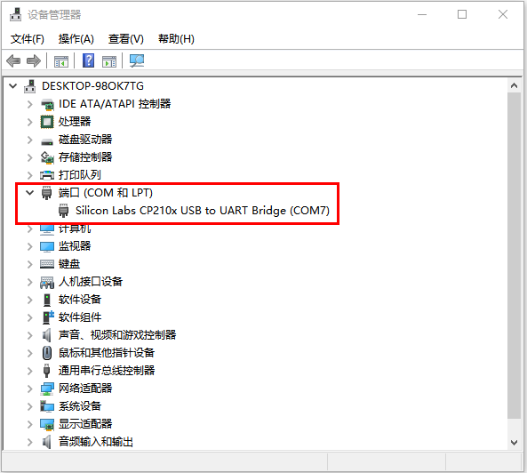
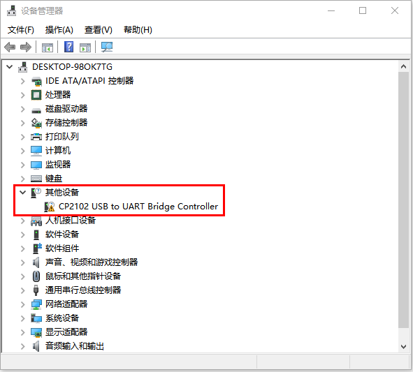
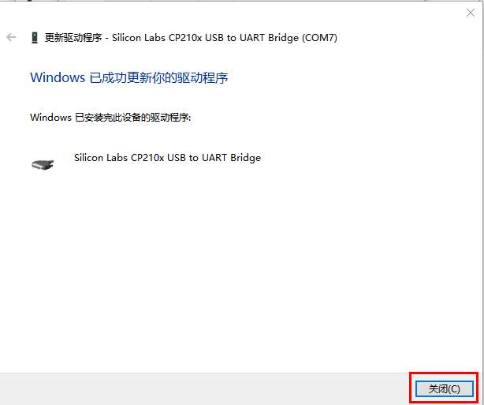
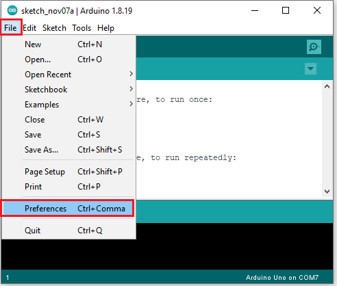
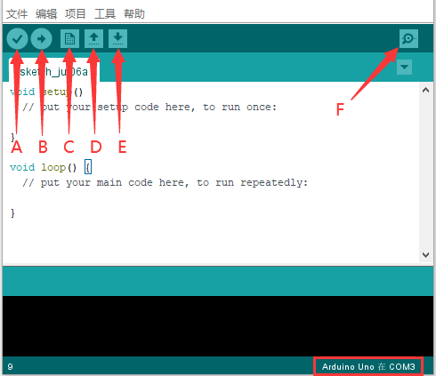
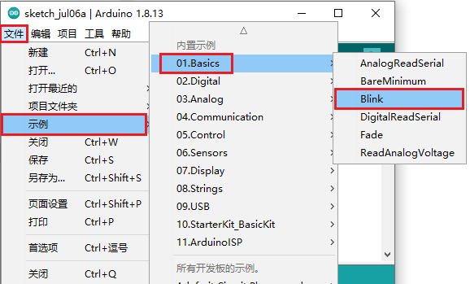
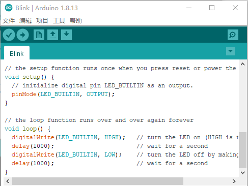
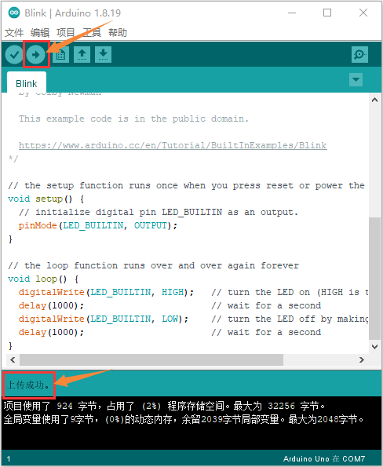
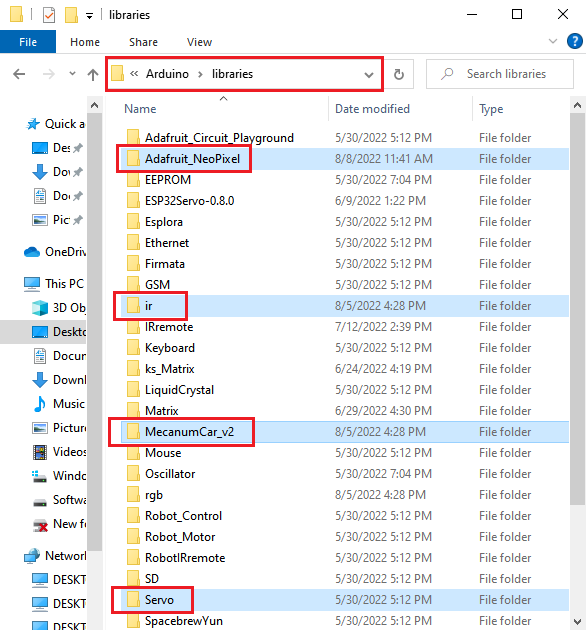
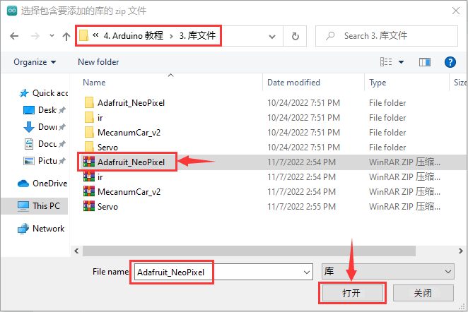

# 开发环境配置

开始于Arduino

## 1. 安装Windows驱动程序 

1.1. 安装 Arduino IDE

我们先到arduino
官方的网站<https://www.arduino.cc/>下载最新版本的arduino开发软件,进入网站之后点击界面上的SOFTWARE,选择DOWNLOADS进入下载页面，如下图：

Arduino 软件有很多版本，有windows,mac, linux系统的（如下图），而且还有过去老的版本，你只需要下载一个适合系统的版本。

这里我们以WINDOWS系统的为例给大家介绍一下下载和安装的步骤。

WINDOWS系统的也有两个版本，一个版本是安装版的，一个是下载版的不用安装，直接下载文件到电脑，解压缩就可以用了。

两个版本都可以正常使用，看你自己的喜好了。选择一个版本，然后将Arduino
开发软件下载到我们的电脑。

一般情况下，我们点击JUST DOWNLOAD就可以下载了，当然如果你愿意，你可以选择小小的赞助，以帮助伟大的ARDUINO开源事业。

1.2. 在Windows系统安装开发板驱动文件

接下来是开发板驱动的安装，这次我们安装的是Keyes Uno Plus
开发板的驱动，这个开发板的USB转串口芯片是CP2102。在ARDUINO
开发软件1.8以上的版本里就已经包含了这个芯片的驱动程序，这样我们使用起来会非常方便。（如果你的Arduino开发软件不是1.8以上版本的，就需要到

[https://www.silabs.com/products/development-tools/software/usb-to-uart-bridge-vcp-drivers](https://www.silabs.com/products/development-tools/software/usb-to-uart-bridge-vcp-drivers)

这个地址去下载CP2102的芯片驱动）一般插上USB，电脑就会识别到硬件，WINDOWS就会自动安装CP2102的驱动。

如果驱动安装失败，则需要手动安装驱动。请打开计算机的设备管理器，右键单击“计算机”-----单击“属性”-----单击“设备管理器”。在端口
(COM &LPT)或Other devices下，黄色感叹号表示CP2102驱动程序安装失败。

显示CP2102的驱动没有安装成功，有一个黄色的感叹号。先双击，再单击“更新驱动程序(U)...”更新驱动。

点击“浏览我的电脑一查找驱动程序(R)”，找到我们安装或者下载的Arduino软件.

在Arduino文件夹（）里面有一个drivers文件夹，打开drivers文件夹就可以看到CP210X系列芯片的驱动。

点击“浏览(R)...”,选中CP210X系列芯片的驱动，点击“下一页”。

过一会儿，驱动安装成功。点击“关闭”即可。

这个时候再打开计算机设备管理器，就可以看到CP2102驱动程序已经安装成功了，刚刚那个黄色的感叹号不见了。

1.3. IDE设置和工具栏介绍

装好了开发板的驱动，我们下面要了解Arduino开发软件的使用了，首先我们点击电脑桌面上的图标，打开Arduino IDE，进行语言切换。单击“File”→“Preferences”，在 Preferences
页面中将语言“English”切换成“简体中文”，点击“OK”就可以了。

关闭Arduino IDE再重启，这样，Arduino IDE页面中的语言就切换好了。

为了避免在将程序上载到板上时出现任何错误，必须选择正确的Arduino板名称，该名称与连接到计算机的电路板相匹配。转到“工具”→“开发板：”，然后选择你的板。

然后再选择正确的COM口（安装驱动成功后可看到对应COM口）。

我们的程序上传到板之前，我们必须演示Arduino IDE工具栏中出现的每个符号的功能。

A - 用于检查是否存在任何编译错误。

B - 用于将程序上传到Arduino板。

C - 用于创建新草图的快捷方式。

D - 用于直接打开示例草图之一。

E - 用于保存草图。

F - 用于从板接收串行数据并将串行数据发送到板的串行监视器。

1.4. 启动你的第一个程序

上面我们学习了怎么下载软件和安装开发板的驱动，那下面我们就开始正式开始第一个程序，打开文件选择例子，选择第一个文件BASIC里面的BLINK程序

当草图窗口打开时，您可以在窗口中看到整个草图。

按照前面方法设置板和COM口，IDE右下角显示对应板和COM口。

点击图标开始编译程序，检查错误，检查无误。

点击图标开始上传程序，上传成功。

程序上传成功，板载的LED灯亮一秒钟，灭一秒钟，恭喜你的第一个程序完成了！

2.在MAC 系统上安装驱动

### 2.1下载安装arduino软件： 

### 2.2如何安装CP2102驱动程序： 

（注意：如果已经安装了驱动程序，则不需要再安装驱动；如果没有，则需要进行以下操作）

（1）用USB线将Keyes Uno PLUS控制板连接到你的MacOS系统电脑上，并打开Arduino IDE。

点击工具，选择主板:“Arduino Uno”，串口为
/dev/cu.usbserial-0001。

点击上传代码，如果上传成功，如下图所示，会显示上传成功。

注意：如果上传代码程序成功了，则不需要再安装驱动，可以跳过下面安装驱动的步骤；如果没有上传成功，则需要跟着下面的步骤安装CP2102驱动。执行下面（2）~（13）步。

（2）CP2102驱动下载链接：

<https://www.silabs.com/products/development-tools/software/usb-to-uart-bridge-vcp-drivers>

（3）点击下载MacOS 版本。

（4）解压下载好的压缩包。

（5）打开文件夹，双击SiLabsUSBDriverDisk.dmg文件。

可以看到以下文件。

（6）双击 Install CP210x VCP Driver 等待界面。

（7）点击Continue

（8）先点击Agree ，然后点击Continue

（9）继续点击Continue ，然后输入你的用户密码

（10）回到安装界面，根据提示等待安装

（11）安装成功

（12）打开arduinoIDE，点击工具，选择主板为Arduino Uno
，串口为/dev/cu.usbserial-0001

（13）然后再点击上传程序，就可以看到烧录成功。

3. 库文件安装

在开始课程之前我们还需要安装课程里面代码需要的Arduino库文件。

什么是arduino库文件 ?

库是代码的集合，使您可以轻松地连接到传感器、显示器、模块等。

例如，内置的LiquidCrystal库使与字符LCD显示器的通话变得容易。
Internet上有数百个其他库可供下载。 参考中列出了内置库和其中一些其他库。
要使用其他库，您需要安装它们。

如何安装库文件?

在这里，我们将为您介绍最简单的添加库的方法。  
第一步： 下载Arduino IDE成功后，您可以右键单击Arduino IDE的图标。
选择“打开文件所在的位置(I)”就会进入安装目录，再点击进入libraries文件夹。

第二步：
你可以看到“libraries”文件夹所在的位置，这个文件夹里面就是Arduino的库文件。

第三步：打开我们提供的资料里面的
Libraries文件夹，复制粘贴到第二步我们打开的文件夹内。复制好了之后，我们的库文件就安装成功了，如下所示：

< 

如果下载的是Arduino IDE 2.0版本，则Arduino IDE 2.0版本的库文件添加方式如下：

1.  现将提供的库文件都压缩成
    .ZIP格式，（这里以文件“Adafruit_NeoPixel”为演示过程，其他库文件的压缩方法是一样的。）

我们也提供了库文件的压缩包，也可以直接添加。

（2）在Arduino IDE2.0版本界面点击“项目”→“包含库”→“添加.ZIP库...”。

（3）点击“打开”添加即可：（注意：库文件需要压缩为.ZIP格式；这里以“Adafruit_GFX_Library.ZIP”为演示，其他库文件的添加方法是一样的。）

