# Mixly 教程

## Mixly软件

### Mixly 软件下载、安装及驱动安装说明书

下载（以下链接中提供了两种安装包）：

Mac系统和 Win 7/8/10系统的Mixly软件

下载链接：<https://pan.baidu.com/s/1p_CxQi6sVekyhBpIQ0WSCQ> 

提取码：keye

（注意：在文件夹中也提供了Mixly_WIN.7Z和Mixly_Mac安装压缩包）

#### 1.Mixly_WIN安装方法： 

（1）下载 Mixly_WIN.7Z 安装压缩包

（2）将压缩包解压到某个硬盘的根目录，如D:Mixly。

注意：目录中不要包括中文、空格、括号等特殊字符。

解压后，显示如下图。

（3）首次安装 Mixly 需要运行 一件更新.bat 文件，运行后会提示 Mixly
软件安装&升级助手的使用方法。

根据提示，输入y 或者 n，来安装您所需要的模块。

如只需要 Mixly 的基础功能，就输入 n。

或者，如需要安装Mixly 高级功能，就输入
y。

接下来一件更新助手将会根据您的选择安装所需模块。

安装完成后，会显示“请按任意键继续..”。说明安装完成。

安装完成后就可以看到完整的 Mixly 软件目录，运行 Mixly.exe 即可开启软件。

（4）Mixly 软件的更新

Mixly 软件的更新与安装方法相同，运行一件更新.bat
文件，选择需要安装的模块即可，一件更新助手会自动下载最新版文件。

（5）Mixly 软件相关使用教程

[https://www.bilibili.com/video/bv1BE411A7hX](https://www.bilibili.com/video/bv1BE411A7hX)

[https://www.bilibili.com/video/BV1jE411A78S](https://www.bilibili.com/video/BV1jE411A78S)

[https://www.bilibili.com/video/BV1YE411A7FT](https://www.bilibili.com/video/BV1YE411A7FT)

[https://wiki.mixly.org/](https://wiki.mixly.org/)

#### 2 .在Windows系统上安装驱动： 

在使用Keyes Uno Plus控制板之前，必须安装它的驱动程序，否则它将无法与计算机通信。与Arduino UNO R3的USB系列芯片(ATMEGA8U2)不同，Keyes Uno Plus控制板采用了USB系列芯片CP2102芯片和USB C型接口。在Mixly1.2软件中的Arduino IDE
是1.8.0版本及以上版本，1.8.0版本及以上版本中包含了CP2102芯片的驱动程序。通常，您将控制板通过USB线连接到计算机，电脑就会识别到硬件，WINDOWS系统就会自动安装CP2102的驱动。过一会儿，CP2102
驱动就会安装成功。

如果驱动安装失败，则需要手动安装驱动。请打开计算机的设备管理器，右键单击“计算机”-----单击“属性”-----单击“设备管理器”。在端口
(COM &LPT)或其他设备。黄色感叹号表示CP2102驱动程序安装失败。

显示CP2102的驱动没有安装成功，有一个黄色的感叹号。我们可以双击硬件更新驱动

点击“浏览我的电脑以查找驱动程序”，找到我们安装或者下载的Mixly1.2软件.

在Mixly1.2软件文件夹里面有一个drivers文件夹，打开drivers文件夹就可以看到CP210X系列芯片的驱动。

点击“浏览（R）...”,选中CP210X系列芯片的驱动，点击“下一步”。

过一会儿，驱动安装成功。

这个时候再打开计算机设备管理器，你就可以看到CP2102的驱动程序已经安装成功了，刚刚的那个黄色的感叹号不见了。

#### 3. Mixly_Mac安装方法： 

（1）MAC必须安装JDK8，而且只能安装JDK8，高版本JAVA不行，可以直接使用云盘目录自带的JDK。

（2）需要安装相应的开源硬件驱动，常用的就是云盘自带的cp210x驱动(<https://www.silabs.com/products/development-tools/software/usb-to-uart-bridge-vcp-drivers>)和ch34x驱动(<https://sparks.gogo.co.nz/ch340.html>)

（3）需要自行安装 python3，步骤如下：

从python.org下载python3并安装

以下命令行操作

sudo xcode-select --install

ruby -e "$(curl -fsSL https://raw.githubusercontent.com/Homebrew/install/master/install)"

brew install portaudio

pip3 install pyaudio

brew install opencv

pip3 install opencv-python

pip3 install baidu-aip matplotlib pandas numpy

以上安装需要一个小时以上的时间

（4）解压Mixy后双击Mixly.jar即可使用

4.
在MAC系统上安装驱动：

在使用Keyes Uno Plus控制板之前，必须安装它的驱动程序，否则它将无法与MAC
系统设备通信。与Arduino UNO R3的USB系列芯片(ATMEGA8U2)不同，Keyes Uno Plus控制板采用了USB系列芯片CP2102芯片和USB C型接口。通常，您将控制板通过USB线连接到MAC 系统设备，MAC
系统设备就会识别到硬件，MAC
系统就会自动安装CP2102的驱动。过一会儿，CP2102 驱动就会安装成功。

注意：如果上传代码程序成功了，则不需要再安装驱动，可以跳过下面安装驱动的步骤；如果没有上传成功，则需要跟着下面的步骤安装CP2102驱动。执行下面（1）~（12）步。

（1）CP2102驱动下载链接：

<https://www.silabs.com/products/development-tools/software/usb-to-uart-bridge-vcp-drivers>

（2）点击下载MacOS 版本。

（3）解压下载好的压缩包。

（4）打开文件夹，双击SiLabsUSBDriverDisk.dmg文件。

可以看到以下文件。

（5）双击 Install CP210x VCP Driver 等待界面。

（6）点击Continue

（7）先点击Agree ，然后点击Continue

（8）继续点击Continue ，然后输入你的用户密码

（9）回到安装界面，根据提示等待安装

（10）安装成功

### Mixly软件的使用方法：

#### 软件安装：

目前Mixly最新版本为1.2，支持Windows 7/8/10、MacOS。

下载：

Mac系统和 Win 7/8/10系统的Mixly软件

下载链接：<https://pan.baidu.com/s/1p_CxQi6sVekyhBpIQ0WSCQ> 

提取码：keye

（注意：在文件夹中也提供了Mixly_WIN.7Z和Mixly_Mac安装压缩包）

安装软件： 

下载 Mixly_WIN.7Z
安装压缩包

（2）将压缩包解压到某个硬盘的根目录，如D:Mixly。

注意：目录中不要包括中文、空格、括号等特殊字符。

解压后，显示如下图。

（3）首次安装 Mixly 需要运行 一件更新.bat 文件，运行后会提示 Mixly
软件安装&升级助手的使用方法。

根据提示，输入y 或者 n，来安装您所需要的模块。

如只需要 Mixly 的基础功能，就输入 n。

或者，如需要安装Mixly 高级功能，就输入 y。

接下来一件更新助手将会根据您的选择安装所需模块。

安装完成后，会显示“请按任意键继续..”。说明安装完成。

安装完成后就可以看到完整的 Mixly 软件目录，运行 Mixly.exe 即可开启软件。

（4）Mixly 软件的更新

Mixly 软件的更新与安装方法相同，运行一件更新.bat
文件，选择需要安装的模块即可，一件更新助手会自动下载最新版文件。

（5）双击图标打开软件；您将看到如下所示的弹出界面。

#### 界面介绍： 

Mixly 1.2软件主要分成图形化程序模块区、图形化代码编辑区、代码（C语言）区、系统功能区、消息提示区

图形化程序选择区

图形化程序选择区中包含了各类图形化程序，每一个类别中都包含多个图形化。通过将这些图形块拖动到图形化程序编辑区就可以完成编程。

程序编写区

程序编写：

我们通常把能完成一定功能的代码块拖动到该区域处进行连接。

程序删除：

- 将不需要的代码拖到右下方的垃圾桶。

- 将不用的代码拖到最左侧的图形化程序选择区。

- 选中不用的代码后点击键盘Delete或者Backspace键。

程序缩放（在右下角垃圾桶上方有缩放按钮）：

第一个按钮是图形块大小正常化并居中。

第二个是放大图形块。

第三个是缩小图形块。

当然也可以直接使用鼠标滚轮进行缩放。

程序复制：

在图形方块上右击，选择复制，会产生一个一样的指令方块，但该方式只能复制一个指令方块。

先用鼠标拖住多个指令方块，再按下Ctrl+C，Ctrl+V可以复制多个指令方块。

切换语言：

在该区域的右上角，还可以选取语言的种类。截止目前为止，Mixly1.2可支持英语、西班牙语、简体中文及繁体中文。

撤销及重做：

在选择语言的左边还有两个箭头，分别是撤销（undo，Ctrl +
Z）及重做（redo，Ctrl + Y）。

撤销功能是当我们编写代码时误删代码后，便可点击左箭头或直接按Ctrl +
Z来恢复误删代码。

而重做则是和Ctrl +
Z相反，它是恢复上一步操作，该功能也可通过点击右箭头或直接键入Ctrl + Y
来实现。

帮助文档：

在选择语言的左侧?图标是帮助文档的链接，点击该图标可以打开帮助文档。

系统功能区：

系统功能区主要执行的功能有新建、打开、保存、另存为、导出库、导入库、管理库、编译、上传、选择主控板型号及端口、串口监视器及软件界面放大缩小等功能。

一般功能：

Mixly1.0的一般功能包括新建、打开、保存、另存为，其中代码保存或另存为的格式为.mix。

当用户需要打开已保存的文件时，可以先打开Mixly1.0软件，再点击“打开”，找到\*.mix文件。也可以直接双击\*.mix文件打开或拖动\*.mix文件到Mixly1.0软件中的程序编写区打开。

编译&上传：

当用户编写完代码后，如果想要检查代码逻辑是否有误，可点击编译。

如果显示“编译失败”，则需要根据提示检查自己的代码，如显示“编译成功”则证明代码逻辑上无误，可上传。

如果出现“上传失败”，大多数情况插拔USB线即可解决该问题。

如果出现“上传成功”，则证明代码已上传至板子上。当然，如果用户对于代码逻辑信心十足，可直接点击上传按钮。

控制板&端口：

当用户点击主控板下拉三角时即可看到有众多主控板型号可供选择。用户需按照当前手中主控板型号予以选择。

选择好控制板型号后，还需要选择该控制板对应的端口号，端口号是电脑与控制板通信的通道。

串口监视器：

串口监视器与模块选择区的通信模块中的串口通信指令一起使用。
可以用于输出变量、传感器数值等。

界面缩放：

在串口监视器右侧有一个左右可拉的按钮，该按钮可放大或缩小Mixly1.0整个界面的大小。

与程序构建区内的放大、缩小不同（该按钮只可放大或缩小程序构建区代码的大小），拖动缩放界面可放大除消息提示区外所有区域的大小。

尝试你的第一个项目---LED闪烁 

接下来，我们将以Arduino Uno Plus控制板为例：

（1）连接指南:

通过USB数据线将控制板连接到电脑上。

（2）打开一下程序代码：

1.  单击“打开”按钮打开示例代码程序“LED闪烁”，按照以下步骤操作。

实际上，您也可以双击或直接拖动程序文件打开“LED闪烁”(单击“Mixly_WIN解压缩包”-\>单击“sample”-\>单击“Arduino”-\>单击“AVR”-\>“01输入-输出”-\>拖动“LED闪烁”文件到代码编辑区)，如下所示。这里你还可以选择你所需的语言，点击“简体中文”后面的下拉三角形选择你需要的语言。

2.  接着点击“编译”对代码进行编译，如果代码编译成功，说明代码没问题，可以进行下一步操作。

c\.
用USB数据线连接好控制板和你的电脑，选择合适的控制板类型和COM端口类型(如果你不确定COM端口，你可以再次右键单击“计算机”-\>以获取“属性”-\>左键单击“属性”-\>左键单击“设备管理器”，在“其他设备”或“端口（COM和LPT）”下，可以看到COM端口类型，也就是正确的COM端口)。再点击“上传”把代码上传到你的控制板上。（这里以端口COM3为例）

检查Arduino代码：

您可以单击查看右侧的Arduino代码。

或者你点击“代码”也可以查看对应的Arduino代码。

你也可以自己编写程序代码：

1.  点击“输入/输出”模块，找到并拖出“数字输出管脚0设为高”方块到代码编辑区。

2.  由于主控板上的LED是接在13引脚上，所以将管脚0改成13，需要给LED高电平LED才会点亮，则需要设置“高”。

3.  点击“控制”模块，找到并拖出“延时毫秒1000”指令方块拖到代码编辑区，并放在“数字输出管脚0设为高”方块下面，可以修改延时时间，这里保持延时1000毫秒不变。

4.  将代码块复制一遍，将“高”改为“低”，其他的不变。

5.  完整的代码程序完成后，接下来的编译、板型选择、端口选择和代码上传等操作就和前面是一样。

6.  好了，如果你要删除代码编辑区的某个代码块，可以右键点击此代码块，选择点击“删除2块”；也可以把此代码块直接移入垃圾箱中删除。

### Keyes 麦轮小车库文件的导入方法：

（以下是以Windows系统为例，MacOS系统可以参考）

（注意：如果Keyes
麦轮小车库文件已经导入了，则不需要再次导入；如果没有，则需要进行以下操作）

（1）从Mixly项目开始，第一步你应该导入相应的库文件。

2.  我们提供的Keyes 麦轮小车库文件在如下路径：

3.  打开Keyes 麦轮小车库文件文件夹，复制Keyes     麦轮小车库文件中单个的库文件“MecanumCar_v2”（其路径：...\6.     Mixly 教程\1. 开发环境配置\2. Mixly库文件\Keyes     麦轮小车\Keyes）粘贴到Mixly软件中（其路径：...\Mixly_WIN\arduino\portable\sketchbook\libraries）。

特别注意：这一步一定要做，否则在下面步骤中导入Keyes麦轮小车库文件到Mixly软件中会缺少单个库文件“MecanumCar_v2”。

4.  打开Mixly1.2软件，在Mixly窗口中，先点击“导入库”，然后点击“本地导入”，最后再选择导入库文件Keyes麦轮小车。你也可以双击以打开库文件Keyes麦轮小车。这样，Keyes麦轮小车库文件就添加完成了。

另外，如果使用完库文件后，不再需要该库文件，也是可以删除该库文件的，如下操作示意图：

## 项目课程

### 第一课 七彩灯  

#### 1.1 项目介绍  

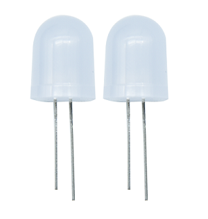  

在本课程中，我们将完成经典的“Arduino点亮LED”项目，但这里使用的是七彩LED，而不是普通的单色LED。七彩LED采用七彩自动闪烁LED（外观为白色，显示七种颜色）元件，可以制作出迷人的灯光效果。该模块与普通LED驱动相同，当输入高电平时，它会自动闪烁七种颜色，而输入低电平时将停止闪烁。  

我们已经将七彩LED集成到电机驱动底板上，在第一个项目中，我们将使用一个基本的测试代码控制该七彩LED，让其闪烁3秒，然后熄灭1秒。你也可以根据需要改变代码中LED灯亮灭的时间，以实现不同的闪烁时长效果。LED模块信号端S为高电平时，七彩LED开始自动闪烁，S为低电平时，七彩LED将熄灭。  

#### 1.2 模块相关资料  

  

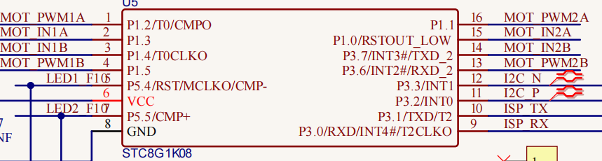  

两个七彩灯分别通过三极管控制，信号端分别接到了P5.4和P5.5。因此，我们只需控制这两个引脚输出高低电平即可控制两个七彩灯的开关。  

#### 1.3 实验代码  

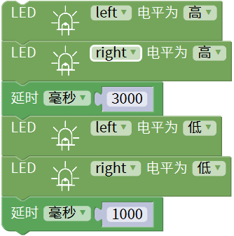  

#### 1.4 实验结果  

编译并上传代码完成后，将拨码开关拨到ON端上电。我们将会看到底板上的两个七彩LED闪烁3秒，然后熄灭1秒，随后再次闪烁3秒再熄灭，如此反复循环。  

### 第二课 WS2812 RGB灯  

#### 1.1 项目介绍  

  

在第一个项目中，我们详细介绍了如何通过代码控制七彩LED的闪烁。在本节课中，我们将使用WS2812灯珠来显示真正的多彩灯。理论上，我们可以通过编程实现任意颜色的显示。  

WS2812 RGB灯的驱动原理与之前学习的七彩LED有所不同，但它只需要一个引脚进行控制。这是一款集控制电路与发光电路于一体的智能外控LED光源。每个LED的外形与5050 LED灯珠相同，每个元件即为一个像素点。我们这一电机驱动板上有四个灯珠，即四个像素。接下来我们将学习如何控制它们以显示任意颜色。  

#### 1.2 模块相关资料  

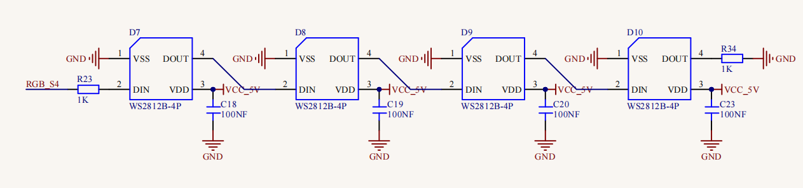  

这四个像素点灯珠是串联连接的，无论数量多少，我们都可以通过一个引脚（此处接D10）控制任意一个灯，并使其显示任意颜色。像素点内部包含智能数字接口、数据锁存、信号整形放大驱动电路，此外还包含高精度的内部振荡器和高压可编程恒定电流控制部分，这些都有效保证了像素点光的颜色高度一致。数据协议采用单线归零码的通讯方式，像素点在上电复位后，从控制器传输过来的数据首先被第一个像素点提取，并送入内部数据锁存器。该 2812 RGB 通讯协议及驱动已在底层封装，我们可以直接调用函数接口使用。  

#### 1.3 实验代码  

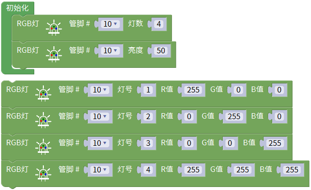  

#### 1.4 实验结果  

将拨码开关拨到ON端上电，上传代码完成后，我们可以看到底板的四个2812灯珠分别显示红、绿、蓝、白四种颜色。  

#### 1.5 项目拓展：流水彩灯  

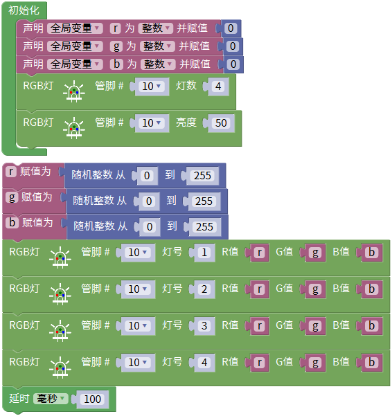  

上传代码成功后，我们将看到四个灯珠以随机颜色显示流水灯效果。  

### 第三课 伺服舵机  

#### 1.1 项目介绍  

  

对于那些DIY智能汽车，往往需要实现自动避障功能。在DIY过程中，我们需要一个伺服舵机来控制超声波模块左右旋转，从而检测汽车与障碍物的距离并控制汽车避开障碍物。  

如果使用普通的微控制器来控制伺服的旋转，需要设置一定频率和一定宽度的脉冲来控制伺服的角度。但如果使用Arduino来控制伺服角度，只需在开发环境中设置舵机的连接引脚，并设定控制角度即可。开发环境会自动设置相应的脉冲以控制伺服旋转。   

在本项目中，您将学习如何控制伺服舵机在0°和180°之间来回旋转。  

#### 1.2 模块相关资料  

  

- **角度范围**：0°~180°（也有0°~360°舵机，0°~90°舵机）  
- **驱动电压**：3.3V或5V  
- **引脚一般为三根线**：  
- **GND**：接地引脚，棕色  
- **VCC**：连接到+5V（3.3V）电源的引脚，红色  
- **S**：信号端的引脚，PWM信号控制，橙色（我们这里接到了D9）  

##### 控制原理  

舵机的转动角度是通过调节PWM（脉冲宽度调制）信号的占空比来实现的。标准PWM信号的周期固定为20ms（50Hz），理论上脉宽应在1ms到2ms之间。  

  

不过实际脉宽可以在0.5ms到2.5ms之间变化，脉宽与舵机的转角（0°～180°）相对应。需要注意的是，由于舵机品牌的不同，相同信号下不同品牌的舵机旋转的角度也会有所不同。  

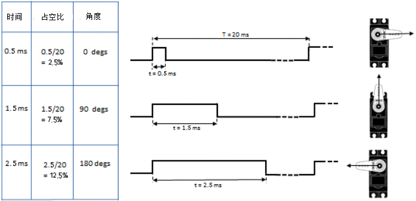  

通过实测，舵机的脉冲范围为0.65ms~2.5ms。180度舵机对应的控制关系如下：  

| 高电平时间  | 舵机角度 | 基准信号周期时间（20ms）                    |  
|--------------|-----------|----------------------------------------------|  
| 0.65ms       | 0度      | 0.65ms高电平 + 19.35ms低电平                |  
| 1.5ms        | 90度     | 1.5ms高电平 + 18.5ms低电平                 |  
| 2.5ms        | 180度    | 2.5ms高电平 + 17.5ms低电平                 |  

#### 1.3 实验代码  

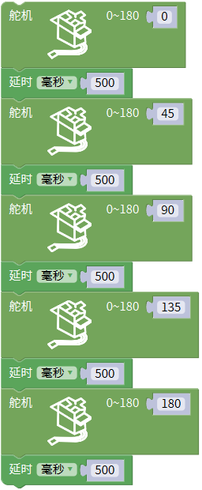  

#### 1.4 实验结果  

编译并上传代码完成后，将拨码开关拨到ON端上电，您将看到舵机在0度和180度之间来回转动。  

### 第四课 直流减速电机  

#### 1.1 项目介绍  

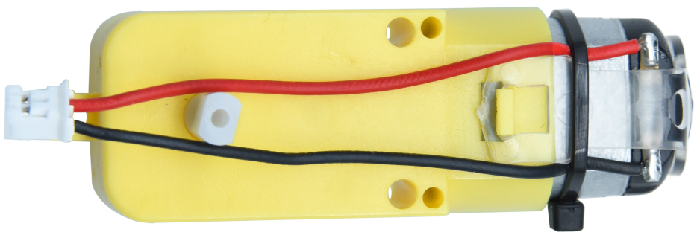  

要让小车跑起来，必须配备电机并搭配车轮。我们这个套件上配有4个直流减速电机，即[齿轮减速电机](https://baike.baidu.com/item/%E9%BD%BF%E8%BD%AE%E5%87%8F%E9%80%9F%E7%94%B5%E6%9C%BA/3249233)，它是在普通[直流电机](https://baike.baidu.com/item/%E7%9B%B4%E6%B5%81%E7%94%B5%E6%9C%BA/2404223)的基础上，加上了配套的齿轮减速箱。齿轮减速箱的作用是提供较低的转速和较大的力矩。不同的[减速比](https://baike.baidu.com/item/%E5%87%8F%E9%80%9F%E6%AF%94/5341327)可以提供不同的转速和力矩，从而提升直流电机在自动化行业中的使用率。  

减速电机是[减速机](https://baike.baidu.com/item/%E5%87%8F%E9%80%9F%E6%9C%BA/873618)与电机（马达）的集成体，这种集成体通常也可称为[齿轮马达](https://baike.baidu.com/item/%E9%BD%BF%E8%BD%AE%E9%A9%AC%E8%BE%BE/7911602)或[齿轮电机](https://baike.baidu.com/item/%E9%BD%BF%E8%BD%AE%E7%94%B5%E6%9C%BA/3377578)。减速电机在钢铁行业、机械行业等领域广泛应用。使用减速电机的优点是简化设计并节省空间。  

由于电机的驱动电流较大，直接使用IO口强制驱动电机可能导致电机不转动或烧坏单片机。因此，我们需要一个电机驱动芯片。我们的电机驱动底板已包含DRV8833电机驱动芯片，用于控制4个直流减速电机的转动方向和转动速度。下面我们来看一下电机驱动底板上两个芯片的电路原理图。  

#### 1.2 模块相关资料  

  

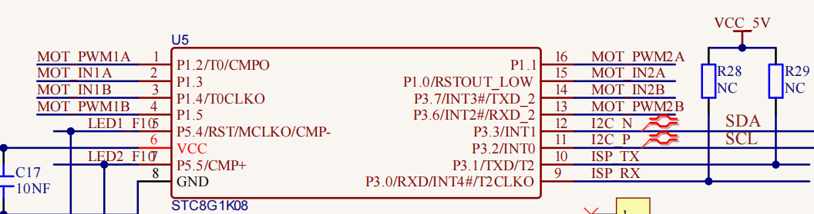  

每个芯片控制4个引脚，每两个引脚控制一个电机，这样总共使用8个引脚控制4个电机。电机驱动与STC的接线图说明了驱动电机时，通过IIC协议向STC芯片对应的寄存器地址写入脉宽值，以输出PWM信号给电机驱动芯片。我们已编写好电机驱动的库文件，使用时只需调用API函数即可使小车运动，操作非常简单。  

#### 1.3 实验代码  

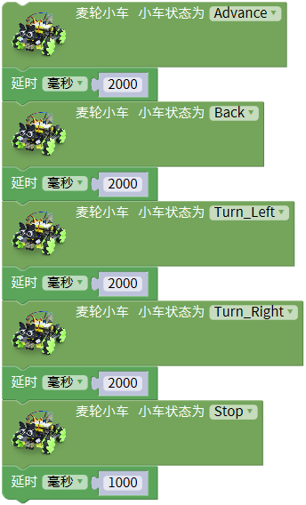  

#### 1.4 实验结果  

编译并上传代码完成后，将拨码开关拨到ON端上电。您将可以看到小车前进2秒，后退2秒，左转2秒，右转2秒，最后停止1秒，如此反复循环。  

### 第五课 循迹传感器  

#### 1.1 项目介绍  

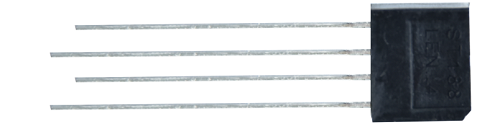  

巡线传感器实际上是红外传感器。在小车驱动底板的前面有3路巡线传感器，使用的组件是TCRT5000红外灯管。其工作原理是利用红外光对不同颜色的反射率进行感应，并将反射信号的强度转换为电流信号。  

在检测过程中，黑色在高电平时处于活动状态，而白色在低电平时处于活动状态。当检测到黑色或近距离没有检测到物体时，输出高电平；而在检测到白色或光滑易反射的物体时，输出低电平。检测的有效高度范围为0-3厘米。  

底板上方还有3个蓝色旋转电位器，通过旋转这些电位器可以调节传感器的检测灵敏度。  

#### 1.2 模块相关资料  

- **工作电压**: 3.3-5V (DC)  
- **接口**: 5PIN接口（我们接到了A0, A1, A2）  
- **输出信号**:   
  - 数字信号（模拟信号口也可以作为数字信号使用，A0相当于D13，A1相当于D14，以此类推）  
- **检测高度**: 0-3 cm  

##### 原理  

巡线传感器的工作原理是利用红外线对颜色反射率的不同，将反射信号的强弱转化为电流信号。上电时，发射二极管会发射红外光。当红外光敏二极管接收到红外光时，产生电流；随着红外光的强度变化，电流也会相应变化。当红外光强度足够弱时，输出信号接近VCC，并经过LM339D比较器输出高电平。而当光强度变强时，输出电压逐渐减小，直到输出低电平。黑色轨道因为吸光能力较强，红外信号会被吸收，导致输出高电平；而白色轨道则会将大部分红外信号反射回来，导致输出低电平。  

  

#### 1.3 实验代码  

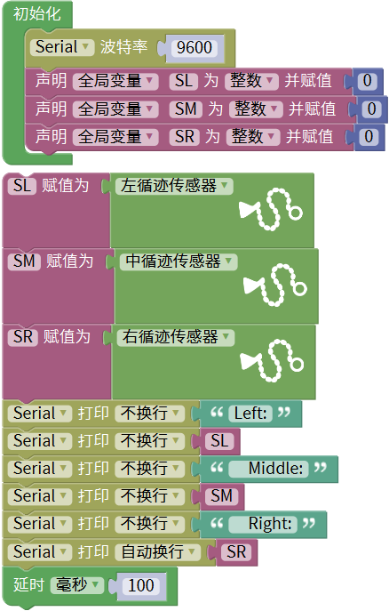  

#### 1.4 实验结果  

编译并上传代码完成后，将拨码开关拨到ON端上电，点击串口监视器，并在窗口设置波特率为9600。我们可以看到串口监视器上打印的三路巡线传感器接收到的数字信号。当我们用白纸遮挡传感器时，输出0；用黑纸或者让小车悬空时，输出1：  

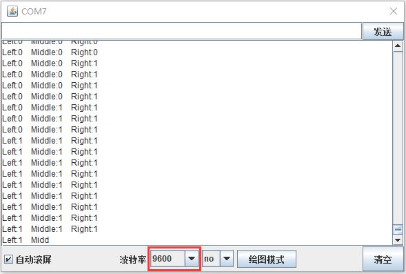  

### 第六课 循迹智能车  

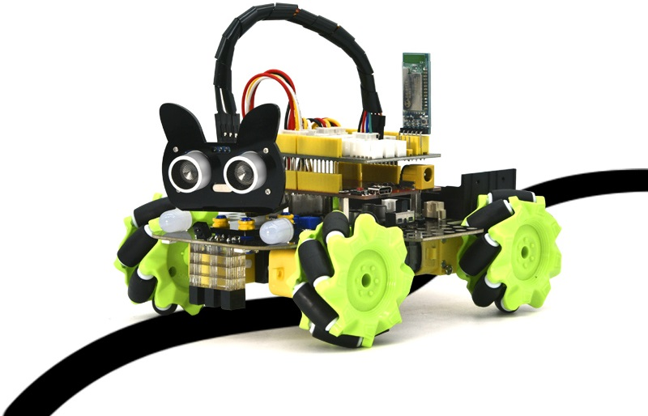  

#### 1.1 项目介绍  

在前面的课程中，我们学习了循迹传感器和电机驱动的原理和应用。接下来，我们将结合这两个基本组件，制作一款循迹小车。  

循迹，意思就是沿着轨迹行驶，这种小车通常是遵循黑色轨迹自动行驶的。其原理是利用循迹传感器对路面黑色轨迹进行检测，并将检测到的信号反馈给控制主板。控制板对采集到的信号进行分析判断，及时调整驱动电机以改变小车的转向，从而使小车能够沿着黑色轨迹自动行驶，实现循迹小车的自动寻迹目的。下面的流程图能更清晰地说明这个过程。  

#### 1.2 实验流程图  

  

#### 1.3 实验代码  

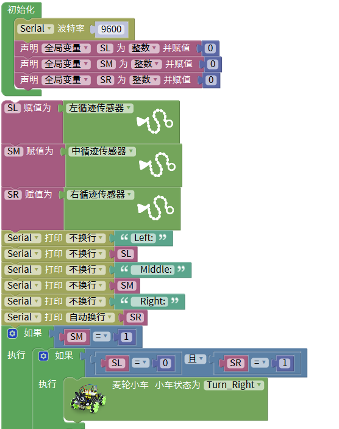  

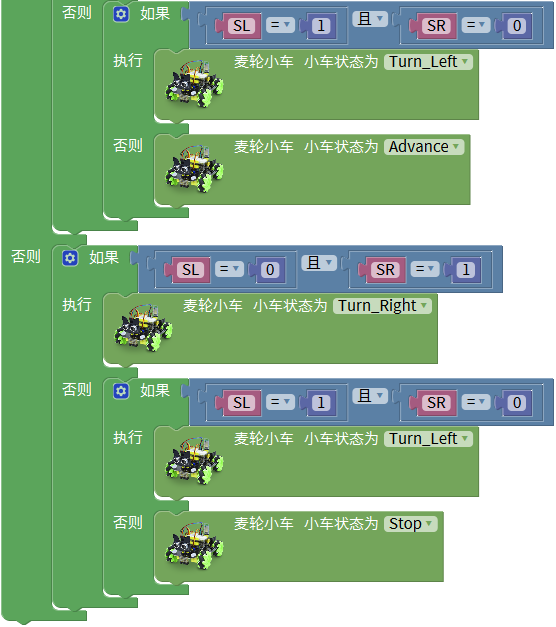  

#### 1.4 实验结果  

代码烧录完成后，将拨码开关拨到ON端上电，并将小车放置在黑色循迹图上。此时，小车将能够沿着黑线顺利行驶。  

### 第七课 超声波传感器  

#### 1.1 项目介绍  

  

HC-SR04超声波传感器像蝙蝠一样使用声纳来确定与物体的距离。它在易于使用的包装中提供了出色的非接触式范围检测，具有高精度和稳定的读数。该传感器配备了超声波发射器和接收器模块。  

HC-SR04超声波传感器广泛用于各种电子项目中，以创建障碍物检测、距离测量应用以及其他多种应用。本文介绍了如何使用Keyes UNO PLUS开发板和超声波传感器测量距离，以及如何在Arduino IDE中使用该传感器。  

#### 1.2 模块相关参数  

- **工作电压**: +5V DC  
- **静态电流**: < 2mA  
- **工作电流**: 15mA  
- **有效角度**: < 15°  
- **距离范围**: 2cm – 400 cm  
- **精度**: 0.3 cm  
- **测量角度**: 30 degree  
- **触发输入脉宽**: 10us  

原理：最常用的超声测距的方法是回声探测法，如图，超声波发射器向某一方向发射超声波，在发射时刻的同时计数器开始计时，超声波在空气中传播，途中碰到障碍物面阻挡就立即反射回来，超声波接收器收到反射回的超声波就立即停止计时。超声波也是一种声波，其声速V与温度有关。一般情况下超声波在空气中的传播速度为340m/s，根据计时器记录的时间t，就可以计算出发射点距障碍物面的距离s，即：s=340t/2：

(1)采用IO口TRIG触发测距，给至少10us的高电平信号;

(2)模块自动发送8个40khz的方波，自动检测是否有信号返回；

(3)有信号返回，通过ECHO输出一个高电平，单片机读取到高电平持续的时间就是超声波从发射到返回的时间。

  

超声波模块的电路图：  

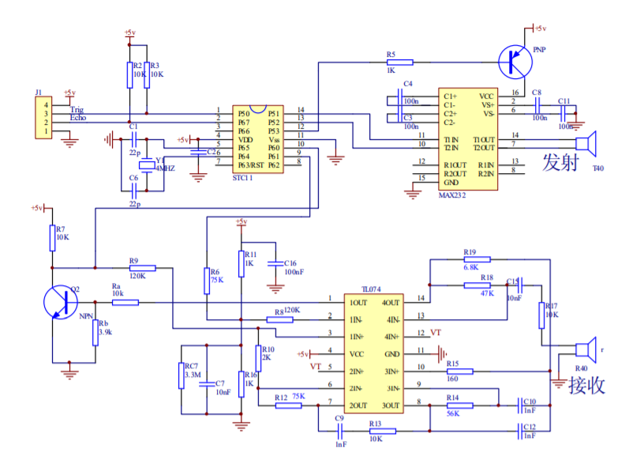  

#### 1.3 实验代码  

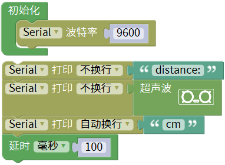  

#### 1.4 实验结果  

编译并上传代码成功后上电，点击串口监视器，并在窗口中设置波特率为9600。我们可以在串口监视器中查看超声波模块测得的距离。当移动小车前面的障碍物时，串口监视器中的距离值会发生变化，如下图所示：  

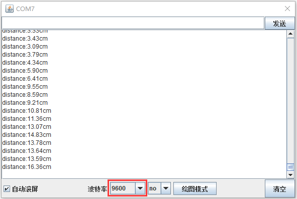  

### 第八课 超声波跟随智能车  

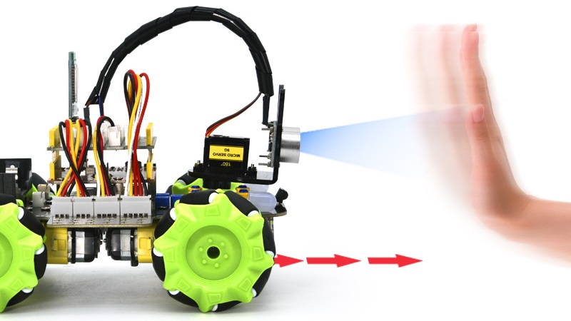  

#### 1.1 项目介绍  

在前面的课程中，我们学习了如何使用循迹传感器和电机制作一个自动巡线智能小车。这一节课，我们将使用超声波传感器和电机制作一个自动跟随智能小车。通过超声波传感器检测智能车与前方障碍物的距离，并根据此数据控制两个电机的转动，从而控制智能车的运动状态。接下来，我们来看看下面的程序流程图，能够使其工作原理更加清晰。  

#### 1.2 实验流程图  

  

#### 1.3 实验代码  

在有需要的情况下，代码中使用的距离值可以根据实际情况进行调整。  

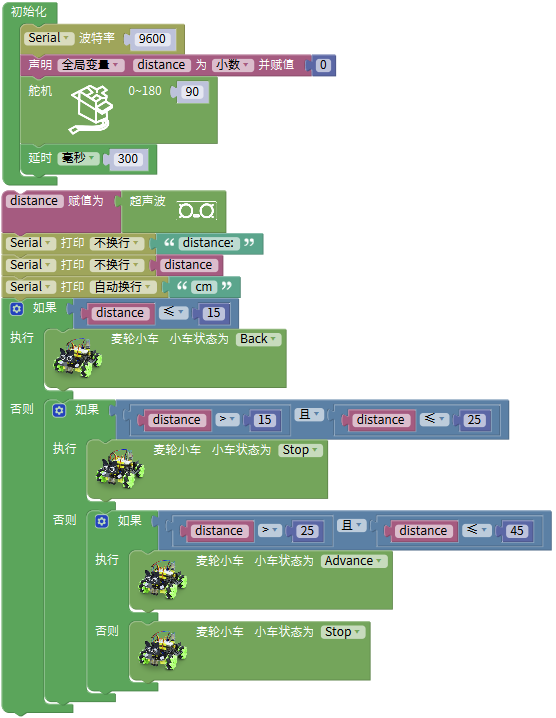  

#### 1.4 实验结果  

上传代码成功后，将拨码开关拨到ON端上电，小车将能够进行直线跟随。注意，此时小车只能直线跟随。当我们用手掌放在超声波传感器前面，慢慢向前移动时，小车也会跟着手掌移动。  

### 第九课 超声波避障智能车  

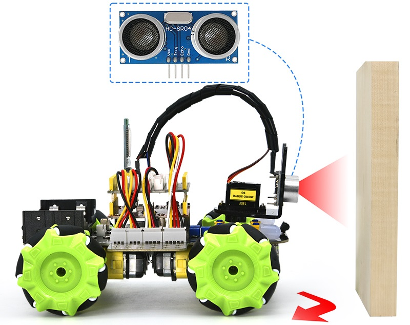  

#### 1.1 项目介绍  

在上一个项目中，我们制作了一个超声波跟随智能车。实际上，利用同样的硬件和接线方法，只需更改测试代码即可将跟随智能车改为避障智能车。超声波避障智能车通过超声波传感器检测前方障碍物的距离，然后通过舵机云台转动检测左右两侧的距离。根据这些数据控制四个电机的转动，从而实现智能车的避障功能。  

下面的程序流程图能清晰地展示这一过程：  

#### 1.2 实验流程图  

  

#### 1.3 实验代码  

在有需要的情况下，代码中使用的距离值可以根据实际情况进行调整。  

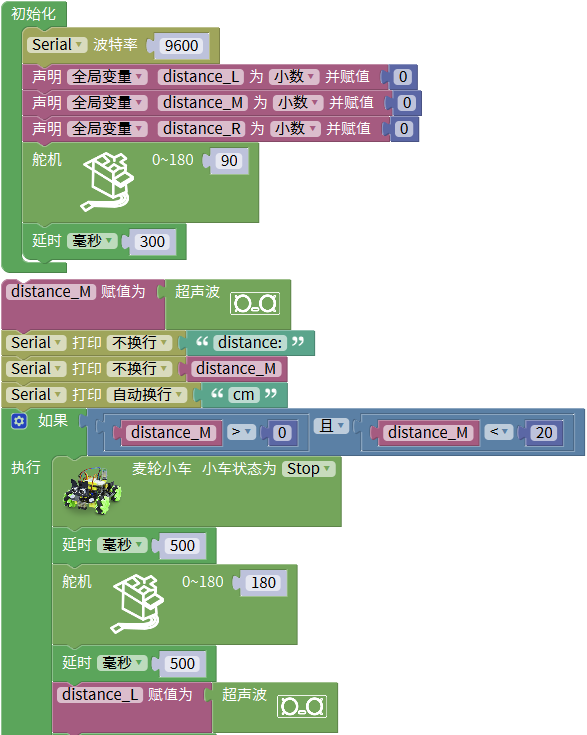  

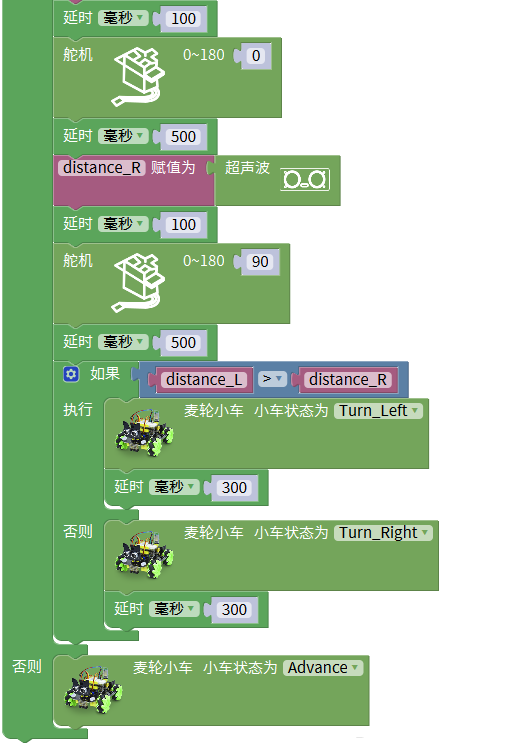  

#### 1.4 实验结果  

上传代码成功后，将拨码开关拨到ON端上电，小车将能够自动避障。注意，行驶速度不要调得太大。当小车在行驶过程中遇到前方的障碍物时，它会首先停止，然后舵机云台会转动到左侧，测量左侧障碍物的距离。接着，舵机云台再转动到右侧测量右侧障碍物的距离。根据左侧和右侧的障碍物距离，判断哪边更远，小车将向那一边转弯并继续行驶。  

### 第十课 红外接收  

#### 1.1 项目介绍  

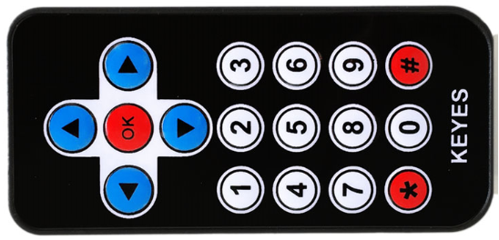  

毫无疑问，红外遥控在日常生活中随处可见，很难想象没有它的世界会变得怎样。红外遥控用于控制各种家电，如电视、音响、录像机和卫星信号接收器。红外遥控系统由红外发射和接收组成，包括一个红外遥控器、红外接收模块和一个能解码的单片机。  

在本项目中，我们使用的红外接收模块主要由红外接收头组成，它集成了接收、放大、解调等功能。内部IC已完成解调工作，能够将接收到的红外线信号输出为TTL电平信号，输出的是数字信号。该红外接收模块只有三个引脚：信号线（连接到单片机的A3引脚）、VCC和GND。与Keyes UNO PLUS开发板及其他单片机连接非常方便。本实验将红外遥控器的键值打印到串口监视器上。  

#### 1.2 模块相关资料  

红外发射的遥控器发射的38KHz红外载波信号由遥控器中的编码芯片处理。其信号格式为NEC协议，包含一段引导码、用户码、用户反码、数据码和数据反码。通过脉冲的时间间隔来判断是0还是1信号（560us低电平 + 560us高电平被认为是信号0，560us低电平 + 1680us高电平被认为是信号1）。同一遥控器的用户码是不变的，而不同的数据码用于区分遥控器按下的不同按键。当按下遥控器按键时，遥控器发送红外载波信号，红外接收器接收到信号后，程序对载波信号进行解码，从而判断按下的是哪个键。为方便接收数据，我们在小车前后都装上了红外接收头，接到了Keyes UNO PLUS开发板的A3引脚。  

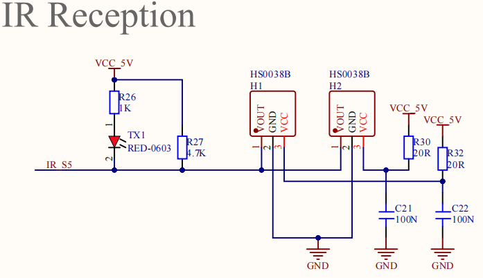  

#### 1.3 实验代码  

  

#### 1.4 实验结果  

上传代码成功后，将拨码开关拨到ON端上电，点击串口监视器，并在窗口中设置波特率为9600。然后，使用遥控器对准红外接收传感器发送信号，即可观察到相应按键的键值。如果按键时间过长，容易出现乱码。  

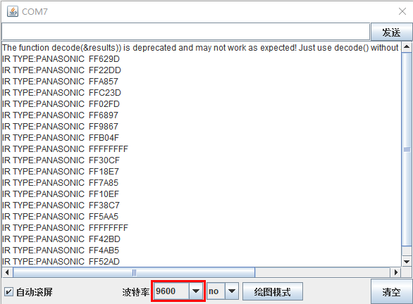  

我们通过测试得到的数值，做了一个遥控器按键值表，方便以后使用。  

  

#### 1.5 项目拓展：使用一个OK键来控制七彩灯的亮灭  

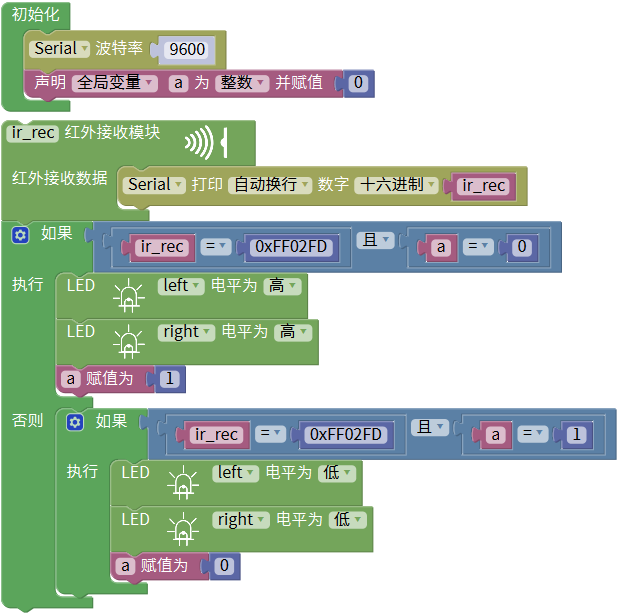  

上传代码成功后，将拨码开关拨到ON端上电。当遥控器按下OK按键时，LED灯将亮起；再按一下OK按键时，LED灯将熄灭。  

### 第十一课 红外遥控智能车  

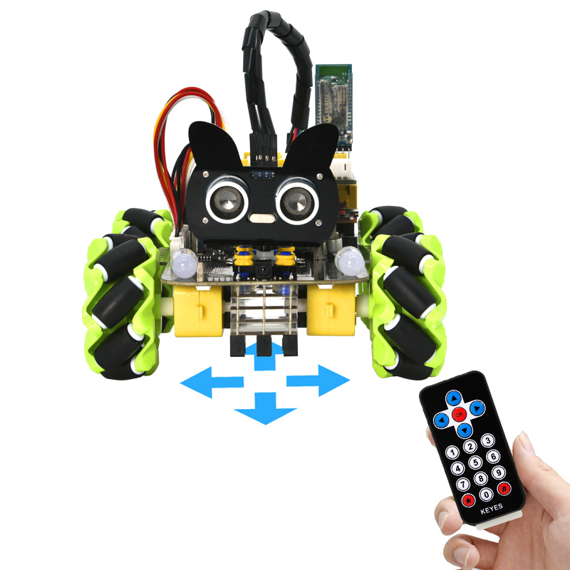  

#### 1.1 项目介绍  

在之前的实验中，我们已经测试出红外遥控器各个按键对应的键值。本项目将利用红外遥控器来控制智能车。通过代码设置按键值，我们可以让对应的按键控制智能车的运动状态。  

#### 1.2 实验流程图  

  

#### 1.3 实验代码  

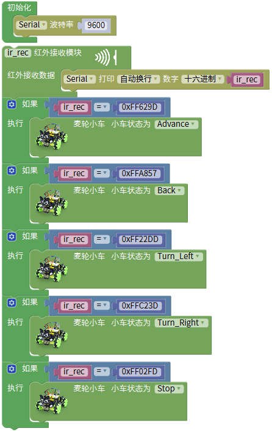  

#### 1.4 实验结果  

上传代码成功后，将拨码开关拨到ON端上电，
当我们按下遥控器上的时，
小车前进；当我们按下遥控器上的时，
小车左转；当我们按下遥控器上的时，
小车后退；当我们按下遥控器上的时，
小车右转；当我们按下遥控器上的时，小车停止。

### 第十二课 蓝牙APP控制麦轮车  

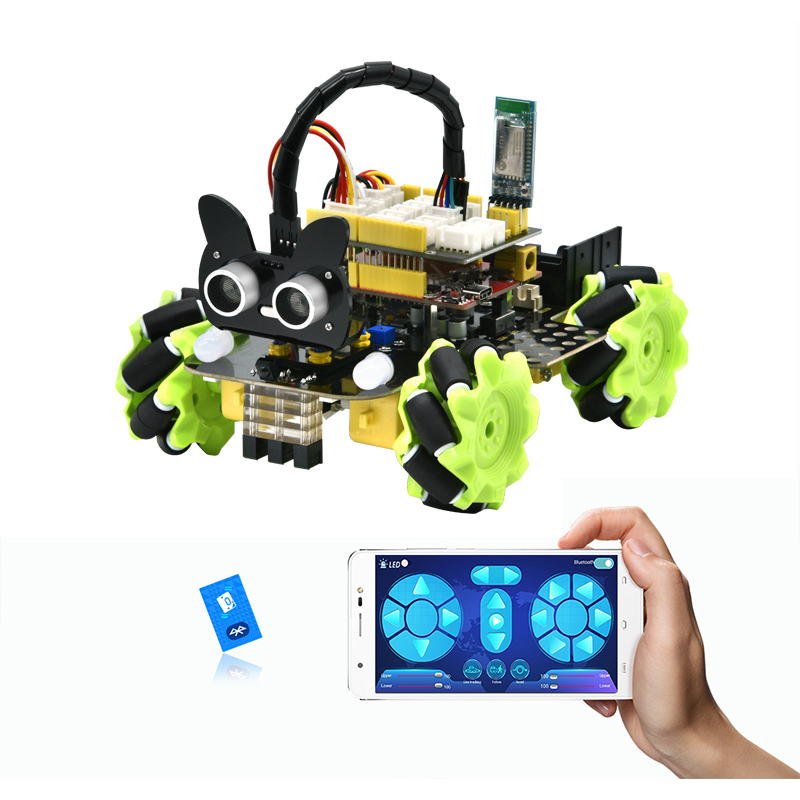  

#### 1.1 项目介绍  

  

在这个套件中，我们有一个DX-BT24 5.1蓝牙模块，该模块配置有256Kb空间，遵循V5.1 BLE蓝牙规范。它支持AT指令，用户可以根据需要更改串口波特率、设备名称等参数，使用灵活。DX-BT24具有UART接口和蓝牙串口透传的能力，具备成本低、体积小、功耗低、收发灵敏性高等优点，只需配备少许外围元件即可实现其强大功能。  

在课程中，我们将所有功能结合起来，使用BT24蓝牙模块和代码，将小车的所有功能整合。通过手机APP连接蓝牙模块，我们可以操作各种功能，简单方便。  

#### 1.2 模块相关资料  

- **蓝牙协议**: Bluetooth Specification V5.1 BLE  
- **工作频率**: 2.4GHz ISM band  
- **通信接口**: UART  
- **供电电源**: 5V/3.3V  
- **通信距离**: 40m  
- **外观尺寸**: 27(L)mm x 13(W)mm x 2(H)mm  
- **蓝牙名称**: BT24  
- **串口参数**: 9600、8数据位、1停止位、无校验、无流控  
- **工作温度**: MIN: -40℃ - MAX: +85℃  

DX-BT24模块同时支持BT5.1 BLE协议，可以直接连接具备BLE蓝牙功能的iOS设备，并支持后台程序常驻运行，主要用于短距离的数据无线传输，替代繁琐的线缆连接。  

##### 蓝牙接口说明  

  

1. STATE: 状态脚  
2. RX: 接收脚  
3. TX: 发送脚  
4. GND: 接地脚  
5. VCC: 电源脚  
6. EN: 使能脚  

##### 将蓝牙模块连接到开发板：  

| Uno   | BT24  |  
|-------|-------|  
| TX    | RX    |  
| RX    | TX    |  
| VCC   | 5V    |  
| GND   | GND   |  

#### 1.3 APP  

关于APP的具体下载安装方法及使用方法，请参考文件夹“6. APP”。  

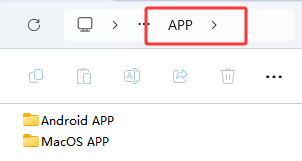  

#### 1.4 实验代码  

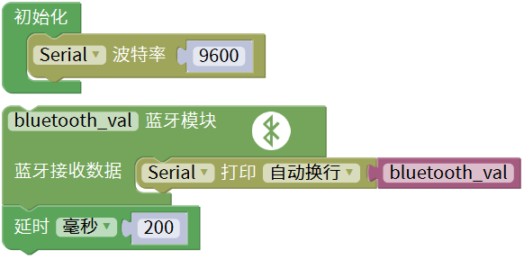  

#### 1.5 实验结果  

上传代码完成后，插上蓝牙模块，注意方向不要插反。连接蓝牙模块并打开串口监视器，对准蓝牙模块按下手机APP上的按钮，我们可以看到APP按钮对应的控制字符。  

注意：蓝牙模块的RXD、TXD、GND、VCC需分别连接到电机驱动扩展板上的TX、RX、GND、5V，而蓝牙模块的STATE和BRK两个引脚不需要接。蓝牙模块直接插在电机驱动扩展板上，上传代码之前请不要插上蓝牙模块。  

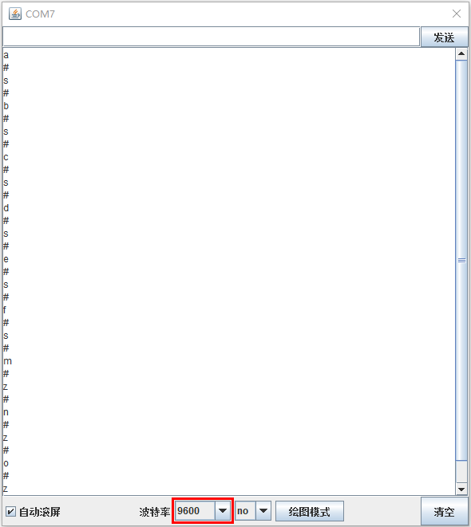  

#### 1.6 综合项目：APP控制麦克纳姆轮智能车  

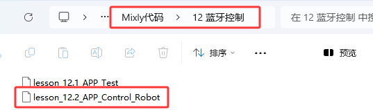

烧入代码后，将拨码开关拨到ON端上电，我们连上蓝牙BT24，就可以使用手机APP来控制我们前面所学的一系列玩法了：

1.  点击开启七彩灯，再次点击这个按钮七彩灯就会关闭。

2.  点击会进入循迹模式，当想退出该模式时，再次点击该按钮。

3.  点击会进入跟随模式、当想退出该模式时，再次点击该按钮。

4.  点击会进入避障模式，当想退出该模式时，再次点击该按钮。

5.  拉动这两个条幅回改变左边两个电机的速度，右边也是相同的操作方法。

6.  这几个按钮是用来切换底板下面4个2812灯珠颜色的，中间按钮为关闭功能。

7.  剩下其他的按钮全都是用来操控小车行驶的，跟其他按钮不同的是，这些按钮当我们按下时小车行驶，松开按钮时小车停止。

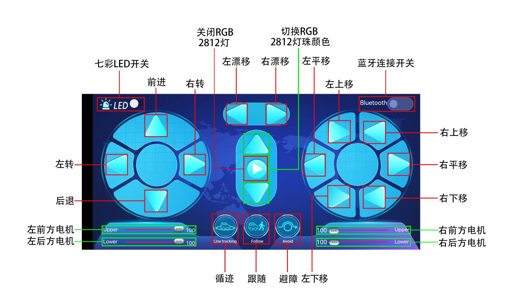

