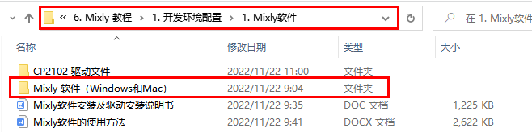
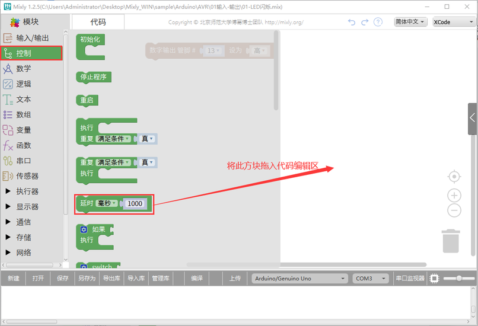
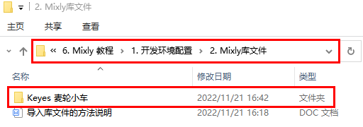

# Mixly软件

## Mixly 软件下载、安装及驱动安装说明书

下载（以下链接中提供了两种安装包）：

Mac系统和 Win 7/8/10系统的Mixly软件

下载链接：<https://pan.baidu.com/s/1p_CxQi6sVekyhBpIQ0WSCQ> 

提取码：keye

（注意：在文件夹中也提供了Mixly_WIN.7Z和Mixly_Mac安装压缩包）

### 1.Mixly_WIN安装方法： 

（1）下载 Mixly_WIN.7Z 安装压缩包

（2）将压缩包解压到某个硬盘的根目录，如D:Mixly。

注意：目录中不要包括中文、空格、括号等特殊字符。

解压后，显示如下图。

（3）首次安装 Mixly 需要运行 一件更新.bat 文件，运行后会提示 Mixly
软件安装&升级助手的使用方法。

根据提示，输入y 或者 n，来安装您所需要的模块。

如只需要 Mixly 的基础功能，就输入 n。

或者，如需要安装Mixly 高级功能，就输入
y。

接下来一件更新助手将会根据您的选择安装所需模块。

安装完成后，会显示“请按任意键继续..”。说明安装完成。

安装完成后就可以看到完整的 Mixly 软件目录，运行 Mixly.exe 即可开启软件。

（4）Mixly 软件的更新

Mixly 软件的更新与安装方法相同，运行一件更新.bat
文件，选择需要安装的模块即可，一件更新助手会自动下载最新版文件。

（5）Mixly 软件相关使用教程

[https://www.bilibili.com/video/bv1BE411A7hX](https://www.bilibili.com/video/bv1BE411A7hX)

[https://www.bilibili.com/video/BV1jE411A78S](https://www.bilibili.com/video/BV1jE411A78S)

[https://www.bilibili.com/video/BV1YE411A7FT](https://www.bilibili.com/video/BV1YE411A7FT)

[https://wiki.mixly.org/](https://wiki.mixly.org/)

### 2 .在Windows系统上安装驱动： 

在使用Keyes Uno Plus控制板之前，必须安装它的驱动程序，否则它将无法与计算机通信。与Arduino UNO R3的USB系列芯片(ATMEGA8U2)不同，Keyes Uno Plus控制板采用了USB系列芯片CP2102芯片和USB C型接口。在Mixly1.2软件中的Arduino IDE
是1.8.0版本及以上版本，1.8.0版本及以上版本中包含了CP2102芯片的驱动程序。通常，您将控制板通过USB线连接到计算机，电脑就会识别到硬件，WINDOWS系统就会自动安装CP2102的驱动。过一会儿，CP2102
驱动就会安装成功。

如果驱动安装失败，则需要手动安装驱动。请打开计算机的设备管理器，右键单击“计算机”-----单击“属性”-----单击“设备管理器”。在端口
(COM &LPT)或其他设备。黄色感叹号表示CP2102驱动程序安装失败。

显示CP2102的驱动没有安装成功，有一个黄色的感叹号。我们可以双击硬件更新驱动

点击“浏览我的电脑以查找驱动程序”，找到我们安装或者下载的Mixly1.2软件.

在Mixly1.2软件文件夹里面有一个drivers文件夹，打开drivers文件夹就可以看到CP210X系列芯片的驱动。

点击“浏览（R）...”,选中CP210X系列芯片的驱动，点击“下一步”。

过一会儿，驱动安装成功。

这个时候再打开计算机设备管理器，你就可以看到CP2102的驱动程序已经安装成功了，刚刚的那个黄色的感叹号不见了。

### 3. Mixly_Mac安装方法： 

（1）MAC必须安装JDK8，而且只能安装JDK8，高版本JAVA不行，可以直接使用云盘目录自带的JDK。

（2）需要安装相应的开源硬件驱动，常用的就是云盘自带的cp210x驱动(<https://www.silabs.com/products/development-tools/software/usb-to-uart-bridge-vcp-drivers>)和ch34x驱动(<https://sparks.gogo.co.nz/ch340.html>)

（3）需要自行安装 python3，步骤如下：

从python.org下载python3并安装

以下命令行操作

sudo xcode-select --install

ruby -e "$(curl -fsSL https://raw.githubusercontent.com/Homebrew/install/master/install)"

brew install portaudio

pip3 install pyaudio

brew install opencv

pip3 install opencv-python

pip3 install baidu-aip matplotlib pandas numpy

以上安装需要一个小时以上的时间

（4）解压Mixy后双击Mixly.jar即可使用

4.
在MAC系统上安装驱动：

在使用Keyes Uno Plus控制板之前，必须安装它的驱动程序，否则它将无法与MAC
系统设备通信。与Arduino UNO R3的USB系列芯片(ATMEGA8U2)不同，Keyes Uno Plus控制板采用了USB系列芯片CP2102芯片和USB C型接口。通常，您将控制板通过USB线连接到MAC 系统设备，MAC
系统设备就会识别到硬件，MAC
系统就会自动安装CP2102的驱动。过一会儿，CP2102 驱动就会安装成功。

注意：如果上传代码程序成功了，则不需要再安装驱动，可以跳过下面安装驱动的步骤；如果没有上传成功，则需要跟着下面的步骤安装CP2102驱动。执行下面（1）~（12）步。

（1）CP2102驱动下载链接：

<https://www.silabs.com/products/development-tools/software/usb-to-uart-bridge-vcp-drivers>

（2）点击下载MacOS 版本。

（3）解压下载好的压缩包。

（4）打开文件夹，双击SiLabsUSBDriverDisk.dmg文件。

可以看到以下文件。

（5）双击 Install CP210x VCP Driver 等待界面。

（6）点击Continue

（7）先点击Agree ，然后点击Continue

（8）继续点击Continue ，然后输入你的用户密码

（9）回到安装界面，根据提示等待安装

（10）安装成功

## Mixly软件的使用方法：

### 软件安装：

目前Mixly最新版本为1.2，支持Windows 7/8/10、MacOS。

1.1下载：

Mac系统和 Win 7/8/10系统的Mixly软件

下载链接：<https://pan.baidu.com/s/1p_CxQi6sVekyhBpIQ0WSCQ> 

提取码：keye

（注意：在文件夹中也提供了Mixly_WIN.7Z和Mixly_Mac安装压缩包）

1.2安装软件： 

下载 Mixly_WIN.7Z
安装压缩包

（2）将压缩包解压到某个硬盘的根目录，如D:Mixly。

注意：目录中不要包括中文、空格、括号等特殊字符。

解压后，显示如下图。

（3）首次安装 Mixly 需要运行 一件更新.bat 文件，运行后会提示 Mixly
软件安装&升级助手的使用方法。

根据提示，输入y 或者 n，来安装您所需要的模块。

如只需要 Mixly 的基础功能，就输入 n。

或者，如需要安装Mixly 高级功能，就输入 y。

接下来一件更新助手将会根据您的选择安装所需模块。

安装完成后，会显示“请按任意键继续..”。说明安装完成。

安装完成后就可以看到完整的 Mixly 软件目录，运行 Mixly.exe 即可开启软件。

（4）Mixly 软件的更新

Mixly 软件的更新与安装方法相同，运行一件更新.bat
文件，选择需要安装的模块即可，一件更新助手会自动下载最新版文件。

（5）双击图标打开软件；您将看到如下所示的弹出界面。

### 界面介绍： 

Mixly 1.2软件主要分成图形化程序模块区、图形化代码编辑区、代码（C语言）区、系统功能区、消息提示区

图形化程序选择区

图形化程序选择区中包含了各类图形化程序，每一个类别中都包含多个图形化。通过将这些图形块拖动到图形化程序编辑区就可以完成编程。

程序编写区

程序编写：

我们通常把能完成一定功能的代码块拖动到该区域处进行连接。

程序删除：

- 将不需要的代码拖到右下方的垃圾桶。

- 将不用的代码拖到最左侧的图形化程序选择区。

- 选中不用的代码后点击键盘Delete或者Backspace键。

程序缩放（在右下角垃圾桶上方有缩放按钮）：

第一个按钮是图形块大小正常化并居中。

第二个是放大图形块。

第三个是缩小图形块。

当然也可以直接使用鼠标滚轮进行缩放。

程序复制：

在图形方块上右击，选择复制，会产生一个一样的指令方块，但该方式只能复制一个指令方块。

先用鼠标拖住多个指令方块，再按下Ctrl+C，Ctrl+V可以复制多个指令方块。

切换语言：

在该区域的右上角，还可以选取语言的种类。截止目前为止，Mixly1.2可支持英语、西班牙语、简体中文及繁体中文。

撤销及重做：

在选择语言的左边还有两个箭头，分别是撤销（undo，Ctrl +
Z）及重做（redo，Ctrl + Y）。

撤销功能是当我们编写代码时误删代码后，便可点击左箭头或直接按Ctrl +
Z来恢复误删代码。

而重做则是和Ctrl +
Z相反，它是恢复上一步操作，该功能也可通过点击右箭头或直接键入Ctrl + Y
来实现。

帮助文档：

在选择语言的左侧?图标是帮助文档的链接，点击该图标可以打开帮助文档。

系统功能区：

系统功能区主要执行的功能有新建、打开、保存、另存为、导出库、导入库、管理库、编译、上传、选择主控板型号及端口、串口监视器及软件界面放大缩小等功能。

一般功能：

Mixly1.0的一般功能包括新建、打开、保存、另存为，其中代码保存或另存为的格式为.mix。

当用户需要打开已保存的文件时，可以先打开Mixly1.0软件，再点击“打开”，找到\*.mix文件。也可以直接双击\*.mix文件打开或拖动\*.mix文件到Mixly1.0软件中的程序编写区打开。

编译&上传：

当用户编写完代码后，如果想要检查代码逻辑是否有误，可点击编译。

如果显示“编译失败”，则需要根据提示检查自己的代码，如显示“编译成功”则证明代码逻辑上无误，可上传。

如果出现“上传失败”，大多数情况插拔USB线即可解决该问题。

如果出现“上传成功”，则证明代码已上传至板子上。当然，如果用户对于代码逻辑信心十足，可直接点击上传按钮。

控制板&端口：

当用户点击主控板下拉三角时即可看到有众多主控板型号可供选择。用户需按照当前手中主控板型号予以选择。

选择好控制板型号后，还需要选择该控制板对应的端口号，端口号是电脑与控制板通信的通道。

串口监视器：

串口监视器与模块选择区的通信模块中的串口通信指令一起使用。
可以用于输出变量、传感器数值等。

界面缩放：

在串口监视器右侧有一个左右可拉的按钮，该按钮可放大或缩小Mixly1.0整个界面的大小。

与程序构建区内的放大、缩小不同（该按钮只可放大或缩小程序构建区代码的大小），拖动缩放界面可放大除消息提示区外所有区域的大小。

尝试你的第一个项目---LED闪烁 

接下来，我们将以Arduino Uno Plus控制板为例：

（1）连接指南:

通过USB数据线将控制板连接到电脑上。

（2）打开一下程序代码：

1.  单击“打开”按钮打开示例代码程序“LED闪烁”，按照以下步骤操作。

实际上，您也可以双击或直接拖动程序文件打开“LED闪烁”(单击“Mixly_WIN解压缩包”-\>单击“sample”-\>单击“Arduino”-\>单击“AVR”-\>“01输入-输出”-\>拖动“LED闪烁”文件到代码编辑区)，如下所示。这里你还可以选择你所需的语言，点击“简体中文”后面的下拉三角形选择你需要的语言。

2.  接着点击“编译”对代码进行编译，如果代码编译成功，说明代码没问题，可以进行下一步操作。

c\.
用USB数据线连接好控制板和你的电脑，选择合适的控制板类型和COM端口类型(如果你不确定COM端口，你可以再次右键单击“计算机”-\>以获取“属性”-\>左键单击“属性”-\>左键单击“设备管理器”，在“其他设备”或“端口（COM和LPT）”下，可以看到COM端口类型，也就是正确的COM端口)。再点击“上传”把代码上传到你的控制板上。（这里以端口COM3为例）

检查Arduino代码：

您可以单击查看右侧的Arduino代码。

或者你点击“代码”也可以查看对应的Arduino代码。

你也可以自己编写程序代码：

1.  点击“输入/输出”模块，找到并拖出“数字输出管脚0设为高”方块到代码编辑区。

2.  由于主控板上的LED是接在13引脚上，所以将管脚0改成13，需要给LED高电平LED才会点亮，则需要设置“高”。

3.  点击“控制”模块，找到并拖出“延时毫秒1000”指令方块拖到代码编辑区，并放在“数字输出管脚0设为高”方块下面，可以修改延时时间，这里保持延时1000毫秒不变。

4.  将代码块复制一遍，将“高”改为“低”，其他的不变。

5.  完整的代码程序完成后，接下来的编译、板型选择、端口选择和代码上传等操作就和前面是一样。

6.  好了，如果你要删除代码编辑区的某个代码块，可以右键点击此代码块，选择点击“删除2块”；也可以把此代码块直接移入垃圾箱中删除。

## Keyes 麦轮小车库文件的导入方法：

（以下是以Windows系统为例，MacOS系统可以参考）

（注意：如果Keyes
麦轮小车库文件已经导入了，则不需要再次导入；如果没有，则需要进行以下操作）

（1）从Mixly项目开始，第一步你应该导入相应的库文件。

2.  我们提供的Keyes 麦轮小车库文件在如下路径：

3.  打开Keyes 麦轮小车库文件文件夹，复制Keyes     麦轮小车库文件中单个的库文件“MecanumCar_v2”（其路径：...\6.     Mixly 教程\1. 开发环境配置\2. Mixly库文件\Keyes     麦轮小车\Keyes）粘贴到Mixly软件中（其路径：...\Mixly_WIN\arduino\portable\sketchbook\libraries）。

特别注意：这一步一定要做，否则在下面步骤中导入Keyes麦轮小车库文件到Mixly软件中会缺少单个库文件“MecanumCar_v2”。

4.  打开Mixly1.2软件，在Mixly窗口中，先点击“导入库”，然后点击“本地导入”，最后再选择导入库文件Keyes麦轮小车。你也可以双击以打开库文件Keyes麦轮小车。这样，Keyes麦轮小车库文件就添加完成了。

另外，如果使用完库文件后，不再需要该库文件，也是可以删除该库文件的，如下操作示意图：

