# Scratch 教程

## 开发环境配置

### 第一小节 KidsBlock软件安装 

软件下载链接

Windows系统软件：https://pan.baidu.com/s/1JJOss8q2zXNsObw24BHn3w

提取码：keye

Mac系统软件链接：https://pan.baidu.com/s/1Q7uXmj3mIDDqWz20om6YJw

提取码：keye

注意：这里是以Windows系统为例，macOS 系统可以以此作为参考。

（1）双击下载好的软件“KidsBlock Desktop 1.1.4 Setup.exe”。

（2）先选中“为使用这台电脑的任何人安装”，再点击“下一步”。

（3）先点击“浏览（B）...”,选择安装的位置（我这里选择安装在C盘，你也可以选择安装在电脑的其他盘），再点击“安装”。这样，软件就在安装过程中。

（4）几秒种后，安装完成。点击“完成”就可以打开安装好的软件。

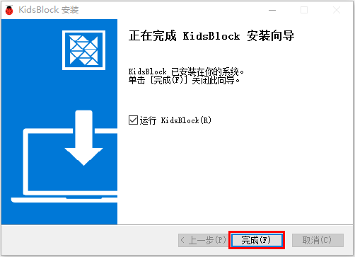

（5）如果出现电脑安全警报窗口，点击“允许访问”。这样就可以打开了软件页面。

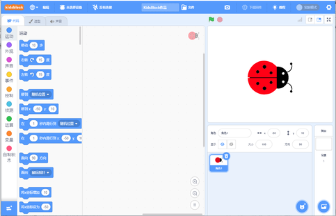

有更新软件时一般打开会自动提醒，为了软件能正常使用我们选择升级

我们也可在设置中手动更新软件

如果已经是最新版本则显示

### 第二小节 KidsBlock软件的使用方法 

（1）软件中各按钮的功能：

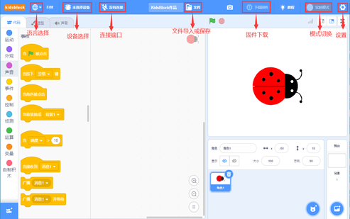

（2）点击可以选择语言“English”和“简体中文”。

（3）点击，选择点击“安装驱动”。（注意：如果电脑已经安装了驱动程序，则不需要再安装驱动；如果没有，则需要进行以下操作）

A.在“设备驱动程序安装向导”页面选择点击“下一页”。

2.  过一会儿，选择点击“完成”。

3.  选择点击“下一页”。

4.  选择点击“完成”。

5.  如果出现安全页面，选择点击“允许”即可，然后选择点击“Install”。

E.选择点击“安装”。

6.  过一会儿，点击“Finish”。

7.  选择点击“Extract”。

8.  选择点击“下一页”。

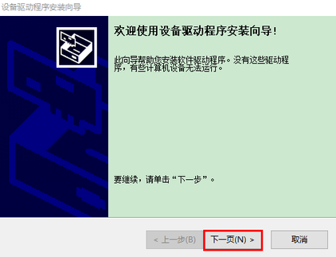

9.  选择点击“我接受这个协议”后，点击“下一页”。

10. 选择点击“完成”。

11. 选择“安装”。

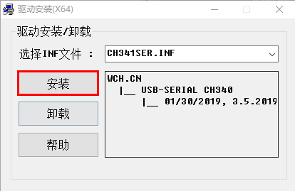

15. 过几秒钟后，驱动安装完成，点击“确定”即可。

（4）驱动安装完后，点击进入主控板页面，可以选择需要添加的设备（控制板），本项目需要选择MecanumRobot (麦克纳姆轮小车)。先点击MecanumRobot(麦克纳姆轮小车)所处区域，后点击“连接”。这样MecanumRobot(麦克纳姆轮小车)已连接上，点击“返回编辑器”回到编码编辑器。这样，我们会发现变成，同时变成，说明MecanumRobot(麦克纳姆轮小车)和端口（COM）
都已经连接上了。

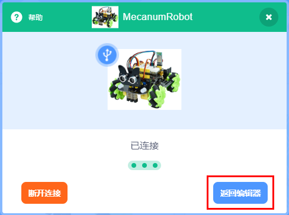

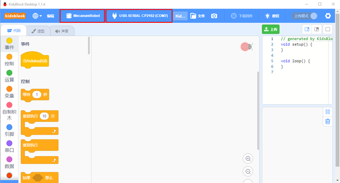

（5）假如MecanumRobot(麦克纳姆轮小车)已经连接上后，但是没有变成，则需要手动点击来连接端口（COM）。先点击，在出现的对话页面中点击，连接成功后，会出现“已连接”页面，说明端口已连接上了。

（6）如果需要断开端口，先点击，在出现的对话页面中点击“断开连接”。这样，端口就断开了。

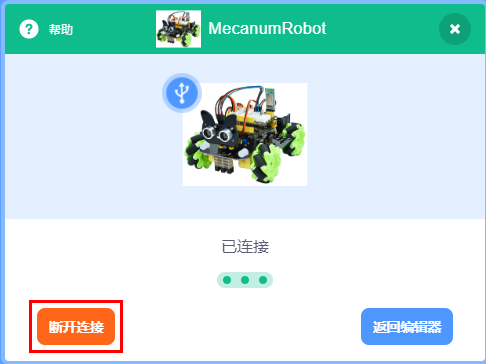

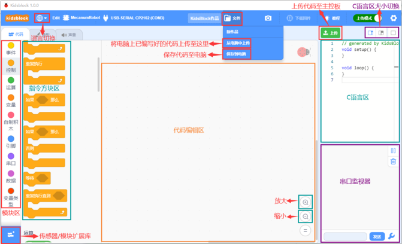

（7）是添加传感器/模块和元件的扩展包，点击可以进入传感器/模块扩展库界面，点击传感器/模块所处区域，就可以添加对应的传感器/模块。例如需要添加超声波传感器模块，点击“超声波传感器”所处区域，“未加载”变成“已加载”，说明“超声波传感器”模块添加成功。

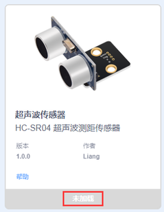

点击，可以回到代码编辑器界面，在模块区可以看到添加的“超声波传感器”模块。

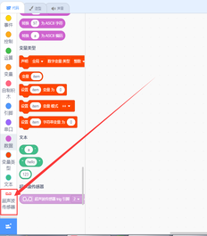

如果需要删除“超声波传感器”模块，只需要点击再次进入传感器/模块扩展库界面，点击“超声波传感器”所处区域，“已加载”变成“未加载”，则说明“超声波传感器”模块删除成功。

其他的传感器/模块和元器件的添加和删除，方法是一样的。

（7）打开已有的SB3类型文件的方法：（推荐使用方法2，方法1打开时有时可能会丢失代码数据）

方法1：鼠标左键双击SB3类型文件，这样就可以打开SB3类型文件。例如：需要打开文件，则只需要左键双击文件就可以直接打开。

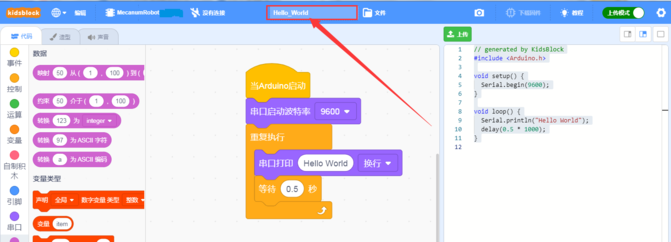

方法2：打开Kidsblock软件，点击“文件”，选择点击“从电脑中上传”，在电脑上选中需要打开的SB3类型文件（例如：文件）

### 第三小节 启动你的第一个程序 

(1)可以直接打开我们编写好的程序：点击文件下的从电脑中上传，然后找到目录下的程序并打开

|文件路径|文件名|
|-|-|
|Scratch教程\1. 开发环境配置\Hello_World程序|Hello_World.sb3|

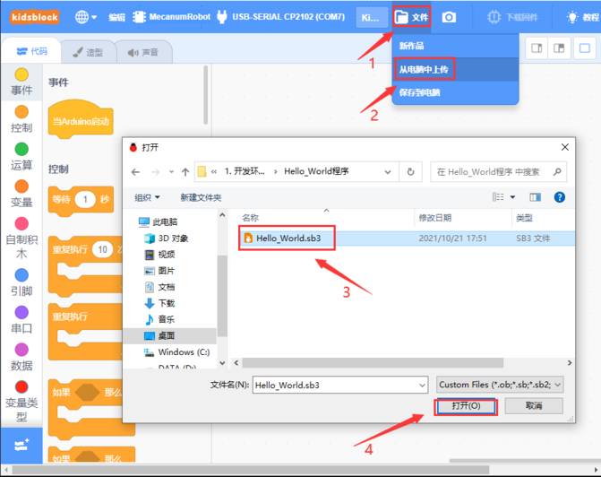

（2）上传程序：选择正确串口，波特率是：9600；MecanumRobot
和端口都选择正确；然后点击上传程序，程序上传成功会提示上传成功。

（3）实验结果：左下角监视窗口每隔0.5S打印一次“Hello World”

注意：这里是以MacOS系统软件下载安装为例

1.  Mac系统软件下载之后，如下图。

2.  双击KidsBlock的图标，出现下图，然后按住鼠标左键将KidsBlock     Desktop拖动到Applications里。

3.  等待安装，安装完成后在启动台中可以看到如下安装好的KidsBlock图标。

## 项目课程

### 第一课 七彩灯  

#### 1.1 项目介绍  

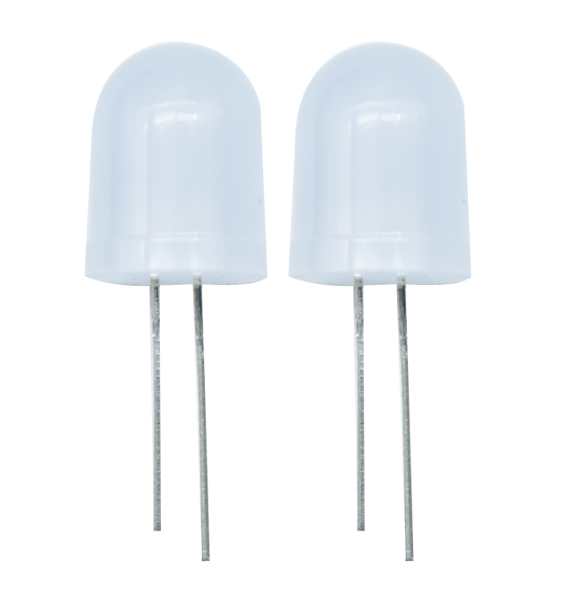  

首先我们要来完成经典的“Arduino点亮LED”项目，但这里的LED不是普通的单色LED，而是一个七彩LED，它采用七彩自动闪烁LED（外观为白色，显示七彩）元件。7色LED模块可自动闪烁内置颜色，能够制作出迷人的灯光效果。该模块与普通LED驱动方式相同，当我们给它输入高电平时，它将自动闪烁七种颜色，而输入低电平时将停止闪烁。  

我们将七彩LED集成到了电机驱动底板上。在第一个项目中，我们用一个最基本的测试代码来控制这个七彩LED，让它闪烁3秒，然后熄灭1秒。你也可以修改代码中LED灯亮灭的时间，实现不同的闪烁时长效果。当LED模块的信号端S为高电平时，七彩LED开始自动闪烁；S为低电平时，将停止闪烁。  

#### 1.2 模块相关资料  

  

  

两个七彩灯分别通过三极管来控制，信号端分别接到了P5.4和P5.5。因此，我们只需控制这两个引脚输出高低电平，即可控制两个七彩灯。  

#### 1.3 实验代码  

##### 1.3.1 寻找代码块  

你也可以通过拖动代码块来编写代码程序，寻找代码块如下：  

1.    

2.    

3.  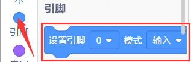  

4.  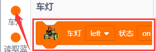  

##### 1.3.2 完整的代码程序  

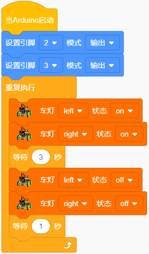  

#### 1.4 实验结果  

编译并上传代码完成后，将拨码开关拨到ON端通电，我们可以看到底板的两个七彩LED闪烁3秒后熄灭1秒，然后再次闪烁3秒再熄灭1秒，如此反复循环。  

### 第二课 WS2812 RGB灯  

#### 1.1 项目介绍  

  

在第一个项目中，我们详细介绍了通过代码控制七彩LED的闪烁。在本节课，我们将使用WS2812灯珠来显示真正的多彩灯。理论上，我们可以通过编程实现我们想要显示的任意颜色。  

WS2812 RGB灯珠的驱动原理与之前学习过的七彩LED不同，但只需一个引脚就能控制。这是一个集控制电路与发光电路于一体的智能外控LED光源。每个LED的外型与5050 LED灯珠相同，每个元件即为一个像素。这种电机驱动板上有四个灯珠，即四个像素。接下来，我们将学习如何控制它们以显示任意颜色。  

#### 1.2 模块相关资料  

  

这四个像素点灯珠都是串联的，无论有多少个，我们都可以用一个引脚（此例中为D10）控制任意灯，并让其显示任意颜色。像素点内部包含了智能数字接口数据锁存信号整形放大驱动电路，并包括高精度的内部振荡器和12V高压可编程定电流控制部分，有效保证了像素点光的颜色高度一致。数据协议采用单线归零码通讯方式，像素点在上电复位后，S端接收从控制器传输过来的数据。首个送来的24 bit数据被第一个像素点提取后送到像素点内部的数据锁存器。该WS2812 RGB通讯协议与驱动已在底层封装好，我们可以直接调用函数接口使用。  

#### 1.3 实验代码  

##### 1.3.1 寻找代码块  

你也可以通过拖动代码块来编写代码程序，寻找代码块如下：  

1.    

2.    

##### 1.3.2 完整的代码程序  

  

#### 1.4 实验结果  

将拨码开关拨到ON端上电，上传代码完成后，我们可以看到底板的4个WS2812灯珠分别显示红、绿、蓝、白四种颜色。  

#### 1.5 项目拓展：流水彩灯  

##### 1.5.1 寻找代码块  

同样，你可以通过拖动代码块来编写代码程序，寻找代码块如下：  

1.    

2.  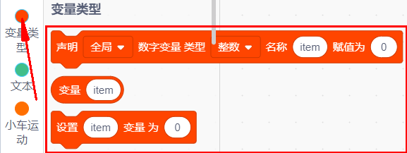  

3.    

4.    

5.  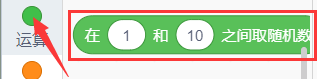  

##### 1.5.2 完整的代码程序  

  

上传代码成功后，我们将看到四个灯珠以随机颜色显示流水灯效果。  

### 第三课 伺服舵机  

#### 1.1 项目介绍  

  

对于那些DIY智能汽车来说，往往都具备自动避障的功能。在DIY过程中，我们需要一个伺服舵机来控制超声波模块左右旋转，检测汽车与障碍物的距离，从而控制汽车避开障碍物。  

如果使用其他微控制器来控制伺服的旋转，我们需要设置一定频率和宽度的脉冲来控制伺服角度。但使用Arduino控制伺服角度时，只需在开发环境中设置舵机的连接引脚以及控制角度即可。开发环境会自动设置相应的脉冲来控制伺服旋转。  

在本项目中，您将学习如何控制伺服舵机在0°和180°之间来回旋转。  

#### 1.2 模块相关资料  

  

- **角度范围**: 0°~180°（也有0°~360°、0°~90°的舵机）  
- **驱动电压**: 3.3V或5V  
- **引脚**: 一般为三根线  
- **GND**: 接地引脚，棕色  
- **VCC**: 连接到+5V（或3.3V）电源的引脚，红色  
- **S**: 信号端引脚，PWM信号控制，橙色（我们这里连接到D9）  

##### 控制原理  

舵机的转动角度通过调节PWM（脉冲宽度调制）信号的占空比实现。标准PWM信号的周期固定为20ms（50Hz），脉宽理论上应在1ms到2ms之间。  

  

事实上，脉宽可由0.5ms到2.5ms之间，脉宽和舵机的转角0°～180°相对应。由于舵机品牌不同，对于同一信号，不同厂家的舵机旋转的角度也会有所不同。  

  

经过实测，舵机的脉冲范围为0.65ms~2.5ms。180度舵机的控制关系如下：  

| 高电平时间 | 舵机角度 | 基准信号周期时间（20ms）                         |  
|------------|----------|--------------------------------------------------|  
| 0.65ms     | 0度     | 0.65ms高电平+19.35ms低电平                     |  
| 1.5ms      | 90度    | 1.5ms高电平+18.5ms低电平                       |  
| 2.5ms      | 180度   | 2.5ms高电平+17.5ms低电平                       |  

#### 1.3 实验代码  

##### 1.3.1 寻找代码块  

你也可以通过拖动代码块来编写代码程序，寻找代码块如下：  

1.    

2.    

3.  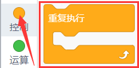  

4.    

##### 1.3.2 完整的代码程序  

  

#### 1.4 实验结果  

编译并上传代码完成后，将拨码开关拨到ON端上电，我们就可以看到舵机在0度到180度之间来回转动。  

### 第四课 直流减速电机  

#### 1.1 项目介绍  

  

要让小车快速运行，必须配备电机并搭配车轮。本套件配备了四个直流减速电机，即[齿轮减速电机](https://baike.baidu.com/item/%E9%BD%BF%E8%BD%AE%E5%87%8F%E9%80%9F%E7%94%B5%E6%9C%BA/3249233)，其结构是建立在普通[直流电机](https://baike.baidu.com/item/%E7%9B%B4%E6%B5%81%E7%94%B5%E6%9C%BA/2404223)的基础上，加上配套的齿轮减速箱。齿轮减速箱的作用是提供较低的转速和更大的力矩。同时，不同的[减速比](https://baike.baidu.com/item/%E5%87%8F%E9%80%9F%E6%AF%94/5341327)可以提供不同的转速和力矩，这大大提高了直流电机在自动化行业中的应用率。减速电机是指将[减速机](https://baike.baidu.com/item/%E5%87%8F%E9%80%9F%E6%9C%BA/873618)和电机（马达）集成在一起，这种集成体通常被称为[齿轮马达](https://baike.baidu.com/item/%E9%BD%BF%E8%BD%AE%E9%A9%AC%E8%BE%BE/7911602)或[齿轮电机](https://baike.baidu.com/item/%E9%BD%BF%E8%BD%AE%E7%94%B5%E6%9C%BA/3377578)。减速电机广泛应用于钢铁行业、机械行业等。使用减速电机的优点是简化设计、节省空间。  

电机的驱动不比LED，电机要求的电流比较大。如果我们使用IO口强制驱动电机，要么电机不转，要么可能导致单片机损坏。因此，我们需要一个电机驱动芯片。电机驱动底板上已经包含了DRV8833电机驱动芯片，用于控制四个直流减速电机的转动方向和速度。下面我们来看一下电机驱动底板上两个芯片的电路原理图。  

#### 1.2 模块相关资料  

  

  

每个芯片可以控制4个引脚，每两个引脚控制一个电机，这样就需要8个引脚控制4个电机。我们可以看到电机驱动与STC的接线图。在驱动电机时，我们使用IIC协议，往STC芯片相应的寄存器地址写入脉宽值，就可以输出PWM信号给电机驱动芯片。我们已经编写了电机驱动的库文件，在使用时只需要调用API函数，就能让小车行驶，非常简单。  

#### 1.3 实验代码  

##### 1.3.1 寻找代码块  

你也可以通过拖动代码块来编写代码程序，寻找代码块如下：  

1.    

2.    

3.  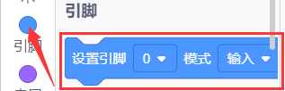  

4.    

##### 1.3.2 完整的代码程序  

  

#### 1.4 实验结果  

编译并上传代码完成后，将拨码开关拨到ON端上电。我们将看到小车前进2秒，后退2秒，左转2秒，右转2秒，并最终停止1秒，如此反复循环。  

### 第五课 循迹传感器  

#### 1.1 项目介绍  

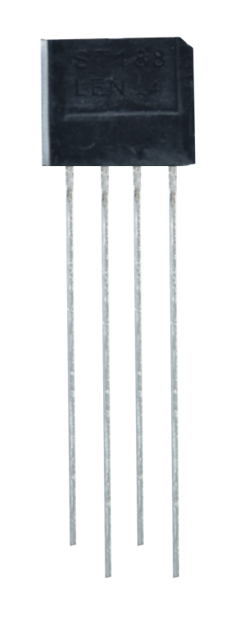  

巡线传感器实际上是红外传感器。在小车驱动底板的前方有3路巡线传感器，所使用的组件是TCRT5000红外灯管。其工作原理是利用红外光对颜色的不同反射率，将反射信号的强度转换为电流信号。  

在检测过程中，黑色表现在高电平时处于活动状态，而白色表现在低电平时处于活动状态。即当检测到黑色或近期未检测到物体时，输出高电平；当检测到白色或光滑易反射光的物体时，输出低电平。传感器的检测高度在0-3厘米之间。  

底板上方有3个蓝色旋转电位器，通过旋转这些电位器可以调节传感器的检测灵敏度。  

#### 1.2 模块相关资料  

- **工作电压**: 3.3-5V (DC)  
- **接口**: 5PIN接口（我们接到了A0，A1，A2）  
- **输出信号**:   
  - 数字信号（模拟信号口也可以当数字信号用，A0相当于D13，A1相当于D14，以此类推）  
- **检测高度**: 0-3 cm  

##### 原理  

巡线传感器的原理是利用红外线对颜色反射率的差异，将反射信号的强弱转化成电流信号。上电时，发射二极管发射红外光，FB-为电位器；通过调整电位器可以给电压比较器LM339D的4、6、8脚提供阈值电压，电压值的大小可以根据实际情况来调试确定。当红外光敏二极管收到红外光时，会产生电流，并且随着红外光的增强电流也会增大。  

当没有红外光或红外光很弱时，输出的信号接近VCC，通过LM339D比较器后，接收检测引脚输出高电平。当红外信号强度增大到一定程度时，输出电压就会降低，直到接收检测引脚变为低电平。  

当红外信号发送到黑色轨道时，黑色因吸光能力强，红外信号会被吸收，反射部分很微弱。白色轨道则会大部分反射红外信号。也就是说，检测到黑色或未检测到物体时，单片机信号端接收到高电平；而检测到白色物体时，信号端接收到低电平。  

  

#### 1.3 实验代码  

##### 1.3.1 寻找代码块  

你也可以通过拖动代码块来编写代码程序，寻找代码块如下：  

1.  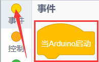  

2.  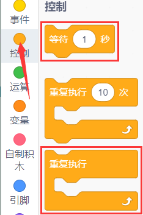  

3.    

4.  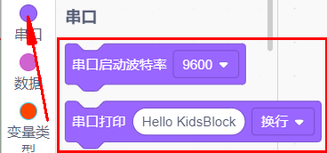  

5.  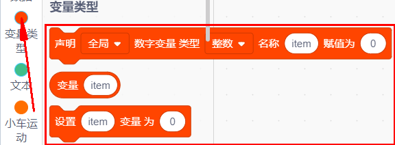  

##### 1.3.2 完整的代码程序  

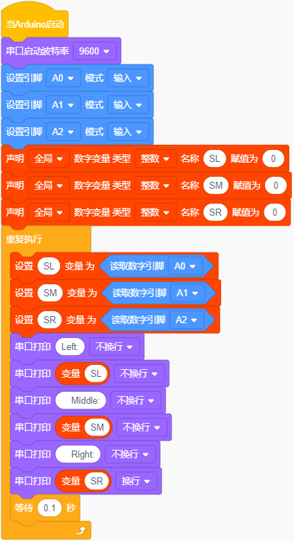  

#### 1.4 实验结果  

编译并上传代码完成后，将拨码开关拨到ON端上电。在串口监视器窗口点击设置波特率为9600，我们可以看到串口监视器打印出的三路巡线传感器接收到的数字信号。当用白纸遮挡传感器时，输出0；用黑纸或让小车悬空时，输出1：  

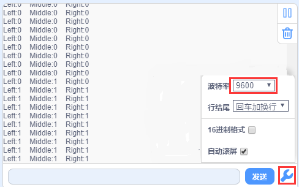  

### 第六课 循迹智能车  

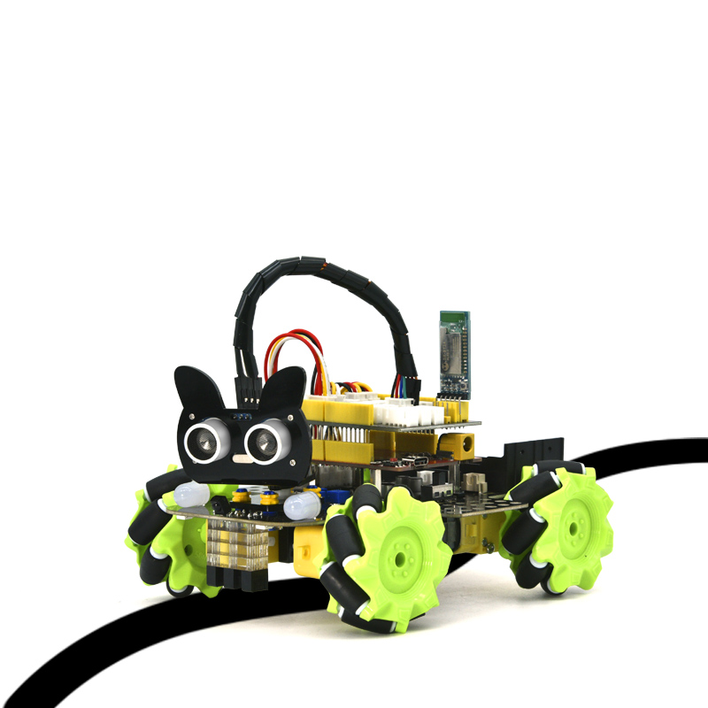  

#### 1.1 项目介绍  

在前面的课程中，我们学习了循迹传感器和电机驱动的原理及其应用。接下来，我们将结合这两个基本组件——循迹传感器和电机驱动，制作一款循迹小车。  

循迹的意思是沿着轨迹行驶，也就是我们常见的走黑线的循迹小车。它的原理是利用循迹传感器对路面黑色轨迹进行检测，并将检测到的信号反馈给控制主板，控制板解析这些信号，及时控制驱动电机以调整小车的方向，从而使小车沿着黑色轨迹自动行驶，最终实现自动寻迹的目的。下面的流程图能够帮助理解这一过程：  

#### 1.2 实验流程图  

  

#### 1.3 实验代码  

##### 1.3.1 寻找代码块  

你也可以通过拖动代码块来编写代码程序，寻找代码块如下：  

1.    

2.    

3.  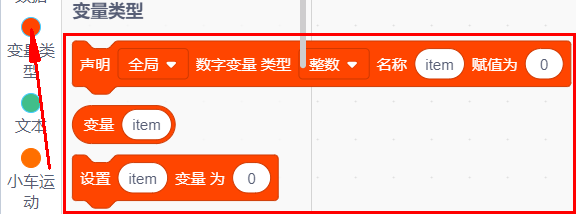  

4.  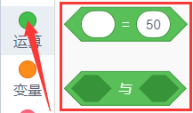  

5.    

6.  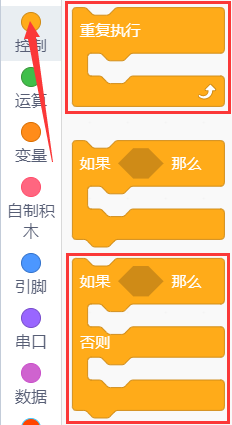  

##### 1.3.2 完整的代码程序  

  

  

  

#### 1.4 实验结果  

代码烧录完成后，将拨码开关拨到ON端上电，并将小车放置在黑色循迹图上，小车便能沿着黑线行驶。  

### 第七课 超声波传感器  

#### 1.1 项目介绍  

  

HC-SR04超声波传感器像蝙蝠一样使用声纳来确定与物体的距离。它在一个易于使用的包装中提供了出色的非接触式范围检测，具有高精度和稳定的读数。它配备了超声波发射器和接收器模块。  

HC-SR04超声波传感器正在广泛应用于电子项目中，用于创建障碍物检测、距离测量以及其他多种应用。这里介绍了用Keyes UNO PLUS开发板和超声波传感器测量距离的简单方法，以及如何在Arduino IDE中使用超声波传感器。  

#### 1.2 模块相关参数  

- **工作电压**: +5V DC  
- **静态电流**: < 2mA  
- **工作电流**: 15mA  
- **有效角度**: < 15°  
- **距离范围**: 2cm – 400 cm  
- **精度**: 0.3 cm  
- **测量角度**: 30°  
- **触发输入脉宽**: 10us  

原理：最常用的超声测距的方法是回声探测法，如图，超声波发射器向某一方向发射超声波，在发射时刻的同时计数器开始计时，超声波在空气中传播，途中碰到障碍物面阻挡就立即反射回来，超声波接收器收到反射回的超声波就立即停止计时。超声波也是一种声波，其声速V与温度有关。一般情况下超声波在空气中的传播速度为340m/s，根据计时器记录的时间t，就可以计算出发射点距障碍物面的距离s，即：s=340t/2：

步骤：  
1. 采用IO口TRIG触发测距，给至少10us的高电平信号；  
2. 模块自动发送8个40kHz的方波，检测是否有信号返回；  
3. 有信号返回时，通过ECHO输出高电平，单片机读取高电平的持续时间即为超声波从发射到返回的时间。  

  

超声波模块的电路图

  

#### 1.3 实验代码  

##### 1.3.1 寻找代码块  

你也可以通过拖动代码块来编写代码程序，寻找代码块如下：  

1.    

2.  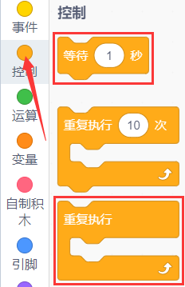  

3.    

4.    

5.  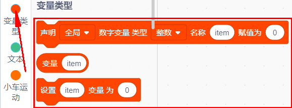  

6.    

##### 1.3.2 完整的代码程序  

  

#### 1.4 实验结果  

编译上传代码成功后上电，在串口监视器窗口点击

设置波特率为9600，我们可以在串口监视器中看超声波模块测得的距离，移动小车前面的障碍物，看到串口监视器中距离值也在发生变化，如下图：

### 第八课 超声波跟随智能车  

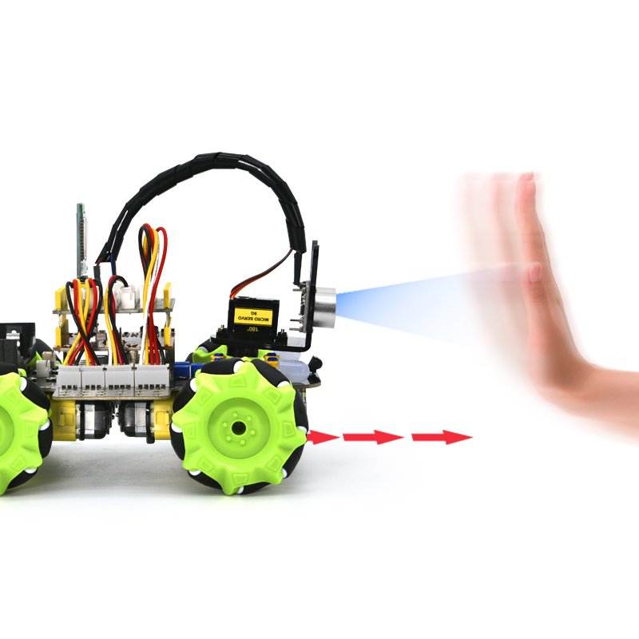  

#### 1.1 项目介绍  

在前面的课程中，我们学习了如何使用循迹传感器和电机来制作一个自动巡线智能小车。这一节课，我们将使用超声波传感器和电机制作一个自动跟随智能小车。通过超声波传感器检测智能车与前方障碍物的距离，然后根据这一数据控制两个电机的转动，从而控制智能车的运动状态。下面的程序流程图能够清晰地展示这个过程：  

#### 1.2 实验流程图  

  

#### 1.3 实验代码  

##### 1.3.1 寻找代码块  

你也可以通过拖动代码块来编写代码程序，寻找代码块如下：  

1.    

2.    

3.    

4.  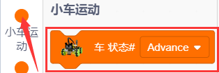  

5.    

6.  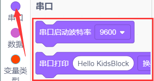  

7.    

8.    

9.  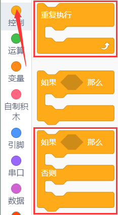  

##### 1.3.2 完整的代码程序  

  

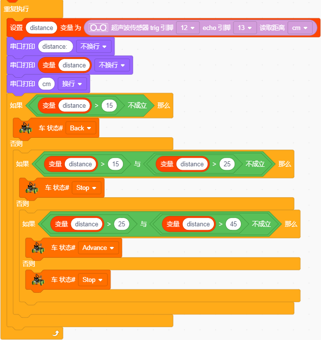  

#### 1.4 实验结果  

上传代码成功后，将拨码开关拨到ON端上电，小车就能直线跟随。注意这里只是直线跟随。当我们用手掌放在超声波前面，慢慢向前移动时，小车会跟随我们的手掌移动。  

### 第九课 超声波避障智能车  

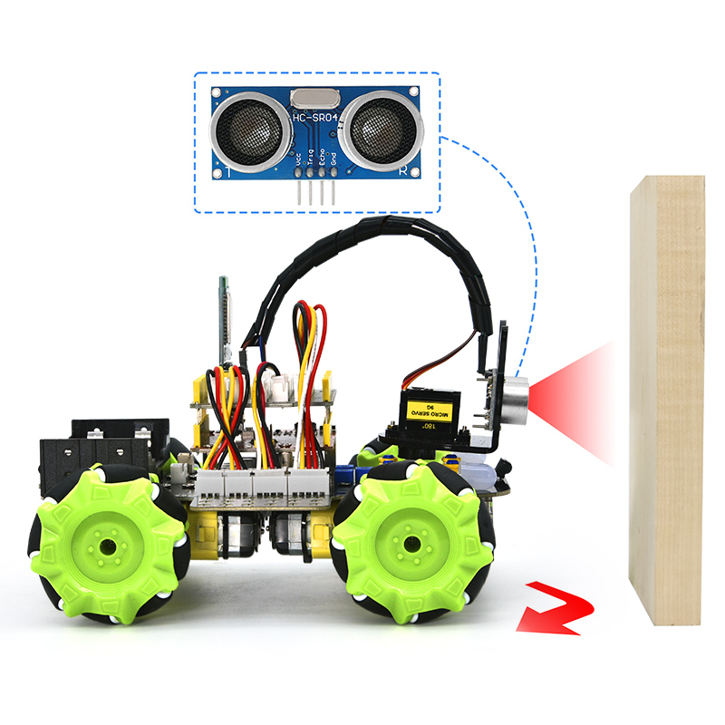  

#### 1.1 项目介绍  

在上一个项目中，我们制作了一个超声波跟随智能车。实际上，利用同样的硬件和接线方法，我们只需要更改测试代码，就可以将跟随智能车变为避障智能车。超声波避障智能车通过超声波传感器检测前方障碍物的距离，同时舵机云台转动以检测左右两边的距离。根据这些数据，我们可以控制四个电机的转动，从而实现智能车的运动状态，最终达到避障的目的。  

下面的程序流程图能够清晰地展示这个过程：  

#### 1.2 实验流程图  

  

#### 1.3 实验代码  

##### 1.3.1 寻找代码块  

你也可以通过拖动代码块来编写代码程序，寻找代码块如下：  

1.    

2.    

3.  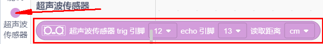  

4.    

5.  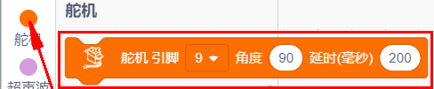  

6.  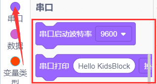  

7.    

8.    

9.    

10.   

##### 1.3.2 完整的代码程序  

  

  

#### 1.4 实验结果  

上传代码成功后，将拨码开关拨到ON端上电，小车就能自动避障。注意，速度不要调得太大。当小车在行驶过程中遇到前方障碍物时，小车会停止，然后舵机云台转动到左边，测量左侧障碍物的距离；随后舵机云台转动到右边，测量右侧障碍物的距离。通过判断左边与右边的障碍物距离，小车将选择更远的一侧转弯，然后继续行驶。  

### 第十课 红外接收  

#### 1.1 项目介绍  

  

毫无疑问，红外遥控在日常生活中随处可见，以至于很难想象没有它的世界会变得怎样。它被用来控制各种家电，如电视、音响、录影机和卫星信号接收器。红外遥控由红外发射和红外接收系统组成，也就是一个红外遥控器、红外接收模块以及一个能解码的单片机。  

我们使用的红外接收模块主要由红外接收头组成，是个集接收、放大、解调一体的器件。其内部IC已经完成了解调，能够完成从红外线接收到输出与TTL电平信号兼容的所有工作，输出的就是数字信号。该接收器的红外接收模块只有三个引脚，分别是信号线（与我们的单片机的A3管脚相连）、VCC和GND。与Keyes UNO PLUS开发板以及其他单片机连接通信非常方便。在本实验中，我们将红外遥控的键值打印到串口监视器上。  

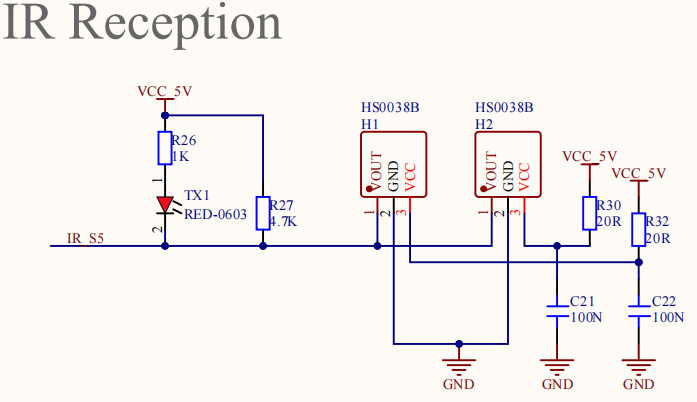  

#### 1.2 模块相关资料  

红外遥控器发射的38KHz红外载波信号是由遥控器里的编码芯片进行编码的。这是通过（NEC协议）组成的一段引导码、用户码、用户反码、数据码和数据反码，利用脉冲的时间间隔来区别是0还是1信号（560us低电平 + 560us高电平被认为是信号0，560us低电平 + 1680us高电平被认为是信号1）。同一个遥控器的用户码是不变的，用数据码的不同来分辨遥控器按的键不同。当按下遥控器的按键时，它会发送红外载波信号，红外接收器接收到信号后，程序对载波信号进行解码，通过数据码的不同来判断按下的是哪个键。单片机根据接收到的01信号进行解码，从而判断遥控器按下的是什么键。为了方便接收数据，我们在小车前后都搭载了红外接收头，并将其连接到Keyes UNO PLUS开发板的A3管脚。  

#### 1.3 实验代码  

##### 1.3.1 寻找代码块  

你也可以通过拖动代码块来编写代码程序，寻找代码块如下：  

1.  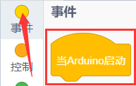  

2.    

3.    

4.  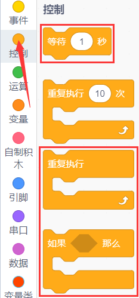  

##### 1.3.2 完整的代码程序  

  

#### 1.4 实验结果  

上传代码成功后，将拨码开关拨到ON端上电，在串口监视器窗口中点击设置波特率为9600，拿出遥控器，对准红外接收传感器发送信号，即可看相应按键的键值，如果按键时间过长，容易出现乱码。

  

我们通过测试得出的数值，制作了一个遥控器按键值表，以便于将来的使用。  

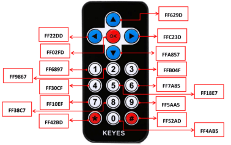  

#### 1.5 项目拓展：使用一个OK键来控制七彩灯的亮灭  

##### 1.5.1 寻找代码块  

你也可以通过拖动代码块来编写代码程序，寻找代码块如下：  

1.    

2.    

3.    

4.    

5.    

6.    

7.    

8.  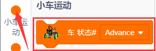  

9.  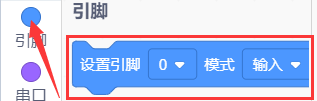  

##### 1.5.2 完整的代码程序  

  

  

上传代码成功后，将拨码开关拨到ON端上电。当遥控器按下OK按键时，LED将会亮起；再按一下OK按键，LED则会熄灭。  

### 第十一课 红外遥控智能车  

  

#### 1.1 项目介绍  

在前面的课程中，我们已经测试出红外遥控器各个按键对应的键值。本项目将使用红外遥控器来控制智能小车。通过代码设置（键值），可以使对应的按键控制智能车的运动状态。  

#### 1.2 实验流程图  

  

#### 1.3 实验代码  

##### 1.3.1 寻找代码块  

你也可以通过拖动代码块来编写代码程序，寻找代码块如下：  

1.    

2.    

3.    

4.    

5.    

6.    

7.  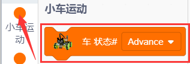  

##### 1.3.2 完整的代码程序  

  

  

#### 1.4 实验结果  

上传代码成功后，将拨码开关拨到ON端上电，
当我们按下遥控器上的时，
小车前进；当我们按下遥控器上的时，
小车左转；当我们按下遥控器上的时，
小车后退；当我们按下遥控器上的时，
小车右转；当我们按下遥控器上的时，小车停止。

### 第十二课 蓝牙APP控制麦轮车  

  

#### 1.1 项目介绍  

  

本项目使用DX-BT24 5.1蓝牙模块，该模块配置了256Kb空间，并遵循V5.1 BLE蓝牙规范。它支持AT指令，用户可以根据需要更改串口波特率、设备名称等参数，使用灵活。支持UART接口，能够实现蓝牙串口透传，具有成本低、体积小、功耗低、收发灵敏性高等优点。只需配置少许外围元件就能实现其强大功能。  

在前面的课程中，我们实现了模块/传感器的单个功能，现在我们将所有功能结合到一起。在本课程中，我们将使用BT24蓝牙模块与手机APP连接，操控各种功能。我们首先通过APP连接蓝牙，以读取APP界面上各按钮发送的控制字符。  

#### 1.2 模块相关资料  

- **蓝牙协议**：Bluetooth Specification V5.1 BLE  
- **工作频率**：2.4GHz ISM band  
- **通信接口**：UART  
- **供电电源**：5V/3.3V  
- **通信距离**：40m  
- **外观尺寸**：27(L)mm x 13(W)mm x 2(H)mm  
- **蓝牙名称**：BT24  
- **串口参数**：9600，8数据位，1停止位，无校验，无流控  
- **工作温度**：MIN:-40℃ - MAX:+85℃  

DX-BT24模块同时支持BT5.1 BLE协议，可直接与具备BLE蓝牙功能的iOS设备连接，支持后台程序常驻运行。主要用于短距离的数据无线传输，避免繁琐的线缆连接，能直接替代串口线。  

##### 蓝牙接口说明  

  

1. STATE：状态脚  
2. RX：接收脚  
3. TX：发送脚  
4. GND：接地脚  
5. VCC：电源脚  
6. EN：使能脚  

##### 将蓝牙模块连接到开发板  

| Uno | BT24 |  
|-----|------|  
| TX  | RX   |  
| RX  | TX   |  
| VCC | 5V   |  
| GND | GND  |  

#### 1.3 APP  

有关APP的具体下载安装方法及使用方法，请参考文件夹“7. APP”。  

  

#### 1.4 实验代码  

##### 1.4.1 寻找代码块  

你也可以通过拖动代码块来编写代码程序，寻找代码块如下：  

1.    

2.    

3.    

4.    

5.    

##### 1.4.2 完整的代码程序  

  

#### 1.5 实验结果  

上传代码完成后，插上蓝牙，注意蓝牙不得插反。连接蓝牙模块并打开串口监视器，按下手机APP按钮，我们可以看到APP按钮对应的控制字符，如下图所示。  

注意：蓝牙模块的RXD、TXD、GND、VCC分别对应电机驱动扩展板上的TX、RX、GND、5V，而蓝牙模块的STATE和BRK两引脚不需要接。蓝牙直接插在电机驱动扩展板上，注意插入方向。此外，在上传代码之前不要插上蓝牙模块。  

  

#### 1.6 综合项目：APP控制麦克纳姆轮智能车  

由于这个代码程序较为复杂，代码块较多，此处不提供编写代码程序所需寻找代码块的过程。如果你有兴趣，可以尝试自行拖动代码块来实现。  

##### 1.6.1 完整的代码程序  

烧入代码后，将拨码开关拨到ON端上电，我们连上蓝牙BT24，就可以使用手机APP来控制我们前面所学的一系列玩法了：

1.  点击开启七彩灯，再次点击这个按钮七彩灯就会关闭。

2.  点击会进入循迹模式，当想退出该模式时，再次点击该按钮。

3.  点击会进入跟随模式、当想退出该模式时，再次点击该按钮。

4.  点击会进入避障模式，当想退出该模式时，再次点击该按钮。

5.  拉动这两个条幅回改变左边两个电机的速度，右边也是相同的操作方法。

6.  这几个按钮是用来切换底板下面4个2812灯珠颜色的，中间按钮为关闭功能。

7.  剩下其他的按钮全都是用来操控小车行驶的，跟其他按钮不同的是，这些按钮当我们按下时小车行驶，松开按钮时小车停止。

