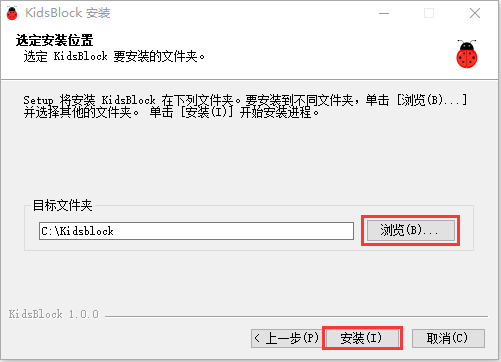
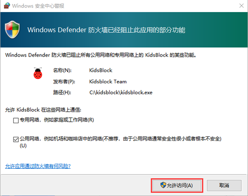
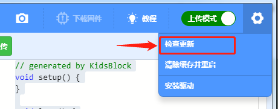
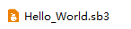
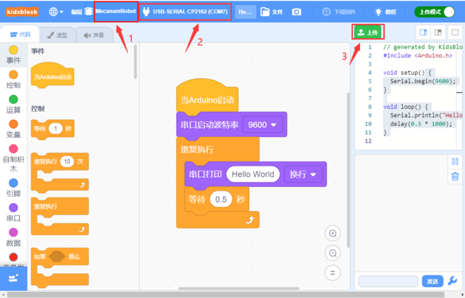

# 开发环境配置

## 第一小节 KidsBlock软件安装 

软件下载链接

Windows系统软件：https://pan.baidu.com/s/1JJOss8q2zXNsObw24BHn3w

提取码：keye

Mac系统软件链接：https://pan.baidu.com/s/1Q7uXmj3mIDDqWz20om6YJw

提取码：keye

注意：这里是以Windows系统为例，macOS 系统可以以此作为参考。

（1）双击下载好的软件“KidsBlock Desktop 1.1.4 Setup.exe”。

（2）先选中“为使用这台电脑的任何人安装”，再点击“下一步”。

（3）先点击“浏览（B）...”,选择安装的位置（我这里选择安装在C盘，你也可以选择安装在电脑的其他盘），再点击“安装”。这样，软件就在安装过程中。

（4）几秒种后，安装完成。点击“完成”就可以打开安装好的软件。

（5）如果出现电脑安全警报窗口，点击“允许访问”。这样就可以打开了软件页面。

有更新软件时一般打开会自动提醒，为了软件能正常使用我们选择升级

我们也可在设置中手动更新软件

如果已经是最新版本则显示

## 第二小节 KidsBlock软件的使用方法 

（1）软件中各按钮的功能：

（2）点击可以选择语言“English”和“简体中文”。

（3）点击，选择点击“安装驱动”。（注意：如果电脑已经安装了驱动程序，则不需要再安装驱动；如果没有，则需要进行以下操作）

A.在“设备驱动程序安装向导”页面选择点击“下一页”。

2.  过一会儿，选择点击“完成”。

3.  选择点击“下一页”。

4.  选择点击“完成”。

5.  如果出现安全页面，选择点击“允许”即可，然后选择点击“Install”。

E.选择点击“安装”。

6.  过一会儿，点击“Finish”。

7.  选择点击“Extract”。

8.  选择点击“下一页”。

9.  选择点击“我接受这个协议”后，点击“下一页”。

10. 选择点击“完成”。

11. 选择“安装”。

15. 过几秒钟后，驱动安装完成，点击“确定”即可。

（4）驱动安装完后，点击进入主控板页面，可以选择需要添加的设备（控制板），本项目需要选择MecanumRobot (麦克纳姆轮小车)。先点击MecanumRobot(麦克纳姆轮小车)所处区域，后点击“连接”。这样MecanumRobot(麦克纳姆轮小车)已连接上，点击“返回编辑器”回到编码编辑器。这样，我们会发现变成，同时变成，说明MecanumRobot(麦克纳姆轮小车)和端口（COM）
都已经连接上了。

（5）假如MecanumRobot(麦克纳姆轮小车)已经连接上后，但是没有变成，则需要手动点击来连接端口（COM）。先点击，在出现的对话页面中点击，连接成功后，会出现“已连接”页面，说明端口已连接上了。

（6）如果需要断开端口，先点击，在出现的对话页面中点击“断开连接”。这样，端口就断开了。

（7）是添加传感器/模块和元件的扩展包，点击可以进入传感器/模块扩展库界面，点击传感器/模块所处区域，就可以添加对应的传感器/模块。例如需要添加超声波传感器模块，点击“超声波传感器”所处区域，“未加载”变成“已加载”，说明“超声波传感器”模块添加成功。

点击，可以回到代码编辑器界面，在模块区可以看到添加的“超声波传感器”模块。

如果需要删除“超声波传感器”模块，只需要点击再次进入传感器/模块扩展库界面，点击“超声波传感器”所处区域，“已加载”变成“未加载”，则说明“超声波传感器”模块删除成功。

其他的传感器/模块和元器件的添加和删除，方法是一样的。

（7）打开已有的SB3类型文件的方法：（推荐使用方法2，方法1打开时有时可能会丢失代码数据）

方法1：鼠标左键双击SB3类型文件，这样就可以打开SB3类型文件。例如：需要打开文件，则只需要左键双击文件就可以直接打开。

方法2：打开Kidsblock软件，点击“文件”，选择点击“从电脑中上传”，在电脑上选中需要打开的SB3类型文件（例如：文件）

## 第三小节 启动你的第一个程序 

(1)可以直接打开我们编写好的程序：点击文件下的从电脑中上传，然后找到目录下的程序并打开

<table>
<colgroup>
<col />
<col />
</colgroup>
<tbody>
<tr>
<td>文件路径</td>
<td>文件名</td>
</tr>
<tr>
<td>Scratch教程\1. 开发环境配置\Hello_World程序</td>
<td>Hello_World.sb3</td>
</tr>
</tbody>
</table>

（2）上传程序：选择正确串口，波特率是：9600；MecanumRobot
和端口都选择正确；然后点击上传程序，程序上传成功会提示上传成功。

（3）实验结果：左下角监视窗口每隔0.5S打印一次“Hello World”

注意：这里是以MacOS系统软件下载安装为例

1.  Mac系统软件下载之后，如下图。

2.  双击KidsBlock的图标，出现下图，然后按住鼠标左键将KidsBlock     Desktop拖动到Applications里。

3.  等待安装，安装完成后在启动台中可以看到如下安装好的KidsBlock图标。

