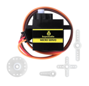
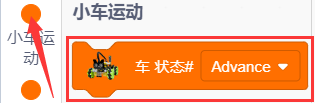
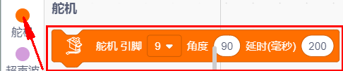
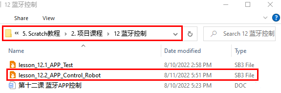

# 项目课程

## 第一课七彩灯

1.1 项目介绍：

首先我们要来完成经典的“Arduino点亮LED”，但是我们这里的LED，不是普通的单色LED，而是一个7彩LED，它采用7彩自动闪烁LED（外观白色，显示七彩）元件。7色LED模块可自动闪烁内置颜色。可以用来制作相当迷人的灯光效果。这个模块与普通LED驱动相同，当我们给它输入高电平时将自动闪烁七种颜色，而输入低电平时将停止闪烁。

我们已经将7彩LED集成到了我们的电机驱动底板，在第一个项目中，我们用一个最基本的测试代码来控制这个七彩LED，让它闪烁3秒钟，灭一秒钟，来实现控制的效果。你也可以改变代码中LED灯亮灭的时间，实现不同的闪烁时长效果。LED模块信号端S为高电平时7彩LED开始自动闪烁，S为低电平时七彩LED熄灭不再闪烁。

1.2 模块相关资料：

两个七彩灯分别通过三极管来控制，信号端分别接到了P5.4和P5.5，所以我们只要控制这两个引脚输出高低电平即可控制两个七彩灯。

1.3 实验代码：

1.3.1.寻找代码块：

也可以自己通过拖动代码块来编写代码程序，寻找代码块如下：

1.  

2.  

3.  

4.  

1.3.2.完整的代码程序：

1.4 实验结果：

编译上传代码完成后，将拨码开关拨到ON端上电，我们就可以看到底板的2个七彩LED闪烁3秒然后熄灭1秒，然后再次闪烁3秒再熄灭1秒，如此反复循环。

## 第二课 WS2812 RGB灯

1.1 项目介绍：

在第一个项目，我们详细的介绍了通过代码控制七彩LED控制闪烁。这节课我们使用WS2812灯珠来显示真正的多彩灯，理论上我们可以通过编程实现我们想要显示的任意的颜色。

但是这个2812 RGB
驱动原理与我们前面学习过的七彩LED不相同，但是也只需要一个引脚就能控制，这是一个集控制电路与发光电路于一体的智能外控LED光源。每个LED原件其外型与一个5050LED灯珠相同，每个元件即为一个像素点，我们这个电机驱动板上有四个灯珠即四个像素。下面我们来学习如何控制它来显示任意颜色。

1.2 模块相关资料：

这四个像素点灯珠都是串联起来的，其实不论多少个，我们都可以用一个引脚（我们这里接的D10）控制任意一个灯，并且让它显示任一种颜色。像素点内部包含了智能数字接口数据锁存信号整形放大驱动电路，还包含有高精度的内部振荡器和12V高压可编程定电流控制部分，有效保证了像素点光的颜色高度一致。数据协议采用单线归零码的通讯方式，像素点在上电复位以后，S端接受从控制器传输过来的数据，首先送过来的24bit数据被第一个像素点提取后，送到像素点内部的数据锁存器。这个2812RGB通讯协议与驱动已经在底层封装好了，我们直接调用函数的接口就可以使用。

1.3 实验代码：

1.3.1.寻找代码块：

也可以自己通过拖动代码块来编写代码程序，寻找代码块如下：

1.  

2.  

1.3.2.完整的代码程序：

1.4 实验结果：

将拨码开关拨到ON端上电，上传代码完成，我们就可以看到底板的4个2812灯珠分显示红、绿、蓝、白色。

1.5 项目拓展： 流水彩灯

1.5.1.寻找代码块：

也可以自己通过拖动代码块来编写代码程序，寻找代码块如下：

1.  

2.  

3.  

4.  

5.  

1.5.2.完整的代码程序：

上传代码成功后，我们将看到4个灯珠以随机颜色显示流水灯。

## 第三课 伺服舵机

1.1 项目介绍：

对于那些DIY智能汽车来说，往往都有自动避障的功能。在DIY过程中，我们需要一个伺服来控制超声波模块左右旋转，然后检测汽车与障碍物的距离，从而控制汽车避开障碍物。
如果使用其他微控制器来控制伺服的旋转，我们需要设置一定频率和一定宽度的脉冲来控制伺服角度。但是如果用arduino来控制伺服角度，我们只需要在开发环境中设置舵机的连接引脚然后设置控制角度即可。在开发环境中会自动设置相应的脉冲来控制伺服旋转。
在本项目中，您将学习如何控制伺服舵机在0°和180°之间来回旋转。

1.2 模块相关资料：

角度范围：0°~180°（有0°~360°舵机，0°~180°舵机，0°~90°舵机）

驱动电压：3.3V或5V

引脚一般为三根线

GND：一个接地的引脚，棕色

VCC：一个连接到+5v（3.3V）电源的引脚，红色

S：信号端的引脚，PWM信号控制，橙色（我们这里接到了D9）

控制原理：舵机的转动的角度是通过调节PWM（脉冲宽度调制）信号的占空比来实现的，标准PWM（脉冲宽度调制）信号的周期固定为20ms（50Hz），理论上脉宽分布应在1ms到2ms
之间。

但是，事实上脉宽可由0.5ms 到2.5ms
之间，脉宽和舵机的转角0°～180°相对应。有一点值得注意的地方，由于舵机牌子不同，对于同一信号，不同牌子的舵机旋转的角度也会有所不同。

经过实测，舵机的脉冲范围为0.65ms~2.5ms。180度舵机，对应的控制关系是这样的：

<table>
<colgroup>
<col />
<col />
<col />
</colgroup>
<tbody>
<tr>
<td>高电平时间</td>
<td>舵机角度</td>
<td>基准信号周期时间（20ms）</td>
</tr>
<tr>
<td>0.65ms</td>
<td>0度</td>
<td>0.65ms高电平+19.35ms低电平</td>
</tr>
<tr>
<td>1.5ms</td>
<td>90度</td>
<td>1.5ms高电平+18.5ms低电平</td>
</tr>
<tr>
<td>2.5ms</td>
<td>180度</td>
<td>2.5ms高电平+17.5ms低电平</td>
</tr>
</tbody>
</table>

1.3 实验代码：

1.3.1.寻找代码块：

也可以自己通过拖动代码块来编写代码程序，寻找代码块如下：

1.  

2.  

3.  

4.  

1.3.2.完整的代码程序：

1.4 实验结果：

编译上传代码完成后，将拨码开关拨到ON端上电，我们就可以看到舵机从0度到180度之间来回转动了。

## 第四课 直流减速电机

1.1 项目介绍：

要想让小车跑起来那必须要有电机，然后搭配车轮就可以了。我们这个套件上配有4个直流减速电机，即[齿轮减速电机](https://baike.baidu.com/item/%E9%BD%BF%E8%BD%AE%E5%87%8F%E9%80%9F%E7%94%B5%E6%9C%BA/3249233)，是在普通[直流电机](https://baike.baidu.com/item/%E7%9B%B4%E6%B5%81%E7%94%B5%E6%9C%BA/2404223)的基础上，加上配套齿轮减速箱。齿轮减速箱的作用是，提供较低的转速，较大的力矩。同时，[齿轮箱](https://baike.baidu.com/item/%E9%BD%BF%E8%BD%AE%E7%AE%B1/1059341)不同的[减速比](https://baike.baidu.com/item/%E5%87%8F%E9%80%9F%E6%AF%94/5341327)可以提供不同的转速和力矩。这大大提高了直流电机在自动化行业中的使用率，[减速电机](https://baike.baidu.com/item/%E5%87%8F%E9%80%9F%E7%94%B5%E6%9C%BA/3750851)是指[减速机](https://baike.baidu.com/item/%E5%87%8F%E9%80%9F%E6%9C%BA/873618)和电机（马达）的集成体，这种集成体通常也可称为[齿轮马达](https://baike.baidu.com/item/%E9%BD%BF%E8%BD%AE%E9%A9%AC%E8%BE%BE/7911602)或[齿轮电机](https://baike.baidu.com/item/%E9%BD%BF%E8%BD%AE%E7%94%B5%E6%9C%BA/3377578)。减速电机广泛应用于钢铁行业、机械行业等。使用减速电机的优点是简化设计、节省空间。

电机的驱动不比LED，它要求的电流比较大，如果我们使用IO口强制驱动电机，要么电机不转动，要么烧坏单片机，所以我们需要一个电机驱动芯片。在电机驱动底板板上已经包含了DRV8833电机驱动芯片，用来控制4个直流减速电机的转动方向和转动速度。我们下面来看一下电机驱动底板两个芯片的电路原理图：

1.2 模块相关资料：

每个芯片控制4个引脚，每两个引脚控制一个电机，这样就使用了8个引脚控制了4个电机了。我们可以看到电机驱动与STC的接线图，我们驱动电机的时候使用IIC协议往STC这个芯片对应的寄存器地址写入脉宽值就可以输出pwm信号给电机驱动芯片了，我们已经写好了电机驱动的库文件，我们使用的时候只需要调用API函数就可以让小车走了，非常简单。

1.3 实验代码：

1.3.1.寻找代码块：

也可以自己通过拖动代码块来编写代码程序，寻找代码块如下：

1.  

2.  

3.  

4.  

1.3.2.完整的代码程序：

1.4 实验结果：

编译上传代码完成后，将拨码开关拨到ON端上电，我们就可以看到小车前进2秒，后退2秒，左转2秒，右转2秒，最后停止1秒，如此反复循环。

## 第五课 循迹传感器

1.1 项目介绍：

巡线传感器实际上是红外传感器。
在小车驱动底板的前面有3路巡线，此处使用的组件是TCRT5000红外灯管。
其工作原理是利用红外光对颜色的不同反射率，然后将反射信号的强度转换为电流信号。
在检测过程中，黑色在高电平时处于活动状态，而白色在低电平时处于活动状态，即检测到黑色时或者近距离没有检测到物体时输出高电平，检测到白色或者光滑易反射光的物体时输出低电平。
检测高度为0-3厘米。
底板上方还有3个蓝色旋转电位器，通过旋转这些电位器，可以调节传感器的检测灵敏度。

1.2 模块相关资料：

工作电压: 3.3-5V (DC)

接口: 5PIN接口(我们接到了A0,A1,A2)

输出信号:
数字信号（模拟信号口也可以当数字信号用，A0相当于D13，A1相当于D14，以此类推。）

检测高度: 0-3 cm

原理：巡线传传感器的原理是利用红外线对颜色的反射率不一样，将反射信号的强弱转化成电流信号。上电时，发射二极管发射红外光，FB-为电位器，我们通过调整电位器给电压比较器LM339D的4、6、8脚提供一个阈值电压，这个电压值的大小可以根据实际情况来调试确定。而红外光敏二极管收到红外光的时候，会产生电流，并且随着红外光的从弱变强，电流会从小变大。当没有红外光或者说红外光很弱的时候，输出的信号接近VCC，通过LM339D比较器后，接收检测引脚输出一个高电平。当随着光强变大，电流变大，输出电压就会越来越小，当小到一定程度，接收检测引脚就会变为低电平。当红外信号发送到黑色轨道时，黑色因为吸光能力比较强，红外信号发送出去后就会被吸收掉，反射部分很微弱。白色轨道就会把大部分红外信号反射回来。也就是说检测到黑色或没检测到物体时，单片机信号端接收到高电平；检测到白色物体时，单片机信号端接收到低电平。

1.3 实验代码：

1.3.1.寻找代码块：

也可以自己通过拖动代码块来编写代码程序，寻找代码块如下：

1.  

2.  

3.  

4.  

5.  

1.3.2.完整的代码程序：

1.4 实验结果：

编译上传代码完成后，将拨码开关拨到ON端上电，在串口监视器窗口点击

设置波特率为9600，我们可以看到在串口监视器是上打印的三路巡线传感器接收到的数字信号，当我们用白纸去遮挡它的时候，输出0，用黑纸或者悬空小车的时候，输出1：

## 第六课 循迹智能车

1.1 项目介绍：

前面我们学习了循迹传感器和电机驱动的原理和应用，下面我们要结合这两个基本的循迹传感器和电机驱动来做一款循迹小车。

循迹，意思就是循着轨迹，也就是我们经常会看到的走黑线的循迹小车，原理是利用循迹传感器对路面黑色轨迹进行检测，并将路面检测信号反馈给控制主板。控制板对采集到的信号予以分析判断，及时控制驱动电机以调整小车转向，从而使小车能够沿着黑色轨迹自动行驶，实现循迹小车自动寻迹的目的，我们来看看下面的流程图就清晰了：

1.2 实验流程图：

1.3 实验代码：

1.3.1.寻找代码块：

也可以自己通过拖动代码块来编写代码程序，寻找代码块如下：

1.  

2.  

3.  

4.  

5.  

6.  

1.3.2.完整的代码程序：

1.4 实验结果：

代码烧录完成后，将拨码开关拨到ON端上电，我们把小车放在黑色循迹图上，小车就能沿着黑线行驶了.

## 第七课 超声波传感器

1.1 项目介绍：

HC-SR04超声波传感器像蝙蝠一样使用声纳来确定与物体的距离。它在一个易于使用的包装中提供了出色的非接触式范围检测，具有高精度和稳定的读数。它配有超声波发射器和接收器模块。
HC-SR04或超声波传感器正在广泛的电子项目中用于创建障碍物检测和距离测量应用以及各种其他应用。这里介绍了用Keyes UNO PLUS开发板和超声波传感器测量距离的简单方法，以及如何在arduino IDE中使用超声波传感器。

1.2 模块相关参数：

工作电压:+5V DC

静态电流: \<2mA

工作电流: 15mA

有效角度: \<15°

距离范围: 2cm – 400 cm

精度: 0.3 cm

测量角度: 30 degree

触发输入脉宽: 10us

原理：最常用的超声测距的方法是回声探测法，如图，超声波发射器向某一方向发射超声波，在发射时刻的同时计数器开始计时，超声波在空气中传播，途中碰到障碍物面阻挡就立即反射回来，超声波接收器收到反射回的超声波就立即停止计时。超声波也是一种声波，其声速V与温度有关。一般情况下超声波在空气中的传播速度为340m/s，根据计时器记录的时间t，就可以计算出发射点距障碍物面的距离s，即：s=340t/2：

(1)采用IO口TRIG触发测距，给至少10us的高电平信号;

(2)模块自动发送8个40khz的方波，自动检测是否有信号返回；

(3)有信号返回，通过ECHO输出一个高电平，单片机读取到高电平持续的时间就是超声波从发射到返回的时间。

超声波模块的电路图：

1.3 实验代码：

1.3.1.寻找代码块：

也可以自己通过拖动代码块来编写代码程序，寻找代码块如下：

1.  

2.  

3.  

4.  

5.  

6.  

1.3.2.完整的代码程序：

1.4 实验结果：

编译上传代码成功后上电，在串口监视器窗口点击

设置波特率为9600，我们可以在串口监视器中看超声波模块测得的距离，移动小车前面的障碍物，看到串口监视器中距离值也在发生变化，如下图：

## 第八课 超声波跟随智能车

1.1 项目介绍：

前面我们学习了使用循迹传感器和电机来制作了一个自动巡线智能小车，这节课我们使用超声波传感器和电机来制作一个自动跟随智能小车，我们通过超声波传感器检测智能车和前方障碍物的距离，然后根据这一个数据控制两个电机的转动，从而控制智能车的运动状态，我们来看看下面的程序流程图就很清晰了：

1.2 实验流程图：

1.3 实验代码：

1.3.1.寻找代码块：

也可以自己通过拖动代码块来编写代码程序，寻找代码块如下：

1.  

2.  

3.  

4.  

5.  

6.  

7.  

8.  

9.  

1.3.2.完整的代码程序：

1.4 实验结果：

上传代码成功后，将拨码开关拨到ON端上电，小车就能直线跟随了，注意这里只是直线跟随。我们用手掌放在超声波前面，慢慢向前，小车就会跟着我们的手掌移动。

## 第九课 超声波避障智能车

1.1 项目介绍：

在上个项目中，我们制作了一个超声波跟随智能车。实际上，利用同样的硬件，同样的接线方法，我们只需要更改一个测试代码就可以将跟随智能车变为避障智能车。超声波避障智能车，就是通过超声波传感器检测前方障碍物的距离，然后舵机云台转动检测到左右两边的距离，然后根据这一个数据控制四个电机的转动，从而控制智能车的运动状态，从而实现避障。

我们来看看下面的程序流程图就很清晰了：

1.2 实验流程图：

1.3 实验代码：

1.3.1.寻找代码块：

也可以自己通过拖动代码块来编写代码程序，寻找代码块如下：

1.  

2.  

3.  

4.  

5.  

6.  

7.  

8.  

9.  

10. 

1.3.2.完整的代码程序：

1.4 实验结果：

上传代码成功后，将拨码开关拨到ON端上电，小车就能自动避障了，注意这里速度不要调得太大。当小车行驶过程中前方遇到障碍物，小车将停止，然后舵机云台转动到左边，测下左边的障碍物的距离；然后舵机云台转动到右边，测下右边的障碍物的距离，然后判断左边与右边障碍物的距离，那边更远，小车就往那边转弯，然后继续行驶。

## 第十课 红外接收

1.1 项目介绍：

毫无疑问，红外遥控在日常生活中随处可见，以至于很难想象没有它世界会变得怎样。它被用来控制各种家电，如电视、音响、录影机和卫星信号接收器。红外遥控是由红外发射和红外接收系统组成的，也就是一个红外遥控器和红外接收模块和一个能解码的单片机组成的。

红外接收我们用的是一个红外接收模块，主要由红外接收头组成，它是集接收、放大、解调一体的器件，它内部IC就已经完成了解调，能够完成从红外线接收到输出与TTL电平信号兼容的所有工作，输出的就是数字信号。接收器做成的红外接收模块只有三个引脚，信号线(由前面安装部分我们知道红外接收是与我们单片机的A3管脚相连的)，VCC，GND。与Keyes UNO PLUS开发板和其他单片机连接通信非常方便，我们这个实验就把红外遥控的键值打印到串口监视器上。

1.2 模块相关资料：

红外发射的遥控器发射的38KHz红外载波信号是由遥控器里的编码芯片对其进行编码。它是（NEC协议）以一段引导码，用户码，用户反码，数据码，数据反码组成，利用脉冲的时间间隔来区别是0还是1信号(560us低电平+560us高电平时被认为是信号0，560us低电平+1680us高电平时被认为是信号1)，而编码就是由这些0
、1信号组成。同一个遥控器的用户码是不变的，用数据吗不同来分辨遥控器按的键不同。当按下遥控器按键时，遥控器发送出红外载波信号，红外接收器接收到信号时程序对载波信号进行解码，通过数据码的不同来判断按下的是哪个键。单片机由接收到的01信号进行解码，由此判断遥控器按下的是什么键，为了方便接收数据，我们在小车前后都板载了红外接收头，我们这里是接到了Keyes UNO PLUS开发板的A3管脚。

1.3 实验代码:

1.3.1.寻找代码块：

也可以自己通过拖动代码块来编写代码程序，寻找代码块如下：

1.  

2.  

3.  

4.  

1.3.2.完整的代码程序：

1.4 实验结果：

上传代码成功后，将拨码开关拨到ON端上电，在串口监视器窗口中点击设置波特率为9600，拿出遥控器，对准红外接收传感器发送信号，即可看相应按键的键值，如果按键时间过长，容易出现乱码。

我们通过测试得出的数值，做了一个遥控器按键值表，方便以后使用。

1.5 项目拓展：使用一个OK键来控制七彩灯的亮灭

1.5.1.寻找代码块：

也可以自己通过拖动代码块来编写代码程序，寻找代码块如下：

1.  

2.  

3.  

4.  

5.  

6.  

7.  

8.  

9.  

1.5.2.完整的代码程序：

上传代码成功后，将拨码开关拨到ON端上电，当遥控器按下OK按键时,LED就会亮；再按一下OK按键时，LED就会灭。

## 第十一课 红外遥控智能车

1.1 项目介绍：

前面我们已经测试出红外遥控器各个按键对应的键值，这个项目我们就是使用红外遥控器来控制小车了，我们可以通过代码设置（键值），让对应的按键控制智能车对应的运动状态。

1.2 实验流程图：

1.3 实验代码：

1.3.1.寻找代码块：

也可以自己通过拖动代码块来编写代码程序，寻找代码块如下：

1.  

2.  

3.  

4.  

5.  

6.  

7.  

1.3.2.完整的代码程序：

1.4 实验结果：

上传代码成功后，将拨码开关拨到ON端上电，当我们按下遥控器上的时，小车前进；当我们按下遥控器上的时，小车左转；当我们按下遥控器上的时，小车后退；当我们按下遥控器上的时，小车右转；当我们按下遥控器上的时，小车停止。

## 第十二课 蓝牙APP控制麦轮车

1.1. 项目介绍：

我们这个套件中有一个DX-BT24 5.1蓝牙模块，这个款蓝牙模块配置
256Kb 空间，遵循 V5.1 BLE蓝牙规范。支持AT指令，用户可根据需要更改串口波特率、设备名称等参数，使用灵活。支持UART接口，并支持蓝牙串口透传，
具有成本低、体积小、功耗低、收发灵敏性高等优点，只需配备少许的外围元件就能实现其强大功能。

在前面课程中，我们只是基本让该套件的模块/传感器实现单个功能，那我们能不能把所有功能合在一起呢？当然可以，在这一课程中，我们使用BT24蓝牙模块用一个代码把小车所有模块都结合起来，这里包含前面课程中讲到的除了红外遥控的所有功能，我们利用手机APP连接蓝牙模块，从而操控各种功能，简单方便。我们先通过APP连接蓝牙来读取APP界面上各按钮发送的控制字符。

1.2. 模块相关资料：

蓝牙协议：Bluetooth Specification V5.1 BLE

工作频率：2.4GHz ISM band

通信接口：UART

供电电源：5V/3.3V

通信距离:40m

外观尺寸：27(L)mm x 13 (W)mm x 2(H) mm

蓝牙名称：BT24

串口参数：9600、8数据位、1停止位、无校验、无流控

工作温度：MIN:-40℃ - MAX:+85℃

DX-BT24模块同时支持 BT5.1 BLE 协议，可以同具备 BLE
蓝牙功能的 iOS 设备直
接连接，支持后台程序常驻运行。主要用于短距离的数据无线传输领域。避免繁琐的线缆
连接，能直接替代串口线。BT24 模块成功应用领域：

※ 蓝牙无线数据传输； ※ 手机、电脑周边设备； ※ 手持
POS 设备；

※ 医疗设备无线数据传输； ※ 智能家居控制； ※
蓝牙打印机；

※ 蓝牙遥控玩具； ※ 共享单车；

蓝牙接口说明：

①STATE：状态脚

②RX：接收脚

③TX：发送脚

④GND：接地脚

⑤VCC：电源脚

⑥EN：使能脚

将蓝牙模块连接到开发板：

<table>
<colgroup>
<col />
<col />
</colgroup>
<tbody>
<tr>
<td>Uno</td>
<td>BT24</td>
</tr>
<tr>
<td>TX</td>
<td>RX</td>
</tr>
<tr>
<td>RX</td>
<td>TX</td>
</tr>
<tr>
<td>VCC</td>
<td>5V</td>
</tr>
<tr>
<td>GND</td>
<td>GND</td>
</tr>
</tbody>
</table>

### 1.3 APP: 

有关APP的具体下载安装方法及使用方法，请参考文件夹“7. APP”。

1.4 实验代码：

1.4.1.寻找代码块：

也可以自己通过拖动代码块来编写代码程序，寻找代码块如下：

1.  

2.  

3.  

4.  

5.  

1.4.2.完整的代码程序：

1.5. 实验结果：

上传代码完成后，插上蓝牙，注意蓝牙不要插反了。连接蓝牙模块和打开串口监视器，对准蓝牙模块按下手机APP按钮，我们可以看到APP按钮对应的控制字符，如下图。

注意：蓝牙模块的RXD、TXD、GND、VCC分别对应的接到 电机驱动扩展板上的TX、RX、G、5V，而蓝牙模块的STATE和BRK两引脚不需要接。蓝牙是直接插在电机驱动扩展板上的，注意一下方向，而且在上传代码之前不要插上蓝牙模块。

1.6. 综合项目：APP控制麦克纳姆轮智能车

由于这个代码程序比较复杂，代码块非常多，这里我们就不提供编写代码程序所需寻找代码块的过程，如果你自己有兴趣的话，可以自己拖动代码块来操作下。

1.6.1.完整的代码程序：

烧入代码后，将拨码开关拨到ON端上电，我们连上蓝牙BT24，就可以使用手机APP来控制我们前面所学的一系列玩法了：

1.  点击开启七彩灯，再次点击这个按钮七彩灯就会关闭。

2.  点击会进入循迹模式，当想退出该模式时，再次点击该按钮。

3.  点击会进入跟随模式、当想退出该模式时，再次点击该按钮。

4.  点击会进入避障模式，当想退出该模式时，再次点击该按钮。

5.  拉动这两个条幅回改变左边两个电机的速度，右边也是相同的操作方法。

6.  这几个按钮是用来切换底板下面4个2812灯珠颜色的，中间按钮为关闭功能。

7.  剩下其他的按钮全都是用来操控小车行驶的，跟其他按钮不同的是，这些按钮当我们按下时小车行驶，松开按钮时小车停止。

