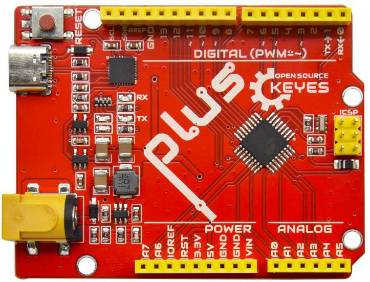
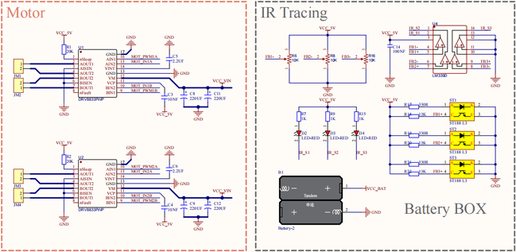

# 主板及扩展板介绍

## Keyes UNO PLUS开发板 简介

在开始所有的项目之前，我们首先要了解下面这片Keyes UNO PLUS开发板，因为这个小车的核心就是这个开发板。

该板处理器核心是ATMEGA328P-AU，并带有CP2102芯片作为UART-to-USB转换器。  
它具有14路数字输入/输出口（其中6路可作为PWM输出），8个模拟输入，1路串口通信接口，16MHz石英晶体，USB连接，电源插孔，1个ICSP插头和一个复位按钮。它支持微控制器所需的一切；只需用USB线将其连接到电脑，然后通过外部电源连接器( DC 6-15V)为其供电即可开始使用。

|主控芯片|ATMEGA328P-AU|
|-|-|
|USB转串口芯片|CP2102|
|工作电压|5V|
|输入电压|DC 6-15V（建议9V）|
|数字IO口|14个 (D0-D13)|
|PWM IO口|6个 (D3，D5，D6，D9，D10，D11)|
|模拟输入引脚|8个(A0-A7)|
|每个I/O直流输出能力|20 mA|
|3.3V端口输出能力|50 mA|
|Flash Memory|32 KB（其中引导程序使用0.5 KB）|
|SRAM|2 KB (ATMEGA328P-PU)|
|EEPROM|1 KB (ATMEGA328P-PU)|
|时钟速度|16 MHz|
|板载LED引脚|D13|

下图就是我们主控板的介绍：

下图是UNO PLUS板与普通UNO的区别:

特殊功能接口说明:

串口通信接口：D0为RX、D1为TX

PWM接口（脉宽调制）：D3 D5 D6 D9 D10 D11

外部中断接口：D2(中断0)和D3 (中断1)

SPI通信接口：D10为SS、D11为MOSI、D12为MISO、D13为SCK

IIC通信端口：A4为SDA、A5为SCL

## 扩展板 简介

1.概述:

这款扩展板是适用于UNO开发板的，可直插在UNO开发板上；无需外接电源，在保留原IO口的情况下，采用PH2.54防反接插口，引出了UNO开发板的IO口，PH2.54插口避免接错而保护UNO主板和传感器；每个IO口配备独立的VCC和GND接口，使得传感器接线更轻松。

电机、七彩灯，RGB等等所有小车上的模块的接口都引出来了，只需要一根带防反插端子的线从对应底板上的接口连接就行了，简单方便。此外我们还预留了一些接口，IIC、UART、还有WIFI接口。注意，这个板子由底板2PIN端子5V供电，注意：是5V。

2.规格参数：

电流：最大为1.2A（arduino UNO的IO提供的最大总电流为200mA，wifi模块最大为1A）

DC输入电压：5V,

输出电压：DC3.3V\5V

最大功率: 4.3W

推荐环境温度：-10°C ~ 50°C

产品尺寸：70\*55\*27mm

重量：25.5g

3.原理图:

4.接口说明:

5.使用方法:

将扩展板堆叠在Keyes UNO PLUS开发板上即可使用，如下图：

## 麦克纳姆轮小车下板（带电机驱动）

1.简介：

电机驱动底板板上包含STC8芯片和DRV8833芯片等，为了节约IO口资源，我们使用STC8芯片部分引脚来控制DRV8833电机驱动芯片，并且HR8833电机芯片是用来控制4个直流减速电机的转动方向和速度。STC8相当于一个8路pwm输出（寄存器0x1~8），2路数字信号输出（寄存器0x9~A）的IIC从设备，我们向它对应的寄存器写入对应的值，芯片将会从对应的引脚输出对应的信号。

该驱动底板还上配有3路循迹传感器、首尾各一个红外接收头、四个WS2812灯、两个七彩灯、4个直流减速电机（两个七彩灯已经与STC8芯片引脚相连，4个电机通过DRV8833驱动芯片也已经与STC8相连，其余传感器实验我们的控制板引脚控制），即[齿轮减速电机](https://baike.baidu.com/item/%E9%BD%BF%E8%BD%AE%E5%87%8F%E9%80%9F%E7%94%B5%E6%9C%BA/3249233)，是在普通[直流电机](https://baike.baidu.com/item/%E7%9B%B4%E6%B5%81%E7%94%B5%E6%9C%BA/2404223)的基础上，加上配套齿轮减速箱。齿轮减速箱的作用是，提供较低的转速，较大的力矩。同时，[齿轮箱](https://baike.baidu.com/item/%E9%BD%BF%E8%BD%AE%E7%AE%B1/1059341)不同的[减速比](https://baike.baidu.com/item/%E5%87%8F%E9%80%9F%E6%AF%94/5341327)可以提供不同的转速和力矩。这大大提高了，直流电机在自动化行业中的使用率。[减速电机](https://baike.baidu.com/item/%E5%87%8F%E9%80%9F%E7%94%B5%E6%9C%BA/3750851)是指[减速机](https://baike.baidu.com/item/%E5%87%8F%E9%80%9F%E6%9C%BA/873618)和电机（马达）的集成体。这种集成体通常也可称为[齿轮马达](https://baike.baidu.com/item/%E9%BD%BF%E8%BD%AE%E9%A9%AC%E8%BE%BE/7911602)或[齿轮电机](https://baike.baidu.com/item/%E9%BD%BF%E8%BD%AE%E7%94%B5%E6%9C%BA/3377578)。减速电机广泛应用于钢铁行业、机械行业等。使用减速电机的优点是简化设计、节省空间。我们来看一下电机驱动底板参数以及正反面的示意图和底板的电路图：

2.规格参数：

底板连接器端口输入：DC 6V---9V

驱动板系统运行电压：5V

标准运行功耗：约为2.2W

最大功率：最大输出功率为12W

电机转速：200RPM

工作温度范围：0-50℃

尺寸：120\*120\*120mm

环保属性：ROHS

正面

反面

驱动板电路原理图

