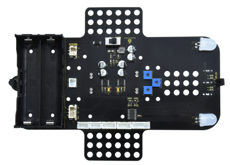
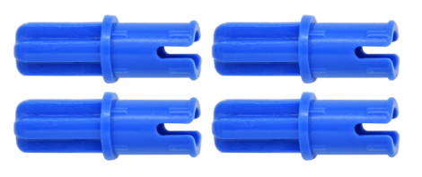

首先感谢选择keyes产品,

我们将继续为你提供好的产品和服务!

关于keyes

Keyes是KEYES Corporation旗下最畅销的品牌，我们的产品包括Arduino开发板、扩展板、传感器模块；树莓派、micro：bit扩展板和智能小车；以及为各阶段客户设计的完整入门套件。这些入门套件旨在为任何水平的客户学习Arduino、树莓派、micro：bit相关知识。

我们所有产品，均符合国际质量标准，在世界各地不同市场中，得到了极大的赞赏。

欢迎从我们的官方网站查看更多内容：

[http://www.keyes-robot.com](http://www.keyestudio.com)

# 获取资料和售后服务

1.Keyes arduino 4WD 麦克纳姆轮小车资料下载地址：

<https://pan.baidu.com/s/1S5VcUVEH6Kd1LNpbaOXR8g> 
提取码：keye

2\.
如果发现某些东西丢失或损坏，或者学习套件时遇到一些困难，keyes会提供免费和快速的支持。如果您有任何疑问，请联系我们我们客服或工作人员。

3\.
欢迎提出建议和反馈，我们会根据您的反馈不断更新套件和教程，以使其更好。谢谢！

产品安全

1.本产品内含细小的零件（螺丝，铜柱等），请放在儿童接触不到的地方，防止划伤或误食。8岁及以下儿童使用，请在大人监督下使用。

2.本产品包含导电部件(控制板和电子模块），请按照本教程的要求进行操作，不当的操作可能导致过热并且损害零件，请勿触摸并立即断开电路电源（请按照正确的方式安装电池）。

版权

keyes商标和徽标是KEYES DIY ROBOT co.,LTD的版权,任何人和公司在没有授权的情况下，不得复制，售卖，转卖，keyes品牌的产品。如果您有兴趣在当地售卖我们的产品，请联系我们专业的批发销售人员。

Keyes arduino 4WD 麦克纳姆轮小车

# 产品简介

提及编程，很多人都会觉得是一件令人非常头疼的事情。 然而，KEYES团队推出的基于arduino的麦克纳姆轮小车套件可以让您发现编程不再那么难。这款可编程套件，提高可玩性的同时，也使得套件内容更加丰富，可以使我们轻松学习编程并实现应用。是的，你没有听错，这款产品不仅可以让你的孩子学习编程的知识，还能获得电子，机械，控制逻辑和计算机科学的诸多相关知识。  
本产品是一款经济实惠，易于操控和开源的编程套件。它的安装和接线也十分简单，复杂的电子器件集成到底板、2.54防反插端子连接，只需要几个简单的组装步骤便可构建自己的麦克纳姆轮小车，然后逐步的了解如何通过物联网控制，比如红外遥控，蓝牙控制编程去控制七彩LED、RGB2812，巡线传感器，伺服舵机，电机与麦克纳姆轮，超声波模块等等这些基础的电子部件，直到完成复杂的综合项目。在这个套件中我们共设置了12个编程课程，由简单到复杂，一步一步和大家一起学习编程。如果您认为这还不够，还可以通过修改代码拓展一些项目，或者也可以添加其他传感器，丰富您的小车功能，完成您的奇妙探索旅程。

2.产品特点：

1.功能多多：彩灯显示、红外控制，蓝牙控制，万向轮控制，超声波跟随，超声波避障，4WD驱动，小车循迹，控制板使用UNO PLUS板等。   2.组装简单：电机驱动及RGB2812灯珠结和七彩灯均已集成在底板上面，更无需焊接电路，小车上面为控制层，我们将扩展板插在我们的UNO PLUS上就行，至于接线，我们都是使用的2.54防反插端子，舵机云台也是使用乐高孔插梢锁住，所以只需几个简单的步骤即可组装该小车，而且拆卸也方便。   3.外观新颖：轮子使用麦克纳姆万向轮，各模块之间接线简单不显得那么凌乱复杂，小车下层驱动底板一体化，外观简约可爱大气。   4.扩展性强：预留IIC、UART、SPI，ESP8266 WIFI等多种外设接口，可以扩展其他的传感器和模块，矩阵键盘可控制性强。

5.学习基础编程：使用Arduino IDE的C语言编程，Scratch图形化编程和Mixly图形化编程，可以接触底层代码。

# 产品参数

输入电压：7-12V

工作电压：5V

最大耗散功率：15W

电机转速：5V 200 rpm

电机驱动形式：DRV8833电机驱动

超声波感应角度：\<15度

超声波探测距离：2cm-400cm

红外遥控距离：10米（实测）

蓝牙遥控距离：50米（实测）

蓝牙APP控制：支持Android和IOS系统

# 产品清单

当我们收到这个产品套件的时候，我们首先看到是一个包装精美的外盒，每个配件被安全且有序的装在外盒里面的小盒子里.如右图。打开包装里面是一堆散装的电子及机械配件和乐高插梢。我们先来清点一下。

|序号|图片|规格|倍用量|
|-|-|-|-|
|1||超声波固定亚克力|1|
|2||乐高孔位亚克力舵机固定平台|1|
|3||电机亚克力垫板|4|
|4|||4.5V 200转/分电机|4|
|5||固定块 |4|
|6||蓝牙模块|1|
|7||舵机|1|
|8||麦克纳姆轮全向轮|4|
|9||传感器扩展板|1|
|10||Keyes Uno Plus 开发板 红色|1|
|11||Keyestudio 4WD Mecanum Robot Car 下板 HR8833驱动板 V2.0|1|
|12||M3*15MM双通铜柱|4|
|13||黄色乐高十字轴套|4|
|14||蓝色乐高半摩擦销|4|
|15||乐高摩擦销用亚克力垫片 6片|1|
|16||M3*6MM 平头 十字螺钉|10|
|17||超声波传感器|1|
|18||M3*8MM 平头 十字螺钉|10|
|19|||M3 螺母|10|
|20||M3*30MM 圆头 十字螺钉|9|
|21||M2 螺母|3|
|22||M2*8MM 圆头 十字螺钉|3|
|23||M1.4 螺母|6|
|24||M1.4*10MM 圆头 十字螺钉|6|
|25||M2.3*16MM 圆头十字 自攻螺钉|4|
|26||遥控器|1|
|27||USB线|1|
|29||HX-2.54 5P 两端反向 22AWG 白黄红红黑 100mm|1|
|30||HX-2.54 4P 两端反向 22AWG 白黄红黑 50mm|1|
|31||HX2.54mm-4P转2.54杜邦母单 绿蓝红黑线 26AWG 线长150MM|1|
|32||XH2.54 3P 两端反向 50mm 黄红黑 22AWG|2|
|33||3*40MM 十字螺丝刀|1|
|34||白色3D打印TT联轴器|4|
|35||M1.2*5MM 圆头十字自攻螺钉|6|
|36||循迹跑道|1|
|37||缠绕管|1|

