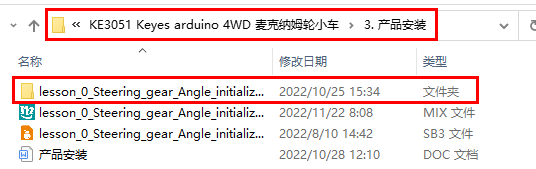
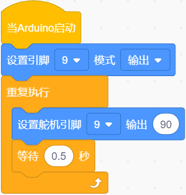
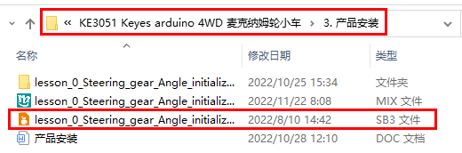
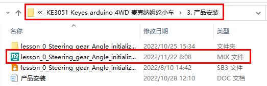
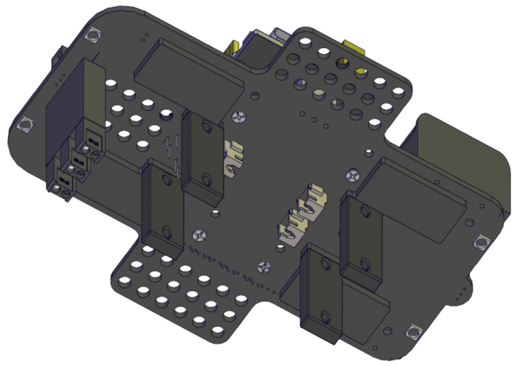
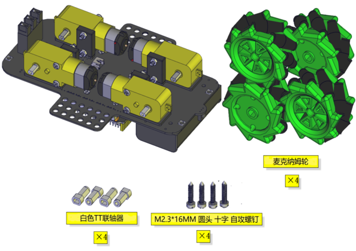
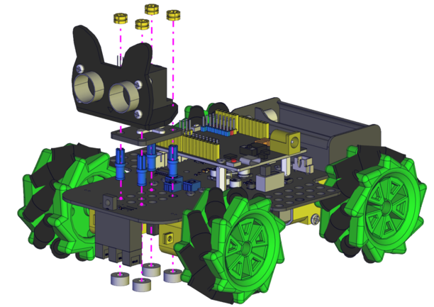

# KE3051安装步骤 

注意：这个套件的亚克力板使用时需要先撕去上面的保护膜。


安装1

安装所需零件


安装


完成


安装2

安装所需零件


安装


完成


安装3

安装所需零件


安装


完成


安装4（此步骤安装前需调节舵机角度）

请根据右图代码使舵机角度调节到90度

|舵机|扩展板|
|-|-|
|棕线|G|
|红线|5V|
|橙黄线|D9|

```
//*****************************************************************
/*
设置90度，编译并上传到开发板。连接到D9端口的舵机将旋转到90°
*/
#define servoPin 9  //设置舵机引脚
int pos; //设置舵机的角度变量
int pulsewidth; // 舵机脉冲宽度可变
void setup() {
  pinMode(servoPin, OUTPUT);  //将舵机引脚设置为OUTPUT
  procedure(0); //设置舵机角度为0°
}
void loop() {

    procedure(90);              // 使舵机转动到90°的位置

}
// 舵机控制功能
void procedure(int myangle) {
  pulsewidth = myangle * 11 + 500;  //计算脉冲宽度值
  digitalWrite(servoPin,HIGH);
  delayMicroseconds(pulsewidth);   //高电平的持续时间是脉冲宽度
  digitalWrite(servoPin,LOW);
  delay((20 - pulsewidth / 1000));  // 这个周期是20毫秒，低电平持续剩下的时间
}
//******************************************************************
```

上面的Arduino代码在资料中有提供，打开舵机的调整代码并烧录到Keyes Uno Plus主板，完成。代码如下图位置：



也可以使用下面的Scratch-KidsBlock代码来调整舵机初始化角度. 



Scratch-KidsBlock代码在资料中也有提供，打开舵机的调整代码并烧录到Keyes Uno Plus主板，完成。代码如下图位置: 



也可以使用下面的Mixly代码来调整舵机初始化角度. 


Mixly代码在资料中也有提供，打开舵机的调整代码并烧录到Keyes Uno Plus主板，完成。代码如下图位置: 



安装所需零件


安装（注意安装方向）


完成


安装5
安装所需零件


安装


完成


安装6
安装所需零件


安 装


完成



安装7
安装所需零件


安装（注意电机安装方向，线材方向朝内）


完成


安装8
安装所需零件



安装（注意麦克纳姆轮的安装方向）


完成


安装9
安装所需零件


安装



完成


安装10
安装所需零件


安装


完成


插入蓝牙模块


接线图
超声波模块接线

|超声波传感器传感器|扩展板|
|-|-|
|Vcc|V
|Trig|D12|
|Echo|D13|
|Gnd|G|


|舵机|接线|
|-|-|
|舵机|扩展板|
|棕线|G|
|红线|5V|
|橙黄线|D9|


控制红外接收传感器接线

|驱动板|扩展板|
|-|-|
|GND|G|
|5V|5V|
|S5|A3|


控制RGB 2812灯接线

|驱动板|扩展板|
|-|-|
|GND|G|
|5V|5V|
|S4|D10|


控制电机和七彩灯接线

|驱动板|扩展板|
|-|-|
|SCL|D2|
|SDA|D3|
|5V|D5|
|GND|D4|


控制三路循迹接线

|驱动板|扩展板|
|-|-|
|S1|A2|
|S2|A1|
|S3|A0|
|5V|5V|
|GND|G|


如图将电机接到对应的接口上


电池安装示范


